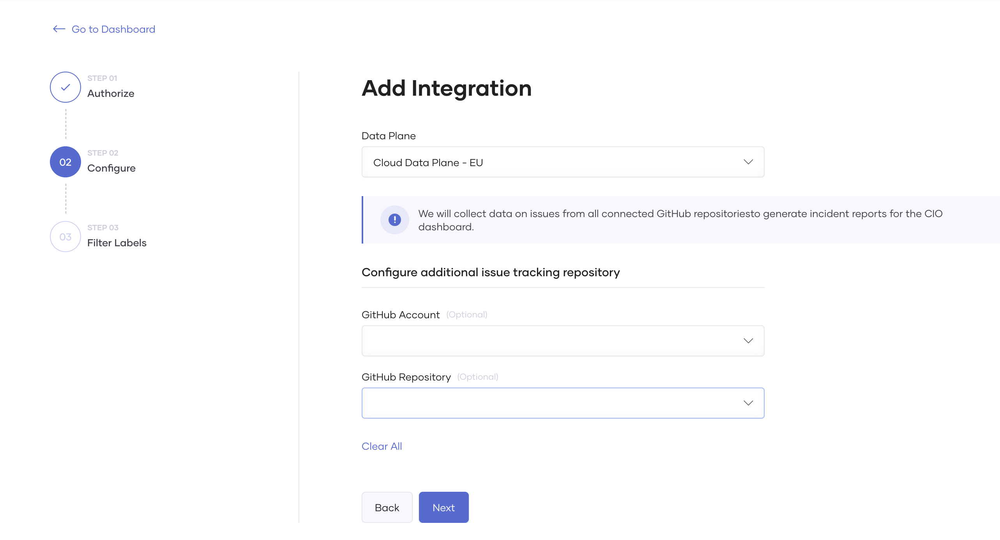

# Configure CIO Dashboard

{.cInlineImage-full}

You can view DORA metrics in Choreo that you can use as KPIs to measure your organization's DevOps teams performance. Choreo enables this feature by default for all organizations. DORA includes the following four key metrics that are regarded as the most important metrics to indicate team performance:

- Deployment Frequency: How often an organization successfully releases to production
- Lead Time for Changes: The amount of time it takes a commit to get into production
- Change Failure Rate: The percentage of deployments causing a failure in production
- Time to Restore Service: How long it takes an organization to recover from a failure in production

Choreo enables two DORA metrics by default; deployment frequency and lead time for change.

## Configure CIO Dashboard with all metrics

To configure the CIO dashboard by enabling the other two metrics, follow the steps below:

1. Sign in to Choreo using your Google, GitHub, or Microsoft account.
2. On the left navigation menu, click **Delivery Insights**.
3. Click on the **DORA Metrics** tab.
4. Scroll to the bottom of the dashboard and click **Configure**.
5. Select your incident management system. Currently Choreo only supports GitHub. 

## Configuring GitHub as the incident management system

{.cInlineImage-full}

To configure GitHub as the incident management system, follow the steps below: 

### Step 1: Authorize

{.cInlineImage-threeQuarter}

First, let's authorize Choreo to access the repositories used to record incidents. 

On the **Add Integration** page,  select **GitHub** and click **Authorize with GitHub**.

Once the authorization process is complete. You can start configuring the GitHub repository.

### Step 2: Configure

{.cInlineImage-threeQuarter}

By default Choreo will collect incident details(issues) from all repositories containing Choreo components. However, you can configure a GitHub Account and a GitHub Repository to allow Choreo to read issues collected in an specific repository and click **Next**. 

| **Field**       | **Description**                   |   **Value**   |
|-----------------|-----------------------------|-----------------------------|
| **Data Plane**  | Choreo collects incident details by running a scheduled job which invokes the GitHub API periodically. This job runs on the user's data plane.   This configuration allows users to specify a preferred data plane to run the job, especially when they have multiple data planes. | Select preferred data plane from **Data Plane** list.        |
| **GitHub Account** | The GitHub account you have your repositories in.  | Select your GitHub account that includes the repository used for incident collection.|
| **GitHub repository**| By default, Choreo will collect incident details(issues) from all repositories which already have Choreo components. |
    

### Step 3: Filter label

{.cInlineImage-threeQuarter}

The filter label allows Choreo to scrape issues associated with that label.

- **Incident Label**:  The label Choreo uses to identify incidents. For example, `Type/Incident`. 

- **Invalid incident label**(Optional) : Choreo will not scrape issues with this label and will proceed to skip these issues. For example, `Resolution/Invalid`. You can use this label when you need to ignore issues. For example, closing an issue after identifying that it doesn't qualify as an incident issue as it was due to a user error. 

Once you configure the labels, click **Save**.

Choreo will enable incident data publishing in the background once you save. Once completed, DORA metric charts will appear in the CIO dashboard for **Mean Time To Recover** and **Change Failure Rate**. If there are any issues in the configuration, the configure banner will reappear, and the user can proceed to reconfigure.

### Step 4: Enriching incident tickets with deployment information

Choreo extracts deployment information from the relevant incident and generate DORA metrics that helps you analyze the deployment statistics related the incidents. Therefore, you need to manually update the GitHub issue with the relevant deployment-related information. Follow the steps below to add the deployment information to the GitHub issue. 
 
#### Get deployment details

1. On the Choreo console header,  select the project and the component for which the incident was reported.
2. On the left navigation menu, click **Deploy**.
3. On the **Production Environment** card, click on **Deployment History**.
4. On the right-hand side panel, select the relevant deployment, and click **Release details** to copy the deployment details to clipboard. 

    {.cInlineImage-small}

#### Add deployment information to the GitHub issue
1. Edit the GitHub issue to add the deployment information. 
2. Paste the deployment information you copied (in the step 4 under section `Get deployment details`) at the end of the issue body.
3. Click **Save**.

That's it! You have successfully configured your CIO dashboard to include the DORA metrics. 

!!! note
    The CIO Dashboard is expected to reflect the latest statistics within approximately 30 minutes.

## Edit Configurations

   {.cInlineImage-small}

   You can edit or override the configurations you made via the edit option in the dashboard. 