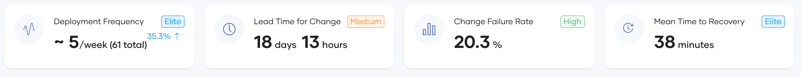
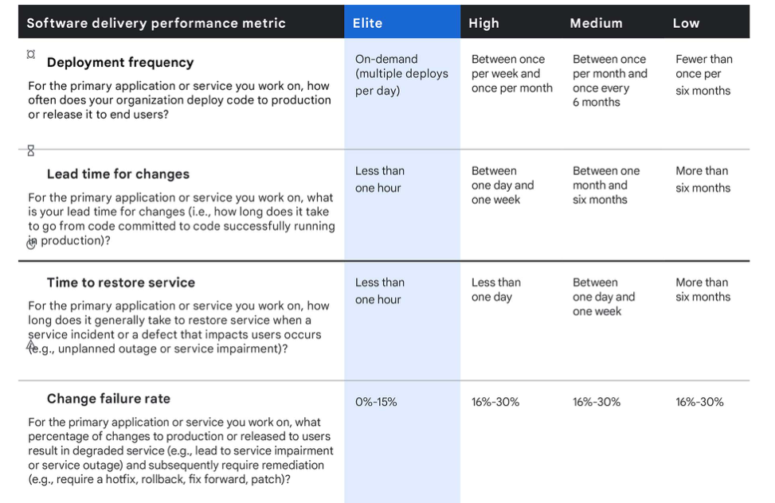
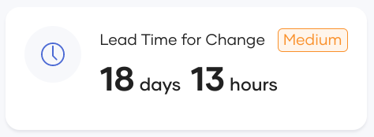
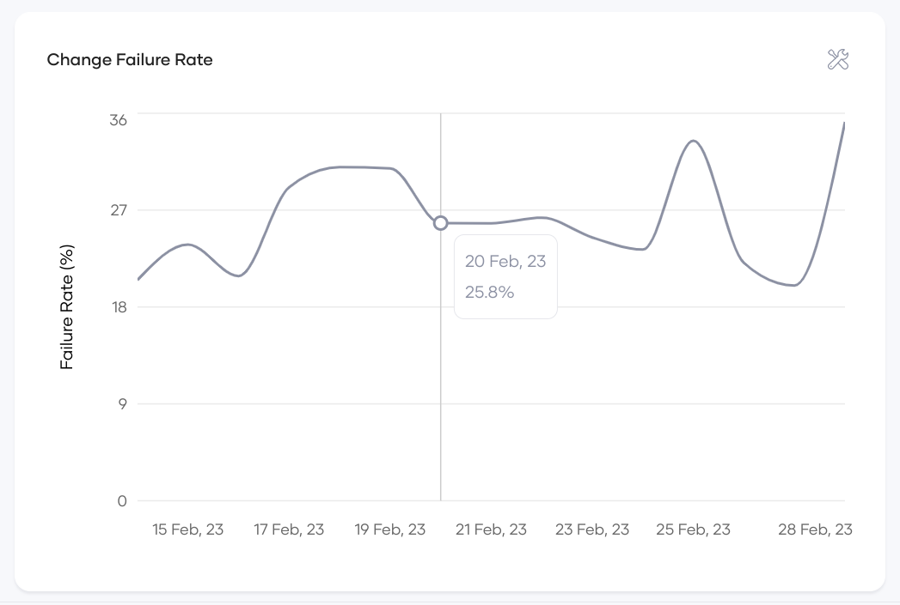
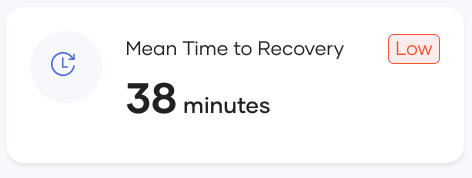

# View DORA metrics

DORA metrics comprise four key metrics. Let's explore what each metric represents in Choreo. Choreo displays a summary and graphical representation of each metric.

### Snapshot view

{.cInlineImage-full}

The snapshot view includes four tiles on the top of the dashboard, summarizing DORA metrics for the entire time period you select. The snapshot view categorizes each metric into four performance levels: elite, high, medium, and low. The categorization is based on the 2020 DORA metric report.

{.cInlineImage-threeQuarter}

### Time series view

The time series view provides a graphical representation of how the statistics have changed over a period of time. You can use this view to analyze team performance and identify trends. 

{.cInlineImage-full}

## Deployment frequency

DORA team definition: The frequency at which an organization successfully releases to production.

In Choreo, this translates to the number of times an organization deploys a component to the production environment. Choreo does not count the deployment done to the development or other lower environments. 

### Snapshot view

{.cInlineImage-small}

The snapshot view of the `Deployment Frequency` metric shows the deployment frequency for all components within the selected organization. The frequency is dynamically determined and rounded to the nearest measurement. For example, if there is more than one deployment daily, the deployment frequency is measured in `deployments per day`. If the deployment frequency is less, it is measured in a higher granularity. For example, `deployments per week`.

A lower deployment frequency indicates that your organizational efficiency is low and that you need to evaluate and improve the processes to encourage frequent releases.

Choreo also displays the total number of deployments for the selected time range and the percentage increase or decrease compared to the previous time range.

### Time series view

{.cInlineImage-half}

The time series view for the `Deployment Frequency` metric visualizes the deployment count as a bar chart for the selected time period. Deployment count is aggregated based on the ‘view by’ selector. Hovering over each bar shows the counts for the aggregated period. 
Using this chart, organizations can identify deployment patterns, such as days of the week/months of the year where more deployments are likely to happen (near quarterly release days) and periods with fewer deployments. Decision-makers can then take steps to investigate and improve performance. 
This chart displays the pattern before and after a process change so you can use it to evaluate the team's performance after a significant process change. 

## Lead Time for Change

 DORA team definition: The time it takes for a commit to reach production.

 In Choreo, this translates into the time between committing and promoting a deployment to production. Although this approach may overlook any commits you push to production between two commits, it effectively assesses the efficiency of the review, approval, and CI/CD processes. Therefore, focusing on the production commits is adequate.  If a team commits locally for extended periods without deploying to production, this gets reflected in the `Deployment Frequency` charts.

### Snapshot view

{.cInlineImage-small}

The snapshot view of this metric displays the 95th percentile of the lead time for the selected time period. 95th percentile serves as a better representation as it filters out large outliers that can taint the average value. Lower lead times for change suggest that your organization has efficient processes for change review, approval, and CI/CD, while longer times suggest that the process needs to improve. Organizations can also use the categorization label to determine their standpoint on global standards.

Additionally, Choreo also displays the percentage increase or decrease compared to the last time period.

### Time series view

{.cInlineImage-half}

The time series view of this metric visualizes the lead time as a bar chart for the selected time period. The time is summed based on the ‘view by’ selector. To handle outliers, the y-axis employs a log scale that represents values read dynamically. Hovering over each bar displays the actual counts for the aggregated period. 
Using this chart, organizations can identify trends in their release process. For example, organizations can identify the time of the year when lead time rises, such as summer break. Also, organizations can use this to benchmark and evaluate new process changes. For example, if you introduced a process to include peer programming and reviewing, this chart can be used to evaluate its effect on the lead time and provide leadership with factual information to proceed further.

## Change failure rate

The DORA team definition: The percentage of deployments causing a failure in production. 

In Choreo, this translates to the ratio of deployments causing production failures to the total number of deployments. If there is at least one incident reported against a deployment, Choreo considers that deployment as a failed deployment in production. Any deployment-time failures are not counted as production failures because such failures don't impact the end user. For this metric to be accurate, the organization is expected to open incidents adhering to the proper format as it is crucial for Choreo to identify production failures. 

### Snapshot view

{.cInlineImage-small}

The snapshot view of this metric visualizes the change failure rate as a percentage for the selected time period. This will be the absolute percentage for the entire time period. When deciding on the time, the time of deployment is considered instead of the incident reported time. For example, the change failure rate for January 2023 will reflect the following:
 -  All deployments that happened within January.
 -  Any incidents that were reported at any time (in or after January) against the January deployments.

This view helps leadership assess the quality of deliverables and identify areas for improvement. Higher rates suggest that the organization needs to improve its processes to bring in more quality assurance aspects such as improved code coverage and end-to-end test coverage.

Additionally, Choreo also shows the percentage increase or decrease compared to the previous time period.

### Time series view

{.cInlineImage-half}

The time series view of this metric displays it as a line chart with data points corresponding to the granularity selected by the ‘view by’ selector. The absolute percentage is shown for each granularity.  Hovering over the line chart displays the actual counts for the aggregated period. 
This chart helps leadership identify timely trends in product quality aspects. For example, this view displays the months of the year where the failure rate is high (for example, close to quarterly release/announcement dates). Also, you can use this to measure the effectiveness of changes introduced to improve quality. For example, if the organization introduced an end-to-end test pipeline integration to the PR approval process, they can use this view to factually observe the timely impact of that change and determine how it decreases the failure rate.

## Mean Time to Recover(MTTR)

The DORA team definition: The time it takes for an organization to recover from a production failure.

In Choreo, this measures the time from identifying a production incident to resolving it. This metric reflects the responsiveness and agility of incident management teams.

Choreo depends on the open and close times of incidents to gather the relevant information. Therefore, for the dashboards to be accurate, organizations must follow process guidelines to update and close incident tickets efficiently in their incident management system.

### Snapshot view

{.cInlineImage-small}

The snapshot view for this metric displays the  mean recovery time for the selected time period. Choreo dynamically adjusts the time unit to measure this metric for better readability.
This chart helps organizations evaluate the response time and agility of their incident handling teams, which in turn is an indication of stability. Higher MTTR means the leadership should look at new ways of improving the efficiency and agility of the teams handling incidents.

### Time series view

{.cInlineImage-half}

The time series view of this metric shows how the mean time to recovery changes over time on a granularity based on the ‘view by’ selector. Each time the `granularity mean` would be used as the aggregation factor. Hovering over the line chart displays the actual counts for the aggregated period. 
This view helps leadership understand timely trends on mean time to recovery, such as higher values during holiday periods when there is less staff. Also, you can use this measurement to evaluate the effectiveness of process changes such as introducing an incident response plan. The trend view clearly shows the before and after statistics and the effectiveness of the process change.
