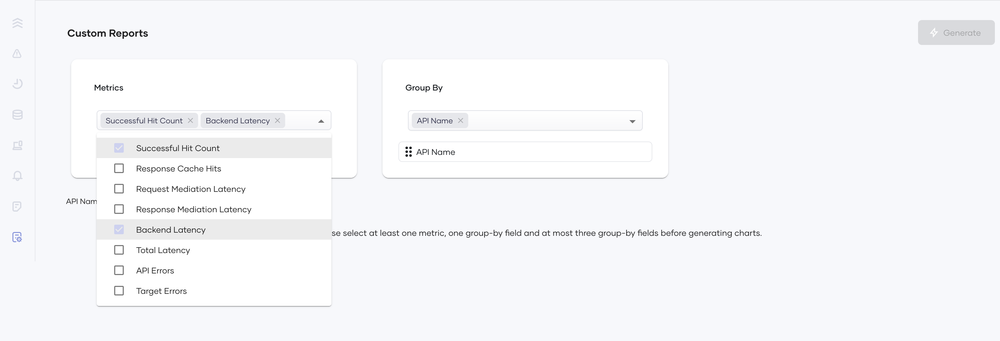
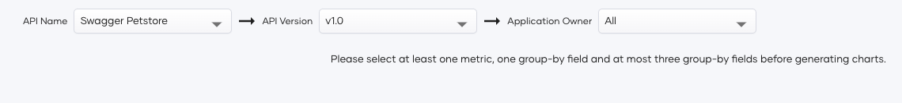
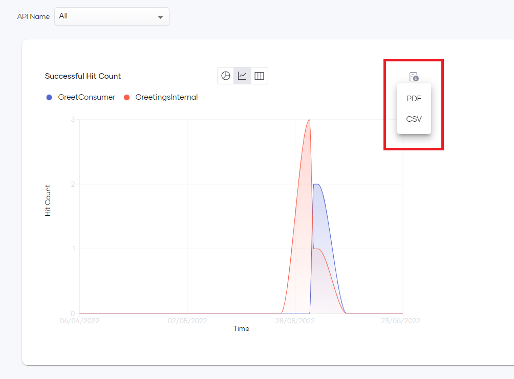

# Generate Custom Reports

Choreo insights allow you to generate custom reports to view the information that is important to you to make timely decisions for the betterment of your business. With custom reports, you can generate reports for a set of metrics of your choice and aggregate results by specific fields. Once generated, the metrics can be filtered out using any selected group-by filters. Custom reports support three visualizations: overtime charts, pie charts, and tables.

## Metrics

Choreo Insights allow you to retrieve data for the following metrics:

 - Successful Hit Count
 - Response Cache Hits
 - Request Mediation Latency
 - Response Mediation Latency
 - Backend Latency
 - Total Latency
 - API Errors
 - Target Errors

## Group-by

**Group-by** fields specify how to group the metric data. e.g., You can select **Successful Hit Count** in the **Metrics** field and **API Name** under **Group-by** to retrieve the successful hit count grouped by the API name.

Choreo Insights allow you to group metric data by the following fields:

 - API Name
 - API Version
 - API Resource Template
 - API Method
 - API Creator
 - Application
 - Application Owner
 - Destination
 - User Agent
 - Platform

To generate a custom report, follow the steps below:

1. In the left navigation menu, click **Custom Reports**.

    {.cInlineImage-full}

2. Select metric(s) from the **Metrics** drop-down selector.

    {.cInlineImage-full}

3. Select a minimum of 1 and a maximum of 3 group-by field(s) from the **Group By** drop down selector.

4. Set the order of the group-by filters by drag and drop to determine the grouping order of the selected metric(s).

5. Once you determine the order of the group-by fields, you can set values for each group-by field from the respective dropdown. 

    {.cInlineImage-full}

6. Click **Generate**.

    {.cInlineImage-full}

## Download Reports

Choreo Insights allow you to download report data related to each chart as a **PDF** or a **CSV** file.

To do this, click the **Download** icon on the top right of the relevant chart and select the required file format.
    {.cInlineImage-full}
