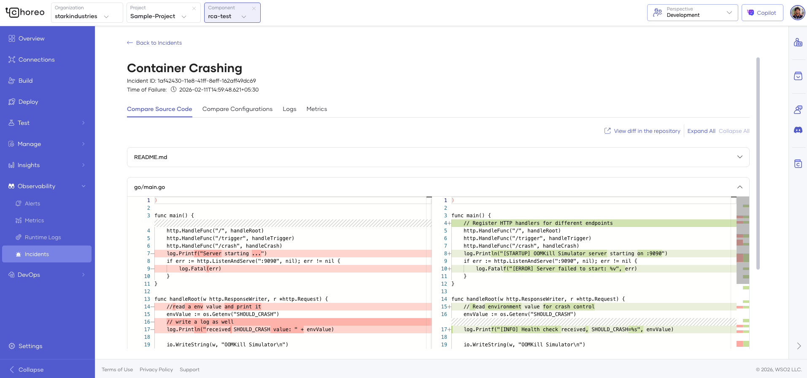
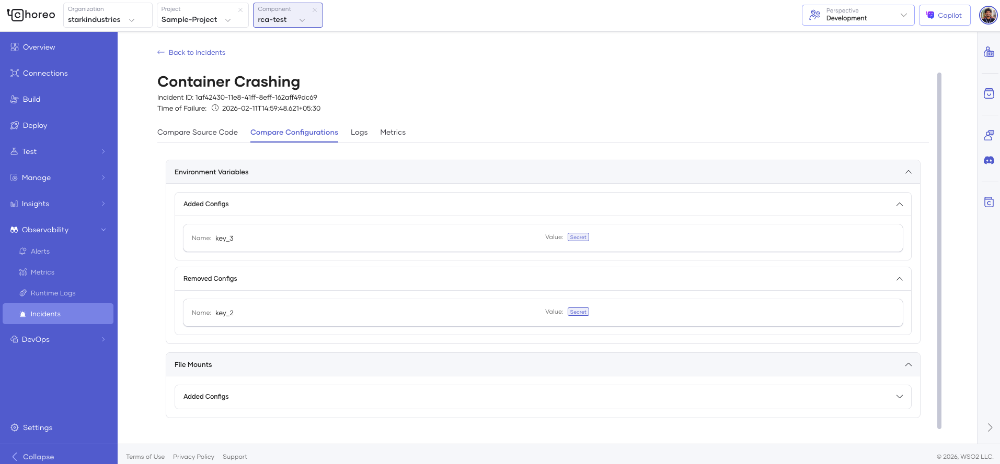
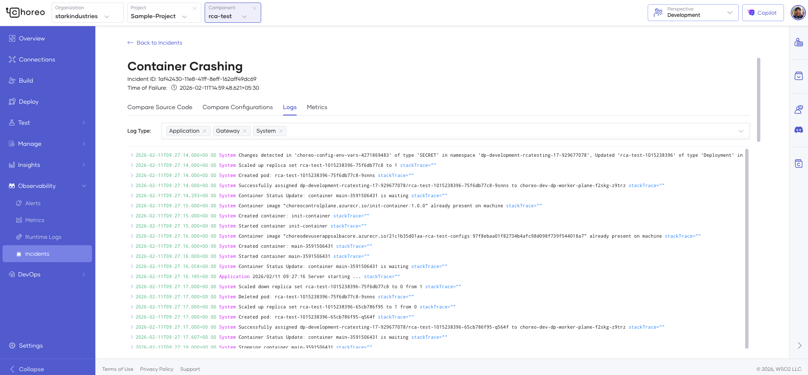
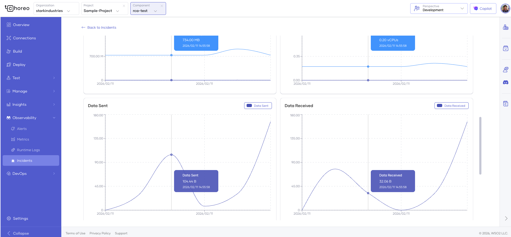

# Incident Overview

This section explains how Choreo automatically detects, analyzes, and helps you manage component incidents. The incident management feature provides automated root cause analysis to help you quickly understand and resolve issues affecting your components.

!!! tip
    Incidents are automatically created when critical system events are detected in your components. You don't need to configure anything. Choreo monitors your components and creates incidents when issues occur.

## What are Incidents?

Incidents are automatically generated alerts that indicate your component has experienced a critical issue affecting its stability or availability. When an incident occurs, Choreo automatically:

- Creates an incident record with detailed information
- Collects relevant logs and metrics from before and during the incident
- Analyzes recent deployment source code and configuration changes

This helps you quickly identify what went wrong and how to fix it.

## Incident Types

Choreo automatically detects and tracks the following types of incidents:

- [OOMKilled incidents](#oomkilled-incidents)
- [CrashLoopBackOff incidents](#crashloopbackoff-incidents)

### OOMKilled Incidents

OOMKilled Incidents occur when your component ran out of memory and was terminated by the system.

**Common causes:**

- Memory leaks in your application
- Memory allocation is too low for your workload needs
- Unexpected traffic spikes causing memory pressure
- Large data processing without proper resource management

### CrashLoopBackOff Incidents

CrashLoopBackOff Incidents occur when your component keeps crashing and restarting repeatedly.

**Common causes:**

- Application fails to start properly
- Missing or incorrect configuration values
- Unable to connect to required dependencies (databases, APIs, etc.)
- Code errors that cause the application to crash immediately on startup

## View Incidents

### Accessing the Incidents Page

1. Navigate to the component you want to monitor.

2. In the left navigation menu, click **Observability** and then click **Incidents**.

    !!! note
        You can view incidents from **project level** or **component level**.

    {.cInlineImage-full}

3. The incidents page displays all detected incidents for your project or component based on where you view the incidents.

### Filtering Incidents

Use the filters at the top of the incidents page to find specific incidents:

- **Time Range**: Select a date range to view incidents from a specific period
- **Environment**: View incidents from specific environments (e.g., Development, Production)

## Understanding Incident Details

Click on any incident to view comprehensive diagnostic information.

### Incident Summary

At the top of the incident details page, you'll see:comp

- **Incident Type**: What kind of issue occurred (OOMKilled or CrashLoopBackOff)
- **Incident ID**: Unique identifier for the incident
- **Time of Failure**: Exact date and time of the incident

### Incident Analysis Sections

Once you open an incident, you'll find four key sections that provide comprehensive diagnostic information to help you understand and resolve the issue:

| **Status**         | **What it means**                                                               |
|--------------------|---------------------------------------------------------------------------------|
| **Compare Source Code**  | Analyzes code changes between the incident version and the previous stable state. |
| **Compare Configurations**| Highlights changes in environment variables or resource allocations.              |
| **Logs**                 | Displays filtered logs and events captured at the time of the incident.           |
| **Metrics**              | Shows resource usage and performance metrics leading up to the incident.           |

#### 1. Compare Source Code

Analyzes code changes between the incident version and the previous stable deployment.

**What you'll see:**
- Side-by-side code diff showing what changed between versions
- Specific files and lines that were modified along with the commitDiff Link of the provider 
- A link to view the commitDiff in the respective git provider. 

!!! note
    if the commitDiff contains more than 5000 characters, only the commitDiff link will be showed.

{.cInlineImage-full}

!!! tip
    If the incident occurred shortly after a deployment, carefully review the code changes—they often reveal the root cause.

#### 2. Compare Configurations

Highlights changes in environment variables, secrets, and resource allocations (CPU/Memory).

**What you'll see:**
- Configuration differences between the current and previous deployment
- Changes in environment variables
- Resource allocation modifications (CPU and memory limits)
- Secret and configmap changes

{.cInlineImage-full}

!!! important
    For OOMKilled incidents, check if memory limits were reduced. For CrashLoopBackOff, verify that all required environment variables are correctly set.

#### 3. Logs

Displays filtered logs and events captured **5 minutes before** and **20 seconds after** the incident occurred.

**What you'll see:**
- **Application Logs**: Your application's output and error logs
- **System Logs**: Container lifecycle events (restarts, crashes, OOMKilled events)
- **Gateway Logs**: API Gateway access and error logs (if applicable)
- Up to 200 log entries per log type, helping you pinpoint exactly what happened

{.cInlineImage-full}

!!! note
    Logs are automatically collected from 5 minutes before the incident to 20 seconds after, ensuring you have context before and during the failure.

#### 4. Metrics

Shows resource usage and performance metrics leading up to the incident.

**What you'll see:**
- **Memory and CPU Usage**: Trends showing resource consumption over time
- **Request Rates**: Number of requests per minute
- **Response Times**: API latency and performance metrics
- **Error Rates**: HTTP error status codes and failure rates

{.cInlineImage-full}

**Use metrics to:**
- Identify memory leaks (steadily increasing memory usage)
- Spot CPU spikes that may have caused issues
- Correlate traffic spikes with the incident
- Understand performance degradation patterns

## Best Practices

### Prevent OOMKilled Incidents

- **Set appropriate memory limits** based on your component's actual usage patterns
- **Monitor memory trends** regularly to catch gradual increases
- **Implement proper memory management** in your code
- **Add alerts** for high memory usage before it reaches the limit

### Prevent CrashLoopBackOff Incidents

- **Test deployments** in non-production environments first
- **Validate configuration** before deploying
- **Implement health checks** in your application
- **Ensure dependencies are available** before deploying

### General Best Practices

1. **Review incidents regularly**: Don't wait for critical issues—proactively review and address incidents
2. **Follow recommendations**: The root cause analysis provides actionable steps—follow them
3. **Track patterns**: If similar incidents occur repeatedly, investigate deeper systemic issues
4. **Update resource limits**: Adjust CPU and memory limits based on incident insights
5. **Keep deployments small**: Smaller, incremental deployments make it easier to identify what changed when incidents occur
