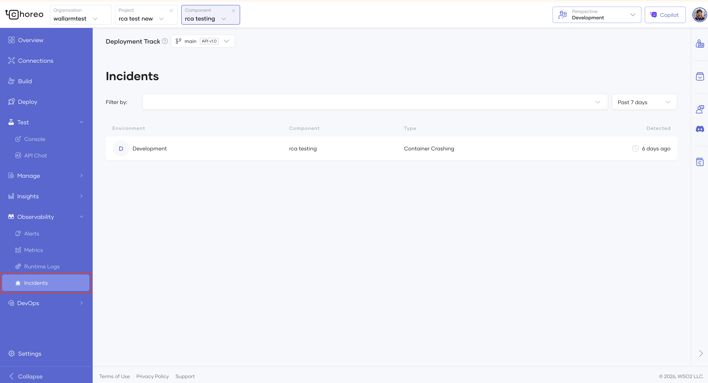

# Incident Overview

This section explains how Choreo automatically detects, analyzes, and helps you manage component incidents. The incident management feature provides automated root cause analysis to help you quickly understand and resolve issues affecting your components.

!!! tip
    Incidents are automatically created when critical system events are detected in your components. You don't need to configure anything. Choreo monitors your components and creates incidents when issues occur.

## What are Incidents?

Incidents are automatically generated alerts that indicate your component has experienced a critical issue affecting its stability or availability. When an incident occurs, Choreo automatically:

- Creates an incident record with detailed information
- Collects relevant logs and metrics from before and during the incident
- Analyzes recent deployment source code and configuration changes
- Generates root cause analysis with probable causes and recommendations ### what should I put here ? 

This helps you quickly identify what went wrong and how to fix it.

## Incident Types

Choreo automatically detects and tracks the following types of incidents:

- [OOMKilled incidents](#oomkilled-incidents)
- [CrashLoopBackOff incidents](#crashloopbackoff-incidents)

### OOMKilled Incidents

OMMKilled Incidents occur when your component ran out of memory and was terminated by the system.

**Common causes:**

- Memory leaks in your application
- Memory allocation is too low for your workload needs
- Unexpected traffic spikes causing memory pressure
- Large data processing without proper resource management

### CrashLoopBackOff Incidents

CrashLoopBackoff Incidents occur when your component keeps crashing and restarting repeatedly.

**Common causes:**

- Application fails to start properly
- Missing or incorrect configuration values
- Unable to connect to required dependencies (databases, APIs, etc.)
- Code errors that cause the application to crash immediately on startup

## View Incidents

### Accessing the Incidents Page

1. Navigate to the component you want to monitor.

    !!! info
        You need to have **Choreo DevOps** or **Choreo Platform Engineer** roles to view incidents.

2. In the left navigation menu, click **Observability** and then click **Incidents**.

    {.cInlineImage-full}

3. The incidents page displays all detected incidents for your component.

    {.cInlineImage-full}

### Filtering Incidents

Use the filters at the top of the incidents page to find specific incidents:

- **Time Range**: Select a date range to view incidents from a specific period
- **Incident Type**: Filter by OOMKilled or CrashLoopBackOff
- **Environment**: View incidents from specific environments (e.g., Development, Production)
- **Version**: Filter by component version

{.cInlineImage-full}

## Understanding Incident Details

Click on any incident to view comprehensive diagnostic information.

{.cInlineImage-full}

### Incident Summary

At the top of the incident details page, you'll see:

- **Incident Type**: What kind of issue occurred (OOMKilled or CrashLoopBackOff)
- **Occurred At**: Exact date and time of the incident
- **Status**: Current processing status (see below)
- **Component Details**: Which component, version, and environment were affected

### Processing Status

Each incident shows its current processing status:

| **Status**         | **What it means**                                                               |
|--------------------|---------------------------------------------------------------------------------|
| Initialized        | Incident detected, data collection starting                                     |
| Data Collected     | Logs, metrics, and deployment information collected                             |

### Root Cause Analysis

This section provides:

- **What Happened**: Clear summary of what caused the incident
- **Probable Causes**: List of potential root causes ranked by likelihood
- **Recommendations**: Step-by-step actions to resolve the issue and prevent it from happening again

{.cInlineImage-full}

### Observability Data

Expand this section to view collected diagnostic information:

**Logs:**
- Application logs from around the time of the incident
- System logs showing container behavior
- Gateway logs (if applicable)

**Metrics:**
- Memory and CPU usage trends
- Request rates and response times
- Error rates and status codes

{.cInlineImage-full}

### Recent Changes

This section shows what changed before the incident:

- **Previous Deployment**: The last stable deployment details
- **Current Deployment**: The deployment that was running when the incident occurred
- **Configuration Changes**: What configuration values were modified
- **Code Changes**: Summary of code commits since the last deployment

{.cInlineImage-full}

!!! tip
    If an incident occurred shortly after a deployment, review the configuration and code changes carefully—they often provide clues to the root cause.

## Project-Level Incidents

To view incidents across all components in your project:

1. Navigate to your project in Choreo.
2. Click **Observability** → **Incidents** in the left menu.
3. The project incidents page shows aggregated incidents from all components.
4. Use filters to narrow down by environment, time range, or incident type.

{.cInlineImage-full}

This gives you a holistic view of incidents across your entire project, helping you identify patterns or widespread issues.

## Best Practices

### Prevent OOMKilled Incidents

- **Set appropriate memory limits** based on your component's actual usage patterns
- **Monitor memory trends** regularly to catch gradual increases
- **Implement proper memory management** in your code
- **Add alerts** for high memory usage before it reaches the limit

### Prevent CrashLoopBackOff Incidents

- **Test deployments** in non-production environments first
- **Validate configuration** before deploying
- **Implement health checks** in your application
- **Ensure dependencies are available** before deploying

### General Best Practices

1. **Review incidents regularly**: Don't wait for critical issues—proactively review and address incidents
2. **Follow recommendations**: The root cause analysis provides actionable steps—follow them
3. **Track patterns**: If similar incidents occur repeatedly, investigate deeper systemic issues
4. **Update resource limits**: Adjust CPU and memory limits based on incident insights
5. **Keep deployments small**: Smaller, incremental deployments make it easier to identify what changed when incidents occur
