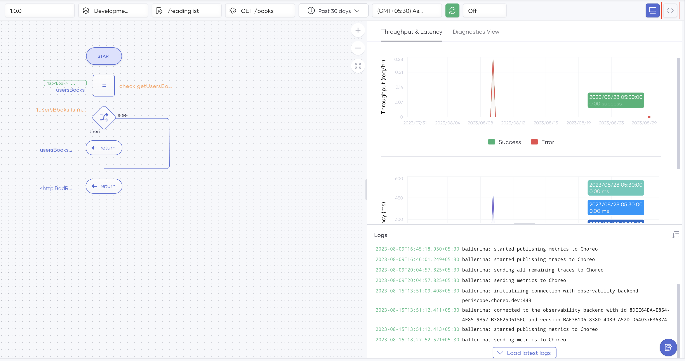
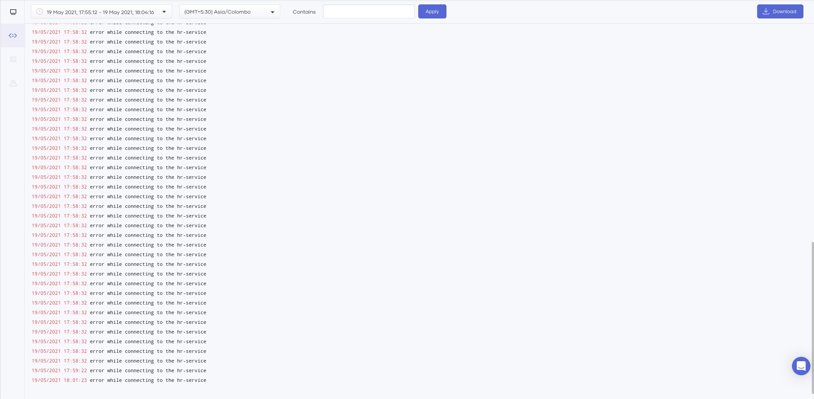

# Observability Overview

Observability in Choreo provides the capability to visualize and monitor the performance of services deployed on Choreo. Choreo has built-in support for viewing the overall status, latencies, throughput data,  diagnostic data, and logs. Hence, you can use Choreo Observability to detect and troubleshoot anomalies in your services efficiently. 

!!! tip
    If you are a Choreo private data plane customer and you want to observe your private data plane using New Relic, see [Observing Choreo Private Data Planes With New Relic](https://wso2.com/blogs/thesource/observing-choreo-private-data-planes-with-new-relic/).

## Dashboard
The Choreo Observability dashboard gives you more than one way to monitor your services. This section introduces the dashboards.

### Dashboard overview

The following diagram shows the Observability dashboard:

{.cInlineImage-full}

The Observability dashboard allows you to:

- Observe the throughput and latencies of requests served over a given period.
- View the logs generated over a given period.
- Compare metrics side-by-side for better diagnosis.
- Observe the flame graph (Diagnostics view) generated over a given period (not available for non-Ballerina components).
- Trace requests (not available for non-Ballerina components).

!!! note
    The Observability view is private and is only visible to the service owner.

### Throughput and latency graphs

The throughput graph shows the throughput of requests per second for a selected timestamp.   

{.cInlineImage-full}

!!! note
    The visual diagram is not available for non-ballerina components. 
    
By default, Choreo renders this graph for the data generated within the past 24 hours. You can change the default time window by selecting the time range and zone from the options bar. To expand the graph, click and drag the cursor over the period you want to drill down. 

You can view the Choreo service logs in the **Logs** view below the graph. Clicking on either graph updates the **Logs** view to contain the corresponding log entries generated at that time. You can use these logs to identify the reasons for any latency and throughput anomalies you detect using the graph.

The following figure shows an example of this:

{.cInlineImage-full}

### Diagnostics view

The **Diagnostics view** provides the capability to view errors, throughput, latencies, CPU usage, memory usage, and logs simultaneously for a particular event. You can detect and analyze errors and anomalies in detail via the **Diagnostics view**.

By default, the time range selected for the **Throughput & Latency** graphs is the same time range used for the **Diagnostics view**.

{.cInlineImage-full}

A **bin** is a horizontal section of the graph for a particular period. A bin consists of the following items:

- **Date/Time:** The timestamp for the log entries as they started to appear.
- **Logs:**  List of log entries and their respective log count that occurred within the bin's time frame. These log entries appear according to precedence. The error logs are listed first, followed by the info logs. Each bin shows a maximum of five log entries sorted by the log count.
- **Error:** The number of HTTP errors that occurred at the selected time.
- **TP:** Throughput of the requests at the selected time (req/s).
- **Latency:** Latency of the request at the selected time (ms).
- **CPU:** CPU usage at the selected time (millicores).
- **Memory:** Memory usage at the selected time (MiB).

## Logs

The Choreo log pane offers a centralized view to access comprehensive runtime logs of the components you have deployed on Choreo, enhancing troubleshooting and analysis.

## Application logs

{.cInlineImage-full}

The Service components generate application logs. On the **Observability Overview** page you can click the **View Logs** icon on the header bar to view the application logs for the component as shown in the image above.

!!! note
    For REST API Proxy components, application logs will only be available if the `Log Message` policy is attached to the respective flows. 

## Gateway logs

{.cInlineImage-full}

The **Logs** pane includes all gateway access logs that the proxy service generates. Logs are currently **only available for REST API Proxy components**.  To view the access logs, click the **Access Logs** icon on the header bar. This will be available for other components soon. 

You can filter the logs based on time or text.

To download the log entries, click the **Download** icon on the header bar. As a result, the log entries are saved as a .zip file in the location you specify.

### Trace requests

You can trace requests your service receives at a given timestamp by clicking a point in the time axis of either the throughput or the latency graphs.  The visual diagram shows the received requests.
For each request in the visual diagram view, it displays the request time, the latency, and the status. Furthermore, when you click on a specific request, you can view the status code, request latency, the path (control flow) followed to execute the request, and the execution time per `if`, `while`, and `foreach` body.
The visual diagram also displays the average request latency and the success rate for each client request that corresponds to the selected time interval.
