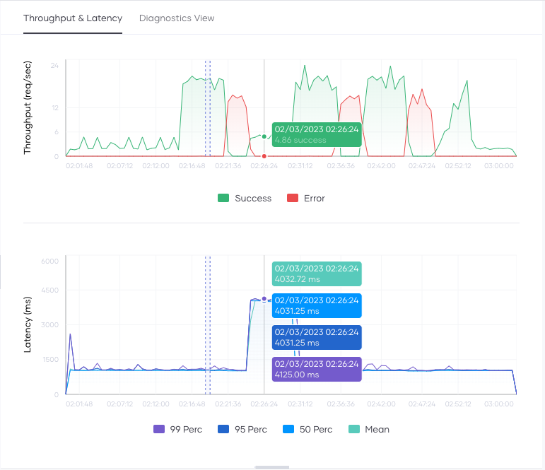

# Observability Overview

The Choreo observability dashboard provides a comprehensive interface to visualize and monitor the performance of services deployed on Choreo.

{.cInlineImage-full}

The Observability dashboard allows you to:

- Observe the throughput and latencies of requests served over a given period.
- Compare metrics side-by-side to facilitate efficient diagnosis.
- Observe the diagnostics view generated over a given period.
- View logs generated over a specific timeframe.

!!! tip
    If you are a Choreo private data plane customer and you want to observe your private data plane using New Relic, see [Observing Choreo Private Data Planes With New Relic](https://wso2.com/blogs/thesource/observing-choreo-private-data-planes-with-new-relic/).

## Throughput and latency graphs

The throughput graph depicts the throughput of requests per second for a selected timestamp.   

{.cInlineImage-full} 
    
By default, Choreo renders this graph for the data generated within the past 24 hours. You can change the default time window by selecting the time range and zone from the options bar. To expand the graph, click and drag the cursor over the period you want to drill down. 

You can view the Choreo service logs in the **Logs** pane below the throughput and latency graph. Clicking on a graph updates the **Logs** view to contain the corresponding log entries generated at that time. You can use these logs to identify the reasons for any latency and throughput anomalies you detect using the graph.

## Diagnostics view

The **Diagnostics view** allows you to simultaneously analyze errors, throughput, latencies, CPU usage, memory usage, and logs for a particular event. This facilitates detailed error detection and analysis.

By default, the time range selected for the **Throughput & Latency** graphs is the same time range used for the **Diagnostics view**.

Each horizontal section of the graph, termed a *bin*, represents a specific period and comprises:

- **Date/Time:** Indicates when the log entries began to appear.
- **Logs:**  List of log entries and respective log counts within the bin's timeframe, sorted by precedence (error logs followed by info logs). Each bin displays a maximum of five log entries.
- **Error:** The number of HTTP errors that occurred at the selected time.
- **TP:** Throughput of the requests at the selected time (req/s).
- **Latency:** Request latency at the selected time (ms).
- **CPU:** CPU usage at the selected time (millicores).
- **Memory:** Memory usage at the selected time (MiB).

## Logs

The **Logs** pane serves as a centralized view to observe logs of the components you deploy on Choreo. This facilitates rigorous troubleshooting and analysis.
