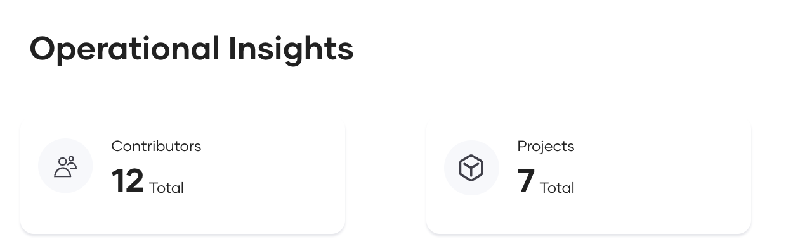
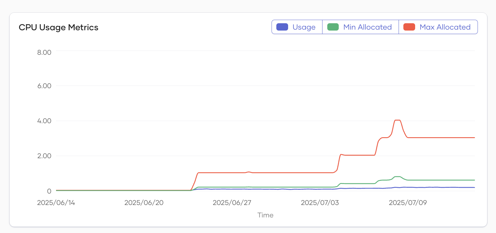
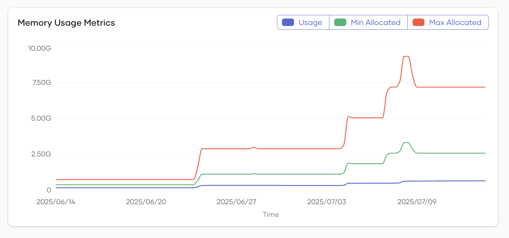
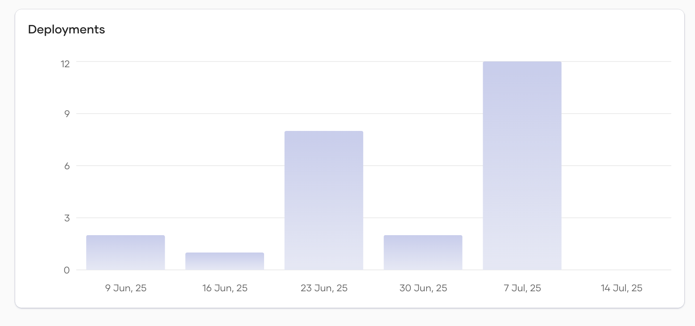
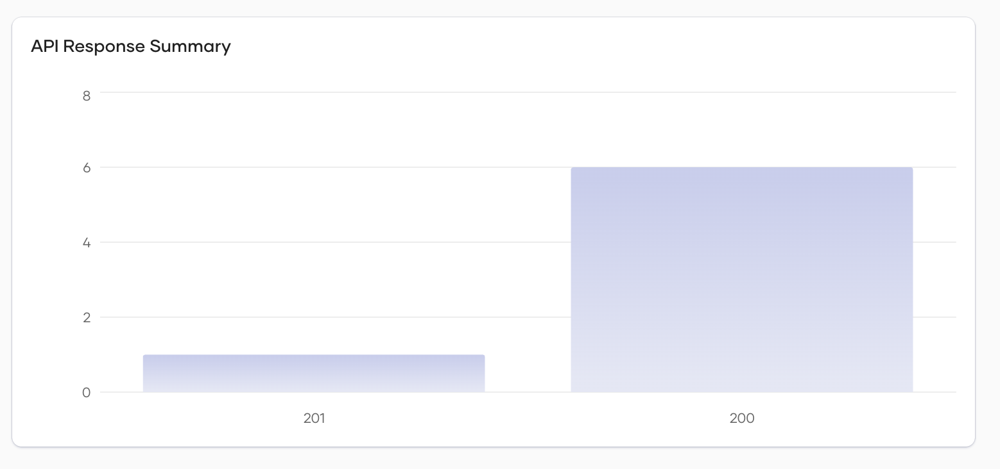

# Operational Insights

The Operational Insights dashboard provides a centralized view for monitoring and analyzing the health and resource usage of your organization and its projects. It enables users to:

- View the number of components, services, API proxies, web apps, and other resources at both the organization and project levels.
- Track CPU and memory utilization for these resources over time, helping to identify trends, bottlenecks, and potential issues.
- Gain insights into deployment activity and API response patterns, supporting operational decision-making and troubleshooting.

This dashboard is essential for maintaining visibility into your cloud resources, ensuring optimal performance, and proactively managing your infrastructure.

You can view the Operational Insights dashboard at either the organization level or the project level. Users can select the desired environment to view insights, and filter the data by time range—choosing from the last day, last week, last two weeks, or last month—to analyze trends and performance over different periods.

---

## Overview

The top section displays key metrics about your environment:

- **Contributors**: Total number of contributors involved in the projects.
- **Projects**: Total number of projects being tracked. Projects are visible only at the organizational level.

- **Components**: Total number of components.
- **Services**: Number of services currently managed.
- **API Proxies**: Number of API proxies in use.
- **Web Apps**: Number of web applications deployed.
- **Tasks**: Number of tasks being tracked.
- **Other**: Any other tracked items not categorized above.

---

## CPU Usage Metrics

- **Description**: This line chart visualizes CPU usage over time.
- **Legend**:

      - **Usage**: Actual CPU usage.
      - **Min Allocated**: Minimum CPU resources allocated.
      - **Max Allocated**: Maximum CPU resources allocated.

- **Purpose**: Helps identify trends, spikes, or resource constraints in CPU usage.

---

## Memory Usage Metrics

- **Description**: This line chart shows memory usage over time.
- **Legend**:

      - **Usage**: Actual memory usage.
      - **Min Allocated**: Minimum memory allocated.
      - **Max Allocated**: Maximum memory allocated.

- **Purpose**: Useful for monitoring memory consumption and ensuring resources are sufficient for workloads.

---

## Deployments

- **Description**: This section displays recent deployment activity.
- **X-Axis**: Shows the time period selected for viewing insights.
- **Y-Axis**: Represents the number of deployments within the selected time range.
- **Purpose**: Allows tracking of deployment frequency and status.

---

## API Response Summary

- **Description**: This chart shows the API request count based on the API response codes returned.
- **X-Axis**: HTTP status codes (e.g., 200, 201, 429).
- **Y-Axis**: Number of responses for each status code.
- **Purpose**: Provides insight into API health, success rates, and error occurrences.

---
