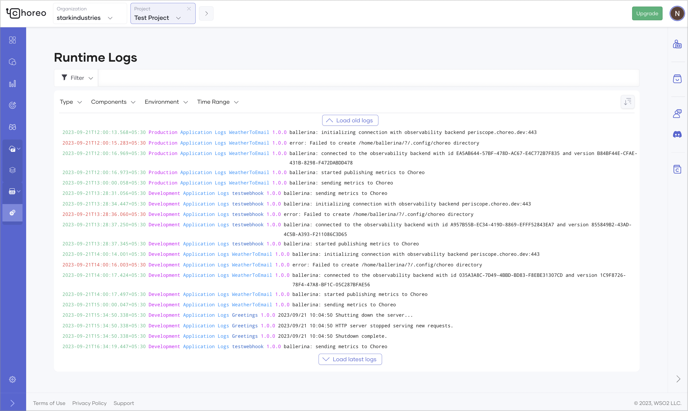
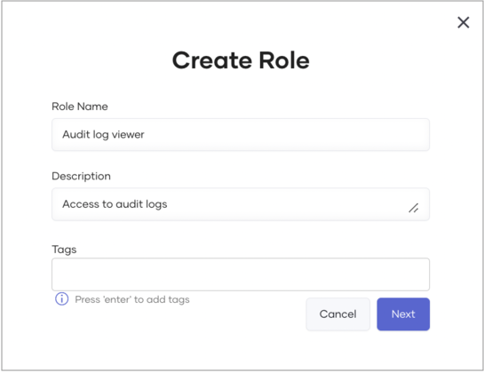

# View Logs

The unified log view in Choreo allows you to view runtime and audit logs to gain application and user insights while ensuring data privacy.

Choreo provides real-time insights through live logs and allows you to view historical logs for insights into the past. You also have the flexibility to define a required time range to view relevant log entries, where an intuitive scrolling capability facilitates easy viewing of appropriate logs within the selected time frame.

The log view also provides advanced filtering capabilities that allow you to efficiently navigate through appropriate logs to expedite troubleshooting in distributed environments.

!!! info "Note"
        All personally identifiable information (PII) gets resolved at the frontend service level, with only relevant UUIDs stored in logs.

## Runtime logs

Choreo runtime logs provide insights into both project and component-level logs, covering application and gateway logs. These logs streamline the debugging process by centralizing diverse log sources.

In Choreo, any organization member can view runtime logs via the runtime logs page. Choreo allows you to apply filters based on parameters such as log level (error, warn, info, debug), log type (application, gateway), and environment (development, staging, production) to simplify the debugging process. 

To access runtime logs, follow the steps below:

1. Sign in to [Choreo](https://console.choreo.dev/).
2. In the left navigation menu, click **Observability** and then click **Runtime Logs**. This displays runtime logs for the past 30 days by default.

    To view logs based on a specific time range and other requirements, you can apply the necessary filter criteria.

    

### Understand runtime logs

When you view component-level logs on the **Runtime Logs** page, you will see both application and gateway logs.

#### Application logs

Each application log entry displays the following details:

  - `timestamp`: The time when the request is received by the component.
  - `level`: Indicates the severity of the log message. Possible values are **Debug**, **Info**, **Warn**, and **Error**.
  - `componentVersion`: The version of the invoked component.
  - `componentVersionId`: The identifier of the invoked component’s version.
  - `envName`: The environment of the inbound request. For example, Development, Production, etc.

#### Gateway logs

Each gateway log entry displays the following details:

  - `timestamp`: The time when the request is received by the gateway component.
  - `logLine`: Contains the following details about the request, including inbound and outbound information from the gateway perspective.
    - `Method`: The HTTP method of the request.
    - `RequestPath`: The path of the inbound request.
    - `ServicePath`: The path of the outbound request.
    - `UserAgent`: The user-agent header of the request.
    - `CorrelationID`: The request identifier of the inbound request. This is useful to track a request.
    - `ServiceHost`: The host IP of the backend.
    - `Duration`: The time taken for the gateway to serve the request.  
  - `gatewayCode`: Indicates the state of the request from the gateway perspective. Possible values are as follows:
    - `BACKEND_RESPONSE`:  Indicates successful processing of the request by the gateway with a response to the client from the backend application.
    - `CORS_RESPONSE`: Denotes a CORS (Cross Origin Resource Sharing) request.
    - `AUTH_FAILURE`: Indicates a request failure at the gateway due to authentication or authorization issues, such as an invalid token.
    - `NO_HEALTHY_BACKEND`: Indicates a request failure at the gateway due to a non-existent backend.
    - `RATE_LIMITED`: Indicates a request failure at the gateway due to surpassing the rate limit enforced within the component.
    - `RESOURCE_NOT_FOUND`: Indicates a request failure at the gateway due to the absence of a matching API resource for the inbound request. This can be caused by a mismatch in the HTTP method, path, or host.
    - `BACKEND_TIMEOUT`: Indicates a request timeout when calling the backend application from the gateway.
    - `GATEWAY_ERROR`: Indicates a request failure due to an erroneous behavior in the gateway.

    !!! info "Note"
         Occasionally, a request may not fit into any of the above categories. In such instances, the `gatewayCode` is displayed as `UNKNOWN`.

  - `statusCode`: The HTTP status code returned to the client.
  - `componentVersion`: The version of the invoked component.
  - `envName`: The environment of the inbound request. For example, Development, Production, etc.

## Audit logs

Audit logs, also called audit trails, enhance security, ensure compliance, provide operational insights, and help manage risks. 

In Choreo, an audit log records organization-level user-specific operations performed via the Choreo Console. It also captures the timestamp and the outcome of the action. 

As of now, Choreo captures the following user-specific operations as audit logs:

- Project creation, update, and deletion.
- Component creation, update, and deletion.
- Component promotion initiation.
- Component version creation.
- Component deployment, redeployment, and undeployment initiation for all components other than REST API Proxy components.
- Component API access mode update.
- Enabling and disabling component auto-deployment on commit. 
- Component build configuration update.
- Component endpoint creation, update, and deletion.
- Organization user management.
- On-premises key management.
- Project-level configuration management.

In Choreo, organization administrators are allowed to view audit logs by default. If other members need to access organization-specific audit logs, the administrator can create a role with the relevant permission and assign it to members. For step-by-step instructions on how to create and assign a role with relevant permission, see [Manage audit log access](#manage-audit-log-access).

To view audit logs, follow these steps:

1. Sign in to [Choreo](https://console.choreo.dev/).
2. In the Choreo Console, go to the top navigation menu and click **Organization**.
   
    !!! tip
         As of now, you can only view organization-level audit logs.

3. In the left navigation menu, click **DevOps** and then click **Audit Logs**. This displays audit logs for the past 30 days by default.

    To view audit logs based on a specific time range and other requirements, you can apply the necessary filter criteria.

    

### Audit log retention

Choreo retains audit logs for one year and archives them for an additional year. Therefore, the total retention period for audit logs is two years.

### Manage audit log access

Follow the steps given below to create a role with audit log access permission and assign it to organization members who need access to audit logs:

!!! info "Note"
        You must be the organization administrator to perform this action.

#### Step 1: Create a role with audit log access permission

1. In the Choreo Console, go to the top navigation menu and click **Organization**.
2. In the left navigation menu, click **Settings**.
3. On the **Organization** tab, click **Roles** and then click **+ Create Role**.
4. Enter a name and description for the role.
   
     

5. Click **Next**.
6. In the **Create Role** dialog, select **LOG-MANAGEMENT** under **Permissions**.

     

7. Click **Create**.  

#### Step 2: Assign the created role to an organization member

1. On the **Organization** tab, click **Members**. This lists the members of the organization with their respective details.
2. Click on a member who needs to have access to audit logs, and then click **+ Add Role**.
   
    !!! tip
         If you want to invite one or more members and assign them the audit log viewer role, follow the steps given below:

           1. Click **+ Invite Member** and then click to expand the **Roles** list.
           2. Select the role you created in [Step 1](#step-1-create-a-role-with-audit-log-access-permission).
           3. In the **Emails** field, enter the email addresses of members you want to invite and grant permission to access audit logs.
           4. Click **Invite**. This sends an invitation email to each email address so that the members can accept and obtain access to view audit logs.

3. Click to expand the **Roles** list and select the role you created in [Step 1](#step-1-create-a-role-with-audit-log-access-permission).
4. Click **Add**. This assigns the selected role to the member. 
