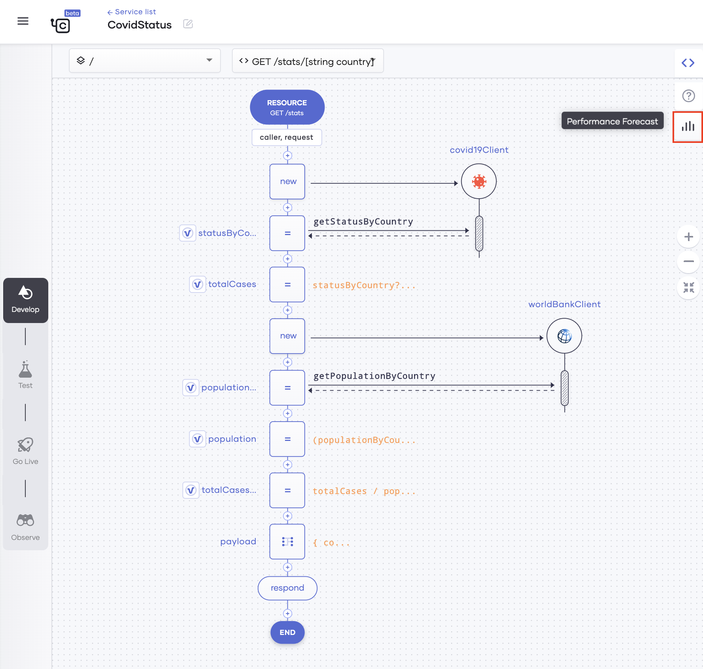
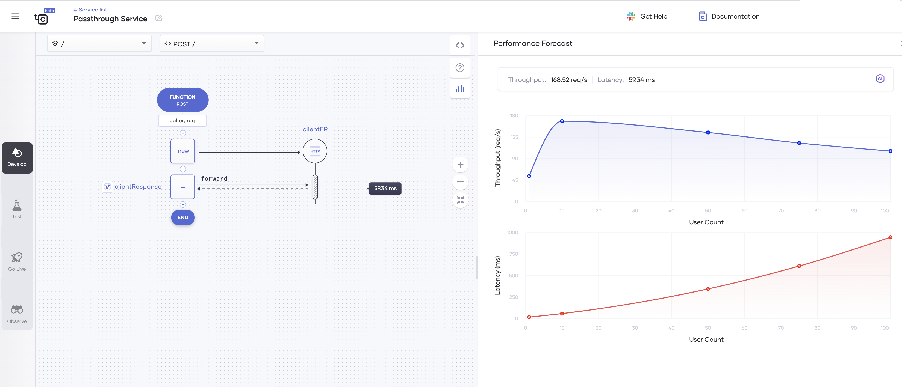
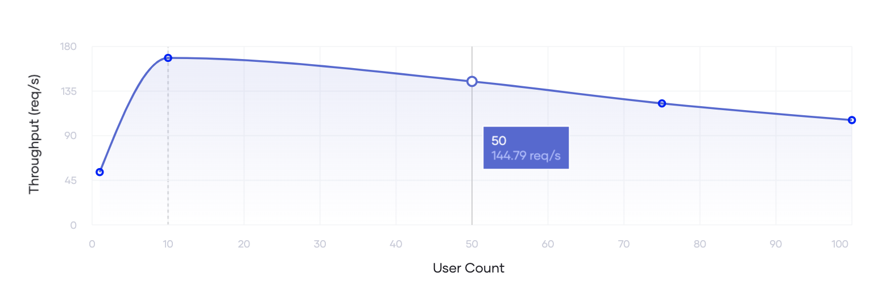
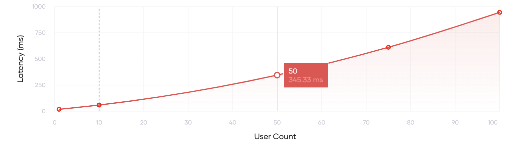
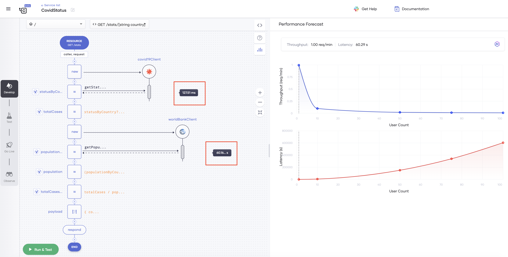

# Performance Analysis

The performance Analyzer tool is an AI-based tool that generates intelligent estimations of the performance of integration-based services and APIs based on historical data. To generate the forecasts, it uses advanced Machine Learning techniques.

Making accurate performance estimations before releasing an application you developed is important due to the following reasons:

- When you create service-level agreements (SLAs) for your application, an accurate forecast of performance allows you to provide valuable insights relating to the scalability of the application and the ways to optimize its performance.
- You can avoid missing important performance characteristics as a result of combining multiple applications including external ones.
- You can correctly assess the cost and feasibility of running the application in a production environment.

Traditionally, the above is achieved via performance debugging which involves measuring the performance of services by load testing them. The Performance Analyzer tool allows you to carry out performance measurement at the application development stage, significantly reducing the time and cost spent on performance debugging.

## Assumptions

The Performance Analyzer tool generates forecasts based on the following assumptions:

- For service-based applications the overhead of non-I/O operations is negligible.
- The service being evaluated is allocated sufficient resources, and therefore, it is not a bottleneck.
- Sufficient historical data is available for each service operation or API call considered during the analysis.

## Access the Performance Analyzer tool

To analyze the performance of a service before deploying it, open the service and click the **Performance Forecast** icon. 

{.cInlineImage-full}

## Forecast performance

Once you access the Performance Analyzer tool, the performance forecast is displayed as shown in the example below:

{.cInlineImage-full}

You can derive insights about the performance as follows:

- You can view the overall throughput and latency above the graphs. In the example given above, the overall forecast is as follows:

    - **Throughput**: 4.90 requests per second.
    - **Latency**: 20.42 seconds per request.

- The **Throughput** graph shows the throughput forecasted by the Performance Analyzer for different user counts. You can hold the pointer over a specific user count to view the forecasted throughput for that user count.

    {.cInlineImage-full}
    
    In the above example, the **Throughput** graph indicates that when the user count is 50 (i.e., 50 users are using the service simultaneously), the forecasted throughput is 4.82 requests per second.
    
- The **Latency** graph shows the latency forecasted by the Performance Analyzer for different user counts. You can hold the pointer over a specific user count to view the forecasted latency for that user count.

    {.cInlineImage-full}
    
    In the above example, the **Latency** graph indicates that when the user count is 50, the forecasted time taken to process one request is 10.37 seconds.
    
- If you want to check the forecasted latency per API call operation for a specific user count, click over that user count in either the **Throughput** or **Latency** graph.

    {.cInlineImage-full}
    
    In the above example, the operation for creating the queue takes 9.901 seconds and the operation for sending a message takes 468.64 milliseconds per request.
