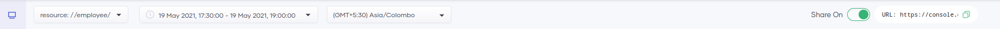

# Observability Overview

Observability in Choreo provides the capability to visualize and monitor the performance of services deployed on Choreo. Choreo has in-built support to view the overall status, latencies, throughput data,  diagnostic data, and logs. Hence, you can use Choreo Observability to detect and troubleshoot anomalies in your services efficiently. 

## Dashboard
Choreo observability dashboard gives you more than one way to monitor your services. This section will introduce the dashboards. 

### Dashboard overview

{.cInlineImage-full}

The Observability dashboard allows you to:

1. Observe the throughput and latencies of requests served over a given period.
2. View the logs generated over a given period.
3. Observe the flame graph (Diagnostics view) generated over a given period.
4. View the low-code diagram.
5.  Trace requests.

!!! note
    By default, the observability view is private and is only visible to the service owner. If you need to share it, toggle the **Share On** switch, copy the observability URL and share it with the required parties.
    {.cInlineImage-full}

### Throughput and latency graphs

{.cInlineImage-full}

The throughput graph shows the throughput of requests per hour for a selected timestamp. 

By default, Choreo renders this graph for the data generated within the past 24 hours. You can change the default time window by selecting the time range and zone from the options bar. 

You can expand the graph by clicking and dragging the cursor over the period you want to drill down.

You can view the Choreo service logs in the **Logs**  view below the graph. Clicking on either graph will update the **Logs** view to contain the corresponding log entries generated at that time. You can use these logs to identify the evident reasons for any latency and throughput anomalies you detect using the graph. 

 {.cInlineImage-full} 

### Diagnostics view

The **Diagnostics view** provides the capability to view errors, throughput, latencies, CPU usage, memory usage, and logs simultaneously for a particular event. You can detect and analyze errors and anomalies in detail via the **Diagnostics view**.

By default, the time range selected for the **Throughput & Latency** graphs is the same time range used for the **Diagnostics View**.

{.cInlineImage-full}

 
A **bin** is a horizontal section of the graph for a particular period. A bin consists of the following:

- **Date/Time**: The timestamp the log entries started to appear.
- **Logs**:  List of log entries and their respective log count that occurred within the bins time frame. These log entries appear according to precedence. The error logs are listed first, followed by the info logs. Each bin shows a maximum of five log entries sorted based on the log count.
- **Error**: The number of HTTP errors that occurred at the selected time.
- **TP**: Throughput of the requests at the selected time (req/s).  
- **Latency**: Latency of the request at the selected time (ms).
- **CPU**: CPU usage at the selected time (millicores).
- **Memory**: Memory usage at the selected time (MiB).

### Trace requests

You can trace requests received by your service at a given timestamp by clicking on a point in the time axis of either the throughput or the latency graph.  The low-code view shows the received requests. For each request, it displays the request time, the latency, and the status. Furthermore, you can view the status code and the request latency when you click on a particular request.

The low-code diagram also displays the average request latency and the success rate for each client request corresponding to the selected time interval. 

## View and filter all logs

{.cInlineImage-full}

The **Logs** panel includes all logs generated by the service. You can filter it based on time or based on text. 

To download the log entries, click **Download**. As a result, the log entries are saved as a .zip file in the location you specify.
