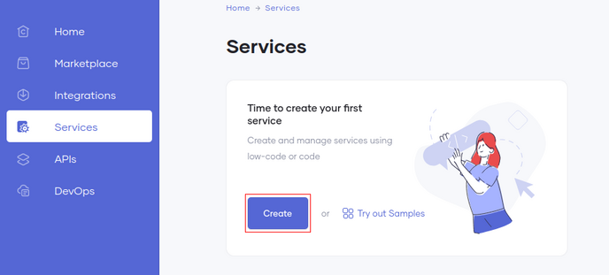
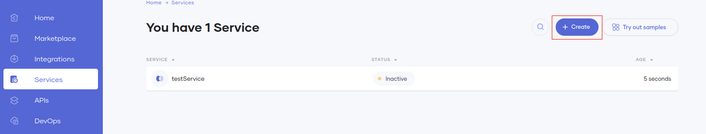
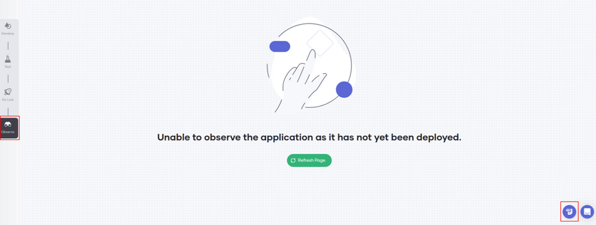
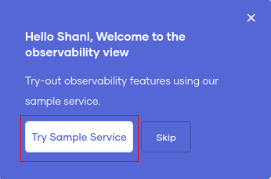
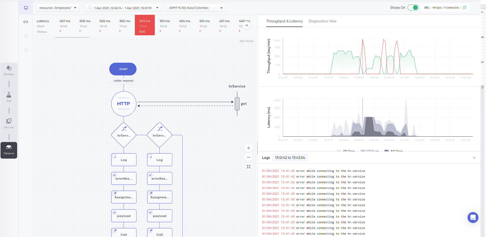
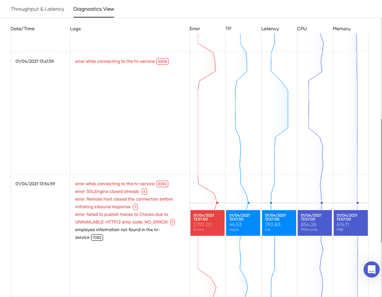

# Perform Root Cause Analysis

Performing root cause analysis is crucial in identifying and rectifying the underlying problem for any anomalies detected in a system. Choreo Observability provides helpful insights out-of-the-box that assists in carrying out a root cause analysis for any service deployed on the Choreo platform.

!!! info
    For explanation, we are using the sample data available in the product.
    
## Get started with the sample service

1. Go to **Services** from the left navigation.
2. Create a new service.
    1. **If this is your first service**, 
    
        1. Enter a name for the service and click **Create**. 
           
           
    2. **Else** (if you already have services created), 
        
        1. Click **+ Create** to start creating a new service.
        2. Enter a name for the service and click **Create**.
           

3. From the left-hand menu, click **Observe**.
4. On the right-hand bottom, click the **Sample Service** icon.
       
5. Click **Try Sample Service**.

       
    
## Detect anomalies and perform root cause analysis
You can detect the anomalies of the usage of a service by observing the **Throughput & Latency** graphs. The throughput graph shows the successful and erroneous requests that occurred during a period. The latency graph shows the latencies of each request. You can observe these graphs at a lower granularity by choosing a shorter time range, which gives you a better understanding of the incidents.

### Step 1: Detect the anomalies

#### Analyze the throughput graph
The throughput graph shows the throughput of requests per hour for a selected timestamp. 

With the sample data, you can observe spikes in the throughput graph.  You can find the root cause for this by learning how to analyze the throughput graph.

Follow the steps below. 

1. Hover over the throughput graph where you see spikes. You can observe the number of errors that occurred at the time. 
    
    !!!tip
        You can expand the graph by clicking and dragging the cursor over the period you want to drill down.
        
2. Click the graph on a high point.
3. Observe the logs in the logs panel.
4. Note multiple logs are mentioning a connection error with the `hr-service`.
 

 
#### Analyze the latency graph

The latency graph shows the latencies of each request.

With the sample data, you can observe spikes in the latency graph. You can identify the errors that caused the spikes and the exact API invocation(s) that caused the errors by analyzing the latency graph. 

Follow the steps below.

1. Hover over the latency graph and click on a high point.
   
    !!!tip
        You can expand the graph by clicking and dragging the cursor over the period you want to drill down.
        
2. Observe the latencies of each request listed in the low-code diagram.
3. Click on one request shown on the low-code diagram (latencies). You can observe the status code for that request and thereby identify the exact API invocation that caused any error(s).

### Step 2: Drill into the analytics

Follow the steps below to learn how to drill down and confirm the root cause for the anomalies we detected in the **Latency and Throughput** graphs.

1. Click on the **Diagnostics View** tab on the left panel. 

    !!!info
        The time range selected for the **Throughput & Latency** graphs is applied to the **Diagnostics View** by default. We recommend capturing the time range you want to analyze in detail from the **Throughput & Latency** graph and then navigate to the **Diagnostics View**.
        
2. In the sample data, you can observe a couple of prominent errors appearing in the four bins.
3. Select a bin that shows a higher occurrence of the error log "error while connecting to the hr-service”. Notice that this bin also includes other errors which occurred at a lesser frequency.

    

4. Furthermore, when you analyze the graph, you can find a peak with a larger number of errors error. At this same time notice instances where you can see an increase in the throughput and a drop in latency. 
5. By analyzing the graphs as above, you can confirm that the cause for the latency drop and the throughput spike is the connectivity issue displayed by the error logs.
6. Observe that the error graph is also fluctuating over time as the service logs errors.
7.  You can observe similar behavior in the other bins as well.

   
   
   
Therefore, now you can conclude that the connectivity issue is the root cause for the intermittent anomalies detected in the throughput and the latencies of requests.
