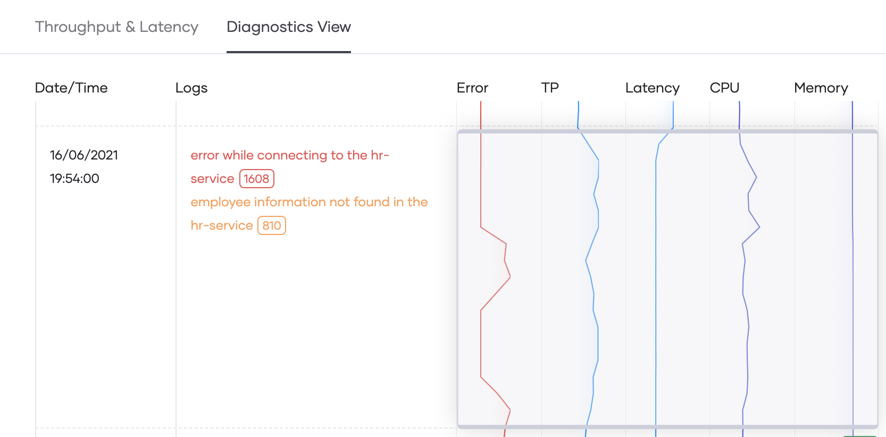

# Perform Root Cause Analysis

Choreo provides insightful observability features to drill down to the request level and confirm the root cause for anomalies you detect.

This guide describes how you can detect anomalies and perform root cause analysis on a service deployed in Choreo. 

    
## Access observability data of a service

Follow this procedure to try out the sample service:

1. Sign in to the Choreo Console at [https://console.choreo.dev/](https://console.choreo.dev/).
2. Go to the **Observability** card and then click **Try Now**. This takes you to the **Observability** page. 
3. Move the pointer to the right-end of the row for an active service, and then click **Observe**. If you do not have any active services, you can click **Try Sample**. 

    {.cInlineImage-full}
        
    You are directed to the sample service low-code view where you can see the following:

    - Low-code diagram
    - Throughput graph   
    - Latency graph
    - Logs
    - Diagnostic data

Here, you can detect anomalies and perform root cause analysis on the sample service.
    
## Detect anomalies and perform root cause analysis

To detect anomalies of the service, you must trace its executions from the code statement level to the machine it runs in. You can analyze observability data and logs to troubleshoot and identify the root cause for the anomalies you detect. 

### Analyze the throughput graph

The throughput graph depicts the total throughput of the service (which includes both successful and erroneous requests) during a selected time interval. You can analyze the spikes in the throughput graph to identify the root cause for requests that result in an error.

The following image is an example of a throughput graph:

{.cInlineImage-full}

The actions you can perform are as follows:

- **View the number of successful requests and errors**

    To do this, hold the pointer over the area of the graph that shows the required time interval. The throughput graph displays the number of successes over the graph as shown in the above image (in this example it displays 296 successes and 2512.43 errors). The low-code diagram displays the success rate for each connector.
    
- **View log entries**

    If you click on the required area on the graph, the log entries applicable for that time period are displayed in the **Logs** pane. In this example, the log displays multiple entries indicating an error in connecting to the `hr-service`.
    
- **View data for a custom time range**

    You can expand the graph by clicking and dragging the pointer over the period you want to drill down. The default graph displays data for a custom time range where the data points are at a lower granularity.

 
### Analyze the latency graph

The latency graph depicts the latency of requests over a selected time interval. You can analyze the spikes in the latency graph to identify the API invocations that result in error status.

The actions you can perform are as follows:

- **View details of a latency that has occurred**

    To do this, go to the latency graph under the **Throughput & Latency** tab and click on a data point where there is a spike. This displays the latency, start time, and status of the corresponding requests just above the low-code diagram as shown in the image below:

    
    
- **View details at a higher granularity**
   
    If you want to drill down to view details at a higher granularity, drag the pointer over a time range to view the graph for the selected period.
    
- **Check the status code of a request that has caused a latency**

    To do this, click on the relevant latency value. In the following example, the status code is `500`, which means the request resulted in an error state.
    
    {.cInlineImage-full}

### Analyze diagnostic data

The **Diagnostic View** allows you to further drill down the observability data you viewed in the **Throughput & Latency** tab to identify possible root causes for anomalies of a service.

The following image is an example of how you can view diagnostic data once you click on the **Diagnostics View** tab.
 
{.cInlineImage-full}

!!!info
    The time range applied to the **Diagnostics View** by default is the same time range for which you viewed the **Throughput & Latency** before clicking on this tab. 
        
If you hold the pointer over a section where you see fluctuations in multiple bins, you can view the related logs.

{.cInlineImage-full}

In this example, the logs indicate a higher occurrence of `error while connecting to the hr-service`. Although there is another error also displayed, its error count is comparatively much lower (i.e., it has occurred only 810 times whereas the `error while connecting to the hr-service` has occurred 1608 times).

In the same example, if you further analyze the sample diagnostic data, you can identify the connectivity error as the most common error.  
   
Based on this, you can conclude that the root cause of the anomalous throughput and latencies is the connectivity issue. 
