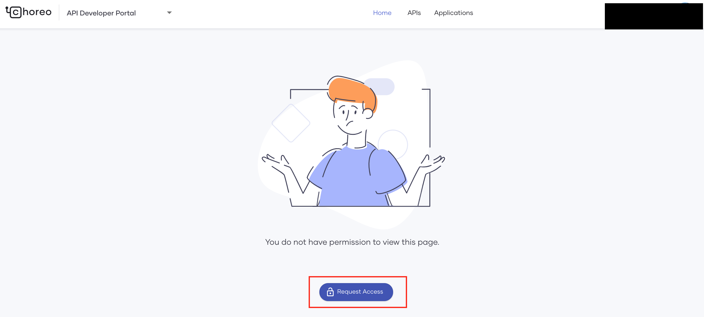
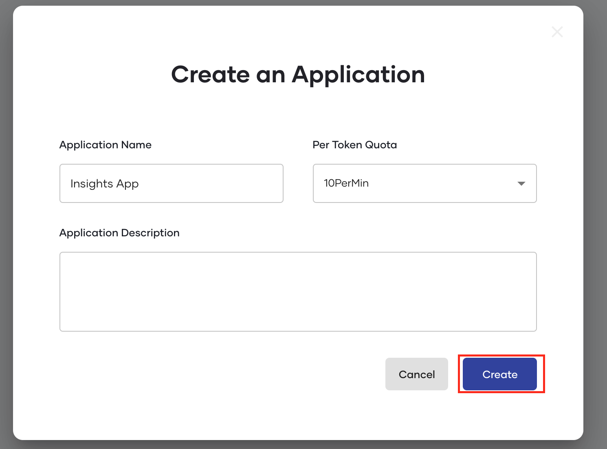
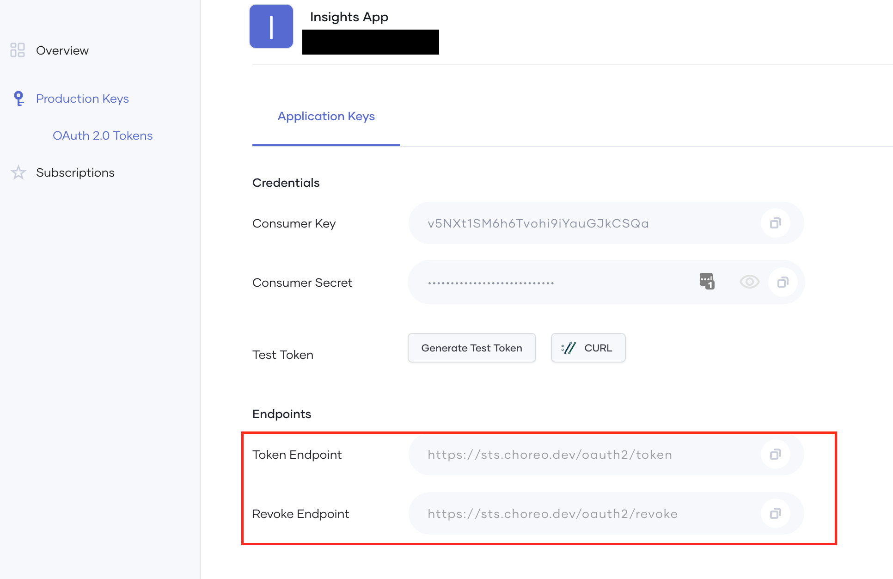

# Programmatic Access to Insights API

The **Insights** page in the Choreo Console displays data fetched from the Insights API exposed over the Internet. However, in some scenarios, you may need to fetch data from external systems and implement custom dashboards to display this data.

Choreo provides a secure and user-friendly method to achieve this requirement. The steps are outlined below:

## Become a member of the Choreo System organization

1. Sign in to [https://devportal.choreo.dev](https://devportal.choreo.dev) using your credentials.

2. Access the Developer Portal of the `Choreo System` organization via [https://devportal.choreo.dev/choreosystem](https://devportal.choreo.dev/choreosystem).
   
3. To get access to the `Choreo System` organization, click **Request Access**.

{.cInlineImage-full}

Once you request access, you are automatically added as a member of the `Choreo System` organization.

Verify this by checking whether the `Choreo System` organization appears in your list of organizations.

{.cInlineImage-full}

## Create an application and generate keys

To create an application and generate keys, follow the steps below:

1. Click on the **Applications** link to create a new application in the Choreo System organization.
    {.cInlineImage-full}

2. Enter a suitable name and create the application.
   
    {.cInlineImage-half}

3. To subscribe to the **Insights** API via the newly created application, click **Subscriptions** in the left navigator, and then click **Add** for the Insights API.

    {.cInlineImage-full}

4. To generate credentials for the application, click  **Production Keys** -> **OAuth 2.0 Tokens** in the left navigator, and then click **Generate Credentials**. This generates a consumer key and secret for the created application.

    {.cInlineImage-full}

5. Specify a suitable token expiry time and click **Update**.
   
    {.cInlineImage-full}

6. Execute the following curl command to generate an access token:

    ```bash
    curl --location --request POST 'https://sts.choreo.dev/oauth2/token' \
    --header 'Authorization: Basic <BASE64_ENCODED_CONSUMER_KEY_AND_CONSUMER_SECRET_OF_YOUR_APP_HERE>' \
    --header 'Content-Type: application/x-www-form-urlencoded' \
    --data-urlencode 'grant_type=client_credentials' \
    --data-urlencode 'orgHandle=<YOUR_ORG_HANDLE_HERE>' \
    --data-urlencode 'scope=apim:api_manage'
    ```

    !!! info
        To get your organization handle name, you must sign in to [https://console.choreo.dev](https://console.choreo.dev), go to **Settings**, and click **Copy Handle**.

    This token can then be used to access the Insights API exposed via [https://choreocontrolplane.choreo.dev/93tu/insights/1.0.0/query-api](https://choreocontrolplane.choreo.dev/93tu/insights/1.0.0/query-api).

    A sample curl command to invoke the Insights API is shown below.

    ```bash
    curl --location --request POST 'https://choreocontrolplane.choreo.dev/93tu/insights/1.0.0/query-api' \
    --header 'Content-Type: application/json' \
    --header 'Authorization: Bearer <TOKEN_HERE>' \
    --data-raw '{"query":"query ($org: OrgFilter!) {listEnvironments(org: $org){id\n name}}","variables":{"org":{"orgId":"<ORG_UUID_HERE>"}}}'
    ```

    !!! tip
        When the token expires, you can generate a new token programmatically by making an API call to the token endpoint via the client credentials grant.

        If a token theft occurs, the relevant token can be revoked by making an API call to the revoke-endpoint.

        {.cInlineImage-full}
