# View API Insights

This section explains how you can view insights about the APIs deployed in your organization.

## Access the Insights page

To open the **Insights** page, access the Choreo Console at [https://console.choreo.dev/](https://console.choreo.dev/), and click **Insights** in the left navigation menu.

## Analyzing statistics

Once you access the **Insights** page, you can access the following subpages.

### Overview

The **Overview** page gives you a quick overview of the performance of the system. It can be used as a dashboard to view the current system status.

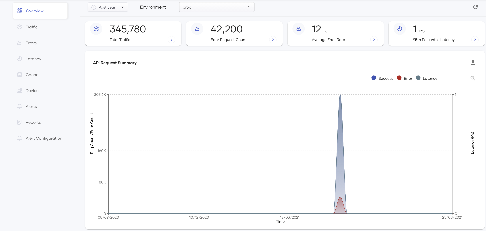{.cInlineImage-full}

The information displayed is as follows:

- **Total Traffic**

  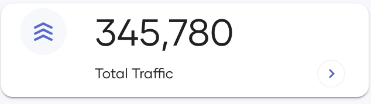{.cInlineImage-half}

  This widget displays the total traffic of the selected environment received during a given time interval. Both successful requests and failed requests are displayed. To investigate further, you can click the arrow icon on the bottom right corner of the widget to open the [**Traffic**](#traffic) page.

- **Error Request Count**

  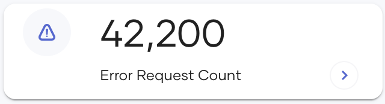{.cInlineImage-half}

  This widget displays the total number of requests that have resulted in errors in your selected environment during the selected time range.

- **Average Error Rate**

  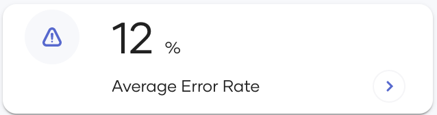{.cInlineImage-half}

  This widget displays the average error rate (i.e., error count/total request count) of the selected environment for a given time interval. You can use this widget as an indicator to understand the health of the system. If the error rate is high, you can investigate further by clicking the arrow on the bottom right of the widget and opening the [**Errors**](#errors) page.

- **95th Percentile Latency**

  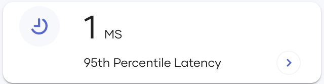{.cInlineImage-half}

  This widget displays the 95th percentile of all API latencies in your selected environment for the given time interval. You can use this widget to know whether the complete system operates under given SLAs. This metric provides the first indication of slow APIs. To investigate further, you can click the arrow on the bottom right of the widget to open the [**Latency**](#latency) page where you can further analyze the latency.

- **API Request Summary**

  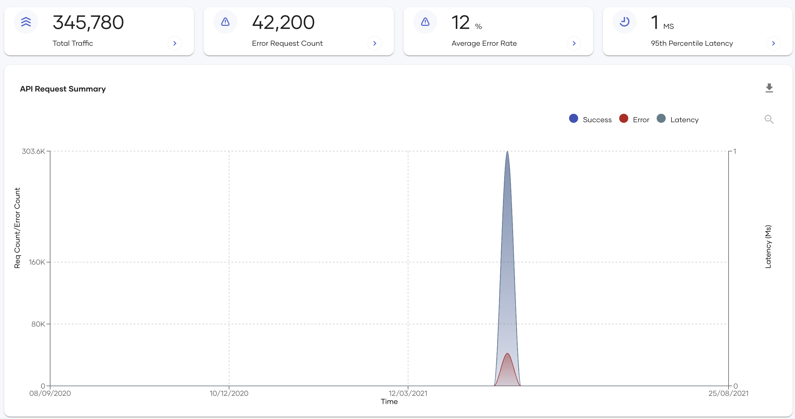{.cInlineImage-full}

  This chart displays the total successful requests, the total requests that have resulted in errors, and the latency in a timeline. The y-axis on the left displays the request count and the error count. The x-axis shows time, and the y-axis on the right shows the latency in milliseconds. The granularity of the data points is decided based on the time range you have selected. The tooltip provides the exact value of all three metrics accurately.

### Traffic

The **Traffic** page shows information related to the traffic that goes through your API management deployments. This includes API usage, application usage, resource usage, etc. You can use this page to investigate the usage of APIs and applications, traffic patterns, etc.

{.cInlineImage-full}

You can filter the information displayed in the widgets as follows:

| **Filtering Option** | **Description** |
|--------------------|-------------------------------------------------------------------------------------------------|
| **By API**         | In the **API** field, you can select one or more APIs for which you want to view analytics. **All** is selected by default. Once you select an API, you can further filter by a specific application that uses the selected API via the **Application** field described below. |
| **By Application** | In the **Application** field, you can select the applications for which you want to view analytics. **All** is selected by default. The available applications are all the applications that have subscribed to one or more of the APIs you selected in the **API** field.|

You can view the following information for the APIs you have selected using the above filtering criteria:

- **API Usage Over Time**

  This timeline shows the count of API hits for the APIs for the filtered APIs. If multiple APIs are selected, the timeline shows each API in a separate line with a legend separating each line. You can also zoom in on a selected time range by selecting that area in the chart. To restore to the original view use the **Zoom out** button on the top right-hand corner of the plot.

  {.cInlineImage-full}

- **API Usage By Application**

  This widget shows the per-application breakdown of requests for the APIs you selected. You can use the pie chart view or the line chart view. You can switch between the two views using the small icon at the upper-right corner of the widget.

  {.cInlineImage-half}

- **API Usage By Target**

  This widget shows the per-backend breakdown of requests for the APIs you selected. This information is useful when multiple APIs share the same backend that has traffic restrictions. You can use these stats to scale your backends proactively. You can switch between the two views using the small icon at the upper-right corner of the widget.

  {.cInlineImage-half}

- **API Resource Usage**

  This table shows a resource-level breakdown of API traffic. Each row represents an API resource and it shows the API name, resource path, API method, and the hit count for that combination.

  {.cInlineImage-half}

### Errors

The **Errors** page shows information related to erroneous API calls that are received by your system. The errors are categorized based on the error type. You can further drill down using the error subtypes. Use this page as the starting point for debugging any API errors.

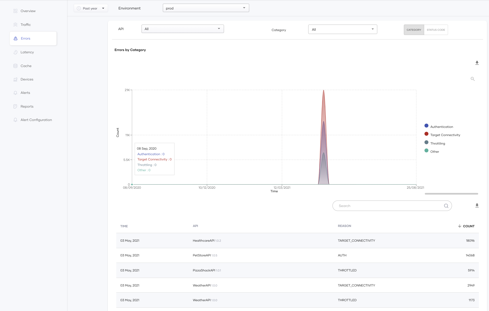{.cInlineImage-full}

You can filter the information displayed in the widgets as follows:

| **Filtering Option** | **Description** |
|--------------------|-------------------------------------------------------------------------------------------------|
| **By API** | In the **API** field, select the APIs for which you want to view analytics. By default, all APIs are selected. You can select one or multiple APIs from this selector and view the aggregated result. |
| **By Category** | The **Category** field is displayed when you click **Category** in the upper right corner of the page. In this field, you can select one or all of the following error categories: **Authentication**: Any kind of authentication error falls into this category including expired/missing/invalid credentials. **Target Connectivity**: Any kind of back-end error falls into this category including connection time-outs/other back-end errors (for example, 4xx and 5xx status codes). **Throttling**: Any kind of rate-limiting error falls into this category including application throttling/subscription throttling. **Other**: All other errors fall into this category including mediation errors/resource not found errors. |
| **By Status Code** | The **Status Code** field is displayed when you click **Status Code** in the upper right corner of the page. In this field, you can select all or any available HTTP status code category (4xx, 5xx, etc.). These status codes represent the response status of the API Gateway. |

#### Viewing errors by category

The following widgets are available for monitoring errors when you have selected **Category** in the upper-right corner of the page.

- This graph shows the error by category over time for the selected period. Apply the required filters as explained above to select the APIs and the error categories to which this content applies. When you select multiple APIs, the error count is grouped by category.

  {.cInlineImage-full}

- This table provides further information about the errors such as application details and the error reason. For some authentication errors, the application name is not available. You can use this table to get more concrete information about the errors related to your APIs and then start the problem identification.

  {.cInlineImage-full}

#### Viewing errors by status code

The following widgets are available for monitoring errors when you selected **Status Code** in the upper-right corner of the page.

- **Errors by Status Code**

  This graph shows the distribution of HTTP status codes received for errors over time for the selected period. Apply the required filters as explained above to select the APIs and status code groups to which this content applies. When you select multiple APIs, the error count is grouped by the status code.

  {.cInlineImage-full}

- **Target Errors by Status Code**

  This graph shows the distribution of target errors that have occurred during the selected time interval by HTTP status code. Apply the required filters as explained in the table above to view the APIs and status code groups to which this content applies. If you select multiple APIs, the widget groups the target error count by the status code.

  {.cInlineImage-full}

- **Errors**

  The Errors heat map shows the HTTP response codes of errors sent to the client by the API Gateway. Each row displays the number of times the system returned each status code for the selected APIs. The cell color is red for higher numbers and white for lower numbers. If required, you can further filter the results by the error code groups you identified with the **Errors by Status Code** graph.

  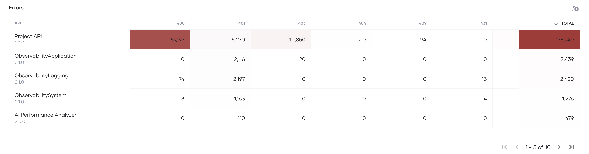{.cInlineImage-full}

- **Target Errors**

  The Target errors heat map shows the HTTP response codes of errors that the API Gateway received from the backend. Each row displays the number of times the system returned each status code for the selected APIs. The cell color is red for higher numbers and white for lower numbers. If required, you can further filter the results by the error code groups you identified with the **Target Errors by Status Code** graph.

  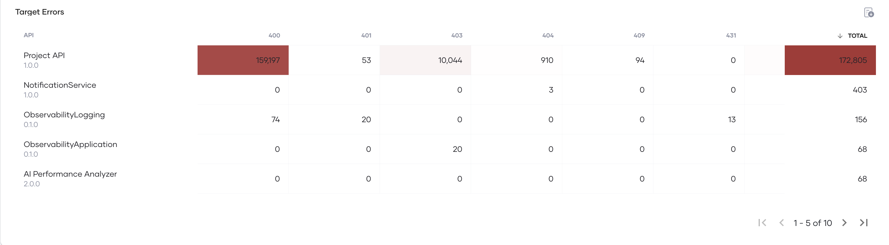{.cInlineImage-full}

### Latency

The **Latency** page shows information related to the latency of API calls within the API management deployment. You can view a summary of the slowest APIs and then drill down into the API view for further analysis. Use this page as a starting point to debug API slowness.

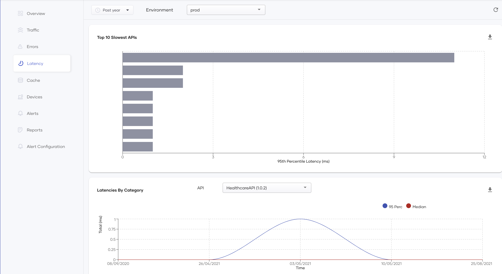{.cInlineImage-full}

The information displayed is as follows:

- **Top 10 Slowest APIs**

  This widget allows you to identify the slowest APIs of the API management system at a glance. Since these are the APIs that contribute to the higher 95th percentile of the system, improving these APIs lowers the 95th percentile of latency in the API Management deployments.

  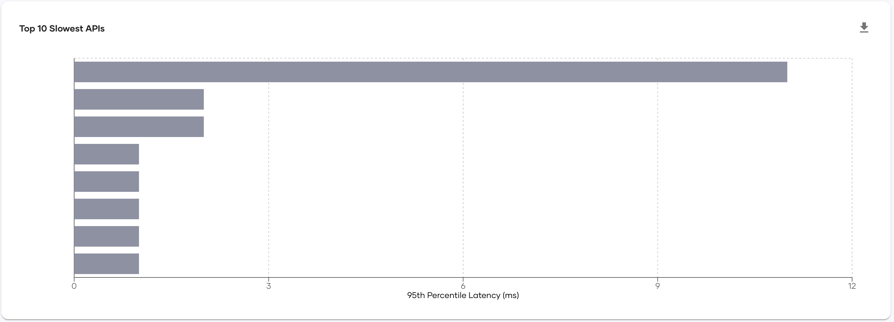{.cInlineImage-full}

- **Latencies By Category**

  This widget allows you to further drill down details in the above chart. Use the API selector in this widget to select the slow API you identified in the earlier step and then analyze further. Use the charts available in the widget to view the 95th percentile and the median latency over the selected period of the following:

    - Backend
    - Request mediation
    - Response mediation

  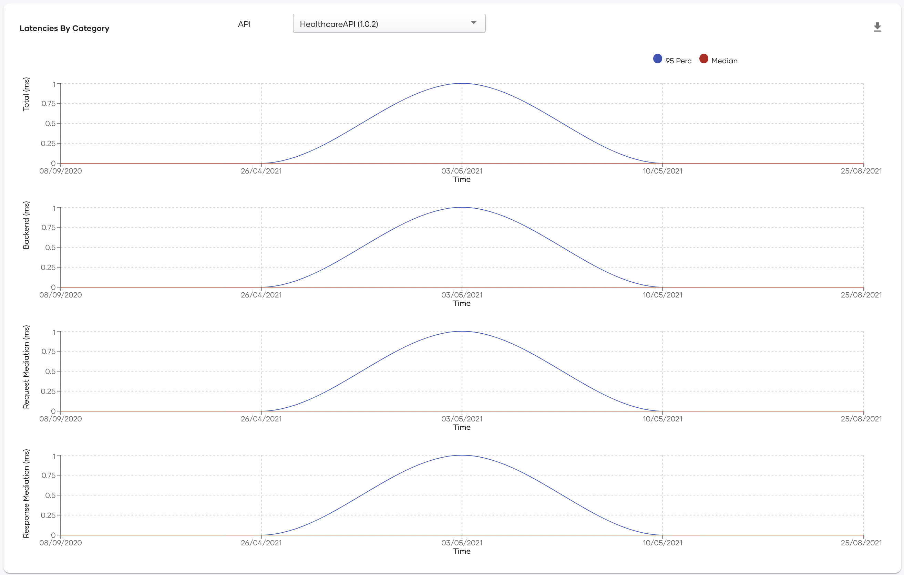{.cInlineImage-full}

  You can use these charts to further drill down and analyze whether the latency occurs in the backend, request mediation, or response mediation. Also, because you can see both the median and 95th percentile, you can easily identify whether the slowness is occurring in each request or whether it is intermittent.

### Cache

The **Cache** page shows statistics that indicate the efficiency with which response caching is carried out for the requests sent to your APIs.

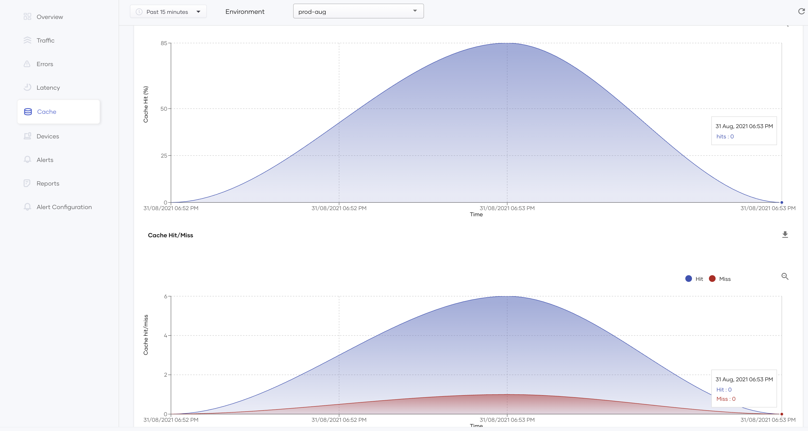{.cInlineImage-full}

The page displays the following statistics:

- **Cache Hit Percentage**

  This graph shows the percentage of requests the system has handled via the response cache over time and the total hits over time. This information allows you to assess how efficiently the backend handles API requests. For example, if the cache hit rate is low, it may indicate that the backend generates the same response each time a specific request is sent instead of returning the response via the cache. In such a scenario, there is scope to improve performance via response caching.

  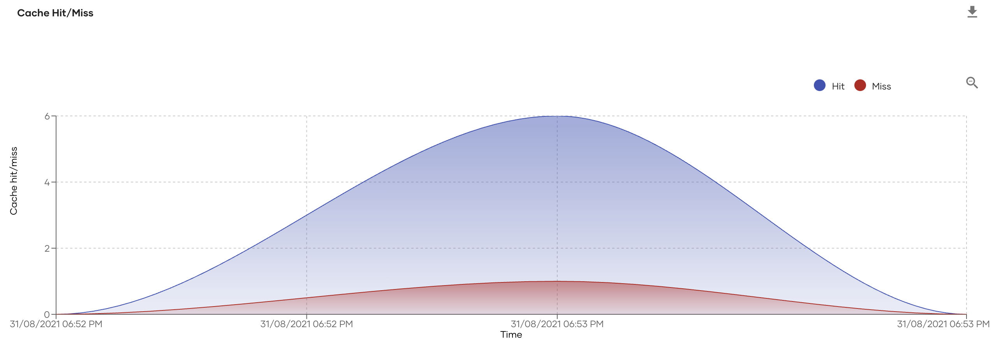{.cInlineImage-full}

- **Latency**

  This section shows the total latency reported during the same time interval applied to the **Cache Hit Percentage** graph above.

  {.cInlineImage-full}

### Devices

The **Devices** page displays information about operating systems and HTTP agents that end users use to invoke the APIs. You can use this page to get an idea of the distribution of your user base and improve your APIs to match the audience.

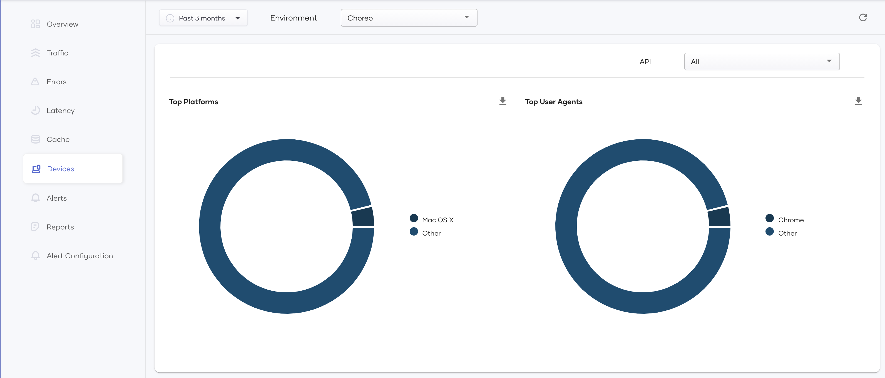{.cInlineImage-full}

To filter the information displayed on this page by API, select the required API(s) in the **API** field. **All** is selected by default.

The information displayed is as follows:

- **Top Platforms**

  This chart shows the breakdown of the API clients by the operating system. The pie chart only shows platforms with a significant amount of requests. Other platforms are grouped under the **Other** category.

  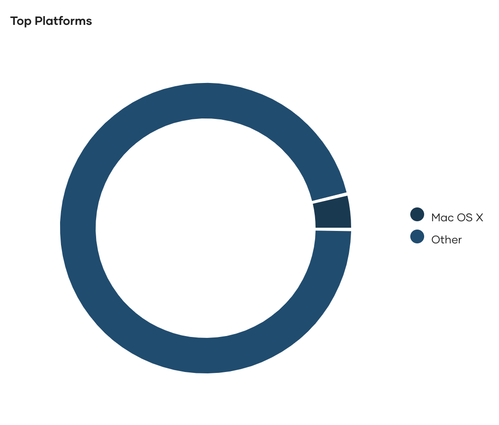{.cInlineImage-half}

- **Top User Agents**

  This chart shows the breakdown of the API clients by user-agent. The pie chart only shows user agents with a significant amount of requests. Other platforms are grouped under the **Other** category.

  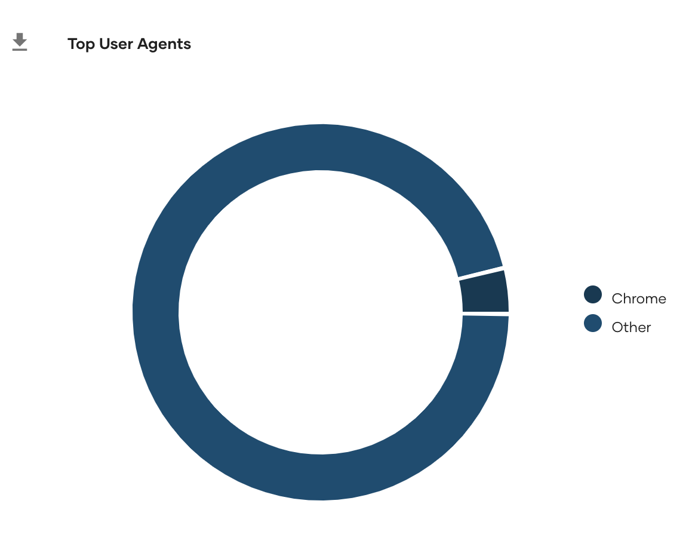{.cInlineImage-half}

### Alerts

The **Alerts** page shows information related to business alerts issued by Choreo for your currently selected environment and organization. You can use this page as a health monitoring dashboard and make it visible to your project team. Using this page you can drill down on each alert and discover possible anomalies in your published APIs. See the topics given below to get details of the available widgets and understand how to use them effectively.

{.cInlineImage-full}

**Prerequisites**

To use this page, be sure to configure alerts and have API invocations that trigger alerts. 

!!! Note
    Alerts are retained only for a week.

- **Alert Summary**

  This table lists down each alert generated during the selected time interval. The message of the alert can be viewed by expanding the arrow icon on the details column. The drop-downs can be used to filter alerts based on the alert type and API.

  {.cInlineImage-full}

- **Top APIs by Alert Count**

  This shows a pie chart and a table to visualize the alert distribution during the selected time interval.

  {.cInlineImage-full}

### Reports

The **Reports** page allows you to download monthly usage reports for your system. There are preconfigured reports with system-wide statistics, and a custom report generator to generate reports based on a subset of APIs/applications.

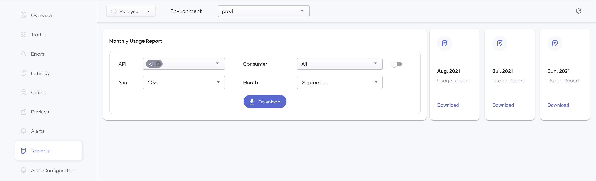{.cInlineImage-full}

#### Download custom reports

This widget allows you to generate a custom report for the statistics that have been generated up to now and download it.

{.cInlineImage-full}

To generate a custom report, follow the steps below:

1. In the **API** field, select one or more APIs for which you want to generate the report. If required, you can select all the APIs by selecting **All**.

2. If you need to further filter the content printed in the report, select one or more applications in the **Application** field. By default, all the applications that have subscribed to one or more of the selected APIs are selected.

    !!! Tip
        If you want to filter the report content by the API consumer instead of the application, click on the toggle switch to the right of the **Application** field, and then select the required consumer. Only consumers who have subscribed to one or more of the selected APIs are displayed in the list. You can either select one, or all of them.

3. Select the required year and the month in the **Year** and **Month** fields to specify the time interval for which you want to generate the report.

4. Click **Download**, and select the required format.

The report is downloaded in the specified format. The following is a sample report generated in PDF format.

{.cInlineImage-half}

The contents of the report are as follows.

| **Item** | **Description** |
|-------------------------|--------------------------------------------------------------------------------------------|
| **Generated Time**      | The date and the time the report was generated.                                            |
| **Organization**        | The organization to which the report applies. Each report always applies to a specific organization. |
| **Environment**         | The environment to which the report applies. Each report always applies to a specific environment.  |
| **Tenant**              | The tenant to which the report applies. Each report always applies to a specific tenant.            |
| **Reporting period**    | The time interval for which the report is generated.                                       |
| **Total request count** | The total request count received by all selected APIs during the report time interval.     |

The table in the report contains the following rows.

| **Item** | **Description** |
|-----------------------|------------------------------------------------------------------------------|
| **API**          | The name of the API.                                                         |
| **Application** | The name of the application. The name of the subscriber is also provided within brackets. |
| **Usage**       | The usage count.                                                           |

#### Download pregenerated reports

These widgets allow you to download monthly reports for the last three months.

{.cInlineImage-half}

To download a pregenerated report, click **Download** for the relevant month and then click on the required format.

### Geo Map

The **Geo Map** page allows you to see a geographical representation of your API usage. You can use this page to make business decisions such as identifying growing regions, analyzing the impact of a region-specific marketing campaign, etc.

{.cInlineImage-full}

To filter the information displayed on this page by API, select the required API(s) in the **API** field. The default value is **All**.

This heat map highlights the countries with the appropriate color based on the hit count. It uses a relative color scale to depict the highest hit count to the lowest non-zero hit count.

{.cInlineImage-half}

#### Viewing the number of requests by country

You can hold the pointer over the highlighted countries to view the country name and the total number of hits from that location. You can also use the mouse to zoom the map or pan it.

{.cInlineImage-half}

!!! Note
    Currently, this feature is only available for on-premise environments.

Optionally you can download geo map data in a tabular format using the PDF or CSV download options by clicking  on the top right corner.

!!! Note
The geo-map page utilizes the IP address of the incoming request to derive the geolocation. The actual source IP address can be replaced if there are intermediate hosts between the client and the gateway node. Therefore, the reverse proxy or the load balancer fronting the gateway node must add the `x-forwarded-for` header to each request to preserve the source IP address. If you do not configure this correctly, the **Geo Map** page will not show any data. To test this, you can manually add an `x-forwarded-for` header to the request.

