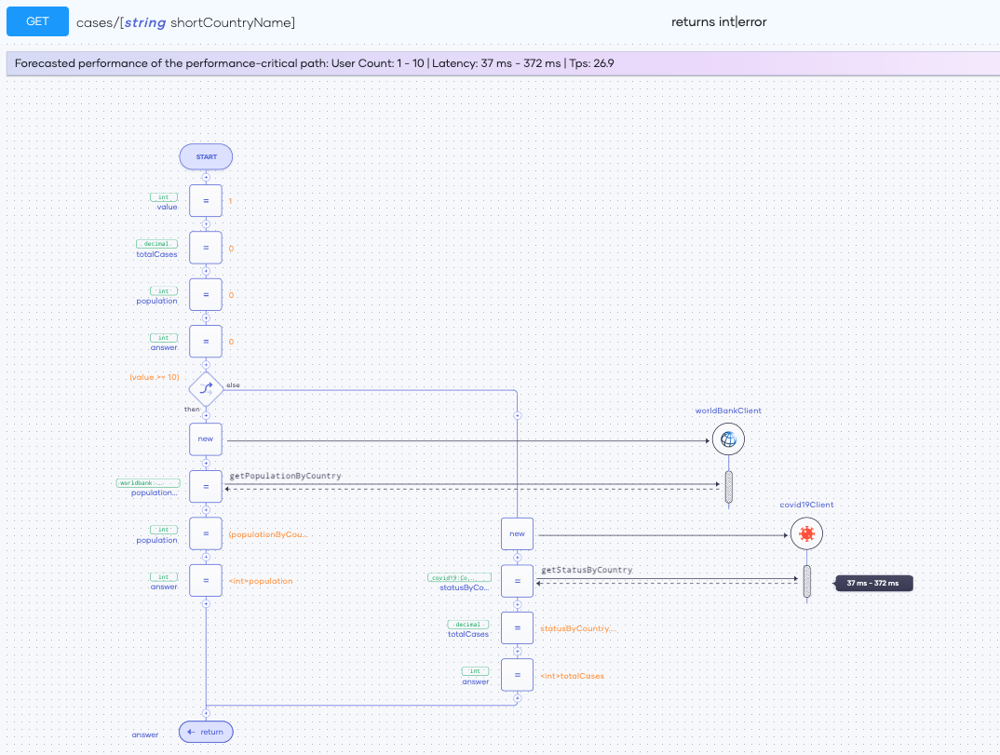
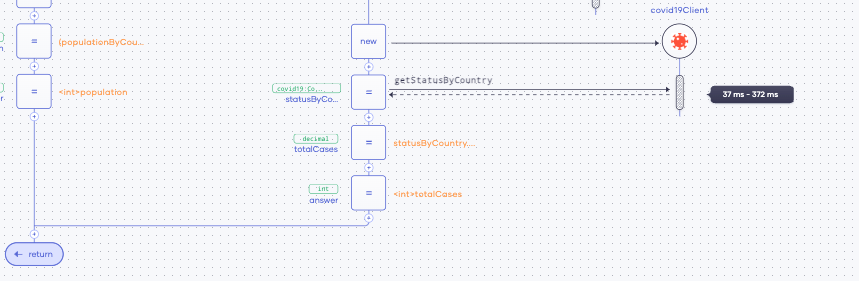
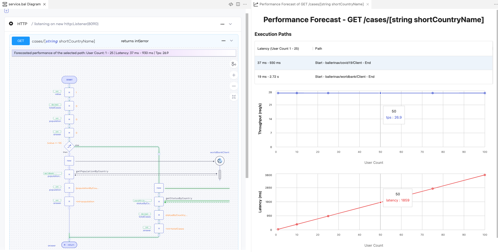
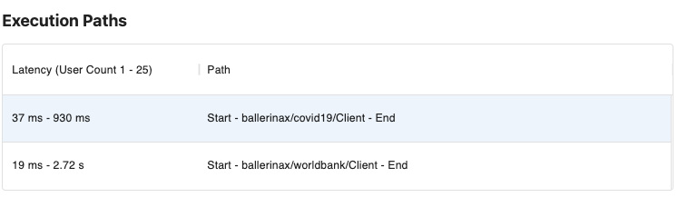
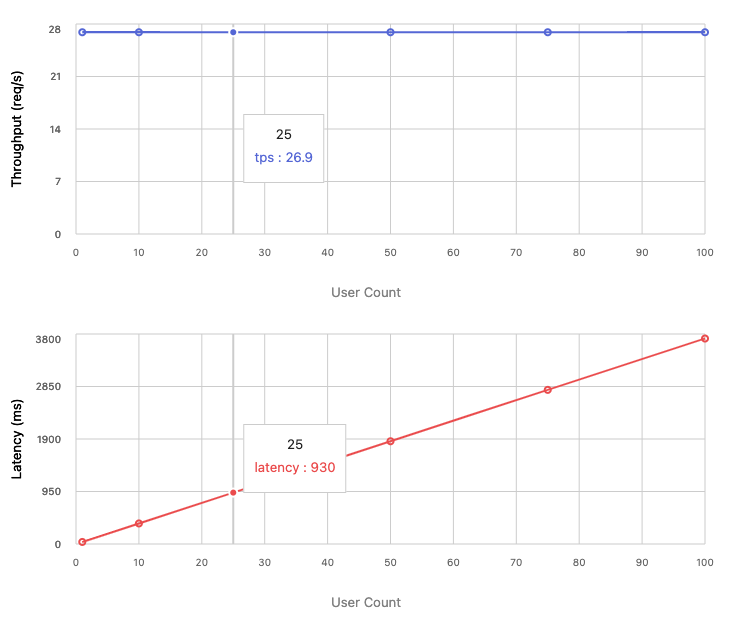

# Performance Analysis

The Performance Analyzer tool is an AI-based tool that generates intelligent estimations of the performance of integration-based services and APIs based on historical data. The Performance Analyzer tool allows developers to obtain forecasts at development time using advanced machine learning techniques and mathematical performance models.

Traditionally, performance analysis includes performance debugging which involves measuring the performance of services by load testing them. The Performance Analyzer allows you to measure performance at the application development stage, significantly reducing the time and cost spent on performance debugging.

A component may have more than one execution path serving requests. The Performance Analyzer tool can analyze all the execution paths and determine the **performance-critical path**: the path that is estimated to take the longest time to process a single request.

## Advantages of using the Performance Analyzer

Making accurate performance estimations before releasing an application you have developed is important due to the following reasons:

- You can identify the performance-critical path of a component at development time. 
- The forecasts you obtain for individual connector actions help identify any bottlenecks in each execution path.
- You can detect any performance anti-patterns and low-quality code in your component implementation that impacts the overall performance. 
- When you create service-level agreements (SLAs) for your application, an accurate performance forecast allows you to provide valuable insights relating to the scalability of the application and the ways to optimize its performance.
- You can avoid missing significant performance characteristics when combining multiple applications, including external applications.
- You can correctly assess the cost and feasibility of running the application in a production environment.
- You can reduce the time and cost spent on debugging performance issues by eliminating or minimizing iterative load testing efforts.

## Use the Performance Analyzer

You can use the Choreo Performance Analyzer on the Web Editor in low-code mode. 

### Analyze the performance-critical path in real-time

To view the real-time analysis of the performance-critical path of your component, follow the steps below:

1. Sign in to the Choreo Console at [https://console.choreo.dev](https://console.choreo.dev). 
2. Navigate to your component and click **Overview** from the left pane. 
3. Click **Edit Code** to access the Web Editor.

#### Overall performance of the performance-critical path

On the low-code editor, you will see a bar with the summarized overall performance estimates for each resource function. By default, this banner displays the forecasted latency and throughput when the indicated user count range executes the performance-critical path. The upper bound of the user count range is set based on the availability of historical data. Since the Performance Analyzer tool derives these metrics in real-time,  any changes to the component will update the metrics in real-time. 

{.cInlineImage-threeQuarter}

By default, the Performance Analyzer tool does not highlight the performance-critical path in the low-code diagram. Click  **Reveal performance-critical path** on the top banner to highlight it in green in the low-code diagram.

#### Latency estimates for individual API invocations in the performance-critical path

The Performance Analyzer tool displays the estimated latency for each API invocation in the performance-critical path as a banner next to the API invocation in the low-code diagram, as shown below. The Performance Analyzer tool derives these estimates based on the user count range that is indicated on the low-code editor, as a bar with the summarized overall performance estimates for each resource function.

{.cInlineImage-threeQuarter}

### Analyze the performance of all execution paths

By default, the Performance Analyzer tool does not highlight the performance-critical path in the low-code diagram. Click **Reveal performance-critical path** on the top banner to highlight it in green. A pane opens on the right of the Web Editor. You can perform an in-depth performance analysis of the component in this pane. 

{.cInlineImage-full}

#### Execution paths

You can view all execution paths in the component in a tabular format listed on top of the **Performance Forecast** pane. The table shows the entries in descending order based on the time it takes to process a single request in each path.

{.cInlineImage-half}

The Performance Analyzer tool identifies the execution paths using the service invocations performed by each of them. If an execution path does not include any service invocation, then the latency of that path is assumed to be negligible.

You can select any execution path from the table. When you select an execution path, the Performance Analyzer tool will highlight the execution path on the low-code diagram. The estimated overall performance values displayed on the top banner will change based on the execution path selected.

#### Performance forecast graphs

The performance forecast graphs: the latency graph and the throughput graph for the selected path of execution are below the **Execution Paths** table in the **Performance Forecast** pane. These performance forecast graphs forecast how the latency and throughput may vary based on the number of users simultaneously accessing the component.

{.cInlineImage-half}

By analyzing these graphs carefully, you can gain a fair understanding of how well your component will scale with the increasing load.

## Assumptions

The Performance Analyzer generates forecasts based on the following assumptions:

- For service-based applications, the overhead of non-I/O operations (CPU-bound operations) is negligible compared to API calls to connectors. 
- The service under evaluation is deployed with sufficient resources and therefore is not a bottleneck.
- Sufficient historical data is available for each service operation or API for the AI models to derive an accurate estimation.
