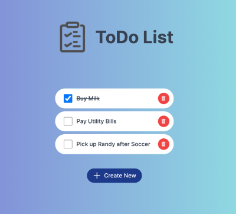

# Deploy your First Static Web Application

Choreo is an internal developer platform as a service that takes care of the complexities of building platforms, allowing application developers to focus on innovation and implementation. Choreo streamlines the entire process of building, deploying, monitoring, and managing your cloud-native applications.

In this quick start guide, you will explore how easy it is to deploy a web application using Choreo. Here, you will use a simple web application designed to add tasks to a to-do list. 

This guide walks you through the following steps:

  - Create a project.
  - Create a Web Application component and connect it to the GitHub repository that includes the web application implementation.
  - Build the web application.
  - Deploy the web application and access it.

## Prerequisites

Before you try out this guide, complete the following:

1. Fork the [choreo-sample-todo-list-app
 repository](https://github.com/wso2/choreo-sample-todo-list-app), which contains the sample for this guide.
2. If you are signing in to the Choreo Console for the first time, create an organization as follows:

    1. Go to [https://console.choreo.dev/](https://console.choreo.dev/), and sign in using your Google, GitHub, or Microsoft account.
    2. Enter a unique organization name. For example, `Stark Industries`.
    3. Read and accept the privacy policy and terms of use.
    4. Click **Create**.

    This creates the organization and opens the organization home page.

## Create a project

Follow the steps given below to create a multi-repository project:

!!! info
     A multi repository project allows you to maintain multiple repositories and assign one to each component or module within your project.

1. Go to [https://console.choreo.dev/](https://console.choreo.dev/) and sign in. This opens the organization home page.
2. On the organization home page, click **+ Create Project**.
3. Enter a unique name and description for the project. You can enter the name and description given below:

    | **Field**       | **Value**               |
    |-----------------|-------------------------|
    | **Name**        | `Sample project`        |
    | **Description** | `My sample mmulti-repo project` |

4. Select **Multi Repository**.
5. Click **Create**.This creates the project and opens the project home page.

## Create a Web Application component

Follow the steps given below to create a Web Application component:

1. On the project home page, click **+ Create** if you already have one or more components in your project. Otherwise, proceed to the next step.
2. Click the **Web Application** card. This opens the **Create a Web Application** pane.
3. Specify a name and description for the component.
4. If you have not already connected your GitHub repository to Choreo, click **Authorize with GitHub**, enter your GitHub credentials, and select the repository you created by forking [https://github.com/wso2/choreo-samples](https://github.com/wso2/choreo-samples) to install the [Choreo GitHub App](https://github.com/marketplace/choreo-apps). 

    !!! info
         The **Choreo GitHub App** requires the following permissions:
         
        - Read and write access to code and pull requests.
        - Read access to issues and metadata.
             
        You can [revoke access](https://docs.github.com/en/authentication/keeping-your-account-and-data-secure/reviewing-your-authorized-integrations#reviewing-your-authorized-github-apps) if you do not want Choreo to have access to your GitHub account. However, write access is only used to send pull requests to a user repository. Choreo will not directly push any changes to a repository.

5. Enter the following information:

    | **Field**                    | **Description**             |
    |------------------------------|-----------------------------|
    | **GitHub Account**           | Your account                |
    | **GitHub Repository**        | choreo-sample-todo-list-app |
    | **Branch**                   | **`main`**                  |

6. Select **NodeJS** as the **Buildpack**
7. Enter the following information:
   
    | **Field**                    | **Description**             |
    |------------------------------|-----------------------------|
    | **NodeJS Project Directory** | /                           |
    | **Language Version**         | npm run build               |
    | **Port**                     | 8080                        |

8. Click **Create**. Choreo initializes the component with the sample implementation and opens the **Overview** page of the component.

Now let's build and deploy the web application.

## Build your web application

To build the web application, follow the steps given below:

1. In the left navigation menu, click **Build**.
2. In the **Builds** pane, click **Build**. This opens the **Commits** pane, where you can see all the commits related to the component.
3. Select the latest commit and click **Build**. This triggers the build process and displays the progress in the **Build Logs** pane.

    !!! info
         The build process can take a while to complete. When the build process is complete, the build will be listed in the **Builds** pane along with its status. 

   Here, you will see the build status as **Success**.

## Deploy and access your web application

1. In the left navigation menu, click **Deploy**.
2. In the **Set Up** card, click **Configure and Deploy**. This opens the **Configure & Deploy** pane, where you can add a file mount if necessary. In this guide you will not add a file mount.
3. Click **Deploy**. The deployment to the Development environment may take a few minutes to complete. On successful deployment, you will see the **Deployment Status** as **Active** in the **Development** card. 
4. To verify that you have successfully hosted the web application, click the **Web App URL** on the **Development** card. This takes you to the web application.

    

     You can try creating one or more new tasks by specifying an appropriate task ID and task label.     
   
