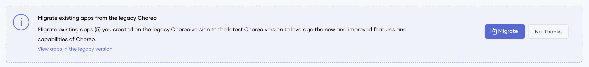
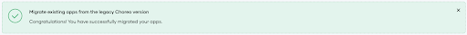
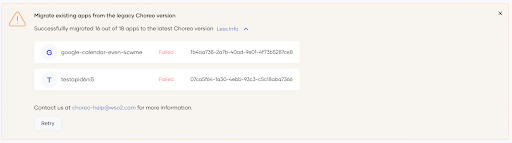
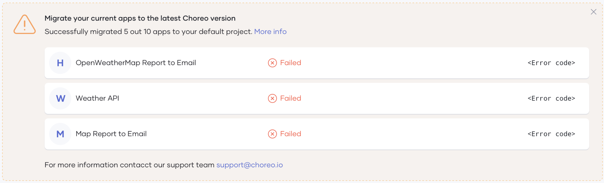
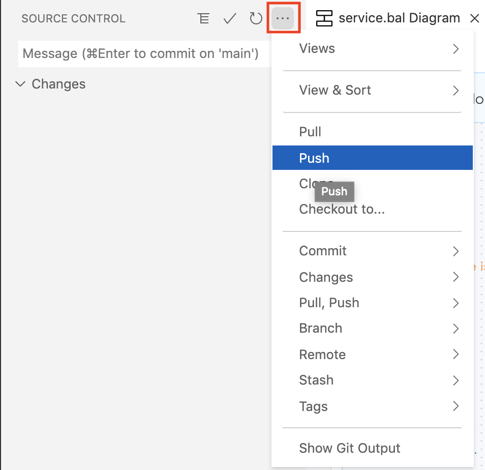

# Migrate Applications to the Latest Version

The previous version of Choreo allowed you to create APIs, services, and integrations. The current version introduces the concept of creating Choreo projects with components.

This section explains how to migrate the APIs, services, and integrations you created in the previous version as components to the current version.

!!! attention
    You need to complete the migration **before the 1st of February 2022**.

!!! note
    You can only migrate APIs, services, and integrations created before 2022.

!!! info

    If you want to continue using the **previous version**, you can access it **until the 1st of February 2022** via the following URLs:

    - **Choreo Console**: [https://console.deprecated.choreo.dev/](https://console.deprecated.choreo.dev/)
    - **Dev Portal**: [https://devportal.deprecated.choreo.dev/](https://devportal.deprecated.choreo.dev/)
    
    The **API access** and **API token management** remains **unchanged**.
    
    To access the APIs, services and integrations you added in the previous version, you can use the same endpoints as before.

To migrate your APIs, services, and integrations from the previous version to the current version, follow the steps below:

## Step 1: Migrate your applications

!!! note
    In this section, **applications** refer to APIs, services, and integrations in the previous version of Choreo.

To migrate your applications:

1. Access Choreo via console.choreo.dev. Enter your current credentials to sign in.
   
     You will see the following displayed on the Home page.
     {.cInlineImage-full}

2. Click **Migrate**. You can continue your work in the Choreo Console while the migration process runs in the background.

3. Once the migration process starts, the following message is displayed.

     {.cInlineImage-full}

4. Once you complete the migration process successfully,  you will see the following message:

     {.cInlineImage-full}

    !!! attention
        **To list the components soon after you complete the migrations process,** follow the steps below:
     
         1. **Refresh** the page.
         2.  On the Home page, select the **`DefaultProject-{ORGANIZATION_NAME}`** project.

5. If the migration fails or results in being partially completed, the following messages are displayed.

    {.cInlineImage-full}

    {.cInlineImage-full}

    -  If either of these messages appears, you can click **Retry** to re-run the migration process again.

    !!! fail
         If you continuously experience migration failures, contact choreo-help@wso2.com.

Once you successfully migrate your applications, on the new Choreo version, you will see them as components. You can then deploy these components.

## Step 2: Deploy the migrated components

Choreo adds the migrated components to a project named `DefaultProject-{ORGANIZATION_NAME}` in the current Choreo version. They are **NOT** deployed.

You can deploy them after editing and testing them in the VS Code Editor as follows:

1. Access the current Choreo version via [https://console.preview.choreo.dev/](https://console.preview.choreo.dev/).

2. In the Home page, select the **`DefaultProject-{ORGANIZATION_NAME}`** project.

3. Click the **Components** icon in the left navigator to open the Components page. The page displays the APIs, services, and integrations (applications) that you migrated from the previous version. Choreo displays these as a list of components.

4. Click on a component. It opens on a separate page.

5. Click **Edit with VS Code Online** to open the component configuration in the VS Code Editor.

6. If there are syntax errors in the code, fix them.

    !!! help
        If you require our assistance to carry out this step, contact us via choreo-help@wso2.com.

7. Once you correct all the errors in the code, commit the component configuration as follows:

    1. To check whether the code is compiling, open the terminal in the VS Code Editor, and issue the following command:

        `bal build`
 
    2. If the build is successful, click the **Run** icon to run the component.

    3. To commit the changes, click **Sync with Choreo Upstream** (at the bottom of the page), and then click **Sync my changes with Choreo**.

    4. In the left panel, enter a commit message (e.g., `Implement REST API`) and click on the tick.

        {.cInlineImage-small}

    5. Select **Yes** in the message that appears to stage the changes.

8. To push the changes to the GitHub repository, click on the GitHub action menu (marked in the image below) and click **Push**.

       {.cInlineImage-small}

       Once you successfully push the changes to the GitHub repository, the VS Code Editor indicates the successful status by displaying the text **In sync with Choreo upstream** for the `service.bal` file.

 9. To deploy the component, go back to the Choreo Console and click on the **Deploy** icon. Then in the **Deploy** tab, click **Deploy**.

 10. To test the component, click on the **Test** icon. Try out the component using one of the methods provided in that view.

 11. If the tests are successful, click the **Deploy** icon again, and click **Promote** under **Production** to promote the component to production. The deployed components will appear as APIs in the developer portal.

    !!! info
        The above step is only applicable if the migrated component was an API or a service. For integrations, you can click the **Deploy** icon again and then click **Run Once**.

 9. Inform your customers of the migration and request them to subscribe again to the new API (the migrated component) via the Developer Portal.

    !!! info
         Once all the consumers have switched to the new API, the Choreo team will restrict access to the previous Choreo version.

    !!! attention
        You need to complete the migration **before the 1st of February 2022**.