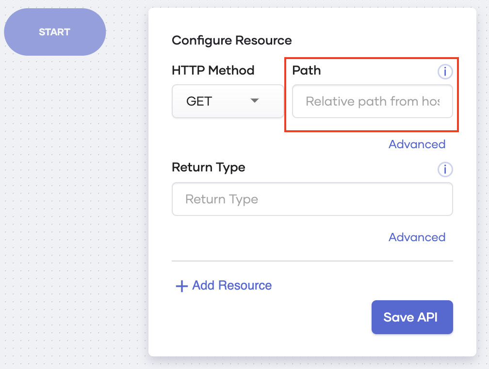

# API Path

When you create a service, you need to configure an API to invoke it. This configuration includes the **Path** field where you enter the path to be used by the API to trigger the service as well as to pass path parameters to it.

{.cInlineImage-half}

e.g., Create a service named `myservice` with an API trigger.

Once you deploy the service, you receive a hostname as follows.

```
https://myservice-<USERNAME>.choreoapps.dev
```

The URL that you need to invoke to trigger the service changes based on the relative path from the host that you specify in the **Path** field of the API configuration.

The relative path can be as follows:

## Empty path

If you do not specify a relative path from the host, invoking the hostname invokes the service.

e.g.,

| **Path**      | **URL to invoke the service**            |
|---------------|------------------------------------------|
| Not specified | `https://myservice-username.choreoapps.dev` |

## Single path

If you provide a single path in this field, you need to append it to the hostname to invoke your service.

e.g.,

| **Path**  | **URL to invoke the service**                  |
|-----------|------------------------------------------------|
| `/path1`  | `https://myservice-username.choreoapps.dev/path1` |

## Multiple path strings

You could also provide multiple paths for this field. If you do so, you need to append them to the hostname to invoke your service.

e.g.,

| **Path**             | **URL to invoke the service**                              |
|----------------------|------------------------------------------------------------|
| `/path1/path2/path3` | `https://myservice-username.choreoapps.dev/path1/path2/path3` |

## Path parameters

If you specify a path parameter, it could be read from within your service. This allows you to read values provided within the path. The format to specify path parameters is `[]`.

e.g.,

| **Path**                    | **URL to invoke the service**                       |
|-----------------------------|-----------------------------------------------------|
| `/[int id]/[string branch]` | `https://myservice-username.choreoapps.dev/01/Chicago` |

In this example, the path allows you to read the ID (in this example,`01`) and the branch (in this example, `Chicago`) from within your service.
