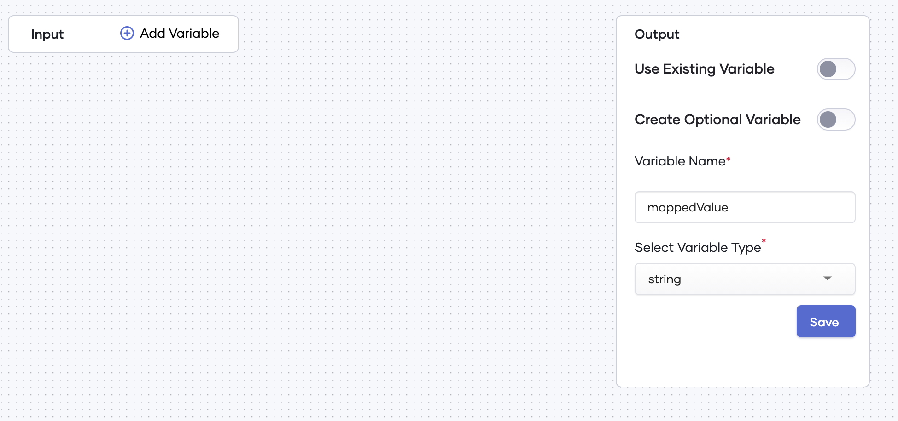
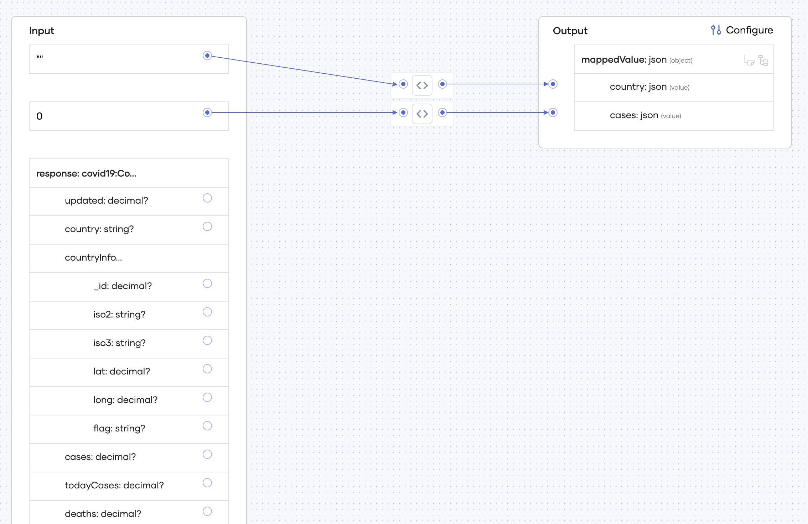
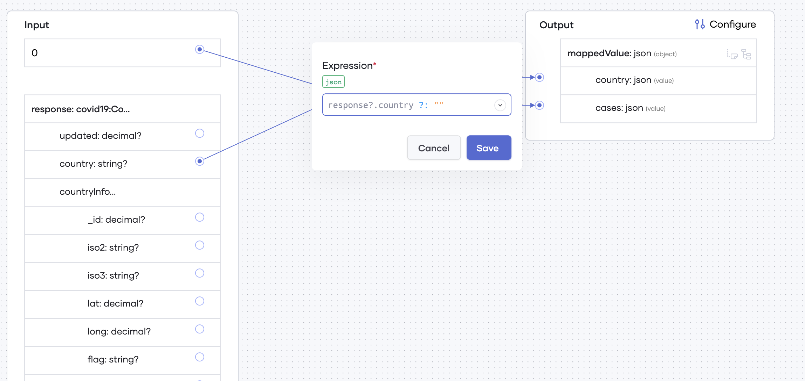

# Data Mapping

You can use a data mapping statement in Choreo to create variables by visually mapping one or more variables.  The most common use of data mapping in Choreo is to map data from an API call response to JSON format. 

Follow this procedure if you want to add a data mapping statement to your integration or service:

1. Go to the **Statements** tab and select **Data Mapping**. You can see the **Input** and **Output** panes.

     {.cInlineImage-full}
   
2. To add an input variable, follow this procedure:

    1. In the **Input** pane, click **Add Variable**.
    2. Select a required input type from the **Select Input Type** drop-down list.
    3. Click **Add**.

3. To add an output variable, you can either select an existing variable or create a new variable via the **Output** pane. 

    - To create a new variable, follow this procedure in the **Output** pane: 

        !!! tip
            If you want to create a new output variable that is optional, click the **Create Optional Variable** toggle to enable it.
            
         1. Enter a value as the **Variable Name**.
         2. Select a variable type from the **Select Variable Type** drop-down list.
         3. Click **Save**.

    - To use an existing variable, follow this procedure in the **Output** pane:         
         1. Click the **Use Existing Variable** toggle to enable it.
         2. Select a variable from the **Select Output Variable** drop-down list.
         3. Click **Save**.
  

   Once you add the input and output variables, the connectors in the middle are displayed.

   {.cInlineImage-full}
   
   The **Input** pane displays constant values (e.g. `0`) and the input variables.
 
Now you can do the following depending on your requirement:

- Add new fields to outputs of type `JSON` by selecting **Add value field** or **Add complex field** icons next to the variable name.

- Map data by connecting the terminals from the **Input** pane to the terminals in the middle connectors. 

- Click the **<>** icon of the connectors in the middle and edit expressions.

     {.cInlineImage-full}
 
