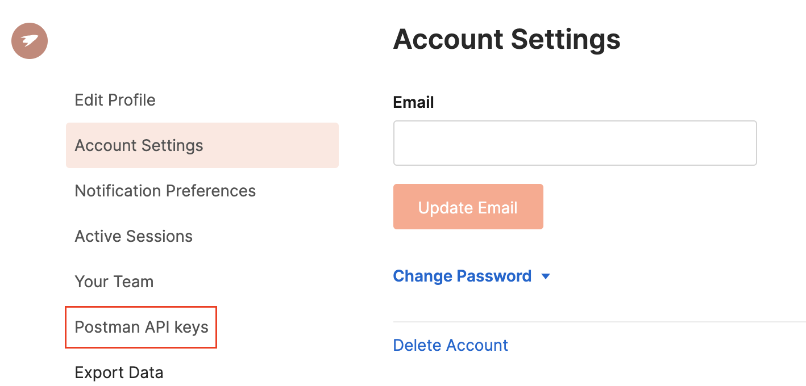

# Postman Integration

The Postman Editor allows you to integrate with your Postman account to easily test your services.

## Prerequisites

In order to use the Postman Editor:

- Make sure you have logged into the Choreo console and created a service. For instructions to create a service, see [Create Your First Service](../services/create-your-first-service.md).

    !!! tip
        This guide uses the service created in [Create Your First Service](../services/create-your-first-service.md) as an example.
        
- Have an active Postman account.

## Step 1: Generate Postman API key

To generate the Postman API key so that you can connect your Postman account to Choreo, follow this procedure:

1. Sign in to your Postman account.

2. Go to your profile, and click **Account Settings**. Then click **Postman API Keys**

    {.cInlineImage-full}

3. Click **Generate API Key**.

4. In the **Generate an API key** dialog box, enter `choreo` as the key name. Then click **Generate API Key**.

5. Copy the key that is generated and save it in a safe location.

## Step 2: Add Postman API key to your service

In this step, you will be connecting your service to your Postman account by adding the Postman API key that you generated to your service.

1. Sign in to the Choreo Console at [https://console.choreo.dev/](https://console.choreo.dev/).

2. Go to the **Services** card and click **Explore**. Then click on the service you want to test.

3. Once the service opens, click on the **Test** icon in the left pane. Then click on the **Postman** icon.

    {.cInlineImage-full}
    
    As shown in the image above, the **Postman** panel opens to the right of the low-code diagram with instructions to integrate Postman. You have already completed the first two steps given there.

4. Click on the link provided in Step 3 in the **Postman** panel.

5. In the **API Key** field, enter the API key that you generated in the Postman application.

    Once you enter it, the following message appears below the field.
    
    ```text
    Your API key was validated by Choreo
    ```
   
6. Click **Save**. 

Now you can proceed to create a new workspace to link to your service or select an existing workspace in your Postman account.

## Step 3: Link a workspace to your service

In this step, let's connect a workspace to your service by following this procedure:

1. In the **Postman** right panel that you opened, expand the **Select or create a workspace** field.

    {.cInlineImage-full}
    
    As shown above, the drop-down list displays the existing workspaces in your Postman account. You can link your service to an existing workspace or create a new one. In this example, let's create a new workspace.
    
2. Click **+ Create New**.

3. Enter a name and a description for the new workspace. For this example, let's enter them as follows:

    | **Field**       | **Value**                       |
    |-----------------|---------------------------------|
    | **Name**        | `covid-Status`                  |
    | **Description** | `Test the covid-Status service` |
    
4. Click **Create & Link**.

Now you have linked your service to the new workspace named `covid-Status`.

## Step 4: Create a collection

!!! tip
    If you linked an existing workspace to the service and that workspace has collections that are already created in it, you can skip this step.
    
To create a collection, follow this procedure:

1. Under **Collections** in the **Postman** right panel, click **+ Add**.

2. Enter a name and a description. For this example, let's enter them as follows:

    | **Field**       | **Value**                             |
    |-----------------|---------------------------------------|
    | **Name**        | `collection1`                         |
    | **Description** | `Collection for covid-status service` |
    
3. Click **Create**.

As a result, the collection is created and displayed under **Collections** in the **Postman** right panel.

## Step 5: Create a request

To create a request, follow this procedure:

1. In the **Postman** right panel, click on the collection that you created. This opens the **Requests** section.

2. Click **+ Add**.

3. Enter a request name (e.g., `test1`)

4. Select the required HTTP method. You can also add the query parameters, the header, and the request body as required.

    In this example, you can select **GET** as the HTTP method and add `country` as a query parameter.
    
    {.cInlineImage-full}
    
5. Click **Save**.

## Step 6: Check your Postman account

Sign in to your Postman account and check your workspaces. The workspace you created via Choreo will be available as shown below.

{.cInlineImage-full}

Click on the workspace. You can view the collection and the request as follows.

{.cInlineImage-full}