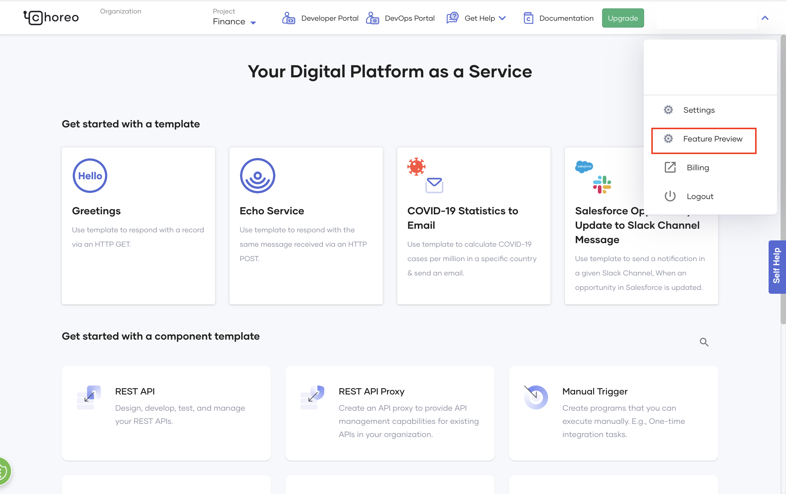
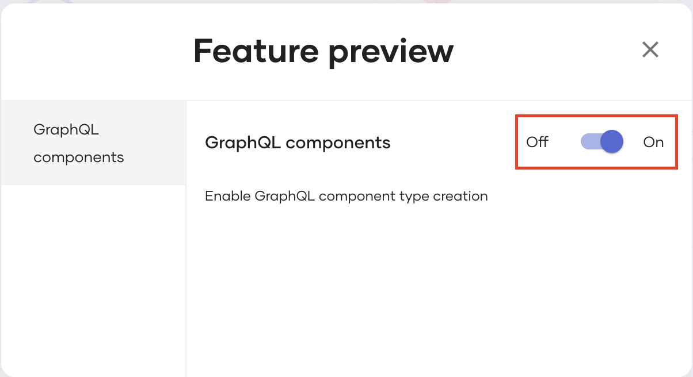

# Preview Features

Preview features offer early access to functionality that is not finalized by the Choreo team. You can enable if you would like to try them out during the early stages of their development.

!!! info
    You cannot enable preview features when you try Choreo anonymously.   

To enable Choreo features that are released as preview features, follow these steps:

1. Expand the profile menu and click **Feature Preview**.

   {.cInlineImage-full}

2. In the **Feature Preview** dialog, enable the required features.

    {.cInlineImage-full}
