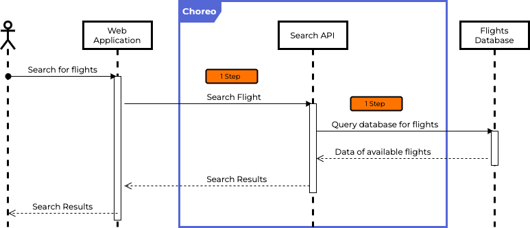
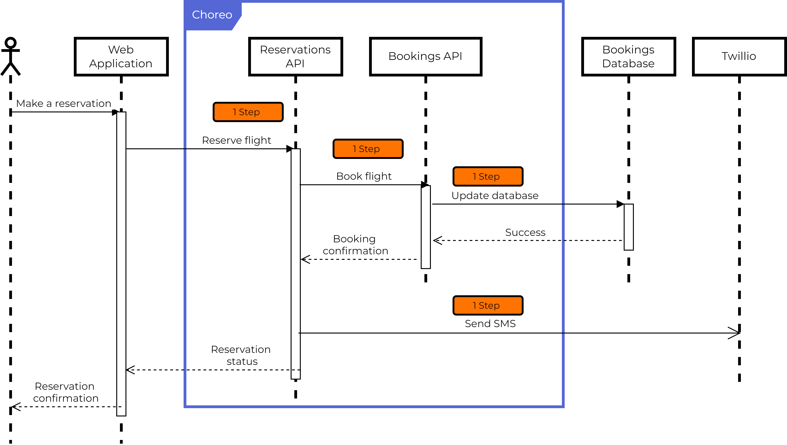
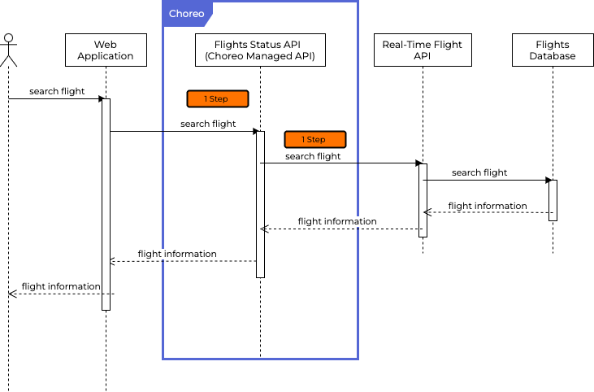
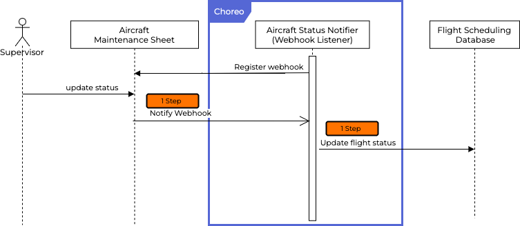
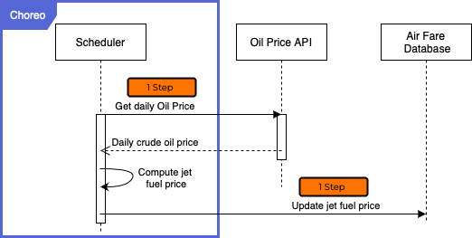

# Pricing

## Introduction

Choreo is a Digital Platform as a Service that helps you develop integration solutions faster by reducing the coding effort with a low-code development platform. You can use Choreo by paying only for your usage: nothing more, nothing less. Choreo has payment plans for all types of users. You can enjoy the free tier with limitations and then move on to the Pay-As-You-Go model if you use more than 5,000 [steps](#what-is-a-step) per month. If you plan to use Choreo significantly, you can also opt for an Enterprise plan and enjoy special discount rates.

## Plans

|               | Free                   |  Pay As You Go    | Enterprise     |
|---------------|------------------------|-------------------|----------------|
| Cost Per Step | 5,000 steps per month *|$5 per 1,000 steps   <ul><li>First 5,000 steps per month are free</li></ul>| Contact Us For Discounted Pricing  <ul><li> Volume Discounts</li><li> Committed-use Discounts</li><li> Support Channels and Support SLA</li></ul>|

 \* Limited to a maximum of 3 components

## Choreo pricing FAQ

### How does Choreo pricing work?

Choreo pricing is based on the number of [steps](#what-is-a-step) in your integration solution. Choreo offers three payment plans: Free, Pay As You Go, and Enterprise.

#### Free 
The Choreo free tier allows you to execute 5,000 [steps](#what-is-a-step) per month, limited to a maximum of 3 components. If you exceed the free tier, your application cannot make any additional requests to Choreo. 

#### Pay As You Go (PAYG) 
Pay As You Go is a flexible usage-based payment plan. While the first 5,000 steps are free per month, Choreo will charge you $0.005 for each additional step, for example, $5 for 1,000 steps based on your usage per month. 

Let’s say you have used a total of 12,500 [steps](#what-is-a-step) for a particular month, your monthly usage for that month under the PAYG plan will be:

    Chargeable steps usage: 12,500 - 5,000 = 7,500
    The total charge for the usage: 7,500 * $0.005 ($5 for every 1,000 steps) = $37.50

#### Enterprise 
The Enterprise plan is suitable for large-scale usage of Choreo. You can access volume discounts and committed-use discounts with this plan. [Contact sales](https://wso2.com/contact/?ref=choreo) to get a discounted rate.

### What is a step?
A step (1 step) is a maximum of 500ms compute time on a container having 350MB of memory and 0.5 vCPU. Any additional compute time is counted as an additional step.  
An incoming event or message to Choreo or an outgoing API call from Choreo is a minimum of 1 step.

## Pricing examples

### Example 1: REST API 

An organization has a flight booking system on Choreo. This system involves several APIs and databases. The scenario and the APIs being used in the system are described below.

#### Scenario

To make a booking through the web application, a client will first search for available flights and then proceed to make the booking. The client application (web application) upon receiving the request will make a call to the [Search API](#searchAPI) to search for available flights. When the client receives the search results the client will proceed to make a reservation using the [Reservations API](#reservationsAPI).

The following two diagrams illustrate the interactions in the system while searching and reserving a flight.
 

#### Glossary
- <a class="pricing" id="searchAPI"> Search API</a>: An external-facing API in Choreo that searches for the availability of flights and seats given the destinations.
- <a class="pricing" id="bookingsAPI">Bookings API</a>: An internal API in Choreo that updates the Bookings database when a booking for a certain flight is made.
- <a class="pricing" id="reservationsAPI">Reservations API</a>: An external-facing API in Choreo that is used by client applications (web apps, mobile apps) to make flight bookings.
- <a class="pricing" id="twillioAPI">Twilio API</a>: A third-party API that is used by the Reservations API in Choreo to send SMS notifications to customers when a booking has been made, canceled, or updated.
- <a class="pricing" id="executionTime">Execution time</a>: The execution time taken for a process is the time taken between a request sent to response received.
 
 

#### Searching for a flight

Let’s see how steps are calculated for the search process: 

- As illustrated above, the client initiates a search for available flights through the web application. 
- The web application then makes **1 API call to the [Search API](#searchAPI)** in Choreo. This is counted as **1 step**.
- The search API in Choreo then makes **1 call to the Flights Database** to retrieve the information according to the search criteria entered by the client. This is counted as **1 step**. 

- **Assuming the entire [execution time](#executionTime) for the search process takes less than 500ms** (starting from making a call to Choreo, and Choreo making a call to the database), the search process thereby results in a **total of 2 steps**.

 
#### Reserving a flight

Let’s see how steps are calculated for the reservation process:

- As illustrated above, the client initiates the reservation process through the Web Application.
- The Web Application proceeds to make **1 API call to the [Reservations API](#reservationsAPI)**. This is counted as 1 step.
- The Reservation API then makes **1 API call to the [Bookings API](#bookingsAPI)**. This is counted as **1 step**. 
- The bookings API makes **1 API call to the Booking Database** to update it with the booking details. This is counted as **1 step**.
- Upon receiving the booking confirmation, the Reservation API makes **1 call to the [Twilio API](#twillioAPI)** to send an SMS confirmation to the customer. This is counted as **1 step**.

- **Assuming the entire execution time for the reservation process takes 1200ms (1.2s)** , in addition to the above steps,  the total number of extra computation units consumed can be calculated as follows using ***floor((t)/500)) where t is the execution time***: 

          floor(1200/500) = 2 units = 2 steps

Therefore the total number of steps for the reservation process is: 

           4 steps + 2 steps = 6 steps

We can calculate the **total number of steps for searching and reserving a flight** as follows:

- **Search process**: Single execution of a search would cost a total of **2 steps**. 
- **Reservation process**: Single execution of reservation process would cost a total of **6 steps**. 
- **Total**: A single execution of the search and reservation process of a flight would cost an organization a total of **8 steps in total**.

!!! note
    The above cost calculation is dependent on the above architecture and design of the APIs.
 

### Example 2: REST API Proxy
An organization exposes a flight tracking API as a managed API on Choreo. This system involves several APIs and databases. The scenario and the APIs in the system are described below:

#### Scenario

To search for real-time flight data, a client will enter search criteria, and search through the web application. Upon receiving the request, the client application (web application) will make a call to the [Flights Status API](#flightStatusAPI), a managed API on Choreo, to search for flight data. Choreo will then invoke the backend API, the [Real-Time Flight API](#realtimeFlightAPI). The backend API will invoke a database to get the information and pass it to the client.

#### Glossary

- <a class="pricing" id="flighStatusAPI">Flight Status API</a>: An external-facing, managed API on Choreo. This API exposes the Real-Time Flight API on Choreo as a managed API.

- <a class="pricing" id="realtimeFlightAPI">Real-TIme Flight API</a>: An unmanaged, external-facing API hosted outside of Choreo.

- <a class="pricing" id="flightsDatabase">Flights Database</a>: A database that stores flight information.

Get flight status

Let’s see how the steps are calculated for the get flight status process:

- As illustrated above, the client initiates a search request for flight data through the web application. 
- The web application then makes **1 API call to the [Flight Status API](#flightStatusAPI)** in Choreo. This is counted as **1 step**.
- The Flight Status API in Choreo then makes **1 call to the [Real-Time Flight API](#realtimeFlightAPI)** with the search criteria entered by the client. This is counted as **1 step**. 
- The Real-Time Flight API then invokes the database to retrieve the information.

- **Assuming the entire execution time for the get flight status process takes less than 500ms** (starting from making a call to Choreo, and Choreo making a call to the backend API),the get flight status process thereby results in a **total of 2 steps**.

 
### Example 3: Webhook
An airport has its flight information display system (FIDS) in Choreo.  This system involves APIs and webhooks.

#### Scenario
This scenario describes a hypothetical maintenance process carried out by airline maintenance. The airline uses Choreo to generate alerts by using Webhooks when the aircraft maintenance status is updated. 
The Aircraft Maintenance team carries out maintenance for each flight before take-off. A supervisor updates the maintenance status of the aircraft on a [Aircraft Maintenance Sheet](#AircraftMaintenanceSheet), which is a Google sheet. Upon updating the sheet, the [Aircraft Status Notifier](#aircraftNotifWebhook) webhook on Choreo gets triggered and updates the [Flight Scheduling Database](#flightSchedulingDatabase) that confirms if the aircraft is ready for take off,  if it will be delayed due to maintenance, or if it is not suitable for take off.

#### Glossary

- <a class="pricing" id="aircraftNotifWebhook">Aircraft Status Notifier</a>:A webhook in Choreo that listens to any events that trigger when the Aircraft maintenance sheet is updated.
- <a class="pricing" id="AircraftMaintenanceSheet">Aircraft Maintenance Sheet</a>: A Google sheet that maintains the list of aircraft, their information,  the maintenance schedule, and the maintenance status.
- <a class="pricing" id="flightSchedulingDatabase">Flight Scheduling Database</a>:The database that includes details about  flights, the aircraft assigned to the flight route, and their maintenance state.

 
#### Update maintenance status 

Let’s see how the steps are calculated for the update maintenance process:

- As illustrated above, the webhook registers with the Google sheet at the time the Webhook component is created on Choreo.
- The supervisor initiates the update process by updating or adding the relevant information on the [Aircraft Maintenance Sheet](#AircraftMaintenanceSheet).
- The Google Sheet triggers **1 event to the Webhook Listener,[Aircraft Status Notifier](#aircraftNotifWebhook)** on Choreo. This is counted as **1 step**.
- The Webhook Listener,[Aircraft Status Notifier](#aircraftNotifWebhook) on Choreo then makes **1 database call to the [Flight Scheduling Database](#flightSchedulingDatabase)** to update the flight maintenance status. This is counted as 1 step. 

- **Assuming the entire execution time for the update process takes less than 500ms**, the update process thereby results in a **total of 2 steps**.

!!! note
    The above cost calculation is dependent on the above architecture and design of the Webhooks.
 

### Example 4: Scheduled Job 
An airline will revise its ticket prices based on the price of jet fuel. This typically happens once a day. The airline uses a scheduled task on Choreo to run this job and to update the jet fuel price once a day.

#### Scenario 
 
Airlines compute ticket prices typically once per day. The ticket prices depend on a number of factors. The price of oil is one such major factor that affects the pricing.  

The [scheduler](#scheduler) on Choreo runs once per day and fetches the oil prices for the day from the [Oil Price API](#oilPriceAPI). It then computes the jet fuel price applying the price calculation formula. The scheduler then updates the daily jet fuel price in the [Air Fare Database](#airFareDatabase).

Having the jet fuel price, the scheduler is able to now calculate the airfare for each route. The Scheduler retrieves the airline routes from the [Airline Routes API](#airlineRoutesAPI). Upon receiving the airline routes, it iterates over each route, computes the airfare, and updates the AirFare database.

#### Glossary 

- <a class="pricing" id="scheduler">Scheduler</a>: A scheduled task created on Choreo that runs every day.
- <a class="pricing" id="oilPriceAPI">Oil Price API</a>: An external-facing API that returns the crude oil price for the day.
- <a class="pricing" id="airFareDatabase">Air Fare Database</a>: The database that stores the jet fuel price which is used to compute the airfare for each route.
- <a class="pricing" id="airlineRoutesAPI">Airline Routes API</a>: An external-facing API that  provides details about the airline routes and a list of airline routes.
- <a class="pricing" id="airlineRoutesDatabase">Airline Routes Database</a>: The database that stores the airline routes information.

 

#### Update jet fuel price daily

Let’s see how we can calculate the steps for the update maintenance process:

- The scheduled task ([scheduler](#scheduler)) on Choreo runs once per day.
- The scheduler makes **1 API call to the [Oil Price API](#oilPriceAPI)** to  retrieve the daily oil price.  This is counted as **1 step**. 
- Upon receiving the daily oil price, the Scheduler then applies the formula to calculate the jet fuel price and calculates daily jet fuel price.
- The Scheduler on Choreo then makes **1 database call to the [Air Fare Database](#airFareDatabase)** to update the daily jet fuel price. This is counted as **1 step**. 

- **Assuming the entire execution time for the update process takes 1200 ms**, the total number of steps can be calculated as follows:
  
        Number of API calls/database calls/events = 2 steps
        Number of computation units = round((1200-500)/500) = 2 units = 2 steps
        Total number of steps = 2 steps + 2 steps = 4 steps

 

#### Update airfare daily  

Let’s see how we can calculate the steps for the update process: 

- The scheduled task ([scheduler](#scheduler))on Choreo runs once per day.
- The Scheduler makes **1 API call to the [Airline Routes API](#airlineRoutesAPI)** to  retrieve the airline routes.  This is counted as **1 step**. 
For ease of explanation, let’s *assume the above API call returns 5 airline routes*. 
- Upon receiving the airline routes, the Scheduler then loops through the 5 airline routes and computes the airfare.  
- The Scheduler on Choreo then makes **1 database call to the [Air Fare Database](#airFareDatabase)** to update the airfare for the airline routes. This is counted as **5 steps** as the database call was made for all airline routes received from the above API call.

- **Assuming the entire execution time for the update process takes 750ms**, the total number of steps can be calculated as follows:
  
           Number of API calls/database calls/events = 6 steps
           Number of computation units = round((750-500)/500) = 1 units = 1 step
           Total number of steps = 6 steps + 1 steps = 7 steps    
