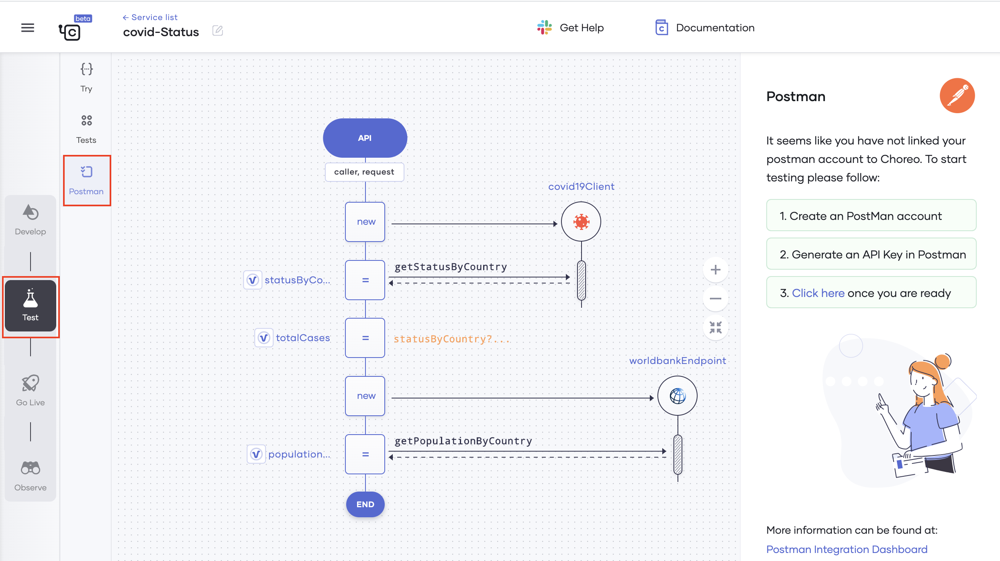
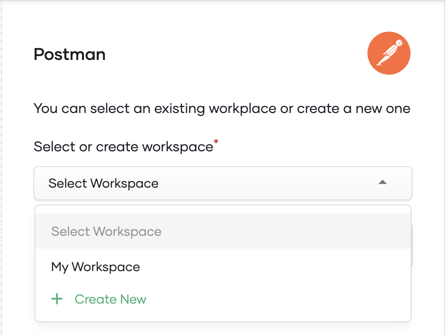
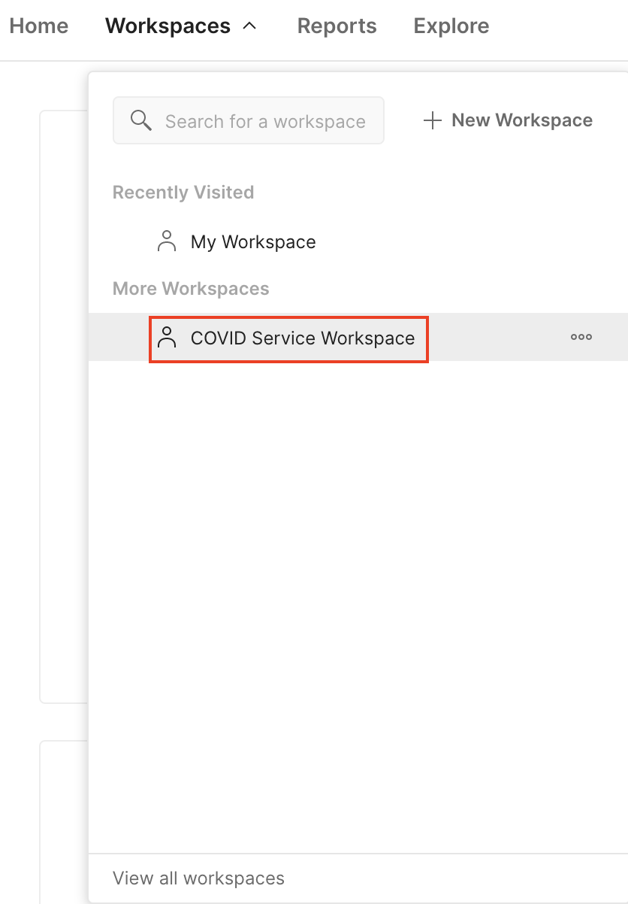
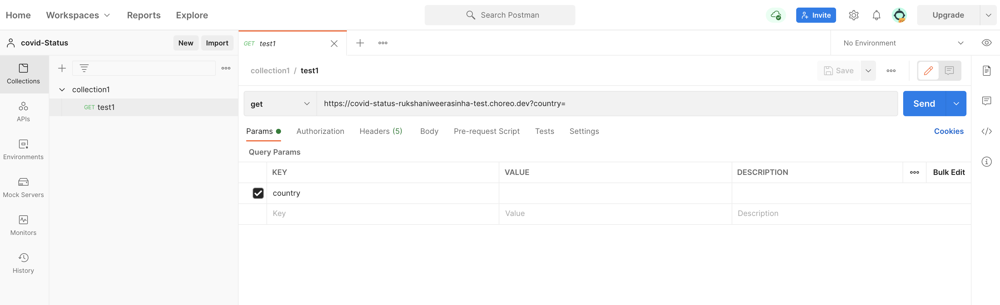
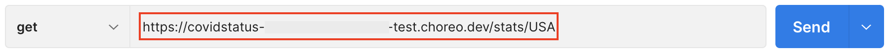
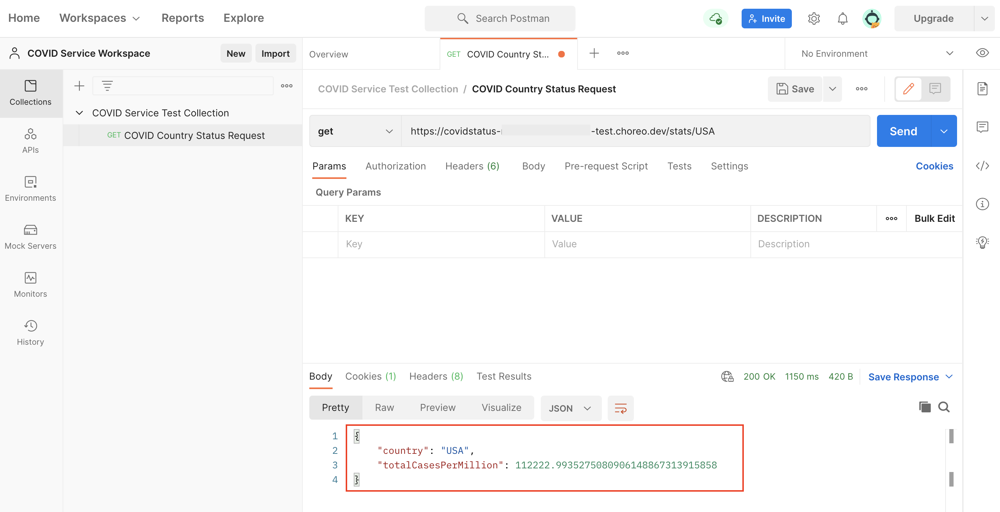

# Test Your Service via Postman

This guide explains how to test your services by connecting them to your Postman account via an API key.

## Prerequisites

To use the Postman Editor:

- Make sure you have logged into the Choreo console and created a service. For instructions to create a service, see [Create Your First Service](../services/create-your-first-service.md).

    !!! tip
        This guide uses the service created in the **World Bank Data to COVID-19 Statistics** sample as an example.
        
- Have an active Postman account.

## Step 1: Generate Postman API key

To generate the Postman API key so that you can connect your Postman account to Choreo, follow this procedure:

1. Sign in to your Postman account.

2. Go to your profile, and click **Account Settings**. Then click **Postman API Keys**.

3. Click **Generate API Key**.

4. In the **Generate an API key** dialog box, enter a key name (e.g., `choreo`). Then click **Generate API Key**.

5. Copy the key that is generated.

## Step 2: Add Postman API key to your service

In this step, you will be connecting your service to your Postman account by adding the Postman API key that you generated to your service.

1. Sign in to the Choreo Console at [https://console.choreo.dev/](https://console.choreo.dev/).

2. Go to the **Services** card and click **Explore**. Then click on the service you want to test (in this example, **World Bank Data to COVID-19 Statistics**).

3. Once the service opens, click on the **Test** icon in the left pane. Then click on the **Postman** icon.

    {.cInlineImage-full}
    
    As shown in the image above, the **Postman** panel opens to the right of the low-code diagram with instructions to integrate Postman. You have already completed the first two steps given there.

4. Click on the link provided in the third step in the **Postman** panel.

5. In the **API Key** field, enter the API key that you generated in the Postman application.

    Once you enter it, the following message appears below the field.
    
    ```text
    Your API key was validated by Choreo
    ```
   
6. Click **Save**. 

You can now create a new workspace to link to your service or select an existing workspace in your Postman account.

## Step 3: Link a workspace to your service

In this step, let's connect a workspace to your service. You can use workspaces in Postman to manage your Postman components for different tasks. In this example, you can create a workspace to have the collections you create for testing the **World Bank Data to COVID-19 Statistics** service. For more information about workspaces, see [Postman Documentation - Using and managing workspaces](https://learning.postman.com/docs/collaborating-in-postman/using-workspaces/managing-workspaces/).

To create a workspace for your service, follow this procedure:

1. In the **Postman** panel that you opened, expand the **Select or create a workspace** field.

    {.cInlineImage-half}
    
    As shown above, the drop-down list displays the existing workspaces in your Postman account. You can link your service to an existing workspace or create a new one. In this example, let's create a new workspace.
    
2. Click **+ Create New**.

3. Enter a name and a description for the new workspace. For this example, let's enter them as follows:

    | **Field**       | **Value**                       |
    |-----------------|---------------------------------|
    | **Name**        | `COVID Service Workspace`       |
    | **Description** | `Test the covid-Status service` |
    
4. Click **Create & Link**.

Now you have linked your service to the new workspace named `COVID Service Workspace`.

## Step 4: Create a collection

In this step, you will be creating a collection. The collection runner in Postman runs multiple requests in a specified sequence and logs the results. Each collection represents one request. For more information about collections, see [Postman Documentation - Collection Runner](https://learning.postman.com/docs/running-collections/intro-to-collection-runs/).

!!! tip
    If you linked an existing workspace to the service and that workspace has existing collections, you can skip this step.
    
To create a collection, follow this procedure:

1. Under **Collections** in the **Postman** panel, click **+ Add**.

2. Enter a name and a description. For this example, let's enter them as follows:

    | **Field**       | **Value**                             |
    |-----------------|---------------------------------------|
    | **Name**        | `COVID Service Test Collection`       |
    | **Description** | `Collection for covid-status service` |
    
3. Click **Create**.

As a result, the collection is created and displayed under **Collections** in the **Postman** panel.

## Step 5: Create a request

In this step, let's create a request that you can send via Postman to invoke your service.

To create a request, follow this procedure:

1. In the **Postman** panel, click on the **>** icon of the collection that you created. This opens the **Requests** section.

2. Click **+ Add**.

3. Enter a request name (e.g., `COVID Country Status Request`).

4. Select the required HTTP method. You can also add the query parameters, headers, and the request body as required.

    In this example, you can select **GET** as the HTTP method, and add `stats/{country}` as the path.
    
    {.cInlineImage-half}
    
5. Click **Save**.

## Step 6: Send a request from your Postman account

To test your service, send a request from your Postman account by following this procedure:

1. Sign in to your Postman account and check your workspaces. The workspace you created via Choreo will be available as shown below.

    {.cInlineImage-half}

2. Click on the workspace. You can view the collection and the request as follows.

    {.cInlineImage-full}
    
3. In the request path displayed, replace `{country}` with `USA` as shown below:

    {.cInlineImage-full}
    
4. Click **Send**.

    The response is logged as shown below.

    {.cInlineImage-full}
    
Now you have successfully tested a service via Postman.
