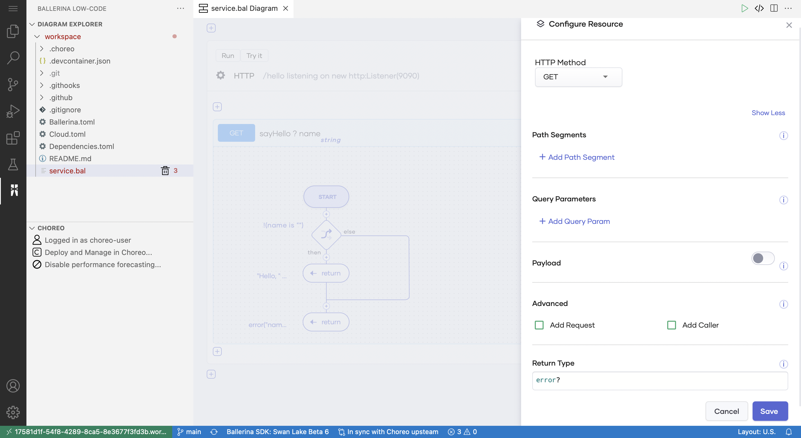
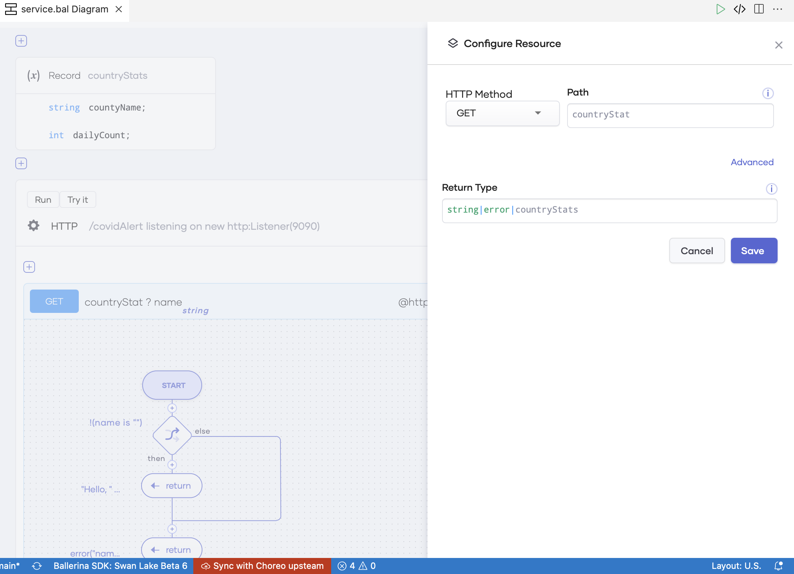
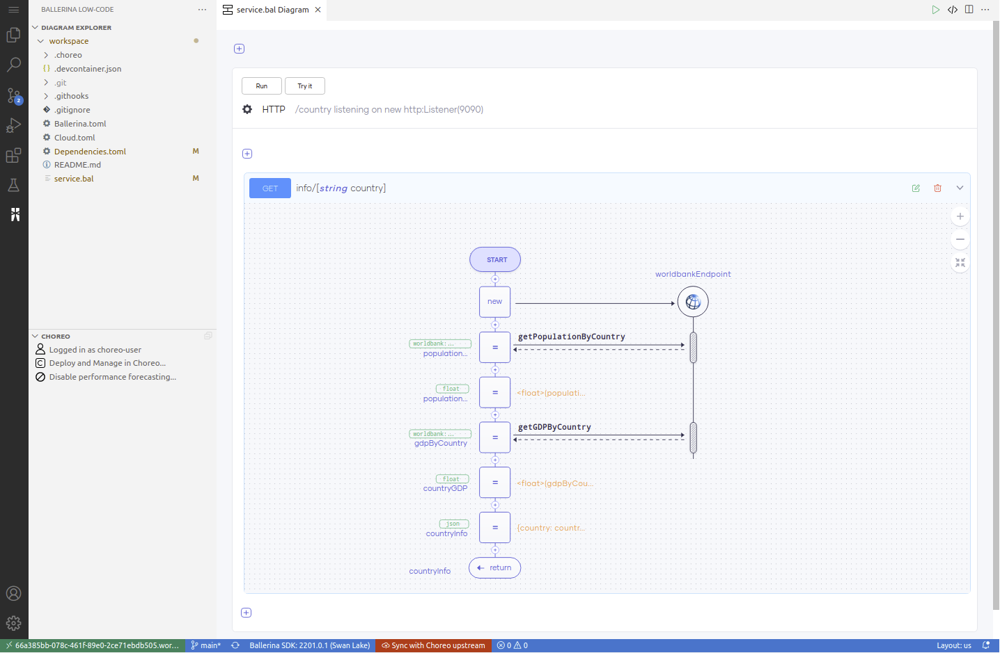
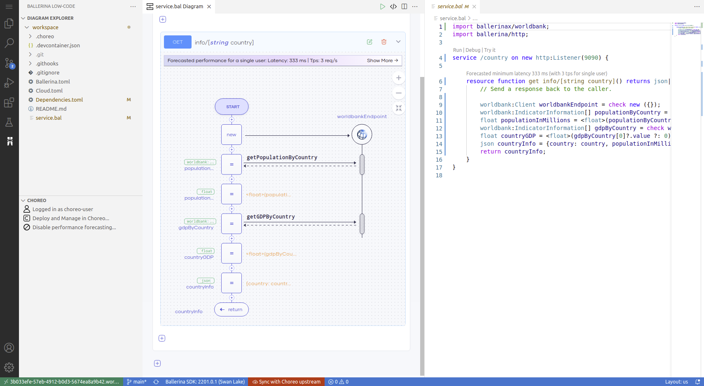
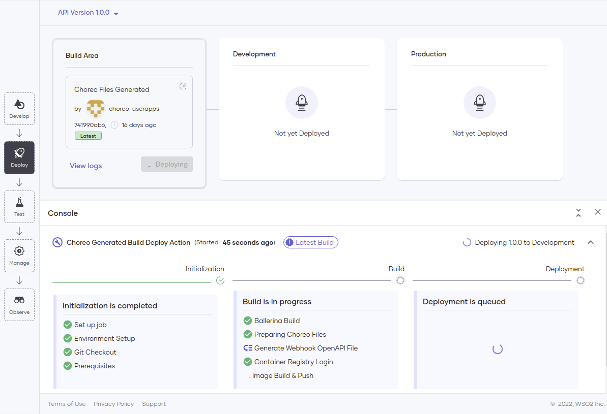
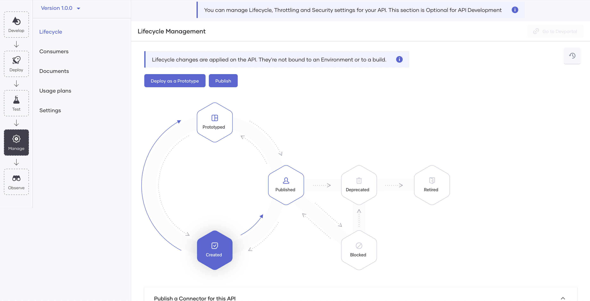

# REST APIs
Explore how you can easily design, develop, and manage REST APIs in Choreo to implement your business API strategy.

## What is a REST API?

A Representational State Transfer(REST) API is an Application Programming Interface(API) that complies with the constraints of REST architectural styles and principles. [REST is an architectural style](https://www.ics.uci.edu/~fielding/pubs/dissertation/rest_arch_style.htm) introduced by Dr. Roy Fielding in his doctoral dissertation in the year 2000. Dr.Roy initially designed it as a guide for the development of modern web architecture. Today, REST is widely adopted to create high-performance, stateless, and reliable APIs that various applications use.

## Designing a REST API

Designing a REST API is the process of declaring the resources, the appropriate HTTP verbs, paths, and input (request) and output (response) data formats to showcase the capabilities of the API. Designing an API based on a standard helps to do the design well and provide a consistent experience to the users of your API. [The Open API Specification](https://github.com/OAI/OpenAPI-Specification) is the most widely used standard for declaring HTTP/REST APIs. The design of an API is a crucial factor that determines the usability and the value of the API. A well-designed API is easily adopted and thereby is profitable. 

Choreo’s low-code editor allows developers to design (and develop) high-quality REST APIs with ease. To start designing a REST API in Choreo, you must create a REST API component. Developers can choose to design the REST API from scratch by manually specifying the resources, the HTTP verbs, paths, and other required elements. The road map of Choreo also includes the capability to design a REST API by importing an OpenAPI document, which will be available soon.

{.cInlineImage-full}

Choreo allows developers to easily specify input and output data formats for each API resource:

{.cInlineImage-full}

{.cInlineImage-full}

## Developing a REST API

Choreo supports spec-driven API development. Once you have carefully designed and defined your API, you can start implementing the functionality of your API. Choreo comes with an online IDE based on Visual Studio Code for developers to implement the API’s functionality. With its support for both low-code and pro-code modes to implement APIs and the flexibility to alternate between the modes during development, Choreo makes API development easy, smooth, and developer-friendly.

### Low-code mode

The following image shows the low-code diagram view in Choreo for a simple API implemented to retrieve information such as population and GDP for a specified country. Here, the [World Bank connector](https://lib.ballerina.io/ballerinax/worldbank/1.2.0) is used to extract the required data, which is then sent as a JSON response.

{.cInlineImage-full}

The low-code programming model allows developers to use common programming constructs such as loops, conditional statements, variable declarations and assignments, logs, data transformations(visual data mapping), and more in a graphical editor. It also allows developers to connect to built-in or custom-developed connectors.

The main advantage of the low-code programming mode is that it can increase developer productivity multiple folds by eliminating the need to write complex code. As developers use constructs on the low-code editor to implement the API, the IDE automatically writes the corresponding [Ballerina](https://ballerina.io/) source code for the API. This speeds up the developer learning process significantly and thereby boosts overall productivity.

### Pro-code mode

The pro-code mode of Choreo allows developers to directly edit code in a manner where the graphical representation in the low-code editor gets updated accordingly. Choreo's online IDE also allows viewing the low-code and pro-code editors side-by-side.

{.cInlineImage-full}

Choreo gives developers the flexibility to use the pro-code mode only or to use it for implementing specific parts of the API while using the low-code mode for the rest, based on their preference. Choreo treats the source code (generated and handwritten) of the API as the single source of truth and has no limitations or restrictions on the mode developers can choose to implement their API's functionality.

## Lifecycle of a REST API

Once you implement a REST API, it needs to be built, tested, and eventually put into production. Choreo executes a CI/CD pipeline to manage the API lifecycle. Choreo stores the source code of APIs in a private GitHub repository for the user account. It also provides the capability for developers to connect their own GitHub repositories containing the source code of their APIs. The CI/CD pipeline in Choreo takes an API through the complete process, starting from code checkout to compile, build, test, and finally deploy.

## Deploying a REST API

The following diagram illustrates the procedure to deploy an API in Choreo to the default development environment.

{.cInlineImage-full}

Choreo runs a professional, enterprise-grade CI/CD process to deploy APIs to their runtime(data plane) clusters. Choreo’s data plane runs on a Kubernetes stack under the hood and benefits from all its features such as auto-scaling, auto-healing, secret management, liveness and readiness checks, and so on.

Once you deploy a REST API to the development environment, it gets exposed through an API Gateway with API security enabled. At this time, Choreo provides a test URL for the API, which you can use to verify the functionality of the API.

## Choreo environments

Choreo provides a development environment by default and a production environment in two separate Kubernetes clusters. Once you deploy an API to the development environment and verify its functionality, you can promote the API to the production environment.

{.cInlineImage-full}

Once you promote an API to production, Choreo provides a second URL that you can use in a production application to invoke the API.

## API management

Choreo provides API management capabilities by default for REST APIs (and other APIs) so that you can manage the exposure of APIs to consumers. With Choreo's API management, you can also configure API security settings, set rate limits, associate usage plans, provide other documentation, and perform other related functions to govern the API. The following image shows how you can execute the consumer-facing lifecycle of an API.

{.cInlineImage-full}

Choreo's inbuilt Developer Portal makes it easy for consumers to consume published APIs. Application developers can discover and invoke published APIs via the Choreo Developer Portal. To learn more about the Choreo Developer portal, see [Developer Portal](../manage/developer-portal.md)

## Observability

Choreo allows you to visualize and monitor the performance of REST APIs deployed on Choreo. Choreo has in-built support for viewing the overall status, latencies, throughput data, diagnostic data, and logs. Developers can efficiently detect and troubleshoot anomalies in REST APIs using  Choreo Observability.

For more information about Choreo's observability capabilities, see [Observability](../observability/observability-overview.md).

## Business insights

Once you take your APIs to production, you need to constantly analyze your APIs to get a good understanding of their usage.

