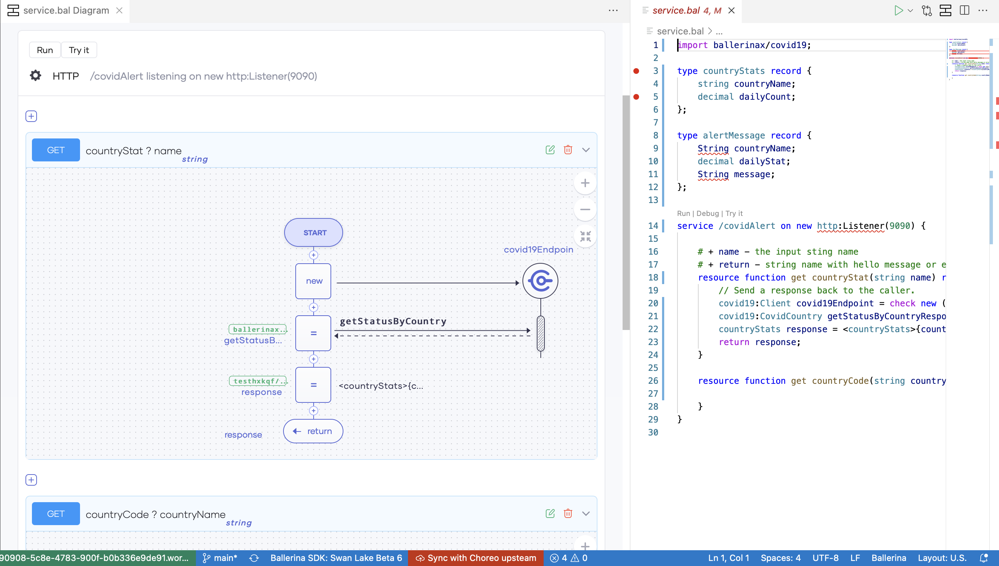

# REST APIs
Explore how you can easily design, develop, and manage REST APIs in Choreo to implement your business API strategy.

## What is a REST API?

A Representational State Transfer(REST) API is an Application Programming Interface(API) that complies with the constraints of REST architectural styles and principles. [REST is an architectural style](https://www.ics.uci.edu/~fielding/pubs/dissertation/rest_arch_style.htm) introduced by Dr. Roy Fielding in his doctoral dissertation in the year 2000.  Dr.Roy initially designed it as a guide for the development of modern web architecture. Today, REST is widely adopted to create high-performance, stateless, and reliable APIs that various applications use.

## Designing a REST API

Designing a REST API is the process of declaring the resources, the appropriate HTTP verbs, paths, and input (request) and output (response) data formats to showcase the capabilities of the API. Designing an API based on a standard helps you design well and provide a consistent experience to the users of your API. [The Open API Specification](https://github.com/OAI/OpenAPI-Specification) is the most widely used standard for declaring HTTP/REST APIs. The design of the API is a crucial factor in determining the usability and the value of the API. A well-designed API is easily adopted and thereby is profitable. 

Choreo’s low-code editor allows developers to easily design (and develop) high-quality REST APIs. Designing a REST API in Choreo begins by creating a REST API component. Developers can choose to design the REST API from scratch by manually specifying the resources, the HTTP verbs, paths, and other required elements or by importing an Open API document(coming soon):

{.cInlineImage-full}

Choreo allows developers to easily specify input and output data formats per each resource of the API:

{.cInlineImage-full}

{.cInlineImage-full}

## Developing a REST API

Choreo supports spec-driven API development. Once you have carefully designed and defined your API, you can start implementing the functionality of your API. Choreo comes with an online IDE based on Visual Studio Code for developers to implement the API’s functionality. By supporting both a low-code and a pro-code mode for implementing APIs and providing the flexibility to alternate between the two modes - Choreo makes API development easy, smooth, and developer-friendly.

### Low Code Mode

TODO: Include a low-code graphic of a program with the above logic.

The above image shows a simple API implemented in the low-code editor in Choreo, that extracts data from an HTTP request, queries a database, and returns a JSON in an HTTP response. 

The low-code programming model allows developers to use common programming constructs such as loops, conditions(if/else, variable declarations and assignments, logs, data transformations(visual data mapping), and much more in a graphical editor. It also allows developers to connect to any built-in or custom-developed [connectors]() as shown above.

The main advantage of the low-code programming mode is that it increases the developer productivity by multiple folds by eliminating the need to write complex code. As developers use constructs on the low-code editor to implement the API, the IDE automatically writes the corresponding [Ballerina](link to Ballerina) source code of the API. This speeds up the developer's learning process significantly and thereby boosts overall productivity.

### Pro Code Mode

In addition to the low-code mode, Choreo provides a pro code mode of implementing API functionality with the ability to alternate between low-code and pro-code at any time. Choreo's online IDE allows viewing the low-code and pro-code editors side by side:

{.cInlineImage-full}

Choreo gives the developers the flexibility to use the pro-code mode only or use it for implementing certain parts of the API and use the low-code mode for the rest, based on their preference. Choreo treats the source code (generated and handwritten) of the API as the single source of truth and therefore has no limitations or restrictions on which mode developers may choose to implement their API’s functionality.

## Lifecycle of a REST API

Once you have implemented the REST API,  it needs to be built, tested, and eventually put into production. Choreo executes a CI/CD pipeline that manages the API’s Lifecycle. Choreo stores the source code of APIs in a private Github repository for the user account. It also provides the capability for developers to hook in their own Github repositories containing the source code of their APIs(coming soon). The CI/CD pipeline in Choreo takes an API through the whole process, starting with code checkout, to compile, build, test, and finally to deployment.

## Deploying a REST API

The following diagram illustrates the process for deploying an API in Choreo to the default development environment. 

{.cInlineImage-full}

Choreo runs a professional, enterprise-grade CI/CD process to deploy APIs to its runtime(data plane) clusters. Under the hood, Choreo’s data plane runs on a Kubernetes stack and hence benefits from all its features such as auto-scaling, auto-healing, secret management, liveness, readiness checks, and so on.

Once you deploy the REST API to the development environment, it is then exposed through an API Gateway with API security turned on. Developers get a testable URL for their API which they can use to verify the functionality of the API they implemented.

## Choreo Environments

Choreo by default provides a development environment and a production environment in two separate Kubernetes clusters. Once you have deployed the API to the development environment and its functionality has been verified, developers can then promote their APIs to the production environment:

{.cInlineImage-full}

Once you have promoted the API to production, Choreo then shows a second URL that developers can use in production applications to invoke the API.

## API Management

API Management is automatically turned on in REST APIs (and other APIs) on Choreo. Developers can use its capabilities to manage the exposure of APIs to their consumers. Developers can configure the API’s security settings, set rate limits, associate usage plans, provide other documentation, and perform other related functions to govern the API. The following image shows how developers can execute the consumer-facing Lifecycle of the API.

[Manage API Lifecycle](assets/img/rest-apis/api-lifecycle-manage.png){.cInlineImage-full}

Consuming the published APIs is made easy with the inbuilt Choreo Developer Portal. Application developers can discover and invoke published APIs using the Choreo Developer Portal. Learn more about the Choreo Developer Portal.

Learn about Choreo's full API Management capabilities of REST APIs from [here](link to the API Management doc page).

## Observability

Choreo allows you to visualize and monitor the performance of REST APIs deployed on Choreo. Choreo has in-built support for viewing the overall status, latencies, throughput data, diagnostic data, and logs. Developers can efficiently detect and troubleshoot anomalies in your REST APIs by using Choreo Observability.

Learn more about Choreo's observability capabilities from [here]().

## Business Insights

Once you take your APIs to production, you need to constantly analyze your APIs to fully understand the usage of your APIs. Choreo provides an

