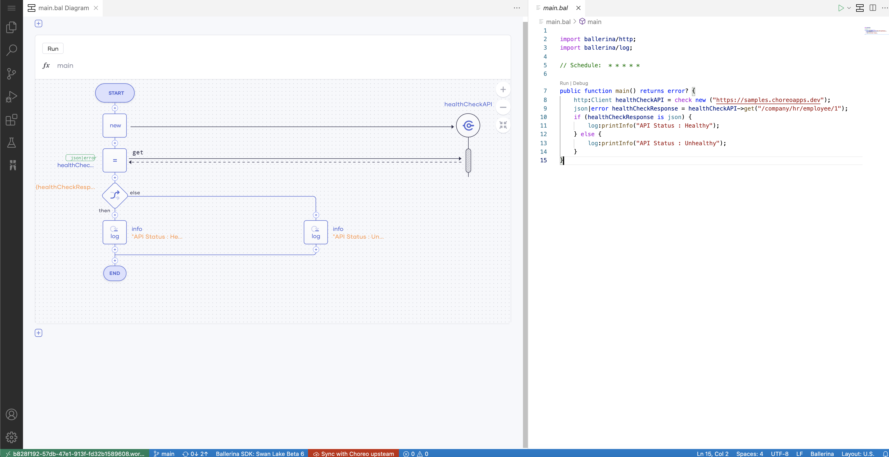

# Scheduled Tasks

Learn how to execute routine tasks at specified time intervals via scheduled tasks.

## What is a scheduled task?

A scheduled task performs a routine task at scheduled time intervals. Following are examples of scenarios where you can schedule tasks:

- Logging a session time-out message for a user at a specific time interval (e.g., every 1 hour).
- Publishing a summary of GitHub issues (i.e., with details such as the number of GitHub issues in each status) as a message in a group chat of a team every day at a specific time.
- Periodically checking whether an application is active or inactive.

## Develop a scheduled task

Developing a scheduled task is the process of configuring an action to be executed.

!!! tip
The development stage does not require you to specify the time interval at which this action needs to be repeatedly executed. You can specify this when you deploy the Scheduled Task component.

e.g., If you need to schedule a health check log for an application, you need to configure a scheduled task that gets the heartbeat of the application, and then define the conditions based on which the log indicates that the application is healthy or unhealthy.

You can configure this scheduled task in low-code mode or pro-code mode.

### Low-code mode

{.cInlineImage-full}

The scheduled task shown above checks whether the heartbeat of an application is received via the `HealthCheckAPI` (which is a connector). Then it logs `Healthy` if the application responds with a heartbeat, or `Unhealthy` if there is no response from the application.

The low-code programming model allows developers to use common programming constructs such as loops, conditions(if/else, variable declarations and assignments, logs, data transformations(visual data mapping), and much more in a graphical editor. It also allows developers to connect to any built-in or custom-developed connectors.

The main advantage of the low-code programming mode is that it increases the developer productivity by multiple folds by eliminating the need to write complex code. As developers use constructs on the low-code editor to implement the integration logic for the scheduled task, the IDE automatically writes the corresponding [Ballerina](https://ballerina.io) source code of the scheduled task. This speeds up the developer's learning process significantly and thereby boosts overall productivity.

### Pro-code mode

In addition to the low-code mode, Choreo provides a pro-code mode of implementing the functionality of a scheduled task with the ability to alternate between low-code and pro-code at any time. Choreo's online IDE allows viewing the low-code and pro-code editors side by side as shown below.

{.cInlineImage-full}

Choreo gives the developers the flexibility to use the pro-code mode only or use it for implementing certain parts of the scheduled task and use the low-code mode for the rest, based on their preference. Choreo treats the source code of the scheduled task (irrespective of whether it is generated or written manually by the developer) as the single source of truth. Therefore, there are no limitations or restrictions on which mode developers may choose to implement the functionality of the scheduled task.

## Deploy a scheduled task

At the deployment stage, Choreo prompts you to specify the time interval at which the scheduled task must be run to execute the configured action.

{.cInlineImage-full}

Once you specify the time interval and proceed to deploy, Choreo starts the process of deploying an API to the default development environment as shown below.

{.cInlineImage-full}

Choreo runs a professional, enterprise-grade CI/CD process to deploy APIs to its runtime(data plane) clusters. Under the hood, Choreo’s data plane runs on a Kubernetes stack and hence benefits from all its features such as auto-scaling, auto-healing, secret management, liveness, readiness checks, and so on.

Once you deploy the scheduled task to the development environment, it is then exposed through an API Gateway with API security turned on.

When you deploy the scheduled task to the development environment, it is active in the developer environment. When you are ready to take the code to production, you can promote the deployment and enable the functionality to your consumers.

Choreo allows you to view the deployment logs through the **Deploy** view. This helps you troubleshoot and view the status of the builds and deployment.

## Choreo environments

Choreo by default provides a development environment and a production environment in two separate Kubernetes clusters. Once you have deployed the scheduled task to the development environment and its functionality has been verified, you can promote it to the production environment.

{.cInlineImage-full}

If required, you can change the time interval of the scheduled task before you promote it to the production environment.

## Observe a scheduled task

You can assess the performance of your scheduled task by observing the success and failure rates of the requests sent to it. The observability view allows you to visualize the performance statistics via interactive graphs.

To learn more about how you can observe your scheduled task, see [Observability Overview](observability/observability-overview.md).
