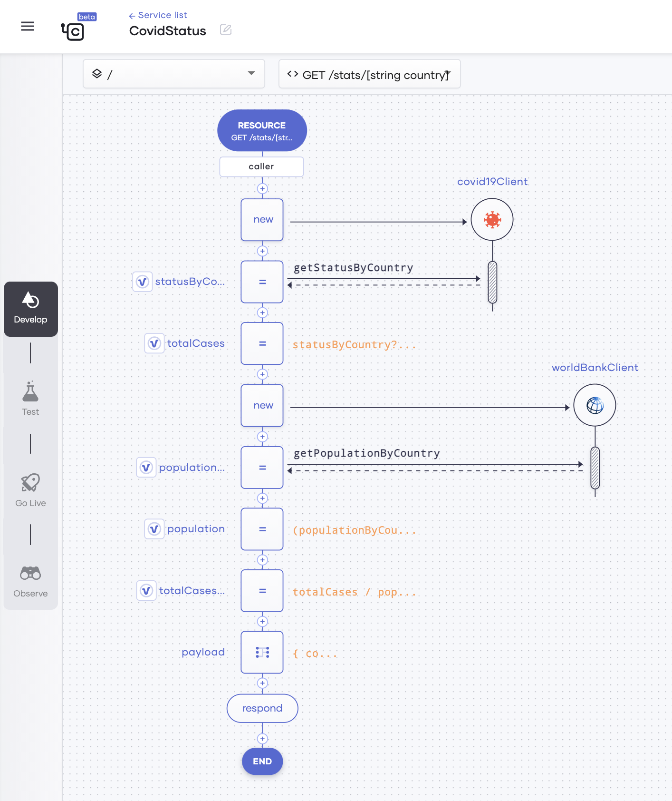
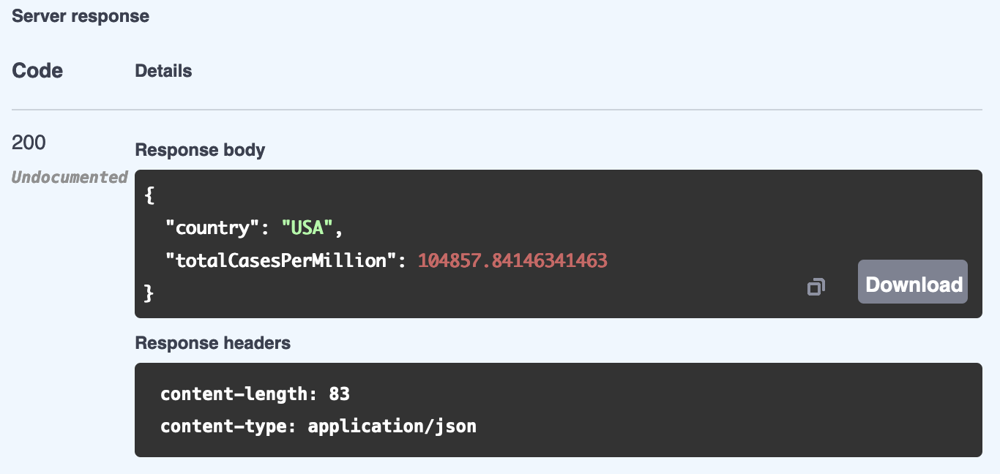
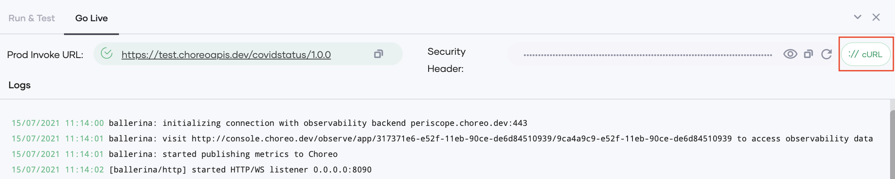

# Create Your First Service

This quick start guide walks you through the steps to create a service that gets the current COVID-19 status of a given country. It will:

- Connect to the COVID-19 data API to get COVID-19 statistics.
- Connect to the World Bank data API to get population data.
- Send a response with further processed COVID-19 data.

Once you develop and test the service, you can deploy it and observe its statistics to evaluate its performance.

## Step 1: Create the service resources

To create the resource via which the service is invoked, follow this procedure:

1. Sign in to the Choreo Console at [https://console.choreo.dev/](https://console.choreo.dev/).
    
2. Go to the **Services** card and click **Get Started**. Now you are on the **Services** page, where you can try out sample services or create your own.
    
3. Click **Create** to create a service from scratch.

4. In the **Create with Choreo** card, enter the service name as `CovidStatus` and click **Create**.

5. Select **GET** as the HTTP method, and enter `stats/[string country]` in the **Path** field.

    {.cInlineImage-half}

6. Click **Save API**. 
    
## Step 2: Get COVID-19 data

Follow this procedure to connect to the COVID-19 API and retrieve data:

1. Click **API Calls** and then select **COVID-19 API**.
2. In the **COVID-19 API Connection** window, enter `covid19Client` as the **Connection Name** and click **Continue to Invoke API**.
3. In the **Operation** drop-down list, select **Country Status** and enter details as follows in the other fields:

    | **Field**                  | **Value**         |
    |----------------------------|-------------------|
    | **Country**                | `country`         |
    | **Response Variable Name** | `statusByCountry` |

6. Click **Save**.
7. Now let’s extract the total case count from the response and store it in a variable. Follow this procedure: 

    1. Click the last **+** icon in the low-code diagram.
    2. Under **Statements**, select **Variable** and enter details as follows:

        | **Field**      | **Value**                     |
        |----------------|-------------------------------|
        | **Type**       | `var`                         |
        | **Name**       | `totalCases`                  |
        | **Expression** | `statusByCountry?.cases ?: 0d`|

    3. Click **Save**.
    
## Step 3: Get the population data

Follow this procedure to connect to the World Bank API and retrieve population data:

1. Click the last **+** icon in the low-code diagram.
2. Click **API Calls** and then select **World Bank API**.
3. In the **World Bank API Connection** window, enter `worldBankClient` as the **Connection Name** and click **Continue to Invoke API**.
4. In the **Operation** drop-down list, select **Get Country Population** and enter details as follows in the other fields: 

    | **Field**                  | **Value**            |
    |----------------------------|----------------------|
    | **Country Code**           | `country`            |
    | **Response Variable Name** | `populationByCountry`|

5. Click **Save**.
6. Now let’s extract the population value from the response, calculate the population in millions, and store it in a variable. Follow this procedure:

    1. Click the last **+** icon in the low-code diagram.
    2. Under **Statements**, select **Variable** and enter details as follows:

        | **Field**      | **Value**                                         |
        |----------------|---------------------------------------------------|
        | **Type**       | `int`                                             |
        | **Name**       | `population`                                      |
        | **Expression** | `(populationByCountry[0]?.value ?: 0) / 1000000`  |

    3. Click **Save**.
    
## Step 4: Calculate the total COVID-19 case count by population

Now let’s calculate the total COVID-19 case count per million in the population based on the COVID-19 statistics and the population data you have retrieved. Follow this procedure:

1. Click the last **+** icon in the low-code diagram.
2. Under **Statements**, select **Variable** and enter details as follows:

    | **Field**      | **Value**                     |
    |----------------|-------------------------------|
    | **Type**       | `var`                         |
    | **Name**       | `totalCasesPerMillion`        |
    | **Expression** | `totalCases / population`     |

3. Click **Save**.

## Step 5: Build the JSON payload and respond

To build the JSON payload to be sent as the response and then send the response, follow this procedure:

1. To build the `json` payload with data of the total cases per million in the population, add a variable.

    Click the last **+** icon in the low-code diagram and click **Variable**. Then enter information as follows:
   
    | **Field**      | **Value**                     |
    |----------------|-------------------------------|
    | **Type**       | `json`                        |
    | **Name**       | `payload`                     |
    | **Expression** | `{country : country, totalCasesPerMillion : totalCasesPerMillion}`     |

2. Click **Save**.
    
3. To respond with the JSON payload, add a `Respond` statement.

    Click the last **+** icon in the low-code diagram and click **Respond**.
    
    In the **Respond Expression** field, enter `payload`.
    
    Save the information.
    
Now you have completed designing the `CovidStatus` service.

The low-code diagram looks as follows:

{.cInlineImage-full}

The code view looks as follows:

```ballerina
import ballerinax/worldbank;
import ballerinax/covid19;
import ballerina/http;

service / on new http:Listener(8090) {
    resource function get stats/[string country](http:Caller caller, http:Request request) returns error? {

        covid19:Client covid19Client = check new ();

        covid19:CovidCountry statusByCountry = check covid19Client->getStatusByCountry(country);
        var totalCases = statusByCountry?.cases ?: 0d;
        worldbank:Client worldBankClient = check new ();
        worldbank:CountryPopulation[] populationByCountry = check worldBankClient->getPopulationByCountry(country);
        int population = (populationByCountry[0]?.value ?: 0) / 1000000;
        var totalCasesPerMillion = totalCases / population;
        json payload = {
            country: country,
            totalCasesPerMillion: totalCasesPerMillion
        };
        check caller->respond(payload);
    }
}
```

## Step 6: Test the service

To test the `CovidStatus` service you created, follow the procedure below:

1. Click **Run & Test**.

    The following logs appear to indicate that the service has successfully started.
    
    ```
    Starting application...
    [ballerina/http] started HTTP/WS listener 0.0.0.0:8090
    ```
   
2. Now you are in the **Test** tab.

    {.cInlineImage-bordered}

3. In the test view that opens to the right of the page, click **GET**.

4. Click **Try it out**, and in the **country** field, enter `USA`.
   
5. Click **Execute**.

    The response is displayed as follows:

    {.cInlineImage-bordered}


## Step 7: Deploy the service

To deploy the `CovidStatus` service, follow the procedure below:

1. Click the **Go Live** icon in the left pane.

    {.cInlineImage-bordered}

2. To deploy the service, click **Deploy**.

    The status of the service changes to **Deployed**, and the following logs appear to indicate that the service is successfully deployed.
    Then, click on **://cURL**. Copy the cURL command that is displayed.

    {.cInlineImage-full}
    
    !!! tip
        The cURL command will be something as given in the example below:<br/><br/>
        `curl "https://johndoe.dv.choreoapis.dev/covidstatus/1.0.0/stats/{country}" -H 'API-Key: <API_KEY>>' -X GET<br/><br/>
        The value for the **country** parameter can be changed as required.
        
3. Invoke the service a few times via the terminal by issuing the cURL command you copied.
      
Now you are ready to observe the `CovidStatus` service based on the statistics generated as a result of the cURL commands you issued. 

## Step 8: Observe the service

To observe the `CovidStatus` service, click the **Observe** icon in the left panel.

{.cInlineImage-bordered}

You can view statistics related to the service as follows:

{.cInlineImage-full}

The low-code diagram displays the success rate and the latency for each connector. 
The observability view to the right of the low-code diagram displays graphs that depict the throughput and the latency. You can move 
the pointer over the throughput graph to view details relevant for specific times. If you want to drill down the statistics further, 
click on the **Diagnostics View** tab.  

Congratulations! Now you have successfully created a service, tested it, deployed it, and observed its statistics.
