# Create Your First Service

To learn how to create a service, let's try a simple scenario. In this example, you are creating a service that consumes a public API that fetches the current active COVID-19 cases in a specified country, testing it, deploying it, and then observing its performance.

## Step 1: Create the service

To create the service, follow the procedure below: 

1. Access the Choreo Console via https://console.choreo.dev/.
    
2. Sign in using either your Google or GitHub credentials.
    
3. In the **Services** page, click **Create**. You are directed to the low-code view.

4. Under **Create with Choreo**, enter `covid-stats` as the name of your service.

5. Select **GET** as the HTTP method, and enter `activecases` as the relative path from host.

    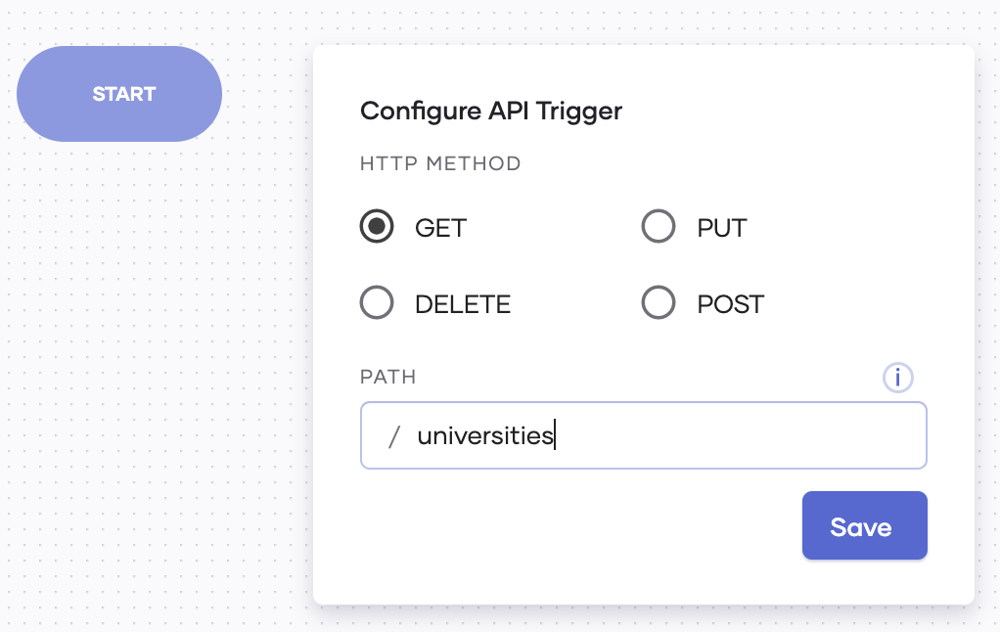
    
    Then click **Save API**. Now you have saved the API trigger that starts your service.
    
6. Click **API Calls**, and then enter information as follows to configure the HTTP connection that connects the public API used in this scenario to the API trigger you configured.

    1. Click **HTTP**.
    
        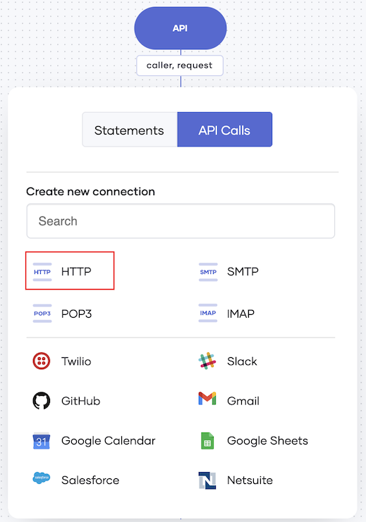
        
    2. Enter information as follows:
    
        | **Field**           | **Value**                    |
        |---------------------|------------------------------|
        | **Connection Name** | `httpEndpoint`               |
        | **URL**             | `"https://api.covid19api.com"` |
        
        Click **Save**.
        
    3. Click the **+** icon below the HTTP API call you added. 
    
        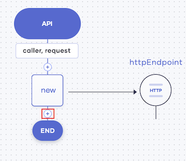
        
    4. Click **API Calls**, and then click on the existing connection.
    
        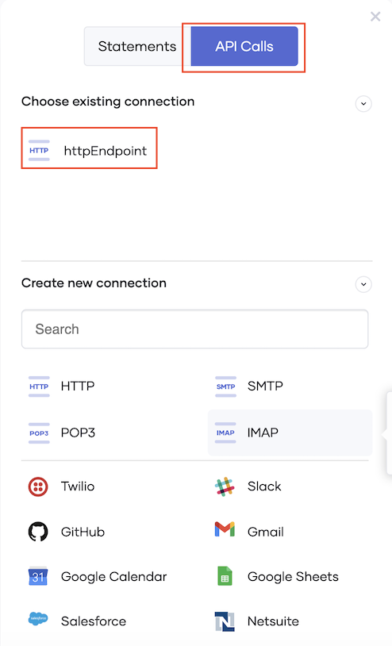
        
    5. Enter information as follows:
        
        
        
        | **Field**               | **Value**                      |
        |-------------------------|--------------------------------|
        | **OPERATION**           | **get**                        |
        | **Resource Path**       | `"/total/country/united-states"` |
        | **Select Payload Type** | **JSON**                       |
        
        !!! info
            To select **JSON** as the payload type, you need to click **Do you want to extract a payload?**.
            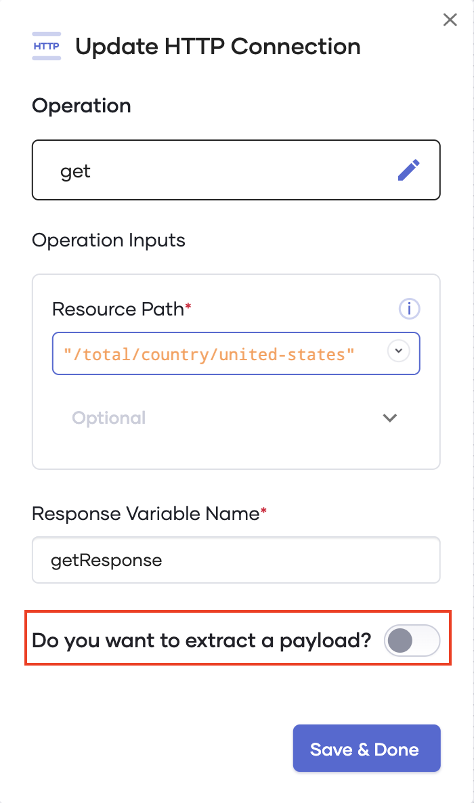
        
        Click **Save & Done**.
        
        Now your API trigger is connected to the public API that fetches the active COVID-19 cases in the selected country.
    
7. To cast all the data retrieved via the API connected to the service before further processing, add a new custom statement as follows:

    1. Click the last **+** icon in your low-code diagram.

        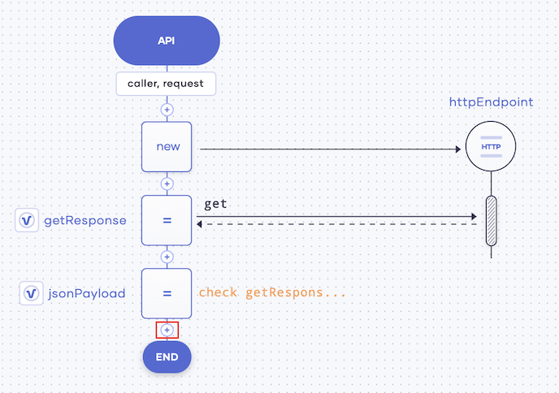
    
    2. Click **Other** and then enter the following in the **Statement** field.
    
        ```
        json[] jsonArray = <json[]>jsonPayload;
        json[] response = [];
        ```
        Then click **Save**.
    
8. To filter the dates on which the active cases have exceeded 5,000, let's add a statement of the `ForEach` type as follows: 

    1. Click the last **+** icon in your low-code diagram.
    
    2. Click **ForEach**.

    3. In the **Iterable Expression** field, enter `jsonArray`. Then click **Save**.
    
    4. To apply the filter mentioned, add a custom statement within the ForEach statement. To do this, click the **+** icon just below the last ForEach statement you added.

        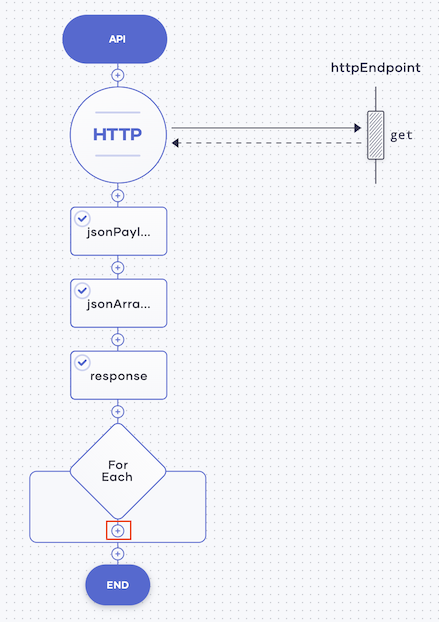
    
    5. In the form that appears, click **Other**. Then enter the following in the **Statement** field.

        ```ballerina
        int active = <int>(check item.Active);
        if (active > 5000) {
            response.push(item);
        }
        ```
        
        Then click **Save**.
    
9. To add a statement of the `Respond` type so that the result of the above processing is returned as a response, click the last **+** icon in your low-code diagram.

    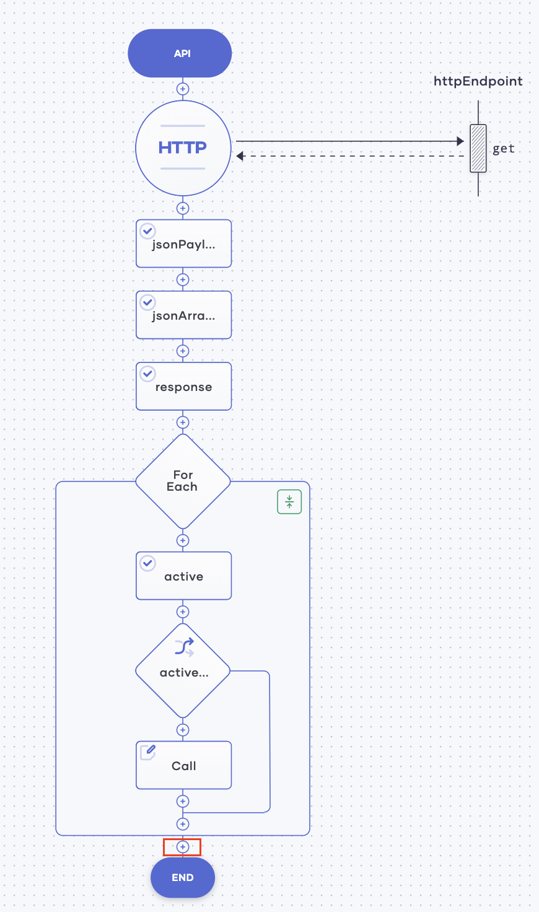
    
    In the **Respond Expression** field, enter `response`, and then click **Save**.

    
Now you have completed designing your service. It looks as follows.

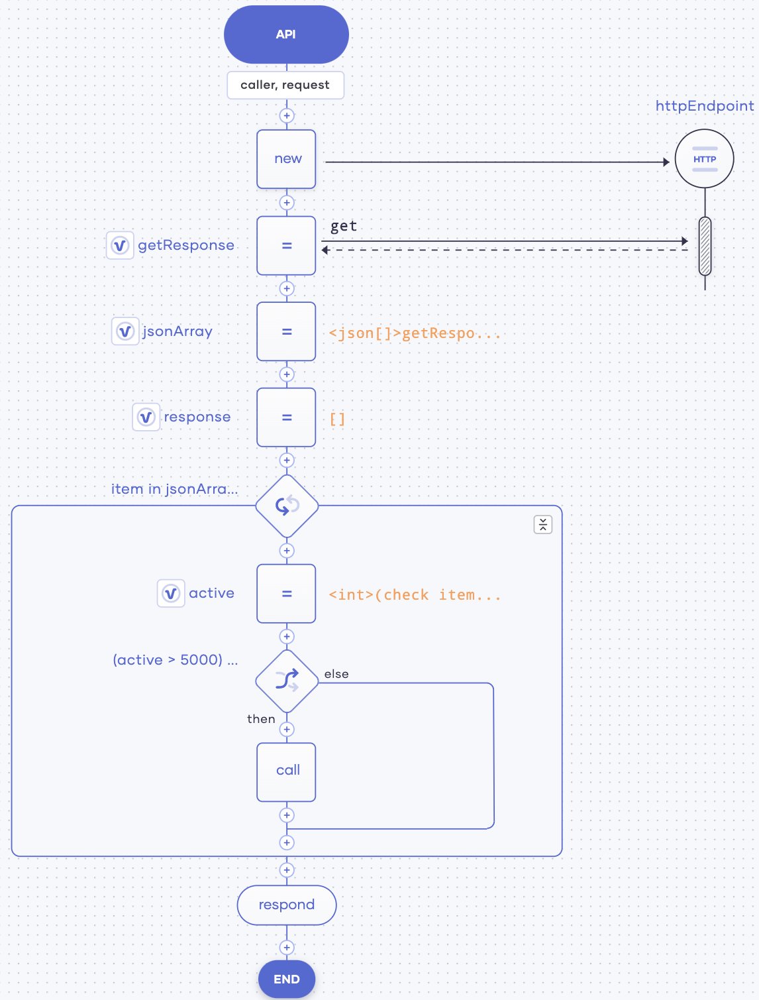

The code view looks as follows.

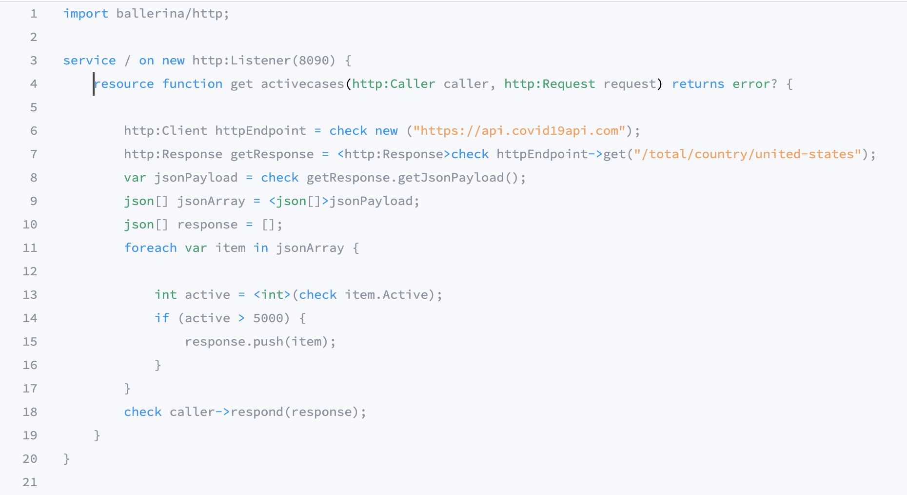

    
To validate the service, click **Run & Test**. The following is logged to indicate that you have successfully started the service.

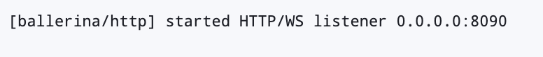
    
Congratulations! You have successfully created your first service.
   
## Step 2: Test the service

To test the `covid-stats` service you created, follow the procedure below:

1. Click the **Test** icon in the left pane.

    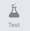

2. In the section that opens to the right of the page, click **GET**.

3. Click **Try it out**, and then click **Execute**.

The search results for COVID-19 statistics of the United States are displayed as the server response as shown below.

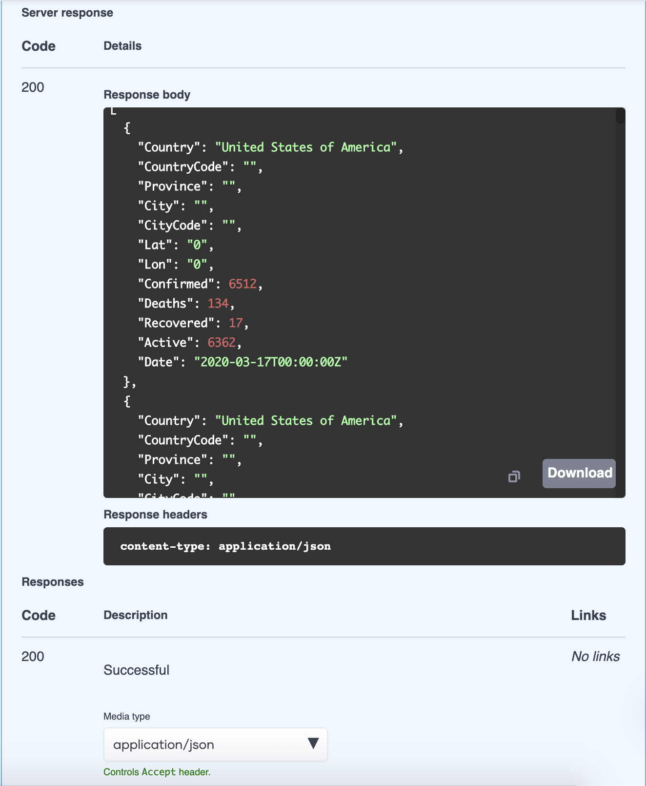

Now you have verified that the `covid-stats` service works as expected. Therefore, you can deploy it.

## Step 3: Deploy the service

To deploy the `covid-stats` service, follow the procedure below:

1. Click the **Go Live** icon in the left pane.

    

2. To deploy the service, click **Deploy**.

    The status of the service changes to **Deployed**, and the following logs appear to indicate that the product is successfully deployed.    

    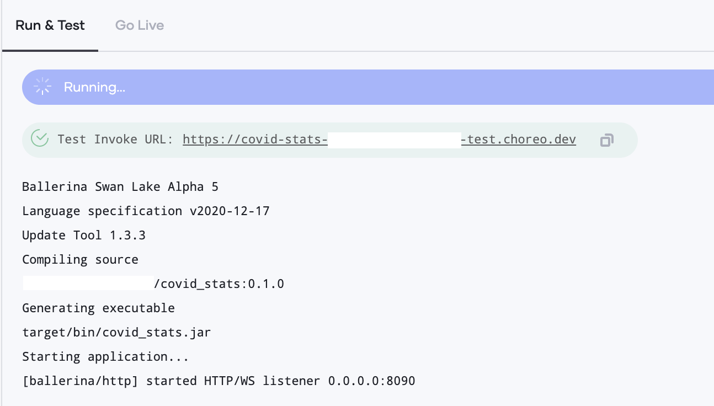

3. Once the service is deployed, click on the **Go Live** tab below the low-code design view. Then click **://cURL** and copy the cURL command that is displayed.

    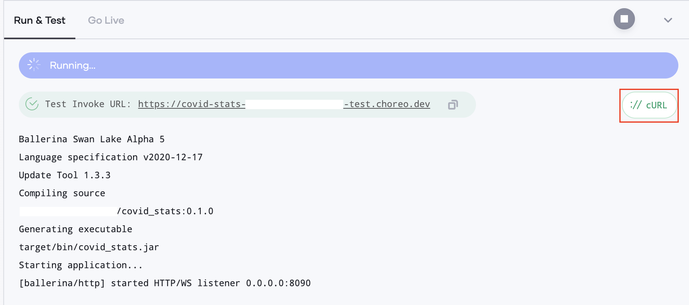
    
    Invoke the `covid-stats` service by issuing a few cURL commands using the Postman application.
    
    The responses are logged as shown below.
    
    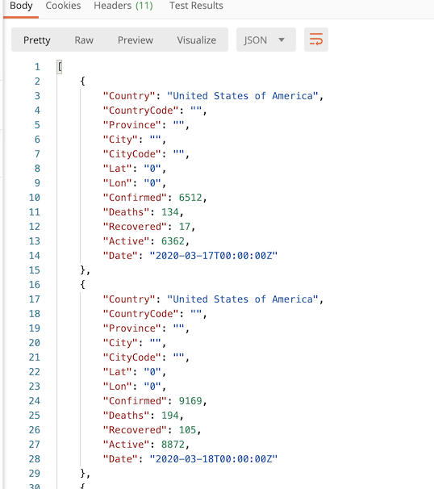

    In the Choreo Development Console, **Go Live** tab, the requests are logged as follows.
    
    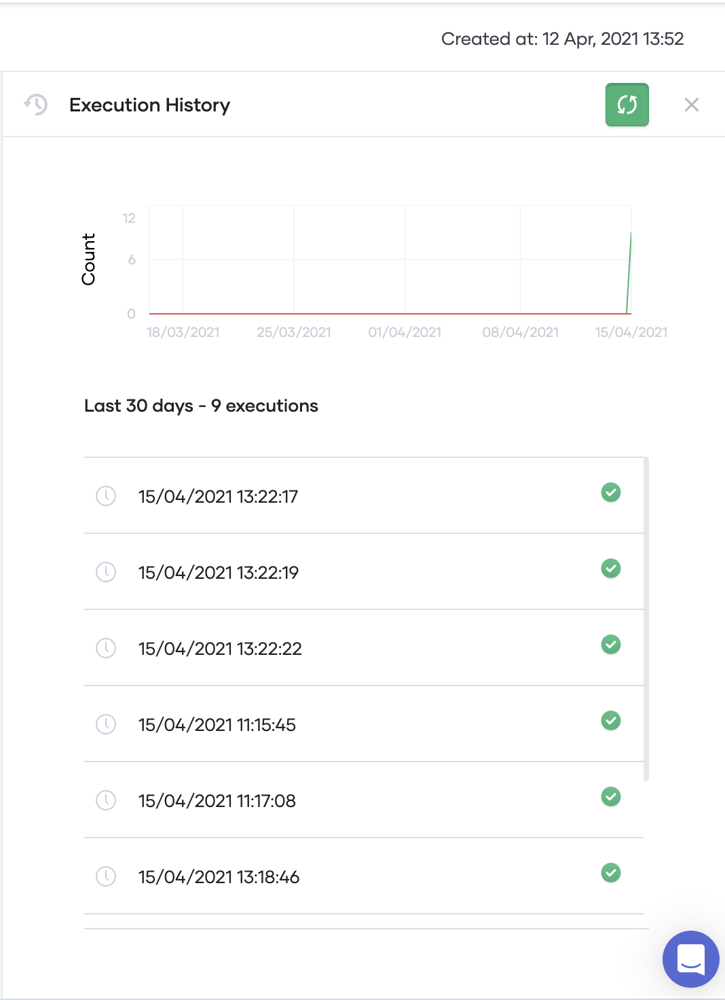
    
To observe the `covid-stats` service by checking the statistics generated as a result of the cURL commands you issued, proceed to Step 4. 

## Step 4: Observe the service

To observe the `covid-stats` service, click the **Observe** icon in the left panel.


The throughput and the latency of the `covid-stats` service are visualized as follows:

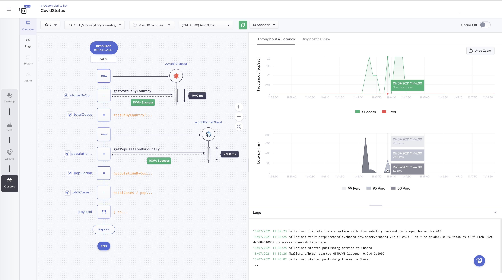

Congratulations! Now you have successfully created a service, tested it, deployed it, and observed its statistics.
