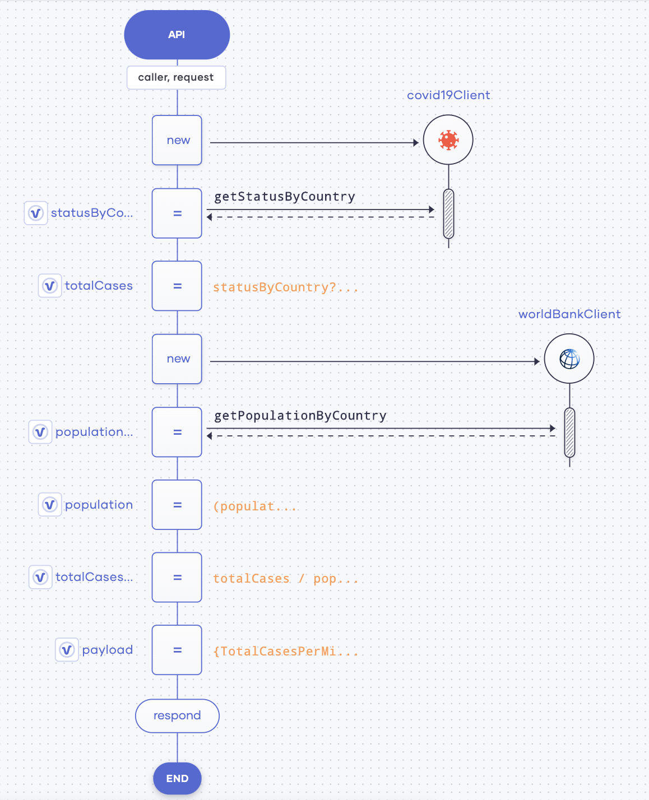
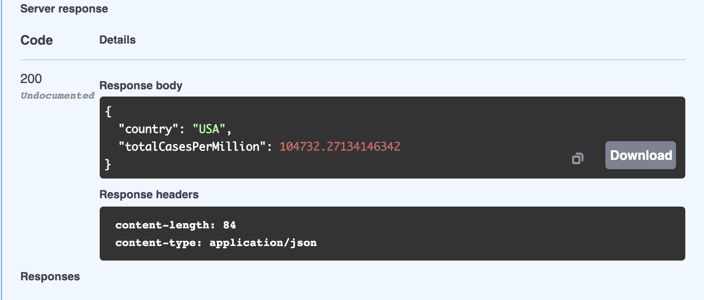

# Create Your First Service

This quick start guide walks you through the steps to create a service that gets the current COVID-19 status of a given country. It will:

- Connect to the COVID-19 data API to get COVID-19 statistics.
- Connect to the world bank data API to get population data.
- Send a response back with further processed COVID-19 data.

Once you develop and test the service, you can deploy it and observe its statistics to evaluate its performance.

## Step 1: Create the service resources

To create the service resources:

1. Access the Choreo Console via [https://console.choreo.dev/](https://console.choreo.dev/).
    
2. Sign in using either your Google or GitHub credentials.
    
3. On the **Services** page, click **Create**. You are directed to the low-code view.

4. Under **Create with Choreo**, enter `CovidStatus` as the name of your service.

5. Select **GET** as the HTTP method, and enter `stats/[string country]/[string date]` in the **Path** field.

    {.cInlineImage-half}
    
    Then click **Save API**. Now you have saved the API resource that starts your service.
    
## Step 2: Get COVID-19 data

To get COVID-19 data:

1. Click on the **API Calls** tab and then click on **Covid19 API** in the available connection list.

2. In the **Connection Name** field, enter `covid19Client`, and save.

3. Click the last **+** icon in the low-code diagram and click **API Calls**.

4. Under **Choose existing connection**, click **covid19Client**.

5. In the **Operation** field, select **Country Status**. Then enter the following information in the other fields that appear.

    | **Field**                 | **Value**         |
    |---------------------------|-------------------|
    | **Country**               | `country`         |
    | **Response VariableName** | `statusByCountry` |
    
    Save the information.
    
6. Now let’s extract the current total cases count from the response and store it in a variable.

    To do this, click the last **+** icon in the low-code diagram and click **Variable**.
    
    Enter information as follows:
    
    | **Field**      | **Value**                      |
    |----------------|--------------------------------|
    | **Type**       | `var`                          |
    | **Name**       | `totalCases`                   |
    | **Expression** | `statusByCountry?.cases ?: 0d` |
    
    Save the information.
    
## Step 3: Get the population data

To get the population data:

1. Click the last **+** icon in the low-code diagram and click **API Calls**.

2. Click on **World Bank API** in the available connection list.

3. In the **Connection Name** field, enter `worldBankClient`, and save.

4. Click the last **+** icon in the low-code diagram and click **API Calls**.

5. Under **Choose existing connection**, click **worldBankClient**.

6. In the **Operation** field, select **Get Country Population**. Then enter the following information in the other fields that appear.

    1. In the **Country Code** field, enter `country`.
    
    2. In the **Date** field, enter `date`.
    
    3. Click **Optional**, and in the **Format** field, enter `json`.

    4. In the **Response Variable Name** field, enter `populationByCountry`

    Save the information.

7. Now let’s extract the population from the response and store it in a variable.

    To do this, click the last **+** icon in the low-code diagram and click **Variable**.
    
    Enter information as follows:
    
    | **Field**      | **Value**                      |
    |----------------|--------------------------------|
    | **Type**       | `int`                          |
    | **Name**       | `population`                   |
    | **Expression** | `(populationByCountry is worldbank:CountryPopulationArr ? populationByCountry[0]?.value ?: 0 : 0) / 1000000` |
    
    Save the information.
    
## Step 4: Calculate the summary of the COVID-19 cases

Now let’s calculate the total cases per million in the population based on the COVID-19 statistics and the population data that you have collected. 

To do this, click the last **+** icon in the low-code diagram and click **Variable**.

Enter information as follows:

| **Field**      | **Value**                  |
|----------------|----------------------------|
| **Type**       | `var`                      |
| **Name**       | `totalCasesPerMillion`     |
| **Expression** | `totalCases / population`  |

Save the information.

## Step 5: Build the JSON payload and respond

To build the JSON payload and respond, follow these steps:

1. To build the `json` payload with data of the total cases per million in the population, add a variable.

    Click the last **+** icon in the low-code diagram and click **Variable**. Then enter information as follows:
    
    | **Field**      | **Value**                                         |
    |----------------|---------------------------------------------------|
    | **Type**       | `json`                                            |
    | **Name**       | `payload`                                         |
    | **Expression** | `{ TotalCasesPerMillion : totalCasesPerMillion }` |
    
    Save the information.
    
2. To respond with the JSON payload, add a `Respond` statement.

    Click the last **+** icon in the low-code diagram and click **Respond**.
    
    In the **Respond Expression** field, enter `payload`.
    
    Save the information.
    
Now you have completed designing the `CovidStatus` service.

The low-code diagram looks as follows:

{.cInlineImage-bordered}

The code view looks as follows:

```ballerina
import ballerinax/worldbank;
import ballerinax/covid19;
import ballerina/http;

service / on new http:Listener(8090) {
    resource function get stats/[string country]/[string date](http:Caller caller, http:Request request) returns error? {

        covid19:Client covid19Client = check new ();
        covid19:CovidCountry statusByCountry = check covid19Client->getStatusByCountry(country);
        var totalCases = statusByCountry?.cases ?: 0d;
        worldbank:Client worldBankClient = check new ();
        worldbank:CountryPopulationArr? populationByCountry = check worldBankClient->getPopulationByCountry(country, 
        date, format = "json");

        int population = 
        (populationByCountry is worldbank:CountryPopulationArr ? populationByCountry[0]?.value ?: 0 : 0) / 1000000;
        var totalCasesPerMillion = totalCases / population;
        json payload = {TotalCasesPerMillion: totalCasesPerMillion};
        check caller->respond(payload);
    }
}

```

## Step 6: Test the service

To test the `CovidStatus` service you created, follow the procedure below:

1. Click **Run & Test**.

    The following logs appear to indicate that the service has successfully started.
    
    ```
    Starting application...
    [ballerina/http] started HTTP/WS listener 0.0.0.0:8090
    ```
   
2. Click the **Test** icon in the left pane.

    {.cInlineImage-bordered}

3. In the test view that opens to the right of the page, click **GET**.

4. Click **Try it out**, and then enter the following information in the fields that appear.

    | **Field**     | **Value**                                         |
    |---------------|---------------------------------------------------|
    | **country**   | `USA`                                            |
    | **date**      | `2019`                                         |
   
5. Click **Execute**.

    The response is displayed as follows:
     {.cInlineImage-bordered}


## Step 7: Deploy the service

To deploy the `CovidStatus` service, follow the procedure below:

1. Click the **Go Live** icon in the left pane.

    {.cInlineImage-bordered}

2. To deploy the service, click **Deploy**.

    The status of the service changes to **Deployed**, and the following logs appear to indicate that the product is successfully deployed.    

    {.cInlineImage-full}
    
    In addition, the following message appears:
    
    ```
    Deployed successfully. Note that the service will automatically undeploy in 12 hours.
    ```
   
3. Once the service is deployed, click on **://cURL**.

    {.cInlineImage-full}
    
    Copy the cURL command that is displayed.
    
    !!! tip
        The cURL command will be something as given in the example below:<br/><br/>
        `curl "https://covidstatus-johndoe-test.dv.choreo.dev/stats/USA/2019" -X GET`<br/><br/>
        The values for the **country** and **date** parameters can be changed as required.
        
4. Invoke the service a few times via the terminal by issuing the cURL command you copied.
      
Now you are ready to observe the `CovidStatus` service based on the statistics generated as a result of the cURL commands you issued. 

## Step 8: Observe the service

To observe the `CovidStatus` service, click the **Observe** icon in the left panel.

{.cInlineImage-bordered}

The throughput and the latency of the `covid-stats` service are visualized as follows:

{.cInlineImage-full}

Congratulations! Now you have successfully created a service, tested it, deployed it, and observed its statistics.
