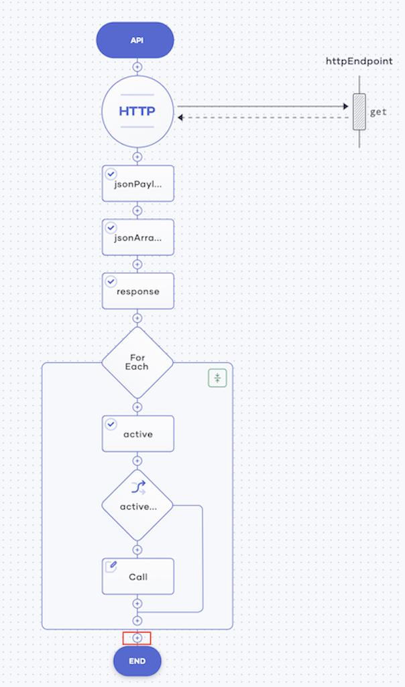
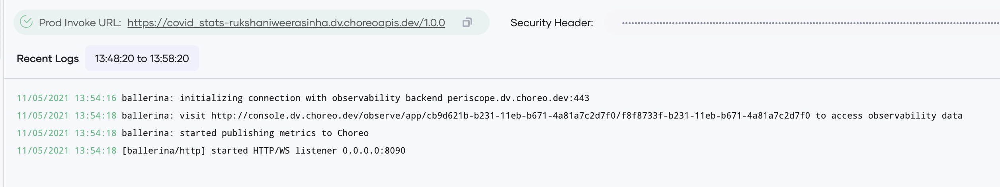

# Create Your First Service

To learn how to create a service, let's look at a simple scenario. In this example, you'll create and design a service that consumes a public API that fetches the current active COVID-19 cases in the United States. Then you'll test it, deploy it, and observe its performance.

## Step 1: Create the service

To create the service, follow this procedure:

1. Sign in to the Choreo Console at [https://console.choreo.dev/](https://console.choreo.dev/).
    
2. On the **Services** page, click **Create**. You are directed to the **Create Service** page.

3. Under **Create with Choreo**, enter `covid-stats` as the name of your service, and then click **Create**. You are directed to the low-code view to design the service.

## Step 2: Design the service

To design the service to fetch the current active COVID-19 cases in the United States, follow this procedure:

1. Select **GET** as the HTTP method and enter `activecases` as the relative path from the host.

    {.cInlineImage-half}
    
2. Click **Save API**.  

3. Click **API Calls** and complete the following steps to create a new HTTP connection:

    1. Click **HTTP** and enter the details as follows:
    
        | **Field**           | **Value**                      |
        |---------------------|--------------------------------|
        | **Connection Name** | `httpEndpoint`                 |
        | **URL**             | `"https://api.covid19api.com"` |
    
        
    2. Click **Save**.
        
    3. Click the **+** icon below the HTTP API call you added. 
    
        {.cInlineImage-half}
        
    4. Click **API Calls** and then click the existing connection.
    
        {.cInlineImage-half}
        
    5. Enter the details as follows:
        
        | **Field**               | **Value**                       |
        |-------------------------|---------------------------------|
        | **OPERATION**           | **get**                         |
        | **Resource Path**       | `"/total/country/united-states"`|
        | **Select Payload Type** | **JSON**                        |
        
        !!! info
            To select **JSON** as the payload type, you must enable **Do you want to extract a payload?**.
            {.cInlineImage-half}

    6. Click **Save & Done**.
        
        Now you have configured the service to fetch the active COVID-19 cases in the United States.
        
    
4. To store the response from the public API to your service, follow this procedure:

    1. Click the last **+** icon in your low-code diagram.

        {.cInlineImage-half}
    
    2. Click **Other** and then enter the following in the **Statement** field:
    
        ```ballerina
        json[] jsonArray = <json[]>getResponse;
        json[] response = [];
        ```
        
    3. Click **Save**.
    
5. To filter the dates on which the active cases have exceeded 5,000, follow this procedure: 

    1. Click the last **+** icon in your low-code diagram.
    
    2. Click **ForEach**.

    3. In the **Iterable Expression** field, enter `jsonArray`and then click **Save**.
    
    4. Click the **+** icon just below the last ForEach statement you added.

        {.cInlineImage-half}
    
    5. In the form that appears, click **Other**. Then enter the following in the **Statement** field:

        ```ballerina
        int active = <int>(check item.Active);
        if (active > 5000) {
            response.push(item);
        }
        ```
    6. Click **Save**.
    
6. To ensure that the data retrieved is returned as a response, follow this procedure: 

    1. Click the last **+** icon in your low-code diagram.

        {.cInlineImage-half}
    
    2. In the **Respond Expression** field, select **response** and then click **Save**.

Now you have completed designing the service. It looks as follows:

- The low code diagram

  {.cInlineImage-half}

- In the code view

  {.cInlineImage-full}

    
To validate the service, click **Run & Test**. The following is logged to indicate that you have successfully started the service.

{.cInlineImage-half}
    
Now you are ready to test the service.
   
## Step 3: Test the service

To test the `covid-stats` service, follow this procedure:

1. Click the **Test** icon in the left pane.

    {.cInlineImage-bordered}

2. In the section that opens to the right of the page, click **GET**.

3. Click **Try it out**, and then click **Execute**.

The following figure shows the server response to the search results for the United States COVID-19 statistics:

{.cInlineImage-half}

Now that you have verified that the `covid-stats` service works as expected, you can deploy it.

## Step 4: Deploy the service

To deploy the `covid-stats` service, follow this procedure:

1. Click the **Go Live** icon in the left pane.

    {.cInlineImage-bordered}

2. To deploy the service, click **Deploy**.

    The status of the service changes to **Deployed**, and the following logs show that the service is successfully deployed:    

    {.cInlineImage-full}

3. Once the service is deployed, click on **://cURL**.

    {.cInlineImage-full}
    
    Copy the cURL command that is displayed.
    
4. Invoke the `covid-stats` service by issuing a few cURL commands using the Postman application. The responses are logged as shown below:
    
    {.cInlineImage-half}
    
5. On the Choreo Console **Go Live** tab, the requests are logged as follows:
    
    {.cInlineImage-half}
    
Now you are ready to observe the `covid-stats` service based on the statistics generated as a result of the cURL commands you issued. 

## Step 5: Observe the service

To observe the `covid-stats` service, click the **Observe** icon in the left panel.

{.cInlineImage-bordered}

The throughput and the latency of the `covid-stats` service are visualized as follows:

{.cInlineImage-full}

Congratulations! Now you have successfully created a service, tested it, deployed it, and observed its statistics.
