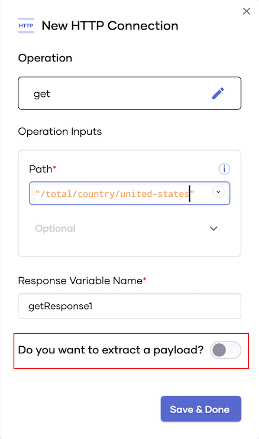
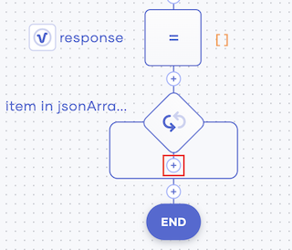
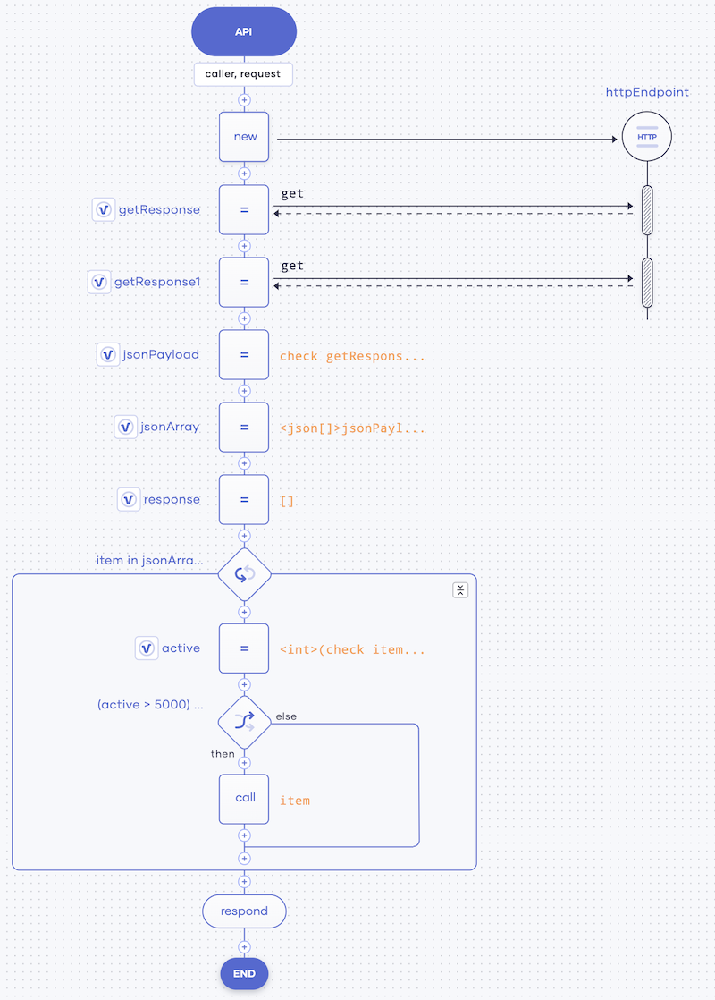
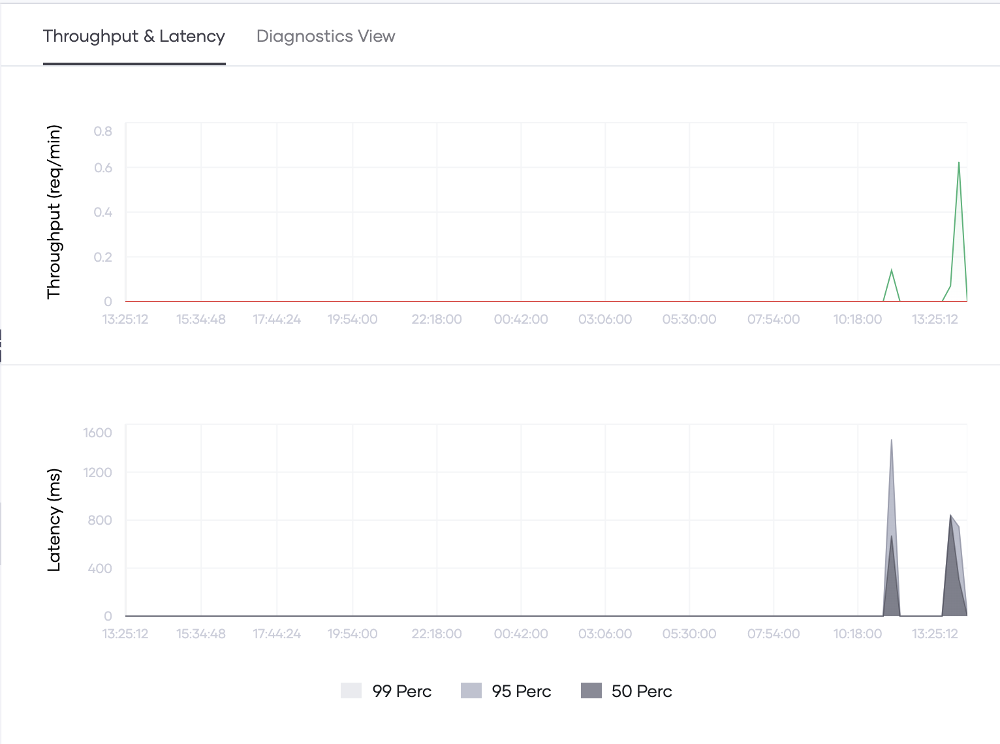

# Create Your First Service

To learn how to create a service, let's look at a simple scenario. In this example, you'll create a service that consumes a public API that fetches the current active COVID-19 cases in the United States. Then you'll test it, deploy it, and observe its performance.

## Step 1: Create the service

To create the service, follow this procedure: 

1. Access the Choreo Console via https://console.choreo.dev/ and sign in using your Google or GitHub credentials.
    
2. On the **Services** page, click **Create**. You are directed to the **Create Service** page.

3. Under **Create with Choreo**, enter `covid-stats` as the name of your service.

4. Select **GET** as the HTTP method and enter `activecases` as the relative path from the host.

     

5. Click **Save API**. Now you have saved the API trigger that starts your service.

6. Click **API Calls** and then complete the following steps to configure the API trigger to use the HTTP connection that connects the public API used in this scenario to it:

    1. Click **HTTP**.
    
        
         
    2. Enter the following information and then click **Save**:
    
        | **Field**           | **Value**                      |
        |---------------------|--------------------------------|
        | **Connection Name** | `httpEndpoint`                 |
        | **URL**             | `https://api.covid19api.com`   |
         
    3. Click the **+** icon below the HTTP API call you added. 
    
        
        
    4. Click **API Calls** and then click the existing connection.
    
        
        
    5. Enter the following information:
        
        | **Field**               | **Value**                       |
        |-------------------------|---------------------------------|
        | **OPERATION**           | **get**                         |
        | **Resource Path**       | `"/total/country/united-states"`|
        | **Select Payload Type** | **JSON**                        |

        !!! info
            To select **JSON** as the payload type, you need to click **Do you want to extract a payload?**.
            
            
    6. Click **Save & Done**.
    
       Now your API trigger is connected to the public API that fetches the active COVID-19 cases in the selected country.

7. Add a new custom statement as follows to cast all the data retrieved via the API connected to the service before further processing:

    1. Click the last **+** icon in your low-code diagram.

        
    
    2. Click **Other** and then enter the following in the **Statement** field:

        ```ballerina
        json[] jsonArray = <json[]>jsonPayload;
        json[] response = [];
        ```
    3. Click **Save**.

8. Add a ForEach statement as follows to filter the dates where the active cases have exceeded 5,000:

    1. Click the last **+** icon in your low-code diagram.
    
    2. Click **ForEach**.

    3. In the **Iterable Expression** field, enter `jsonArray`. Then click **Save**.
    
    4. To apply the filter, add a custom statement within the ForEach statement. To do this, click the **+** icon just below the last ForEach statement you added.

        
    
    5. In the form that appears, click **Other**. Then enter the following in the **Statement** field:

        ```ballerina
        int active = <int>(check item.Active);
        if (active > 5000) {
            response.push(item);
        }
        ```
    6. Click **Save**.

9. Add a Respond statement as follows so that the result of the above processing is returned as a response:

    1. Click the last **+** icon in your low-code diagram.

        

    2. In the **Respond Expression** field, enter a response, and then click **Save**.

Now you have completed designing your service. It looks as follows.

- In the low-code view

   

- In the code view

   
    
To validate the service, click **Run & Test**. The following is logged to indicate that you have successfully started the service.

 
    
Congratulations! You have successfully created your first service.
   
## Step 2: Test the service

To test the `covid-stats` service you created, follow this procedure:

1. Click the **Test** icon in the left pane.

   

2. In the section that opens to the right of the page, click **GET**.

3. Click **Try it out**, and then click **Execute**.

The following figure shows the server response to the search results for the United States COVID-19 statistics:


Now that you have verified that the **covid-stats** service works as expected, you can deploy it.

## Step 3: Deploy the service

To deploy the `covid-stats` service, follow this procedure:

1. Click the **Go Live** icon in the left pane.

      

2. To deploy the service, click **Deploy**.

    The status of the service changes to **Deployed**, and the following logs show that the product is successfully deployed:    

      

3. Once the service is deployed, click the **Go Live** tab below the low-code diagram. Then click **://cURL** and copy the cURL command that is displayed.

      

4. Invoke the **covid-stats** service by issuing a few cURL commands using the Postman application. The responses are logged as shown below:

      

5. In the Choreo Development Console **Go Live** tab, the requests are logged as follows:
    
    
    
To observe the `covid-stats` service by checking the statistics generated as a result of the cURL commands you issued, proceed to Step 4. 

## Step 4: Observe the service

To observe the `covid-stats` service, click the **Observe** icon in the left panel.

   

The throughput and the latency of the `covid-stats` service are visualized as follows:

   

Congratulations! Now you have successfully created a service, tested it, deployed it, and observed its statistics.
