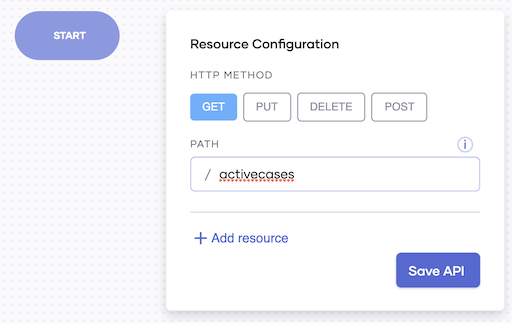

# Create Your First Service

This quick start guide walks you through the steps to create a service that gets the current COVID-19 status of a given country. It

- Connects to the COVID-19 data API to get COVID-19 statistics
- Connects to the World Bank data API to get population data
- Sends a response with further processed COVID-19 data

Once you develop and test the service, you can deploy it and observe its statistics to evaluate its performance.

## Step 1: Create the service resources

To create the resource to invoke the service, follow this procedure:

1. Sign in to the Choreo Console at [https://console.choreo.dev/](https://console.choreo.dev/).
    
2. Go to the **Services** card and click **Create**. This takes you to the **Create Service** page.
    
3. In the **Create with Choreo** card, enter the service name as `CovidStatus` and click **Create**.

4. Select **GET** as the HTTP method, and enter `stats/[string country]` in the **Path** field.

    {.cInlineImage-half}

5. Click **Advanced** and select **Add Caller** under the **Advanced** section.

6. Click **Save API**. 
    
## Step 2: Get COVID-19 data

Follow this procedure to connect to the COVID-19 API and retrieve the data:

1. Click **API Calls** and then select **COVID-19 API**.
2. In the **COVID-19 API Connection** window, enter `covid19Client` as the **Endpoint Name** and click **Continue to Invoke API**.
3. In the **Operation** drop-down list, select **getStatusByCountry** and enter these details:

    | **Field**                  | **Value**         |
    |----------------------------|-------------------|
    | **Country**                | `country`         |
    | **Response Variable Name** | `statusByCountry` |

4. Click **Save**.
5. Now let’s extract the total case count from the response and store it in a variable. Follow this procedure: 

    1. Click the last **+** icon in the low-code diagram.
    2. Under **Statements**, select **Variable** and enter the details as follows:

        | **Field**      | **Value**                     |
        |----------------|-------------------------------|
        | **Type**       | `int`                         |
        | **Name**       | `totalCases`                  |
        | **Expression** | `<int>statusByCountry.cases`  |

    3. Click **Save**.
    
## Step 3: Get the population data

Follow this procedure to connect to the World Bank API and retrieve the population data:

1. Click the last **+** icon in the low-code diagram.
2. Click **API Calls** and then select **World Bank API**.
3. In the **World Bank API Connection** window, enter `worldBankClient` as the **Endpoint Name** and click **Continue to Invoke API**.
4. In the **Operation** drop-down list, select **getPopulationByCountry** and enter these details: 

    | **Field**                  | **Value**            |
    |----------------------------|----------------------|
    | **Country Code**           | `country`            |
    | **Response Variable Name** | `populationByCountry`|

5. Click **Save**.
6. Now let’s extract the population value from the response, calculate the population in millions, and store it in a variable. Follow this procedure:

    1. Click the last **+** icon in the low-code diagram.
    2. Under **Statements**, select **Variable** and enter the details as follows:

        | **Field**      | **Value**                                         |
        |----------------|---------------------------------------------------|
        | **Type**       | `int`                                             |
        | **Name**       | `populationMillions`                                      |
        | **Expression** | `(populationByCountry[0].value ?: 0) / 1000000`  |

    3. Click **Save**.
    
## Step 4: Calculate the total COVID-19 case count by population

In this step, you'll calculate the total COVID-19 case count per million in the population based on the COVID-19 statistics and the population data you retrieved. Follow this procedure:

1. Click the last **+** icon in the low-code diagram.
2. Under **Statements**, select **Variable** and enter these details:

    | **Field**      | **Value**                     |
    |----------------|-------------------------------|
    | **Type**       | `decimal`                     |
    | **Name**       | `totalCasesPerMillion`        |
    | **Expression** | `<decimal>(totalCases / populationMillions)` |

3. Click **Save**.

## Step 5: Build the JSON payload and respond

To build the JSON payload to be sent as the response and then to send the response, follow this procedure:

1. To build the `json` payload with data of the total cases per million in the population, add a variable.

    Click the last **+** icon in the low-code diagram and click **Variable**. Then enter these details:
   
    | **Field**      | **Value**                     |
    |----------------|-------------------------------|
    | **Type**       | `json`                        |
    | **Name**       | `payload`                     |
    | **Expression** | `{country : country, totalCasesPerMillion : totalCasesPerMillion}`|

2. Click **Save**.
    
3. To respond with the JSON payload, add a `Respond` statement:

    1. Click the last **+** icon in the low-code diagram and click **Respond**.
    
    2. In the **Respond Expression** field, enter `payload`.
    
    3. Save the information.
    
Now you have completed designing the `CovidStatus` service.

The low-code diagram looks like the following:

{.cInlineImage-full}

The code view looks like this:

```ballerina
import ballerinax/worldbank;
import ballerinax/covid19;
import ballerina/http;

service / on new http:Listener(8090) {
    resource function get stats/[string country](http:Caller caller) returns error? {

        covid19:Client covid19Client = check new ();
        covid19:CovidCountry statusByCountry = check covid19Client->getStatusByCountry(country);
        int totalCases = <int>statusByCountry.cases;
        worldbank:Client worldBankClient = check new ();
        worldbank:IndicatorInformation[] populationByCountry = check worldBankClient->getPopulationByCountry(country);
        int populationMillions = (populationByCountry[0].value ?: 0) / 1000000;
        decimal totalCasesPerMillion = <decimal>(totalCases / populationMillions);
        json payload = {
            country: country,
            totalCasesPerMillion: totalCasesPerMillion
        };
        check caller->respond(payload);
    }
}
```

## Step 6: Test the service

To test the `CovidStatus` service you created, follow this procedure:

1. Click **Run & Test**.

    The **Test** tab opens, and the following logs appear to indicate that the service has successfully started.
    
    ```
    Starting application...
    [ballerina/http] started HTTP/WS listener 0.0.0.0:8090
    ```

2. In the test view that opens to the right of the page, click **GET**.

3. Click **Try it out**, and in the **country** field, enter `USA`.
   
4. Click **Execute**.

    The response is displayed as follows:

    {.cInlineImage-half}


## Step 7: Deploy the service

To deploy the `CovidStatus` service, follow this procedure:

1. Click the **Go Live** icon in the left pane.

    {.cInlineImage-bordered}

2. To deploy the service, click **Deploy**.

    The status of the service changes to **Deployed**, and the following logs appear, indicating that the service is successfully deployed.

    {.cInlineImage-full}
    
    Then click **://cURL** and copy the cURL command that is displayed.
    
    !!! tip
        The following shows an example of what the cURL command would look like:<br/><br/>
        `curl "https://test.choreoapis.dev/covidstatus/1.0.0/stats/{country}" -H 'API-Key:<API_KEY>' -X GET`<br/><br/>
        The value for the **country** parameter can be changed as required.
        
3. Invoke the service a few times via the terminal by issuing the cURL command you copied.
      
Now you are ready to observe the `CovidStatus` service based on the statistics generated as a result of the cURL commands you issued. 

## Step 8: Observe the service

To observe the `CovidStatus` service, click the **Observe** icon in the left panel.

{.cInlineImage-bordered}

You can view statistics related to the service as the following diagram illustrates:

{.cInlineImage-full}

The low-code diagram displays the success rate and the latency for each connector. 
The Observability view to the right of the low-code diagram displays graphs that depict the throughput and the latency. You can move 
the pointer over the throughput graph to view details relevant for specific times. If you want to drill down further, 
click the **Diagnostics View** tab.

The requests you sent to generate the above statistics use the temporary API key created when you deploy the service. To access the API of the `CovidStatus` service, consumers of the service need to generate their credentials. To allow this, proceed to the next step and publish the API.

## Step 9: Publish the service API

To publish the API of the `CovidStatus` service, follow this procedure:

1. Open the left navigator and click **APIs**.

2. Click on the `CovidStatus` API (i.e., the API of the `CovidStatus` service).

3. Click the **Publish** icon in the left pane.

4. On the **Lifecycle Management** page, click **Publish**.

    {.cInlineImage-full}
    
    The status of the API changes to **Published**.
    
Now you have published the API of the `CovidStatus` service. To understand how a user can generate credentials for it and then invoke it, proceed to the next step.

## Step 10: Generate API credentials

To generate credentials for the `CovidStatus` API and invoke it, follow this procedure:

1. On the **Lifecycle Management** page, click **Go to Developer Portal**.

2. Once you are signed in to the API Developer Portal, click **Credentials** in the navigator.

3. Click **Generate Credentials**. As a result, **Consumer Key** and **Consumer Secret** fields are populated with the newly generated tokens.

4. Click **://Curl**. Then copy the cURL command that is displayed.

    !!! tip
        Click the button to copy the cURL command. Do not manually copy it because the displayed command is a template, and it does not include the generated credentials.

5. Close the **Get cURL to Generate Access Token** card. Then click **Update**.

    A message appears to confirm that the keys are successfully updated.
    
You can replace `consumer-key` and `consumer-secret` with the consumer key and the consumer secret you generated in the API Developer Portal.

Congratulations! You have now successfully created a service, tested it, deployed it, observed its statistics, and published its API.
