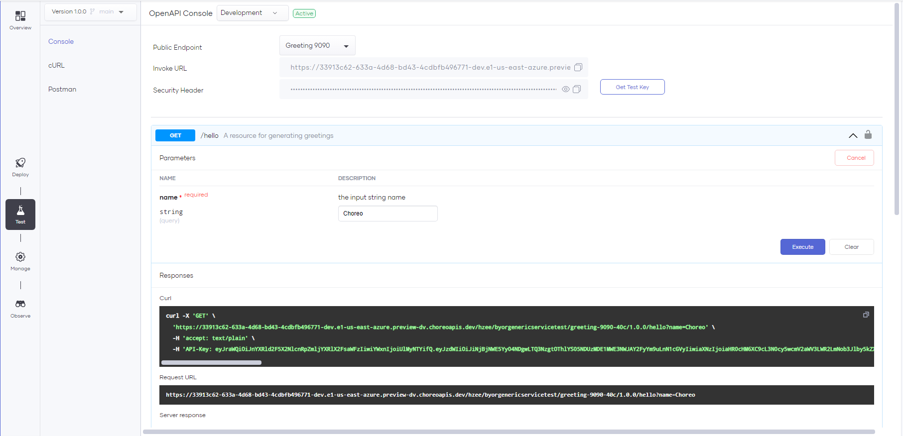
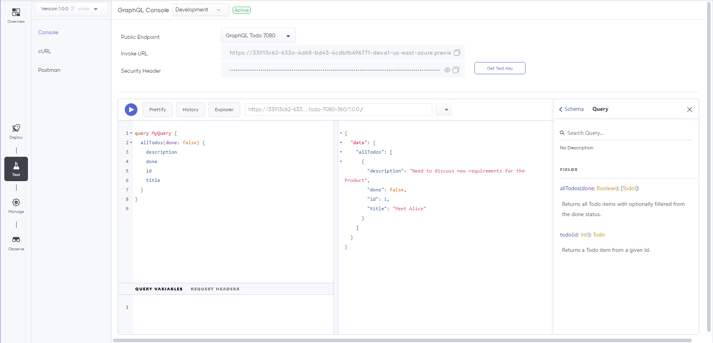

# Invoke APIs via Console

[Choreo Console](https://console.choreo.dev/) allows you to test your publicly exposed APIs. 
Once you have deployed a [Service](../develop/components/service.md) with public endpoint(s), it is ready to be tested. 

The Choreo Console supports the following endpoint API types for testing:

* REST APIs
* GraphQL APIs

You can follow the below steps to navigate to the test console:

1. Sign in to the Choreo Console at [https://console.choreo.dev/](https://console.choreo.dev/).

2. In the component list, click the Service component you want to test.

3. On the left navigation bar,  click  **Test** to open the **Test view**,

4. Click **Console** to open the test console.

5. From the **Environment** list, select the **Environment** you want to test. 

6. From the **Public Endpoint** list, select the required **Endpoint** 
    !!! note
        You can only see the endpoints that you have configured with **Public** networkVisibility.

## REST Endpoints

The OpenAPI Console is an interactive UI that guides you to test the REST Endpoints. 
Since Choreo uses OAuth2.0 authentication to secure REST APIs by default, The OpenAPI Console will generate test keys for you to test the APIs.

1. Expand the resource that you want to test.

2. Click **Try it out**.

3. Enter any parameter values if necessary.

4. Click **Execute**.

5. You can view the response body under Responses.

{.cInlineImage-full}

## GraphQL Endpoints

The GraphQL Console is an interactive UI that guides you to write queries and mutations to test the GraphQL Endpoints.
Since Choreo uses OAuth2.0 authentication to secure GraphQL APIs by default, The GraphQL Console will generate test keys for you to test the APIs.

1. Enter the API path and the query or mutation you want to test.

2. Click the **Play** Button.

!!! hint
    You can click the **Explorer** button to open the GraphQL **Explorer** and generate the required query or mutation for testing.

{.cInlineImage-full}
