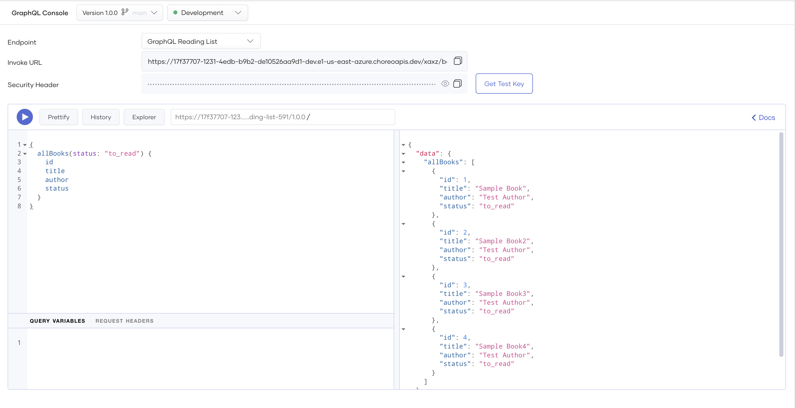

# Test GraphQL Endpoints via the GraphQL Console

Choreo provides an integrated GraphQL Console to test publicly exposed GraphQL endpoints of Service components you create and deploy. The GraphQL Console allows you to write queries and mutations interactively. As Choreo uses OAuth2.0 authentication by default to secure GraphQL APIs, the GraphQL Console generates test keys to test APIs.

Follow the steps below to test a GraphQL endpoint via the GraphQL Console:

1. Sign in to the [Choreo Console](https://console.choreo.dev/).

2. In the **Component Listing** pane, click on the component you want to test.

3. Click **Test** in the left navigation menu and then click **Console**. This opens the **GraphQL Console** pane.

4. In the **GraphQL Console** pane, select the environment from the drop-down list.

5. Select the required endpoint from the **Endpoint** list.

    !!! note
        - The **Network Visibilities** of an endpoint are set in the **component.yaml**. You can set any combination of **Public**, **Organization**, or **Project**.
        - If you have set the **Network Visibilities** of the endpoint in the **component.yaml** to **Public**, continue with step 7. 
        - If you have set the **Network Visibilities** of the endpoint in the **component.yaml** to **Organization**, the GraphQL endpoint will not be invokable from outside the organization. In this instance, for testing purposes, Choreo allows you to generate a temporay test URL that will be active for 15 minutes. Execute step 6 to generate the temporary URL. 
        
6. If the **Network Visibilities** of the endpoint contains **Organization**, click on **Generate URL** to generate a temporary test URL that will be active for 15 minutes. Else, skip this step. 

    !!! note
        The temporay test URL will be available **only for 15 minutes** and it will get expired after. You can deactivate the test URL by clicking on the **Deactivate URL** button.

    {.cInlineImage-full}

7. Enter the API path and the query or mutation you want to test.

8. Click the play icon.

    !!! tip
        If you want to generate a required query or mutation for testing via the GraphQL Explorer, click **Explorer** to open the GraphQL Explorer.
    
    !!! note
         GraphQL Explorer has a known issue causing improper construction of list inputs. To work around this, you must manually update the list input in the generated query before executing it.

    {.cInlineImage-full}
