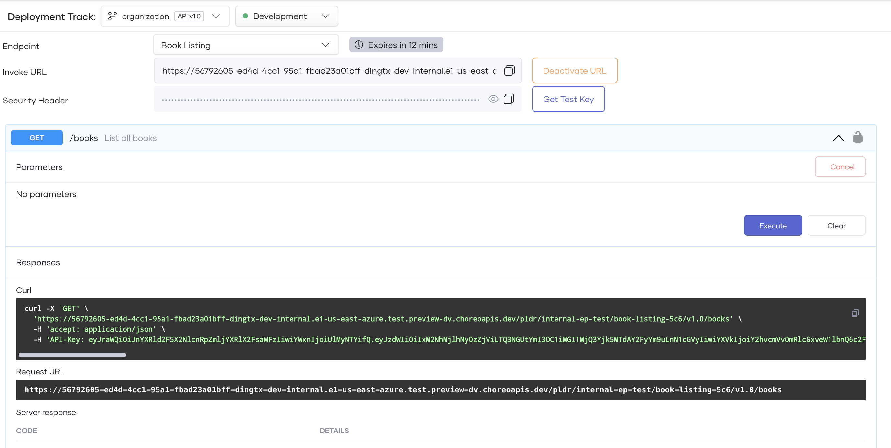

# Test REST Endpoints via the OpenAPI Console

Choreo provides an integrated OpenAPI Console to test REST endpoints of Service components that you create and deploy.
As Choreo uses OAuth2.0 authentication to secure REST APIs, the OpenAPI Console generates test keys to test APIs.

Follow the steps below to test a REST endpoint via the integrated OpenAPI Console:

1. Sign in to the [Choreo Console](https://console.choreo.dev/).

2. In the **Component Listing** pane, click on the component you want to test.

3. Click **Test** in the left navigation menu and then click **Console**. This opens the **OpenAPI Console** pane.

4. In the **OpenAPI Console** pane, select the environment from the drop-down list.

5. Select the required endpoint from the **Endpoint** list.

    !!! note
        - The **Network Visibility** of an endpoint is set in the **endpoints.yaml**. You can set it to **Public**, **Organization**, or **Project**.
        - If you have set the **Network Visibility** of the endpoint in the **endpoints.yaml** to **Public**, go to step 7. 
        - If you have set the **Network Visibility** of the endpoint in the **endpoints.yaml** to **Organization**, the GraphQL endpoint will not be invokable from outside the organization. In this instance, for testing purposes, Choreo allows you to generate a temporay test URL that will be active for 15 minutes. Execute step 6 to generate the temporary URL. 

6. If the **Network Visibility** of the endpoint is set to **Organization**, click on **Generate URL** to generate a temporary test URL that will be active for 15 minutes. Else, skip this step. 

    !!! note
        The temporary test URL will be available **only for 15 minutes** and it will get expired after. You can deactivate the test URL by clicking on the **Deactivate URL** button.

    {.cInlineImage-full}

7. Expand the resource you want to test.

8. Click **Try it out**.

9. Enter values for parameters if applicable.

10. Click **Execute**. You can see the response body under **Responses**.

    {.cInlineImage-full}
