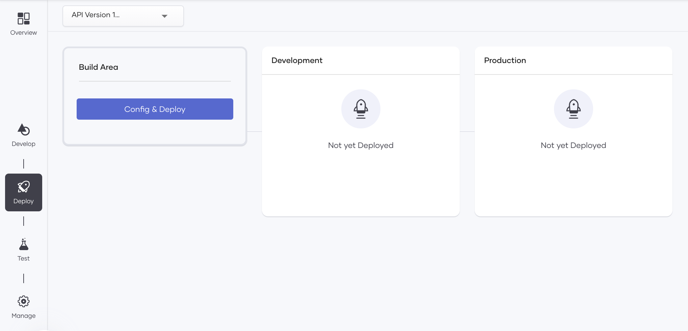
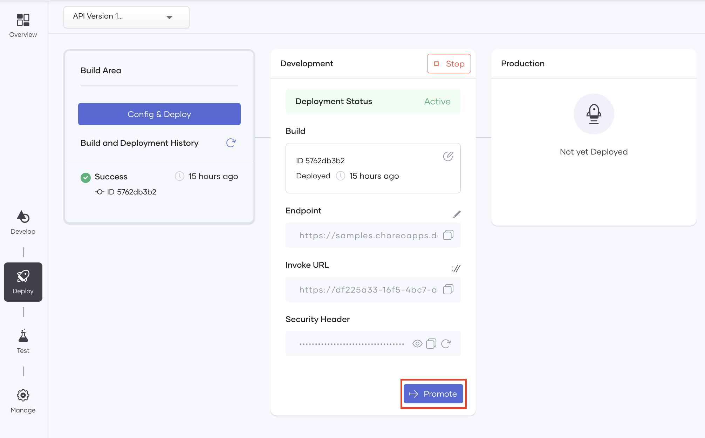
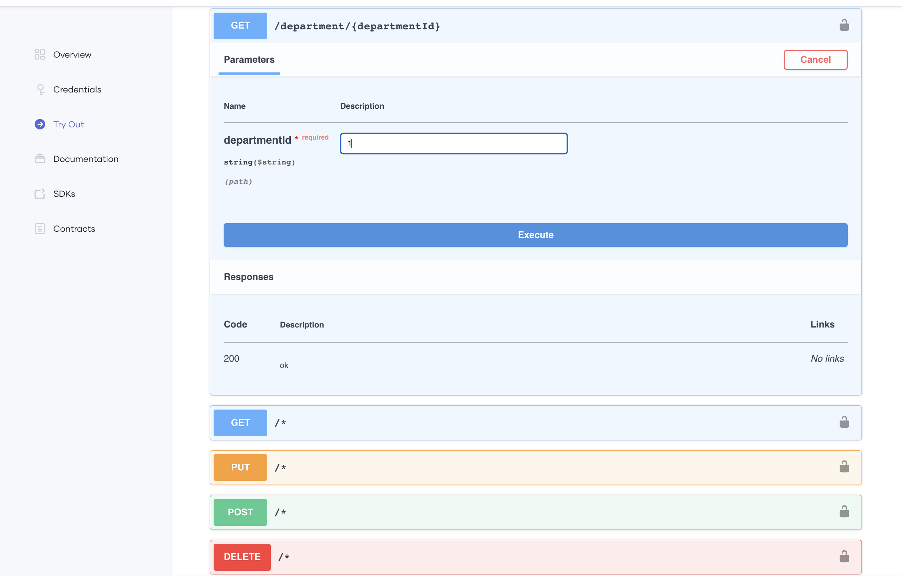
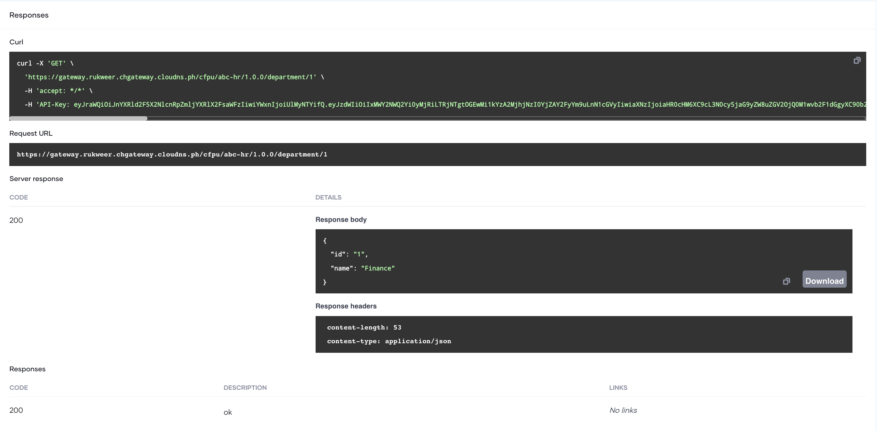
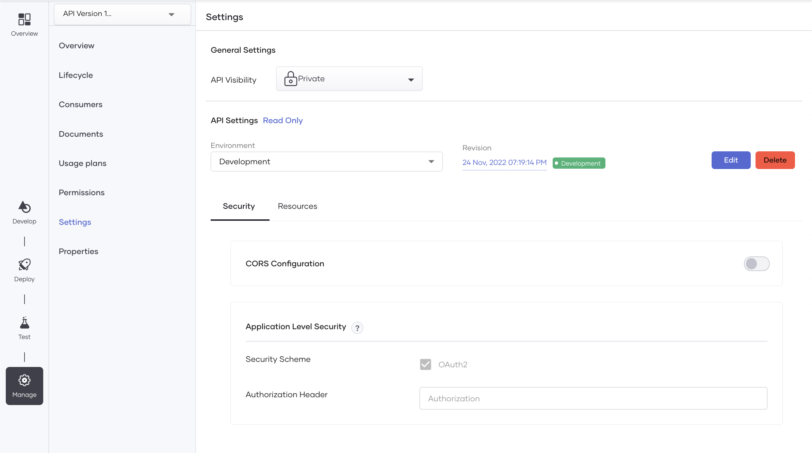
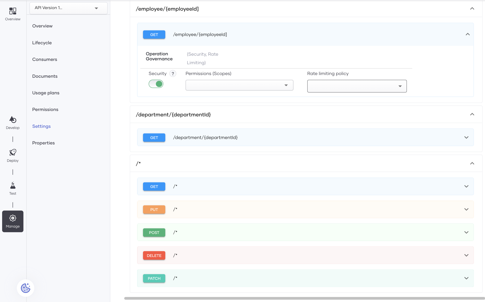
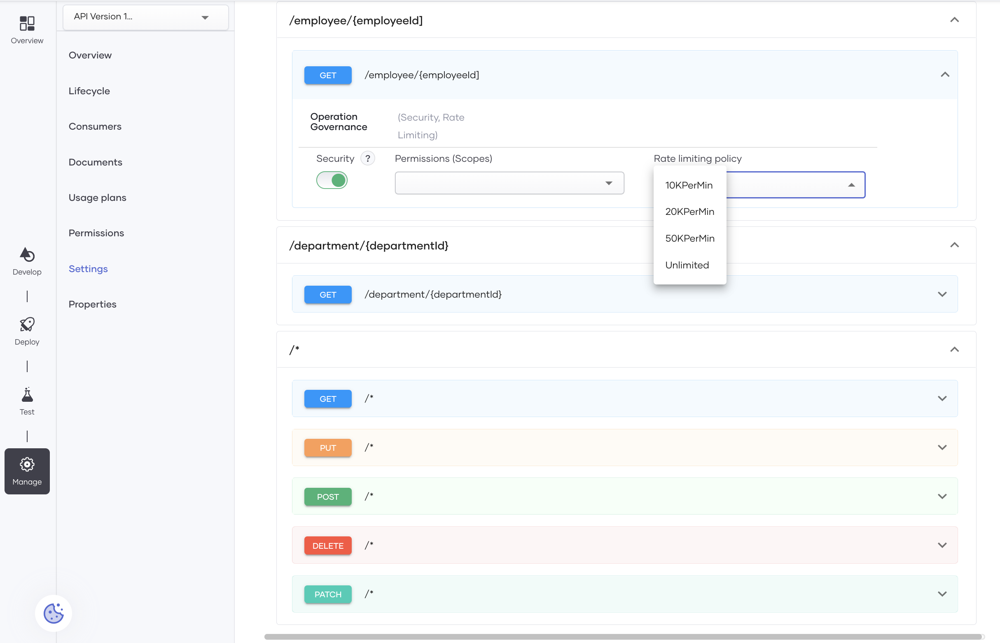
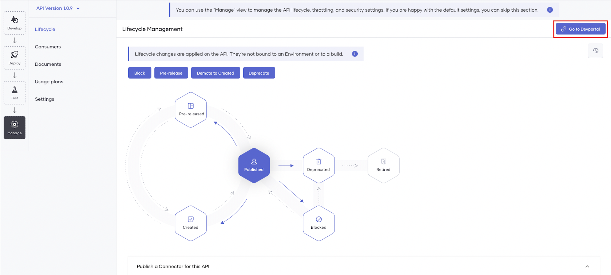

# Create Your First REST API Proxy

Choreo is a low-code cloud-native platform for building integration solutions. This tutorial explores API proxies supported by Choreo. An API proxy fronts an API, and it is the contact point for applications that need to consume the API.

To understand API Proxies, let's consider an organization with an existing unmanaged API for its Human Resources Management system. This organization wants to revamp the Human Resources Management system, but the existing API alone cannot ensure security for the backend and the application. To address this, you can create an API proxy and apply the necessary security and access-control policies etc.

In this tutorial, you will do the following to explore REST API Proxies in Choreo:

1. Expose an existing API by creating a REST API proxy
2. Deploy the REST API proxy
3. Test the REST API proxy to verify its functionality
4. Manage your REST API proxy by adding access control and security policies and leveraging the platform's API management capabilities.

!!!tip "Before you begin..."
    Familiarize yourself with REST API Proxies in Choreo. [REST API Proxies](../api-proxies.md) 

Let's begin...

## Step 1: Create a REST API Proxy

You can create a REST API proxy in one of the following methods: 

- Design a new REST API proxy using an existing endpoint. 
- Importing the OpenAPI specification of an existing API.

In this tutorial, you will be designing a new REST API proxy using an existing endpoint and creating a REST API proxy:

1. Sign in to the Choreo Console at [https://console.choreo.dev](https://console.choreo.dev).

2. Expand the project dropdown on the console header and click **+ Create New** to create a new project.

    {.cInlineImage-full}

3. Enter a unique name and description for your project and click **Create**. 

    You can now start adding components to your project. Let's add a REST API proxy component.

    !!! tip
        Once you create a project successfully, you are taken to the components landing page. You can also select the components icon from the left menu and open the **Components** landing page. 

4. On the **Components** landing page, click **Create**.

5. Click the **REST API Proxy** card.

6. Click **Design a new REST API**.

7. In the **REST API Proxy** dialog, enter the following information:

    | **Field**         | **Value**                                   |
    |-------------------|---------------------------------------------|
    | **API Name**      | `HR API`                                    |
    | **API Version**   | `1.0.0`                                     |
    | **API Base Path** | `cfpu/ abc-hr`                              |
    | **Endpoint**      | `https://samples.choreoapps.dev/company/hr` |

8. Click **Create**.

Choreo adds the API proxy with the default OpenAPI specification and opens it on a separate page.

## Step 2: Developing the REST API Proxy

Let's develop two new operations for the API proxy that you added as follows:

1. Under **Resources**, add a new resource to fetch the employee ID as follows:

    1. Select **GET** as the HTTP verb.
   
    2. Enter `/employee/{employeeId}` as the URI pattern.
   
    3. To add the new resource, click **+**.
   
    4. Once the resource is added, expand it, and then enter a name and a description for it as given below:

        | **Field**        | **Description**                   |
        |------------------|-----------------------------------|
        | **Operation ID** | `findEmployee`                    |
        | **Description**  | `Find an employee by employee ID` |
   
    5. Click **Save**.

3. Similarly, add another resource to fetch the department ID as follows:

    1. Select **GET** as the HTTP verb.

    2. Enter `/department/{departmentId}` as the URI pattern.

    3. To add the new resource, click **+**.
   
    4. Once the resource is added, expand it, and then enter a name and a description for it as given below:

        | **Field**        | **Description**                      |
        |------------------|--------------------------------------|
        | **Operation ID** | `findDepartment`                     |
        | **Description**  | `Find a department by Department ID` |
   
    5. Click **Save**.
   

## Step 3: Deploy the REST API Proxy

Deploying the REST API proxy makes it invokable. Choreo maintains two environments by default: development and production. [Learn more](../api-proxies/#choreo-environments). 

1. Return to the Choreo Console. From the left navigation, click **Deploy**. 

2. Let's deploy the REST API proxy to the development environment. Click **Config & Deploy** in the **Build Area** column.

    {.cInlineImage-full}

3. In the **Configure & Deploy** pane, click **Save & Deploy**.

4. Once you have deployed it to the development environment, you can test it. When it is ready for the production environment, you can return to this view and promote it by clicking **Promote** on the **Development** card.

    {.cInlineImage-full}

## Step 4: Test your REST API Proxy

In Choreo, you can test your REST API proxy before publishing it for consumers to use it. Choreo provides you with three modes to test your REST API proxy: 

- OpenAPI Console 
- cURL
- Postman

In this tutorial, let's use the inbuilt OpenAPI Console. 

1. Click **Test** from the left navigation menu.

2. Choreo uses OAuth 2.0 Therefore, you will notice the security header. Click **Get Test Key** to generate a new test key for testing purposes.

3. Let's invoke. Expand the **GET** resource with the **/department/{departmentId}** URI pattern.

    {.cInlineImage-full}

4. Click **Try it Out**.

5. In the **departmentId** field, enter `1`.

6. Click **Execute** and observe the response.

    {.cInlineImage-full}

You can test the resource with the `/employee/{employeeId}` URI pattern by following the same steps.

## Step 5: Manage your REST API Proxy

Now that you have a tested REST API proxy, let's publish it and make it available for application developers to consume.

### Step 5.1: Secure your REST API Proxy

First, let's review the security settings and add a rate limit to the API. 

1. Click **Manage** on the left navigation and click **Settings**.

2. Click **Security**. Review the security settings. If you wish to change the security settings, click **Edit** and make the necessary changes. Once the changes are confirmed, you can save them by clicking on **Save**.
   
    {.cInlineImage-full}

3. Next, let's add a rate-limiting policy to the API. Click **Resources**.

4. Click **Edit**.

5. Select **API Level** as the rate limiting level. Here, you are adding a rate-limiting policy to the entire API. You can also choose to apply rate limits per resource. [Learn more](../api-proxies/#settings)

    {.cInlineImage-full}

    {.cInlineImage-full}

6. Next, from the dropdown, select an appropriate rate limiting policy.

7. Click **Save**.

### Step 5.2: Apply usage plans on the REST API Proxy

Apply usage plans on the REST API proxy to allow API developers to select the suitable usage plan when subscribing to the REST API proxy.

1. Click **Usage Plans** from the left menu. 

2. Select **Bronze**, **Gold**, and **Unlimited**. 

3. Click **Save**.

### Step 5.3: Publish the REST API Proxy 

Publishing the REST API proxy makes it available for consumers to discover and subscribe to. 

1. Click **Lifecycle** from the left menu. 

2. Click **Publish**.

    A pop-up named **Publish a connector** appears. Creating a connector for this REST API proxy makes it available in the Marketplace. Let's skip publishing a connector for this REST API proxy. Click **No, Thanks**.

3. Click **Publish**.

    As a result, the status of the API changes to **Published**.

    To understand how a user can generate credentials for the API and then invoke it, proceed to the next step.

### Step 5.4: Invoke your REST API Proxy

Now your REST API proxy is ready to be consumed. An application developer can discover your REST API proxy, subscribe to it, and invoke it. 

#### Step 5.4.1: Generate Credentials

1. On the **Lifecycle Management** page, click **Go to DevPortal**.

    {.cInlineImage-full}

2. Once you sign in to the API Developer Portal, click **Credentials** in the navigator.

3. Click **Generate Credentials**. As a result, Choreo populates the **Consumer Key** and **Consumer Secret** fields with the newly generated tokens.

4. Click **://Curl**. Then copy the cURL command that is displayed.

    !!!info
        To copy the cURL command, always click the icon for copying. **Do not manually copy it**. The displayed cURL command is only a template, and it does not include the generated credentials.

5. Close the **Get cURL to Generate Access Token** card. Then click **Update**. 
    A message appears to confirm that the keys are successfully updated.
 
6. Replace `consumer-key` and `consumer-secret` with the consumer key and the consumer secret you generated in the API Developer Portal to generate an access token.

Now, let's try out the REST API proxy you created by invoking a resource. 

#### Step 5.4.2; Invoke the REST API Proxy

1. Click **Try out**.

2. Enter the following values:

    | **Field** | **Value** |
    |-----------------|-------------------------------|
    | **Environment** | `Development` |
    | **Access Token**| the generated access token in step 6. Alternatively, click **Get Test Key** to generate a test access token. |

3. Expand the **GET** resource **/department/{departmentId}**

4. Click **Try it out**.

5. Enter the **departmentId** value as `1`.

6. Click **Execute** and observe the response. 

Congratulations! You have successfully created your first REST API Proxy, deployed, developer tested, managed, and invoked it. 
