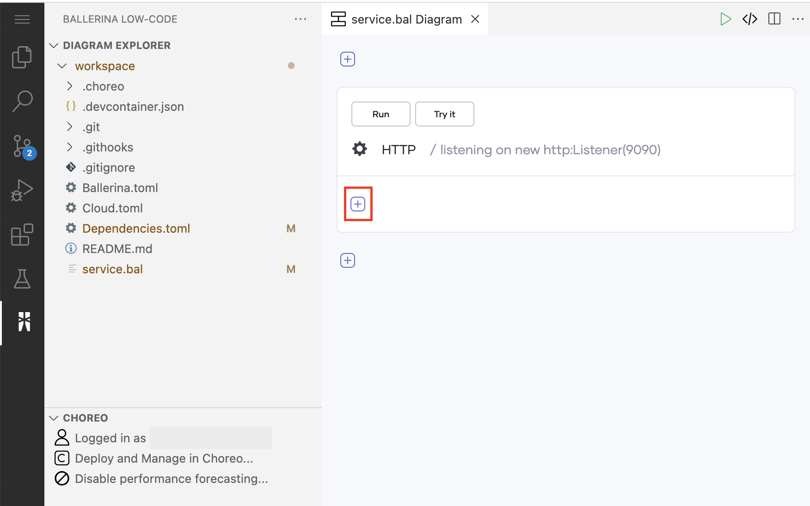
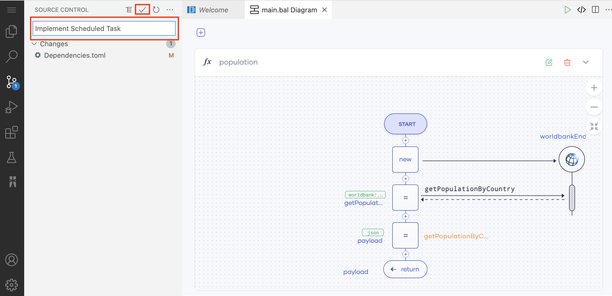

# Create Your First REST API

A RESTful API (Application Program Interface) uses HTTP requests to access and use data. The operations you can perform on data are GET (reading), PUT (updating), POST (creating), and DELETE (deleting).

The Web Editor of Choreo allows developers to design (and then implement) high-quality REST APIs easily. To explore this capability, let's consider a scenario where an analyst wants to retrieve the daily count of COVID-19 patients per one million population by country. In this tutorial, you will address this requirement by doing the following:

1. Design a REST API that addresses the described requirement, test it in the Web Editor, and then commit it to make it available in the Choreo Console.

2. Deploy the REST API you created to make it available for use.

3. Test the REST API after deploying it to check whether it works as expected.

## Step 1: Develop

In this section, let's develop an application to retrieve COVID-19-related statistics.

### Step 1.1: Create a project 

1. Sign in to the Choreo Console at [https://console.choreo.dev](https://console.choreo.dev).

2. In the **Projects** list, select **+ Create New**.

    {.cInlineImage-half}

3. Enter a unique name and a description for the project. For this tutorial, let's enter the following values:

       | **Field**       | **Value**                             |
       |-----------------|---------------------------------------|
       | **Name**        | `COVID-19Stats`                       |
       | **Description** | `Get statistics relating to COVID-19` |

4. Click **Create**. This takes you to the **Components** page.

### Step 1.2: Add a REST API component

Let's create a new REST API component as follows:

1. On the **Components** page, click **Create**.

2. Click the **REST API** card.

3. Click **Start from scratch**.

4. Enter a unique name and a description for the API. For this tutorial, let's enter the following values:

    | **Field**       | **Value**             |
    |-----------------|-----------------------|
    | **Name**        | `Statistics`          |
    | **Description** | `COVID-19 Statistics` |

    !!! tip
        Leave the following selections unchanged for this tutorial:</br></br>
         - The **Access mode** field allows you to select whether you want the REST API to be publicly accessible or to be accessible only within Choreo. By default, the API is publicly accessible.</br></br>
         - You can specify whether you want to save the REST API configuration in a Choreo-managed repository or a repository managed by you. The **Choreo-managed repository** option is selected by default.

5. Click **Create**. The `Statistics` REST API overview page opens with details of the API.

### Step 1.3: Design the REST API

Designing the REST API involves specifying how the REST API should function. Choreo comes with an online IDE based on Visual Studio Code to implement the functionality of your API. You have the flexibility to use the low-code or pro-code mode or even alternate between the modes during development.

In this tutorial, let's design the REST API by updating the low-code diagram as follows:

1. To open the REST API component in the Web Editor, click **Edit Code**.

    !!! info
        Opening the Web Editor may take a little while if you are a first-time user.

2. Remove the resource that is configured by default for the REST API by clicking its **Delete** icon.

    {.cInlineImage-half}

3. To add a new resource, click the **+** icon under the existing construct.

    {.cInlineImage-half}

    As a result, a pane named **Configure Resource** opens on the right of the page. In this pane, enter information as follows:

    | **Field**         | **Value**                |
    |-------------------|--------------------------|
    | **HTTP Method**   | `GET`                    |
    | **Resource Path** | `stats/[string country]` |
    | **Return Type**   | `json|error`             |

    Here, you are configuring a GET resource to fetch COVID-19 statistics.

    By adding `string country` within square brackets in the path, you are introducing `country` as a path parameter for which the value should be in the string format.

    The specified return type allows the REST API to return the output in either JSON or error format.

    Click **Save**.

    The low-code diagram of this resource opens.

4. To connect to the COVID-19 API and retrieve data, follow the sub-steps below:

    1. On the low-code diagram, click **+** under **Start**.

    2. In the **Add Constructs** pane that appears, click **Connector**.

        To search for the required connector and add it with changes, follow the steps below:

         1. Search for **COVID-19** and select the **COVID-19 by ballerinax** connector when it appears in the search results.

         2. Click **Save** to add the endpoint.

    3. To add a query parameter to the connector you added, click **+** below it.

        In the **Add Constructs** pane, click **Action**. The **Action** pane opens. Configure the action as follows:

        1. In the **Action** pane, click **covid19Ep**.

        2. Click **getStatusByCountry**.

        3. In the **Parameters** tab, check whether the **country** check box is selected. If not, select it.

            This adds `country` as a query parameter in the connector configuration to allow the REST API to fetch COVID-19 statistics specific to a given country.

        4. Update the action statement as follows:
        
            1. Double-click **`getStatusByCountryResponse`** variable name to edit it. Replace the default value with `statusByCountry`.
        
            2. Double-click **""**, and then click **Suggestions**. Click **country string**. Doing so specifies that the country for which the connector needs to fetch COVID statistics is the country you enter as the query parameter value.         
        
        5. Click **Save**.

    4. To extract the response of the **COVID-19** connector, add a variable by following these sub-steps.

        1. Click the last **+** in the low-code diagram.

        2. Click **Variable**. In the **Variable** pane that opens, configure the variable as follows:

            1. On the variable statement, click **`var`**, and then click **int** on the list that appears below in the **Suggestions** tab. Here, you are changing the variable type from `var` to `int`.

            2. To edit the variable name, double-click **`variable`**. Then enter `totalCases` as the variable name.

            3. Click <add-expression> and then click **statusByCountry** displayed in the list of suggestions. Here, you are selecting the **statusByCountry** query parameter you previously added to derive information related to a specific country.

                Update the expression further as follows:

                 1. In the list of second-level suggestions that appear in the **Suggestions** tab under **statusByCountry**, click **cases decimal**. Here, you are specifying that you want the total number of cases per country. The connector returns this information in `decimal` format.

                 2. To cast the total number of cases per country in `int` format instead of in `decimal` format, follow these sub-steps:

                     1. Click **Expressions**, and then click **`<type>`Es** under the **Type Cast** category.

                     2. On the variable statement, click **`<<add-type>>`**.

                     3. Click **Suggestions**, and click **int** in the list of suggestions.
                     
            4. Click **Save**.

               The statement should now be as follows:

               `<int>statusByCountry.cases`

    5. The REST API needs to further process the COVID-19 cases per country you derived to present the number of cases per one million people in the given country's population. Therefore, let's derive population statistics per country via the **World Bank** as follows:

        1. Click the last **+** in the low-code diagram.

        2. In the **Add Constructs** pane that opens, click **Connector**.

            To search for the required connector and add it with changes, follow the steps below:

            1. In the **Connectors** pane, search for World Bank, and select the **World Bank by ballerinax** connector when it appears in the search results.

            2. In the **Endpoint** pane that opens, click **Save** to add the endpoint.

        5. Click the last **+** in the low-code diagram (below the connector you added).

        6. In the **Add Constructs** pane, click **Action**.

        7. Click **worldbankEp** to define an action for the World Bank connector.

        8. Click **Get Country Population**. This allows you to fetch the population by country via the connector.

        9. In the **Parameters** tab, check whether the **countryCode** check box is selected. If not, select it.
       
            You are adding the `countryCode` query parameter to the World Bank connector configuration to fetch population statistics for the country that the REST API user specifies.
       
        10. Update the action statement as follows:
        
            1. Double-click **`getPopulationByCountryResponse`** which is the default query parameter name to edit it. Change it to `populationByCountry`.
            
            2. Double-click **""**, and then click **Suggestions**. Click **country string**. Doing so specifies that the country for which the connector needs to fetch population statistics is the country you enter as the query parameter value. 
        
        11. Click **Save**.

    6. The REST API needs to calculate the number of COVID-19 cases in every group of one million people in the specified country. Therefore, to calculate the number of groups with one million people in a country, add a variable as follows:

        1. Click the last **+** in the low-code diagram.

        2. In the **Add Constructs** pane, click **Variable**.

        3. In the variable expression, click **`var`**. In the list of suggestions that appear in the **Suggestions** tab, click **int**.

        4. Double-click **`variable`** which is the default variable name to edit it. Enter `populationMillions` as the new variable name.

        5. To derive the number of one million groups in a country's population, you must divide the total population by one million. Therefore, the expression you need to enter is `(populationByCountry[0]?.value ?: 0) / 1000000`. Let's add it as follows:

            1. Click **`<add-expression>`**.

            2. Click **Expressions** and under **Arithmetic**, click **Es / En** to add the expression template for a division.

            3. Double-click the first **`<add-expression>`** (the dividend) and enter the following as the expression:

                ```
                (populationByCountry[0]?.value ?: 0)
                ```

            4. Double-click the second **`<add-expression>`** (the divisor) and enter `1000000` as the expression.

            5. Click **Save**.

    7. To calculate the number of COVID-19 cases in each group of one million, add another variable as follows:

        1. Click the last **+** in the low-code diagram.

        2. Click **Variable**.

        3. On the variable statement, click **`var`**, and click **decimal** in the list of suggestions that appear in the **Suggestions** tab.

        4. Double-click **`variable`**, and enter `totalCasesPerMillion` as the variable name.

        5. The expression to calculate the number of COVID-19 cases in each group of one million is `totalCases / populationMillions`. Let's add it as follows:

            1. Click **`<add-expression>`** and click **Expressions**.

            2. Under **Arithmetic**, click **Es / En**. You will get the template for a division (i.e., **`<add-explression> / <add-expression>`**).

            3. Click the first **`<add-expression>`** (the dividend) and click **Suggestions**. In the list of suggestions, click **totalCases**.

            4. Click the second **`<add-expression>`** (the divisor) and click **populationMillions** in the list of suggestions.

            5. The values for `totalCases` and `populationMillions` variables are currently in integer format. Therefore, the value of the `totalCasesPerMillion` variable derived from those variables is also in the integer format. To convert it to decimal, follow these sub-steps:

                1. Select both expressions.

                2. Click **Expressions**, and under the **Type Cast** category, click **`<type>`Es**.

                3. Click **Suggestions** and in the list of suggestions, click **decimal**.

            6. Click **Save**.

    8. To generate the payload, add a variable as follows:

        1. Click the last **+** in the low-code diagram.

        2. Click **Variable**.

        3. On the variable statement, click **`var`**, and click **json** in the list of suggestions.

        4. Double-click **`variable`**, and enter `payload` as the variable name.

        5. Click **`<add-expression>`**.

        6. To add the expression as a key-value pair, click **Expressions**, and under the **Structural Constructors**, click **{ key : value }**.

        7. Double-click **`key`** to edit it, and enter `country` as the key.

        8. Double-click **`<add-expression>`**, and click **Suggestions**. In the list of suggestions, click **country**.

        9. To add another key-value pair, click **+** after the key-value pair you added in the previous step.

        10. Double-click **`key`** to edit it, and enter `totalCasesPerMillion` as the key.

        11. Double-click **`<add-expression>`**, and click **Suggestions**. In the list of suggestions, click **totalCasesPerMillion**. Now the expression you constructed should look as follows:

             `{country : country, totalCasesPerMillion : totalCasesPerMillion}`

        12. Click **Save**.

    9. Now you can add a return statement to return the payload as follows:

        1. Click the last **+** in the low-code diagram.

        2. Click **Return**.

        3. Click **`<add-expression>`**, and in the list of suggestions, click **payload**.

        4. Click **Save**.


Now you have completed designing the `Statistics` REST API.

The low-code diagram looks as follows:

{.cInlineImage-half}

The code view looks as follows:

```ballerina
import ballerinax/worldbank;
import ballerinax/covid19;
import ballerina/http;

# A service representing a network-accessible API
# bound to port `9090`.
service / on new http:Listener(9090) {

    resource function get stats/[string country]() returns json|error {

        covid19:Client covid19Ep = check new ();
        covid19:CovidCountry statusByCountry = check covid19Ep->getStatusByCountry(country = country);
        int totalCases = <int>statusByCountry.cases;
        worldbank:Client worldbankEp = check new ();
        worldbank:IndicatorInformation[] populationByCountry = check worldbankEp->getPopulationByCountry(countryCode = country);
        int populationMillions = (populationByCountry[0]?.value ?: 0) / 1000000;
        decimal totalCasesPerMillion = <decimal>totalCases / populationMillions;
        json payload = {
            country: country,
            totalCasesPerMillion: totalCasesPerMillion
        };
        return payload;
    }
}
```
Now you can run the REST API and test it to see whether it works as expected.


### Step 1.4: Run and test the REST API

Let's run the REST API you designed in the Web Editor to check whether it can be started successfully without errors.

1. Click **Run** (above the low-code diagram).

    Once the REST API is successfully started, the following appears in the terminal log.

     ```
     Running executable
     ```
   Now you can try out the REST API.

2. Click **Try it**. As a result, a test view opens on the right of the page.

3. In the test view, expand the **GET** resource.

4. Click **Try it out**.

5. In the **country** field, enter `USA`.

6. Click **Execute**.

    A response is displayed as follows in the **Response body** field under **Responses**.

     {.cInlineImage-half}

The REST API you created works as expected. Therefore, now you can commit the REST API configuration to GitHub.

### Step 1.5: Commit the REST API to GitHub

The REST API you designed is currently available only in the Web Editor. To use it, you need to save it in the Choreo Console. You can do this by committing the REST API configuration into a private repository in GitHub that is maintained by Choreo as follows:

1. Click **Sync with Choreo Upstream** in the bottom pane of the page (highlighted in red).

    In the message that appears, click **Sync my changes with Choreo**.

2. In the left pane, enter a commit message (e.g., `Implement REST API`) and click the tick.

    {.cInlineImage-full}

    Select **Yes** in the message that appears to specify that you need the changes to be staged.

3. To push the changes to the private GitHub repository maintained by Choreo, click **0↓ 1↑** in the bottom pane.

    !!! info
        This icon appears only after the committing process is completed.

    {.cInlineImage-full}

Once the changes are successfully pushed to the GitHub repository, the Web Editor indicates by displaying the text **In sync with Choreo upstream** for the `service.bal` file.
   
Now you have designed, tested, and committed the REST API configuration to GitHub. The next step is to deploy the REST API.

## Step 2: Deploy

To deploy the REST API, follow the steps below:

1. Go back to the Choreo Console and click **Deploy** in the left navigation menu.
   
2. In the **Build Area** card, click **Build and Deploy**.

Once the API is deployed, the **Development** card indicates that the API is active as shown below.

{.cInlineImage-full}

Now you can test the deployed REST API to verify whether it works as expected.

## Step 3: Test

Once you deploy the REST API you can test it via the OpenAPI Console, a cURL command, or Postman.

In this tutorial, let's test via the OpenAPI Console:

1. To open the test view, click **Test** in the **Development** card. Alternatively, you can click **Test** in the left navigation menu.

2. Click to expand the **GET** resource and then click **Try it out**.

3. In the **country** field, enter `USA`.

4. Click **Execute**.

    The following is displayed as the response body under **Responses**.

     {.cInlineImage-half}

Congratulations! You have now successfully created and tested a REST API in Choreo!

## Step 4: Manage

Now that you have a tested REST API, you can manage the API by applying necessary security settings, rate limits, usage plans and so on. Then you can publish the REST API to make it available for application developers to consume.
   
### Step 4.1: Apply security settings to the API

To review and make necessary changes to the API security settings, follow this procedure:

1. Click **Manage** in the left navigation menu and then click **Settings**.

2. To review and change security settings, click the **Security** tab.

3. Review the security settings and click **Edit** if you want to make changes to the security settings. Once the changes are confirmed, you can click **Save**. In this tutorial, let's leave the default security settings.
    {.cInlineImage-full}

### Step 4.2: Apply usage plans on the API

You can apply usage plans on the API so that API developers can select an appropriate usage plan when subscribing to the API. To apply usage plans, follow this procedure:

1. Click **Manage** in the left navigation menu and then click **Usage Plans**. 

2. Select **Bronze**, **Gold**, and **Unlimited**. 

3. Click **Save**.

### Step 4.3: Publish the API

Follow this procedure to publish the API to the API Developer Portal so that external consumers can view and consume the API:

1. Click **Manage** in the left navigation pane, and then click **Lifecycle**.

2. On the **Lifecycle Management** page, click **Publish**. This displays a message asking whether you want to publish the REST API as a  client connector. For this tutorial, click **No, Thanks**.

3. To view the published API in the API Developer Portal, click **Go to Devportal**.

Now the REST API is published and ready to be consumed. Next, let's see how an application developer can generate credentials for the API and invoke it.

### Step 4.4: Invoke the API

Follow this procedure to invoke the REST API via the API Developer Portal:

1. In the left navigation menu of the API Developer Portal, click **Credentials**.

2. On the **Credentials** page, click **Generate Credentials**. Choreo creates credentials for an internal application and subscribes this API to that internal application.

     {.cInlineImage-full}

3. On the **Credentials** page, click **Generate Access Token**, copy the generated access token, and click **Close**.

     {.cInlineImage-full}

4. In the left navigation menu, click **Try Out**. 

5. Paste the copied access token in the **Access Token** field.

6. Click the `GET` resource to expand it, and then click **Try it out**.

5. In the **country** field, enter `USA`.

6. Click **Execute**. You'll see the response from the API.

Now you have successfully invoked the REST API.

## Step 5: Observe

Choreo allows you to visualize and monitor the performance of your API deployed on Choreo. Choreo has in-built support for viewing the overall status, latencies, throughput data, diagnostic data, and logs. Developers can efficiently detect and troubleshoot anomalies in REST APIs using  Choreo Observability.

To learn more about how to observe the REST API, see [Observability](../observability/observability-overview.md).

## Step 6: View business insights

When your API is in production, you can analyze it to understand its usage.

To learn more about how you can view insights and analyze statistics, see [Business Insights](../insights/view-api-insights.md).
