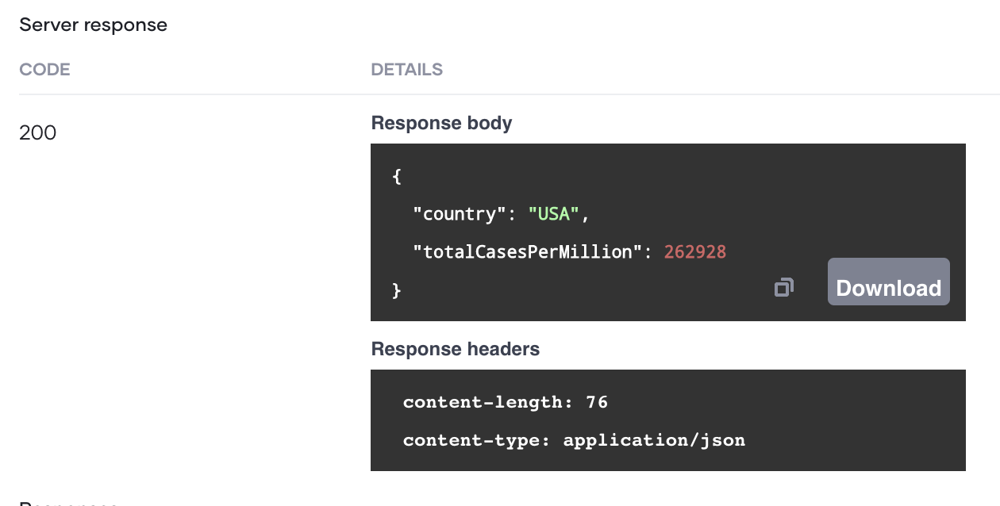

# Create Your First REST API

A RESTful API (Application Program Interface) uses HTTP requests to access and use data. The operations you can perform on data are GET (reading), PUT (updating), POST (creating), and DELETE (deleting).

Choreo’s low-code editor allows developers to easily design (and then implement) high-quality REST APIs. To explore this capability, let's consider a scenario where an Analyst needs to retrieve the daily count of COVID-19 patients per one million population by country. In this tutorial, you will address this requirement by doing the following:

- Design a REST API that addresses the described requirement, test it in the VS Code Editor, and then commit it so that it is available in the Chore Console.
- Deploy the REST API you created to make it available for use.
- Test the REST API after deploying it to check whether it works as expected.

## Step 1: Develop

In this section, let's develop the application that retrieves COVID-19 related statistics.

### Step 1.1: Create a project and add a REST API component

1. Sign in to the Choreo Console at [https://console.choreo.dev/](https://console.choreo.dev/).

2. Expand the drop-down menu for projects and click **+ Create New**.

    {.cInlineImage-full}

3. Enter the name and the description for the project as follows:

    | **Field**       | **Value**                             |
    |-----------------|---------------------------------------|
    | **Name**        | `COVID-19Stats`                       |
    | **Description** | `Get statistics relating to COVID-19` |

4. Click **Create**.

    This takes you to the **Components** page shown below.

   {.cInlineImage-full}

### Step 1.2: Add a REST API component

Let's create a new REST API component as follows:

1. On the **Components** page, click **Create**.

2. Click on the **REST API** card.

3. Click on **Create an API from scratch**.

4. Enter a name and a description for the API as follows:

    | **Field**       | **Value**             |
    |-----------------|-----------------------|
    | **Name**        | `Statistics`          |
    | **Description** | `COVID-19 Statistics` |

5. Click **Create**.

The `Statistics` REST API opens on a separate page.

### Step 1.3: Design the REST API

Designing the REST API involves specifying how the REST API should function by adding and configuring the required connectors and statements. You can do this by editing the low-code diagram of the REST API or by editing its code. 

In this tutorial, let's design the REST API by updating the low-code diagram as follows:

1. To open the REST API component in the Web Editor, click **Edit Code**.
    
    !!! info
        Opening the Web Editor may take a little while if you are a first-time user.

2. Remove the resource that is configured by default for the REST API by clicking its **Delete** icon.

   {.cInlineImage-half}

3. Add a new resource by clicking the **+** icon under the existing construct.

   {.cInlineImage-half}

    Then click **Resource**. 

    As a result, a panel named **Configure Resource** appears on the right of the page. In this panel, enter information as follows:

     | **Field**       | **Value**                |
     |-----------------|--------------------------|
     | **HTTP Method** | `GET`                    |
     | **Path**        | `stats/[string country]` |
     | **Return Type** | `json|error?`            |

    Here, you are configuring a GET resource to fetch statistics related to COVID-19.

    By adding `string country` within square brackets in the path, you are introducing `country` as a path parameter for which the value should be in the string format.

    The specified return type allows the REST API to return the output in either JSON or error? format.

    Click **Save**.

    The low-code diagram of this resource opens.

4. To connect to the COVID-19 API and retrieve data, follow the sub-steps below:

    1. Click **Connector** to add a connector. Then search for the COVID-19 connector, and click on it once it appears in the search results.

    2. In the **Connector** panel, `covid19Client` as the **Connection Name** and click **Continue to Invoke API**.

    3. In the **Covid19 API Connection** window, enter `covid19Client` as the **Connection Name** and click **Continue to Invoke API**.

    4. In the **Operation** drop-down list, select **getStatusByCountry** and enter details as follows in the other fields:

       | **Field**                  | **Value**         |
       |----------------------------|-------------------|
       | **Country**                | `country`         |
       | **Response Variable Name** | `statusByCountry` |

    5. Click **Save**.

6. Now let’s extract the total case count from the response and store it in a variable. Follow this procedure:

    1. Click the last **+** icon in the low-code diagram.

    2. Under **Statements**, select **Variable** and enter details as follows:

       | **Field**         | **Value**                     |
       |-------------------|-------------------------------|
       | **Variable Type** | `int`                         |
       | **VariableName**  | `totalCases`                  |
       | Expression        | `<int>statusByCountry.cases`  |

    3. Click **Save**.

6. To retrieve the population data, connect to the World Bank API as follows:

    1. Click the last **+** icon in the low-code diagram.

    2. Click **Connector** to add a connector. Then search for the World Bank connector, and click on it once it appears in the search results.

    3. In the **Connector** panel that appears on the right of the page, enter `worldBankClient` as the **Connection Name** and click **Continue to Invoke API**.

    4. In the **Operation** drop-down list, select **getPopulationByCountry** and enter details as follows in the other fields:

        | **Field**                  | **Value**            |
        |----------------------------|----------------------|
        | **Country Code**           | `country`            |
        | **Response Variable Name** | `populationByCountry`|

    5. Click **Save**.

    6. Now let’s extract the population value from the response, calculate the population in millions, and store it in a variable. To do this, follow this procedure:

        1. Click the last **+** icon in the low-code diagram.

        2. Under **Statements**, select **Variable** and enter details as follows:

            | **Field**         | **Value**                                         |
            |-------------------|---------------------------------------------------|
            | **Variable Type** | `int`                                             |
            | **Variable Name** | `populationMillions`                              |
            | Expression        | `(populationByCountry[0]?.value ?: 0) / 1000000`  |

        3. Click **Save**.

7. Now let’s calculate the total COVID-19 case count per million in the population based on the COVID-19 statistics and the population data you have retrieved. Follow this procedure:

    1. Click the last **+** icon in the low-code diagram.

    2. Under **Statements**, select **Variable** and enter details as follows:

        | **Field**         | **Value**                                    |
        |-------------------|----------------------------------------------|
        | **Variable Type** | `decimal`                                    |
        | **Variable Name** | `totalCasesPerMillion`                       |
        | Expression*       | `<decimal>(totalCases / populationMillions)` |

    3. Click **Save**.

8. To build the JSON payload with data of the total cases per million in the population, add a variable.

    Click the last **+** icon in the low-code diagram and click **Variable**. Then enter information as follows:

     | **Field**         | **Value**                     |
     |-------------------|-------------------------------|
     | **Variable Type** | `json`                        |
     | **Variable Name** | `payload`                     |
     | Expression        | `{country : country, totalCasesPerMillion : totalCasesPerMillion}` |
     
     Click **Save**.

9. To respond with the JSON payload, add a `Return` statement.

    Click the last **+** icon in the low-code diagram and click **Return**.

    In the **Return Expression** field, enter `payload`.

    Click **Save**.

Now you have completed designing the `CovidStatus` service.

The low-code diagram looks as follows:

 {.cInlineImage-half}

The code view looks as follows:

```ballerina
import ballerinax/worldbank;
import ballerinax/covid19;
import ballerina/http;

service /CovidStats on new http:Listener(9090) {
    resource function get stats/[string country]() returns json|error {
        covid19:Client covid19Client = check new ({});
        covid19:CovidCountry statusByCountry = check covid19Client->getStatusByCountry(country);
        int totalCases = <int>statusByCountry.cases;
        worldbank:Client worldbankClient = check new ({});
        worldbank:IndicatorInformation[] populationByCountry = check worldbankClient->getPopulationByCountry(country);
        int populationMillions = (populationByCountry[0]?.value ?: 0) / 1000000;
        decimal totalCasesPerMillion = <decimal>(totalCases / populationMillions);
        json payload = {country: country, totalCasesPerMillion: totalCasesPerMillion};
        return payload;
    }
}
```
Now you can run the REST API and test it to see whether it works as expected.

### Step 1.4: Run and test the REST API 

Let's run the REST API you designed in the VS Code Editor to check whether it can be started successfully without errors.

1. Click **Run** (above the low-code diagram).

    Once the REST API is successfully started, the following appears in the terminal log.

    ```
    Running executable
    ```
    Now you can try out the REST API.

2. Click **Try it**. As a result, a test view opens on the right of the page.

3. In the test view, expand the **GET** resource.

4. Click **Try it out**.

5. In the **country** field, enter `USA`.

6. Click **Execute**.

A response is displayed as follows in the **Response body** field under **Responses**.

{.cInlineImage-half}

The REST API you created works as expected. Therefore, now you can commit it.

### Step 1.5: Commit the REST API to GitHub

The REST API you designed is currently available only in the Web Editor. To use it, you need to save it in the Choreo Console. You can do this by committing the REST API configuration into a private repository in GitHub that is maintained by Choreo as follows:

1. Click **Sync with Choreo Upstream** in the bottom panel of the page (highlighted in red). In the message that appears as a result, click **Sync my changes with Choreo**.

2. In the left panel, enter a commit message (e.g., `Implement REST API`) and click on the tick.

    {.cInlineImage-half} 

    Select **Yes** in the message that appears to specify that you need the changes to be staged.

3. To push the changes to the GitHub repository, click on the GitHub action menu (marked in the image below), and then click **Push**.

    {.cInlineImage-half}

Once the changes are successfully pushed to the GitHub repository, the VS Code Editor indicates by displaying the text **In sync with Choreo upstream** for the `service.bal` file.

## Step 2: Deploy

Once you have designed, tested, and committed the REST API, you need to deploy it so that users can invoke it.

To deploy the API, follow the steps below:

1. Click the **Deploy** icon. Then in the **Build Area** card, click **Deploy**.

    {.cInlineImage-full}

2. To check the progress of the deployment, click **View Logs**

    {.cInlineImage-full}

Once the API is deployed, the **Development** card indicates that the API is active as shown below.

{.cInlineImage-full}

Now you can test your deployed REST API to check again whether it is working as expected.

## Step 3: Test

Once you have deployed the Choreo application you can test it via the Open API Console, a cURL command, or Postman.

In this tutorial, let's test via the Open API Console:

1. To open the test view, click **Test** in the **Development** card. Alternatively, you can click on the **Test** tab.

2. Click **Try it out**.

3. In the **country** field, enter `USA`.

4. Click **Execute**.

The following is displayed as the response body under **Responses**.

{.cInlineImage-full}

Congratulations! You have now successfully created and tested a REST API in Choreo!

## Step 4: Manage

Once you have successfully deployed your API and tested it, you can perform the following actions for it

- Manage the lifecycle: You can publish your API to the Developer Portal to make it available for public use, or deploy it as a prototype so that users can try it out and provide feedback for improvement. Once you publish an API, you can deprecate it or block it from being used if required.

- Validate subscriptions: You can configure subscription validation to mandate subscriptions.

- Add documents: This involves attaching files with information about the API for users.

- Select/switch usage plans: You can select a usage plan for your API out of `Bronze` `Silver`, `Gold`, and `Unlimited` based on the level of traffic that you expect the API to receive. You can change the usage plan when required.

- Update API settings.
