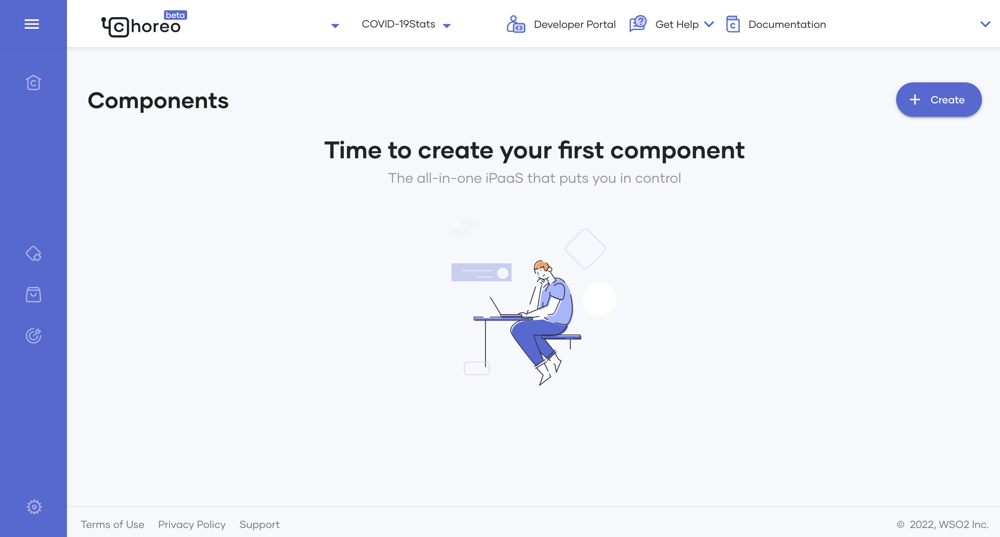
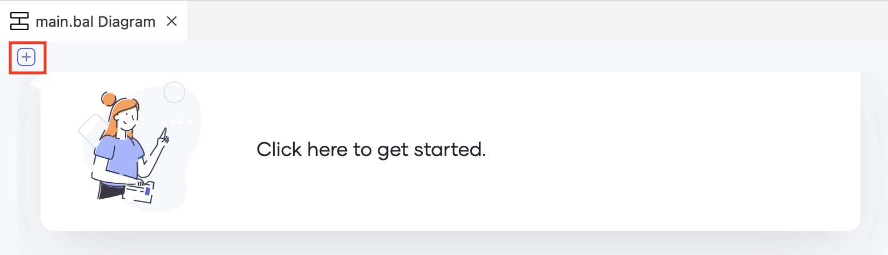
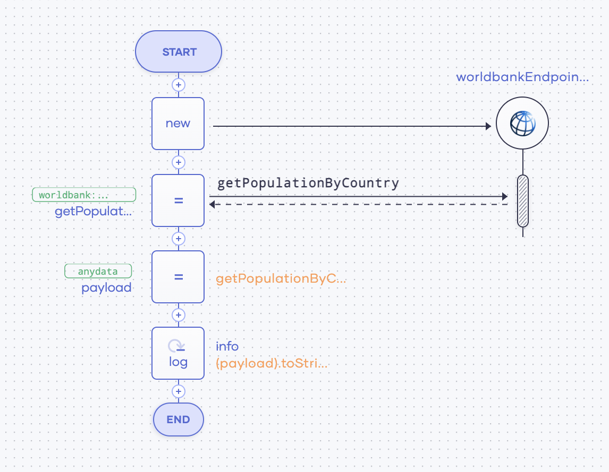
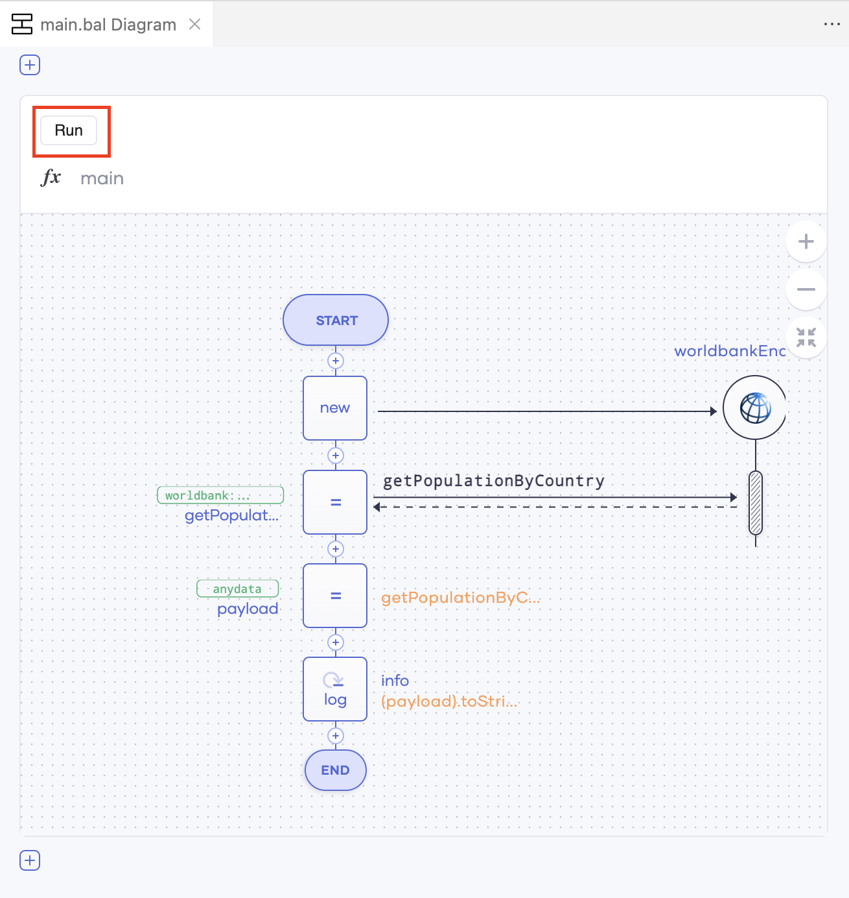
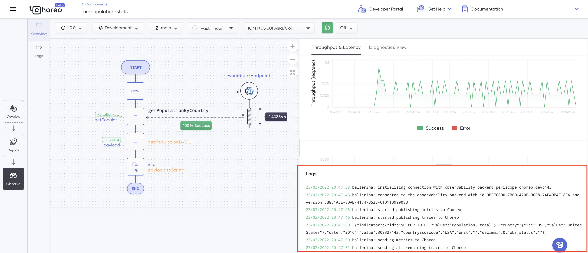

# Create Your First Scheduled Task

A scheduled task is a routine task at a given time interval. The following are a few examples:

- Routinely carrying out a health check of a machine
- Daily presenting the number of COVID-19 cases reported for the day
- Logging the hourly sales total of an online store

Choreo’s low-code editor allows you to easily design complex processes to be carried out routinely. Once the design is implemented, you can schedule them by specifying the time interval at which they need to be carried out.

To try it out, let's consider a scenario where a statistician needs to monitor the USA population every two minutes to present an analysis. In this tutorial, you will address this requirement by doing the following:

- Designing and implementing the process to capture the required statistics
- Setting the time interval at which the scheduled task needs to run
- Observing whether the scheduled task is functioning as expected

## Step 1: Develop

In this section, let's design and implement the process that captures the population of the USA every two minutes.

### Step 1.1: Create a new project and add a Scheduled Task component

First, let's create a new project and add a Scheduled Task component to it as follows:

1. Sign in to the Choreo Console at [https://console.choreo.dev/](https://console.choreo.dev/).

2. Expand the drop-down menu for projects and click **+ Create New**.

    {.cInlineImage-full}

    Enter the name and the description for the project as follows:

    | **Field**       | **Value**                                             |
    |-----------------|-------------------------------------------------------|
    | **Name**        | `USPopulationStats`                                   |
    | **Description** | `Routinely retrieves statistics on the US population` |

    Then click **Create**.

    This takes you to the **Components** page shown below.

    {.cInlineImage-full}

3. Add a component as follows:

    1. On the Components page, click **Create**, and then click **Scheduled Task**.

    2. In the **Name** field, enter `us-population-stats` and click **Next**. The **Scheduled Task** dialog box opens.

    3. For this tutorial, let's create the scheduled task configuration in a Choreo-managed repository. Therefore, leave the **Choreo-managed repository** selected (as by default) and click **Create**.
       
    As a result, this Scheduled Task component opens on a separate page.

### Step 1.2: Design the scheduled task

Let's design the functionality of the scheduled task by following this procedure:

1. To design the process that the scheduled task needs to carry out, click **Edit Code**. This opens the Web Editor in which you can develop the scheduled task in low-code or pro-code.

    !!! info
        Opening the Web Editor may take a little while if you are a first-time user.

    The low-code diagram that you can see in the Web Editor is the default scheduled task configuration created by Choreo.

2. To remove the construct of the default scheduled task configuration (which is of the `Main` type), hover over it until two icons appear for editing and deleting as shown in the image below.

    {.cInlineImage-half}

    Once they appear, click the icon for deleting.

3. Let's start creating the scheduled task by adding a construct of the `Main` type. To do this, click on the plus icon shown in the image below:

    {.cInlineImage-half}

    Click **Main**.

    In the panel that appears on the right of the page, click **Save** to proceed with the default settings.

4. To define the functionality of the scheduled task, you can update the low-code diagram that appears below the construct you added.

    You can start the design by adding and configuring the World Bank connector in Choreo so that you can extract the population of the United States using it. To add it, follow this procedure:

    1. Click **Connector**.
   
    2. In the **Connectors** panel that opens on the right of the page, search for `World Bank by ballerinax`.
   
        When the **World Bank by ballerinax** connector appears in the search results, click on it.
   
    3. In the **Connector** panel that appears on the right of the page, click **Continue to Invoke API**.
   
    4. To get the population of a specific country, select **getPopulationByCountry** in the **Operation** field.
   
    5. To specify the USA as the country for which the population data should be fetched, enter `"USA"` in the **CountryCode** field.
   
    6. Click **Save**.
   
5. Let's add a variable to get the output of the World Bank connector by following the procedure below:

    1. Click the last **+** icon in the low-code diagram, and then click **Variable**.
   
    2. In the **Variable** panel that opens on the right of the page, enter the following information:

        | **Field**            | **Value**                        |
        |----------------------|----------------------------------|
        | **Variable Type**    | `anydata`                        |
        | **Variable Name**    | `payload`                        |
        | **Value Expression** | `getPopulationByCountryResponse` |
   
        The expression refers to the `getPopulationByCountryResponse` variable from the World Bank connector.

    3. Click **Save**.

6. Now let's add a log statement to log the payload generated via the last variable as follows:

    1. Click the last **+** icon in the low-code diagram.

    2. Click **Log** to add a log statement.
   
    3. In the **Expression** field, enter `payload.toString()`. This gets the value of the `payload` variable statement you added, converts it to a string format, and logs it.
   
    4. Click **Save**.

Now you have completed designing the functionality of the scheduled task.

The low-code diagram looks as follows:

{.cInlineImage-half}

The pro-code view looks as follows:

!!! tip
    To access the pro-code view, click the **<**/**>** icon.

```
import ballerina/log;
import ballerinax/worldbank;

public function main() returns error? {

    worldbank:Client worldbankEndpoint = check new ({});
    worldbank:IndicatorInformation[] getPopulationByCountryResponse = check worldbankEndpoint->getPopulationByCountry("USA");
    anydata payload = getPopulationByCountryResponse;
    log:printInfo((payload).toString());
}
```

### Step 1.3: Run the scheduled task

To check whether the scheduled task is executable, click **Run**.

{.cInlineImage-half}

If the scheduled task configuration is free of errors, the following appears in the terminal log.

 ```
 Running executable
 ```

### Step 1.4: Sync changes with Choreo Console

The scheduled task configuration you created is currently only saved in the Web Editor. To deploy it and run it, you need to push this configuration to the Choreo Console by saving it in a GitHub repository. To do this, follow this procedure:

!!! info
    You are saving the scheduled task in a Choreo-maintained repository as specified in [Step 1.1: Create a new project and add a scheduled task component](#step-11-create-a-new-project-and-add-a-scheduled-task-component).

1. Click **Sync with Choreo Upstream** in the bottom panel of the page (highlighted in red). In the message that appears, click **Sync my changes with Choreo**.

    {.cInlineImage-full}

2. In the left panel, enter a commit message (e.g., `Implement Scheduled Task`) and click on the tick.

    {.cInlineImage-full}

    Select **Yes** in the message that appears to specify that you need the changes to be staged.

3. To push the changes to the private GitHub repository maintained by Choreo, click **0↓ 1↑** in the bottom panel.

    !!! tip
        This link appears only after the system completes the committing process.

    {.cInlineImage-full}

    Then click **OK** in the message that appears to confirm.

Once the changes are successfully pushed to the GitHub repository, the Web Editor indicates by displaying the text **In sync with Choreo upstream** for the `main.bal` file as shown below.

{.cInlineImage-full}

## Step 2: Deploy

 Once you have developed a scheduled task and synced its configuration to the Choreo Console, you need to deploy it to be able to run it. To deploy it, follow this procedure:

1. Click the **Deploy** icon. Then in the **Build Area** card, click **Deploy**.

    {.cInlineImage-full}

    As a result, the **Configure & Deploy** panel appears on the right of the page.
 
2. To run the scheduled task every two minutes, enter `2` in the **Every** field. 

3. Click **Deploy** in the **Configure & Deploy** panel.

Once the deployment process is completed, a message appears to notify you of it. From the time the deployment is completed, the scheduled task starts running continuously, retrieving the population of the USA every two minutes until you undeploy it.

You can proceed to the next section to observe the scheduled task, see whether it is run every two minutes as expected, and check whether the data retrievals are successfully carried out.

## Step 3: Observe

By observing the scheduled task, you can verify whether it is run every two minutes as expected and check whether the data retrievals are successfully carried out.

To open the Observability statistics, click **Observe** in the **Development** card. Alternatively, you can click the **Observe** icon**.

The logs section displays the logs generated every two minutes with population statistics of the USA. In addition, the graphs are populated with throughput and latency statistics.

{.cInlineImage-full}

For more information see [Observability](../observability/observability-overview.md)

Congratulations! You have successfully created your first scheduled task, deployed it, and observed it running as expected.
