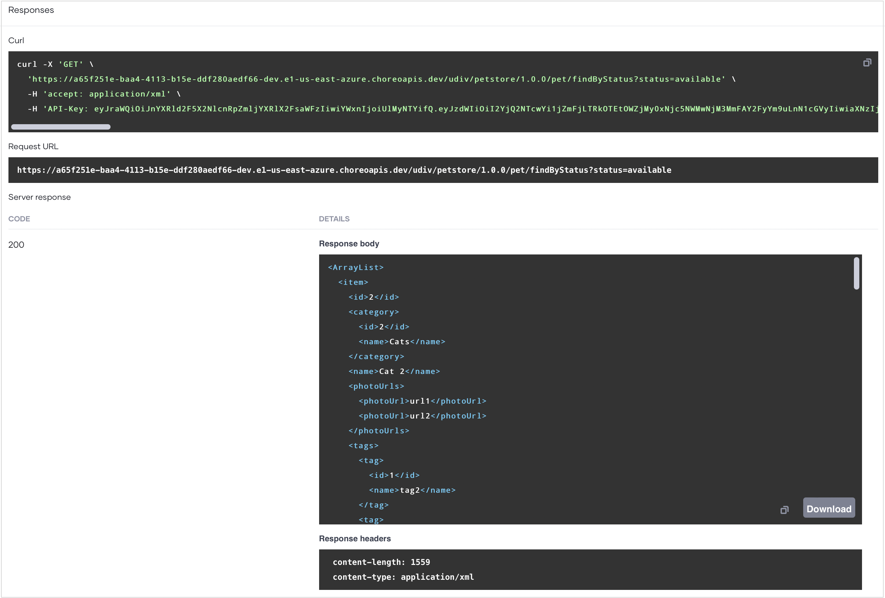

# Expose a Service as a Managed API

Choreo simplifies securely exposing existing services as managed APIs. It also allows you to effectively manage all aspects of an API's lifecycle, security, throttling, and governance so that you can focus more on service development. 

In this tutorial, you will use Choreo to expose a service as an API proxy and publish it to the Choreo Developer Portal for application developers to consume.

## Prerequisites

Before you try out this tutorial, complete the following:

- If you are signing in to the Choreo Console for the first time, create an organization as follows:

    1. Go to [https://console.choreo.dev/](https://console.choreo.dev/), and sign in using your preferred method.
    2. Enter a unique organization name. For example, `Stark Industries`.
    3. Read and accept the privacy policy and terms of use.
    4. Click **Create**.

    This creates the organization and opens the **Project Home** page of the default project created for you.

## Step 1: Create an API proxy

To create an API proxy, you can either upload an OpenAPI specification or provide an OpenAPI specification URL. In this tutorial, you will use a URL of a sample OpenAPI specification. 

Follow the steps given below:

1. Go to [https://console.choreo.dev/](https://console.choreo.dev/) and sign in. This opens the project home page.
2. If you already have one or more components in your project, click **+ Create** under **Component Listing**. Otherwise, proceed to the next step.
3. Click the **API Proxy** card.
4. In the **Create an API Proxy** pane that opens, click **Try with sample URL**.
5. Click **Next**.
6. Update the populated API proxy details with the values given in the following table:
    
    !!! info
         In the **Name** field, you must specify a name to uniquely identify the component in various contexts. The value is editable only at the time you create the component. You cannot change the name after you create the component. 

    |  **Field**       | **Value**                                   |
    |------------------|---------------------------------------------|
    | **Display Name** | `Swagger Petstore`                          |
    | **Name**         | `swagger-petstore`                          |
    | **Context**      | `api/v3`                                    |
    | **Version**      | `1.0`                                       |
    | **Target**       | `https://petstore3.swagger.io/api/v3`       |
    | **Access Mode**  | `External: API is publicly accessible`      |

7. Click **Create**. This creates the component and takes you to the **Overview** page of the component. 

To see the resources of the API proxy, go to the left navigation menu, click **Develop**, and then click **Resources**.

## Step 2: Deploy the API proxy

To deploy the API proxy to the development environment, follow the steps given below:

1. In the left navigation menu, click **Deploy**.
2. In the **Build Area** card, click **Configure & Deploy**. This opens the **Configure & Deploy** pane, where you can select the API access mode depending on how you want the API to be accessible. 

     Here, you can select **External** to make the API publicly accessible, and then click **Deploy**. 
     
     Once the deployment is complete, the **Development** card indicates the **Deployment Status** as **Active**.

Now you are ready to test the API proxy.

## Step 3: Test the API proxy

You can test the API proxy in the development environment before promoting it to production. Choreo provides the following options to test your API proxy:
- OpenAPI Console
- cURL

In this guide, you will use the OpenAPI Console.

To test the API proxy via the OpenAPI Console, follow the steps given below:

1. In the left navigation menu, click **Test** and then click **OpenAPI Console**.

    !!! tip
          Since the API proxy is secured when it is deployed, you will need a key to invoke it. Choreo automatically generates a key when you navigate to the **OpenAPI Console** pane.

2. In the **OpenAPI Console** pane, select **Development** from the environment drop-down list.   
3. Expand the `GET /pet/findByStatus` method and click **Try it Out** to test it.
4. Select **available** as the status and click **Execute**. You will see a response similar to the following:

    

   This indicates that your API proxy is working as expected.

## Step 4: Promote the API proxy to production

Once you verify that the API proxy is working as expected in the development environment, you can follow the steps given below to promote it to production:

1. In the left navigation menu, click **Deploy**.
2. In the **Development** card, click **Promote**.
3. In the **Configure & Deploy** pane that opens, click **Next**.

    !!! tip
          If you want to specify a different endpoint for your production environment, you can make the change in the **Configure & Deploy** pane.

   The **Production** card indicates the **Deployment Status** as **Active** when the API proxy is successfully deployed to production.

   If you want to verify that the API proxy is working as expected in production, you can test the API in the production environment.

   Now that your API is deployed in both development and production environments and can be invoked, the next step is to publish it so that consumers can discover and subscribe to it.

## Step 5: Publish the API proxy

To publish the API to the Choreo Developer Portal, follow the steps given below:

1. In the left navigation menu, click **Manage** and then click **Lifecycle**. This opens the **Lifecycle** page, where you can see the different lifecycle stages that an API can be in. You can see that the current lifecycle stage is **Created**.
2. Click **Publish**.
3. In the **Publish API** dialog that opens, click **Confirm** to proceed publishing the API with the specified display name. If you want to change the display name, make the necessary changes and then click **Confirm**. This changes the API lifecycle state to **Published**.
 
You can observe that the API lifecycle stage has changed to **Published**. Now the API is available for consumption. API consumers can consume the API via the Choreo Developer Portal.

## Step 6: Invoke the API 

To generate credentials for the published API and to invoke it via the Developer Portal, follow the steps below:

1. In the **Lifecycle Management** pane, click **Go to DevPortal**. This takes you to the Petstore API published to the Choreo Developer Portal.

2. To generate credentials for testing the API, follow the steps given below:

    1. In the Developer Portal left navigation menu, click **Production** under **Credentials**.
    2. Click **Generate Credentials**. Choreo generates new tokens and populates the **Consumer Key** and **Consumer Secret** fields.

3. To invoke the API, follow the steps given below:

    1. In the Developer Portal left navigation menu, click **Try Out**.
    2. In the **Endpoint** list, select **Development** as the environment to try out the API.
    3. Click **Get Test Key**. This generates an access token.
    4. Expand the `GET /pet/findByStatus` operation and click **Try it out**.
    5. Select **available** as the status and click **Execute**.

Now you have successfully created, deployed, tested, and published an API proxy using Choreo.
