# Integrating Services

In this tutorial, you can learn how to integrate multiple services via Choreo. Here, let's consider a simple example where an online shoe store uses an application that captures online orders. For each order, the application also needs to generate a notification for the sales manager as well as update the inventory recordsinventory records and notify the status to the client who places the order.

## Prerequisites

The following are required to try out this tutorial:

- A Google account. In this Google account, open the Google Drive and create a Google sheet named `inventory` with the following table:

    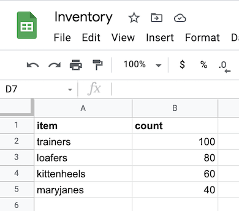{.cInlineImage-half}
    
    | **item**    | **count** |
    |-------------|-----------|
    | trainers    | 100       |
    | loafers     | 80        |
    | kittenheels | 60        |
    | maryjanes   | 40        |
                            
- A Twilio account.

## Step 1: Create a service to manage inventory records

In this step, you are creating a service that does the following:

- Reading order requests captured by the `orders` service that you will create in step 3.
- Determining whether the order request can be met by checking the inventory records in the `inventory` Google Sheet.
- Generating a response for each order request based on the status (i.e., whether the requested item is available and whether the available quantity is adequate to match the quantity requested).

To create this service, follow the procedure below:

1. Access the Choreo Console via `https://console.choreo.dev/`.

    Sign in using either your Google or GitHub credentials.
    
    Click **Services**, and then click **Create**.

2. Enter `inventory` as the name and click **Create**.

3. To define the API that triggers your service, click **PUT** under **HTTP Method**. Then enter `/inventory` in the **Path** field, and click **Save API**.

    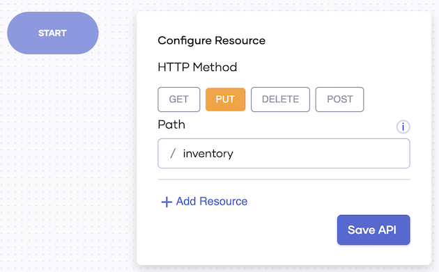{.cInlineImage-half}
    
4. To read the information in the order, define the required parameters.

    In this scenario, the information derived from each order includes the name of the item ordered, and the quantity required.
    
    Therefore, let's define the parameters via variables as follows:
    
    1. First, define a variable to contain the variables that define the parameters.
    
        To do this,  click **Variable**.
        
        Enter the following information:
        
        | **Field**         | **Value**                  |
        |-------------------|----------------------------|
        | **Type**          | **other**                  |     
        | **Other Type**    | `map<string[]>`            |
        | **Name**          | `queryParams`              |
        | **Expression**    | `request.getQueryParams()` |
        
        Click **Save**.

    2. To allow the service to identify the name of the item ordered, define another variable.
    
        Click the **+** icon below the `queryParams`statement, and then click **Variable**.
        
        Enter the following information:
    
        | **Field**         | **Value**                    |
        |-------------------|------------------------------|
        | **Type**          | **string**                   |     
        | **Name**          | `inventoryItemId`            |
        | **Expression**    | `queryParams.get("item")[0]` |
        
        Click **Save**.
        
    3. To allow the service to identify the quantity ordered, define another variable.
    
        Click the **+** icon below the `inventoryItemId` variable statement, and then click **Variable**.
        
        Enter the following information:
        
        | **Field**         | **Value**                                           |
        |-------------------|-----------------------------------------------------|
        | **Type**          | **int**                                             |     
        | **Name**          | `quantity`                                          |
        | **Expression**    | `check int:fromString(queryParams.get("count")[0])` |
        
        Click **Save**.
     
 5. The inventory records are maintained in the `Inventory` Google Sheet that you previously created. To manage them, connect to this Google Sheet by adding and configuring an API call.
 
    1. First, the `inventory` service needs to integrate with the Google Sheets application. To do this, add an API call.
            
        Click the **+** icon below the `quantity` variable statement, and then click **API Calls**. Then click **Google Sheets**.
        
        To access the specific account you need to use for this scenario, click **Connect to Google Sheets**, and then click **Proceed**. Click on the Google Account of your choice and click **Allow** to allow Choreo to access it as described on the page. Then click **Save**.
    
    2. Configure the API call you added to connect to the `Inventory` Google sheet.
    
        To do this, click the **+** icon below the Google Sheets connection you just added. Click **API Calls**, and then click **sheetsEndpoint** under **Choose existing connection**.
        
        In the **Operation** field, select **Get values from a column**. Then enter information as follows in the rest of the fields that appear:
        
        1. In the **SpreadsheetId** field, enter the ID of the `Inventory` Google Sheet within inverted commas. This can be derived from the URL of the Google sheet.
        
            e.g., If the Google Sheet URL is `https://docs.google.com/spreadsheets/d/<SPREADSHEET_ID>>/edit#gid=0`, the value you must enter is `"<SPREADSHEET_ID>"`.
            
        2. In the **Worksheet Name** field, enter the name of the sheet with the inventory records. This must be entered within inverted commas.
        
            e.g., `"Sheet1"`
            
        3. In the **Column** field, enter the name of the column in which you have added the item names. This must be entered within inverted commas.
        
            e.g., `"A"`
            
        Click **Save**.
        
 6. For the service to cast the information is retrieved from the Google sheet as a response to the order, add a variable.
 
    To do this, click the **+** icon below the Google Sheet connection, and then click **Variable**.
    
    Enter the following information:
    
    | **Field**         | **Value**        |
    |-------------------|------------------|
    | **Type**          | **other**        |     
    | **Other Type**    | `string[]`       |
    | **Name**          | `respondMessages`|
    | **Expression**    | `[]`             |
        
    Click **Save**.
        
 7. Once the response is cast, the service needs to log it.
 
    To do this, click the **+** below the `respondMessages` variable statement, and then click **Log**.
    
    In the **Expression** field, enter `"itemIDs.toJsonString()"`.
    
    Click **Save**.    
    
 8. To iterate over the rows in the Google sheet that you connected to the service and match the information with that in the order, add statements as follows:
 
    1. To iterate over the list of items that are currently available in the `inventory` Google sheet, add a variable.
 
        Click the **+** below the log statement, and then click **Variable**.
        
        Enter the following information:
        
        | **Field**      | **Value** |
        |----------------|-----------|
        | **Type**       | **int**   |     
        | **Name**       | `i`       |
        | **Expression** | `1`       |
        
        Click **Save**.
 
    2. To add an index where the shoe type requested via the order is found, add another variable.
    
        Click the **+** below the log statement, and then click **Variable**.
        
        Enter the following information:
        
        | **Field**      | **Value** |
        |----------------|-----------|
        | **Type**       | **int**   |     
        | **Name**       | `index`   |
        | **Expression** | `-1`      |
        
        Click **Save**.    
        
    3. To find the item in the Google sheet that matches the item requested in the order, add another variable.
        
        Click the **+** icon below the last `index` statement, and then click **Variable**.
        
        Enter the following information: 
     
        | **Field**      | **Value**      |
        |----------------|----------------|
        | **Type**       | **string**     |     
        | **Name**       | `itemIDString` |
        | **Expression** | `""`           | 
             
        Click **Save**.
         
 9. Define the process to be followed by the `inventory` service for each order request sent by following this procedure:
   
    1. To add a `ForEach` statement that iterates over a list of items, click the **+** icon below the last `itemIDString` statement, and then click **ForEach**.
    
        Enter the following information:
    
         | **Field**                  | **Value**   |
         |----------------------------|-------------|
         | **Current Value Variable** | **itemID**  |     
         | **Iterable Expression**    | `itemIDs`   |
         
        Click **Save**.
         
    2. To specify the action to be iterated for each order request, add a custom statement within the `ForEach` statement.
    
        Here, the action to be iterated is to check whether the `Inventory` Google Sheet has an item that is the same as the ordered item, and if it does, to create an index.
     
        Click the **+** icon below the `Foreach` statement.
        
        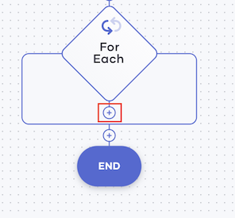{.cInlineImage-half}
            
        Then click **Other**, and enter the following in the **Statement** field.
        
        ```
        itemIDString = <string>itemID;
        if (itemIDString == inventoryItemId) {
            index = i;
            break;
        } 
        i = i + 1;
        ```
        Here, `i = i + 1` means `1` is added to the index each time a matching item is found.
        
        Click **Save**.
                       
10. Define the action to be taken based on whether the requested item exists in stock or not as follows:

    1. First, let's add an `If` statement to define the condition where the `inventory` Google sheet has the item that matches the item mentioned in the order.
    
        To do this, you can check whether the index you previously specified to be added when an order has a matching item in the `Inventory` Google Sheet. When this index has a value greater than 0, it means 
    
        To do this, click the last **+** icon in the diagram of your low code diagram.
    
        {.cInlineImage-half}
    
        Click **If**, and in the **Condition** field, enter `index > 0`.
        
        Here, you are checking whether the index that you previously added as a variable has a value greater than zero. If this condition is met, it means that a matching item is available and the index is updated.
    
        Click **Save**.
        
    2. Define the actions that the service needs to perform if the given condition is met by adding the following statements:
    
        1. To derive the available stock for the requested item from the specified cell in the Google sheet, add a variable statement. 
        
            Click the **+** icon below the last `If` statement.
    
            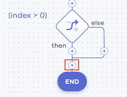{.cInlineImage-half}
        
            Then click **Variable** and enter information as follows:
            
            | **Field**      | **Value**                |
            |----------------|--------------------------|
            | **Type**       | **string**               |     
            | **Name**       | `cellName`               |
            | **Expression** | `"B" + index.toString()` | 
            
            The above expression directs the service to check the value in the `B` column cell which is in the same row as the item ordered (i.e., identified via the index).
                
            Click **Save**.
            
        2. To get the cell value, add an API call that connects to the `Inventory` Google Sheet.         
        
            Click the **+** icon below the `cellName` variable statement.
            
            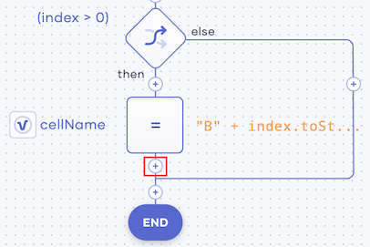{.cInlineImage-half}
                
            Click **API Call**, and then click **sheetsEndpoint** under **Choose existing connection**.
            
            In the **Operation** field, select **Get value in a cell**. Then enter information as follows in the rest of the fields that appear:
            
            1. In the **SpreadsheetId** field, enter the ID of the `Inventory` Google Sheet within inverted commas. This can be derived from the URL of the Google sheet.
            
                e.g., If the Google Sheet URL is `https://docs.google.com/spreadsheets/d/<SPREADSHEET_ID>>/edit#gid=0`, the value you must enter is `"<SPREADSHEET_ID>"`.
                
            2. In the **Worksheet Name** field, enter the name of the sheet with the inventory records. This must be entered within inverted commas.
            
                e.g., `"Sheet1"`
                
            3.  To apply the `cellName` variable statement that you added to the Google sheet, enter `cellName` in the **Column** field.
            
                Click **Save**.
            
        3. To log the cell value obtained, add a `Log` statement.
        
            Click the **+** icon below the last API call. 
            
            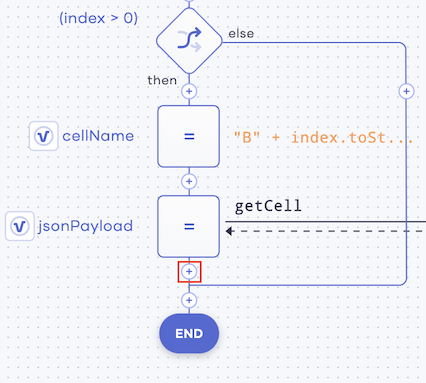{.cInlineImage-half}
                
            Then click **Log**, and in the **Expression** field, enter `"cellValue.toJsonString()"`.
            
            Click **Save**.
            
        4. To cast the cell value derived as the available stock of the requested item, add a variable.
            
            Click the **+** icon below the last log statement.
            
            {.cInlineImage-half}
            
            Then click **Variable** and enter the following information:
            
            | **Field**      | **Value**                                         |
            |----------------|---------------------------------------------------|
            | **Type**       | **int**                                           |     
            | **Name**       | `intCellValue`                                    |
            | **Expression** | `check 'int:fromString(cellValue.toJsonString())` | 
                
            Click **Save**.                  
        
        5. To specify the action that the service should perform based on whether the cell value (i.e., the available stock) is greater than the quantity ordered or not, add an `If` statement.
        
            Click the **+** icon below the `intcellValue` statement.
            
            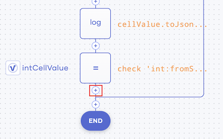{.cInlineImage-half}
                
            Click **If**, and in the **Condition** field, enter `intCellValue > quantity`.
            
            This checks whether the value derived from the cell (i.e., the current stock) is greater than the quantity specified in the order.
                
            Click **Save**.
            
        6. To specify the action to perform when the condition is met, add statements as follows.
               
            1. To deduct the quantity ordered from the existing stock, add a variable statement.
                
                Click the **+** icon on the **then** path of the if statement.
                
                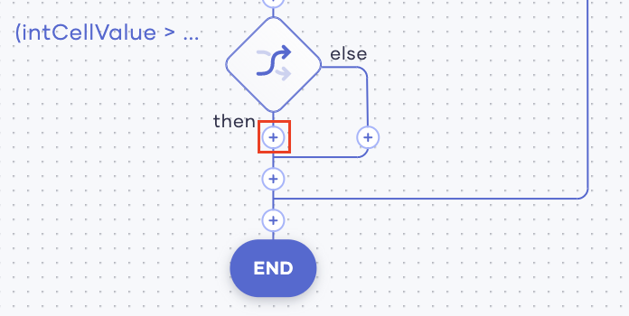{.cInlineImage-half}
               
                Click **Variable**, and enter the following information:
                    
                | **Field**      | **Value**                 |
                |----------------|---------------------------|
                | **Type**       | **int**                   |     
                | **Name**       | `newStockValue`           |
                | **Expression** | `intCellValue - quantity` |
                        
                Click **Save**.
                    
            2. To set the value derived via the `newStockValue` variable statement as the current stock, add an API call as follows:
                
                Click the **+** icon below the `newStockValue` statement.
                    
                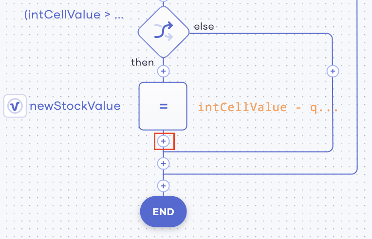{.cInlineImage-half}
                        
                Click **API Call**, and then click **sheetsEndpoint** under **Choose existing connection**.
                    
                In the **Operation** field, select **Set value to a cell**. Then enter the following information in the rest of the fields that appear.
                    
                | **Field**                          | **Value**                                           |
                |------------------------------------|-----------------------------------------------------|
                | **SpreadsheetId**x                 | The ID of your Google sheet. This can be derived from the URL of your Google sheet. e.g., If the Google Sheet URL is `https://docs.google.com/spreadsheets/d/1wHOdJgJzN6V9-vBQVSLEYxpYDp5XnpIcNqgj-h9pX4Q/edit#gid=0`, the google sheet ID is `1wHOdJgJzN6V9-vBQVSLEYxpYDp5XnpIcNqgj-h9pX4Q`.|  
                | **Worksheet Name**                 | The name of the sheet with the inventory records.   |
                | **Required Cell in A1 Annotation** | **cellName**                                        |
                | **Value Of The Cell To Set**       | **newStockValue**                                   |
                | **Response Variable Name**         | `respondMessages`                                   |
                        
                Click **Save**.
                    
            3. To generate a message that confirms that the current inventory record is updated, add a custom message.
                
                Click the **+** icon below the last API call.                     
        
                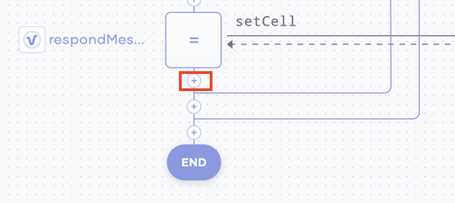{.cInlineImage-half}
                    
                Click **Other**, and in the **Statement** field, enter `respondMessages.push("Successfully updated the item: " + itemIDString);`
                
                Click **Save**.
            
        7. To specify the action to perform when the `intCellValue > quantity` condition is not met, add a custom statement.
            
            Click the **+** icon on the **else** path of the `intCellValue > quantity` if statement.
                
            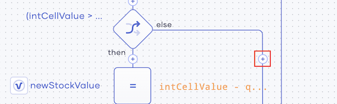{.cInlineImage-half}
                    
            Click **Other**, and in the **Statement** field, enter `respondMessages.push("Stock is not enough for the Item: " + itemIDString);`.
                
            Here, you are configuring a message stating that the stock is not enough to be returned if the available stock is less than the quantity requested.
                    
            Click **Save**.
                
        6. To specify the action to perform if the `index > 0` condition is not met, add another custom statement.
        
            Click the **+** icon on the **else** path of the `index > 0` if statement.
            
            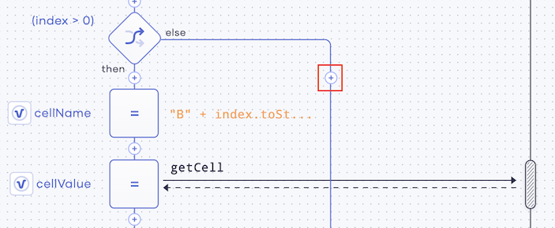{.cInlineImage-half}
                
            Click **Other**, and in the **Statement** field, enter `respondMessages.push("Cannot find the item: " + itemIDString);`.
            
            Here, you are configuring a message stating that the requested item cannot be found when the item name in the order request is not available in the Google sheet.
                
            Click **Save**.
               
11. To send the final response after processing the complete flow of the service, add a `Respond` statement.

    Click the last **+** icon in the diagram. Then click **+** again.
    
    {.cInlineImage-half}
    
    Click **Respond**, and in the **Respond Expression** field, enter `respondMessages`. 
    
    Click **Save**.
    
Now you have finished developing the `inventory` service. Now you can test it and deploy it if it works as expected.

## Step 2: Test and deploy the created service

In this step, you will test the `inventory` service and deploy it if it works as expected. 

1. Click **Run & Test** for your service.

    {.cInlineImage-half}
    
    Once the service has started, you will see the following log.
    
    ```
    [ballerina/http] started HTTP/WS listener 0.0.0.0:8090
    ```
    
2. In the **Run & Test** tab, click **://cURL**.

    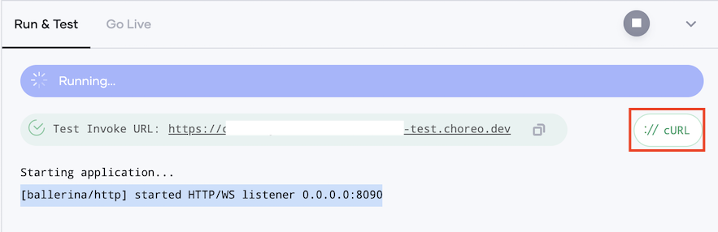{.cInlineImage-half}
    
3. Copy the cURL command displayed.

4. Update your cURL command to add a payload and issue it as given below. 

    !!! note
        To demonstrate how the service works in the scenarios given below, let's assume that the cURL command you copied is `curl "https://inventory-choreodeveloper-test.choreo.dev/inventory" -X PUT`

    - **Scenario 1:** A sufficient quantity is available of the requested item
    
        Issue the following cURL command:
        
        ```
        curl "https://inventory-choreodeveloper-test.choreo.dev/inventory?item=trainers&count=10" -X PUT
        ```
      
        The following response is returned.
        
        ```
        ["Successfully updated the item: trainers"]
        ```
      
      This also reduces the count displayed in the B2 cell of the `inventory` Google sheet from `100` to `90`.
    
    - **Scenario 2:** The quantity requested in the order cannot be met
    
        Issue the following cURL command:
        
        ```
        curl "https://inventory-choreodeveloper-test.choreo.dev/inventory?item=trainers&count=1000" -X PUT
        ```
      
        The following response is returned.
        
        ```
        ["Stock is not enough for the Item: trainers"]
        ```
    
    - **Scenario 3:** The item ordered is not available
    
        Issue the following cURL command:
        
        ```
        curl "https://inventory-choreodeveloper-test.choreo.dev/inventory?item=galoshes&count=10" -X PUT
        ```
      
        The following response is returned.
        
        ```
        ["Cannot find the item: galoshes"]
        ```
    Based on the above, the `inventory` service is working as expected. Therefore, you can deploy it.
    
5. To deploy the service, click **Go Live** for the service.

    {.cInlineImage-half}
    
6. Click **Deploy**.

    The status of the service changes to **Deployed**, and the following message appears.
    
    ```
    Deployed successfully. Note that the service will automatically undeploy in 12 hours.
    ```

## Step 3: Create a service to capture and respond to orders

In this step, you will create a service that performs the following functions of the application:

- Capturing the online orders and forwarding them to the `inventory` service to process.
- Responding to each order request by forwarding the response message generated by the `inventory` service to the customers as WhatsApp messages via Twillio.
- Sending a mail to the Sales Manager with details about the order.

1. Access the Choreo Console via `https://console.choreo.dev/`.
   
   Sign in using either your Google or GitHub credentials.
       
    
2. Click **Services**, and then click **Create**.

3. Under **Create with Choreo**, enter `orders` as the name of your Choreo service.

4. To create the API that triggers the `orders` service, select **POST** as the HTTP method, and then click **Save API**.

    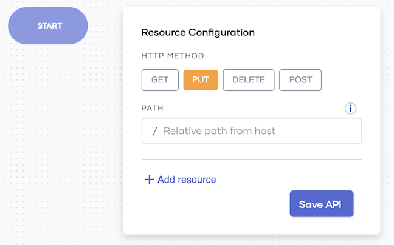{.cInlineImage-half}

5. For the service to read the parameter values in each order request, add variables that define those parameters:

    1. First, add a variable to contain the variables that define the parameters.

        To do this, click **Variable** and enter information as follows:
    
        | **Field**      | **Value**                  |
        |----------------|----------------------------|
        | **Type**       | **other**                  |
        | **Other Type** | `map<string[]>`            |
        | **Name**       | `queryParams`              |
        | **Expression** | `request.getQueryParams()` |
        
        Click **Save**.
    
    2. To identify the parameter that represents the number of items ordered, add another `Variable` statement.

        To do this, click the **+** icon below the `queryParams` variable statement, and click **Variable**. 
        
        Enter the following information:
        
        | **Field**      | **Value** |
        |----------------|-----------|
        | **Type**       | **var**   |
        | **Name**       | `count`   |
        | **Expression** | `-1`      |
        
        Click **Save**.
    
    3. To identify the parameter that represents the name of the item ordered, add another `Variable` statement.

        Click the **+** icon below the `count` variable statement, and then click **Variable**.
        
        Enter information as follows.
        
        | **Field**      | **Value** |
        |----------------|-----------|
        | **Type**       | **var**   |
        | **Name**       | `item`    |
        | **Expression** | `""`      |
        
        Click **Save**.
    
6. Filter only requests that specify the number of items to be purchased via an `If` statement

    To do this, click the **+** icon below the `item` variable, and then click **If**.
    
    In the **Condition** field, enter `queryParams.hasKey("count")`.
        
    This checks whether the request received includes a value for the `count` parameter.
    
    Click **Save**.
    
7. Specify the action to be carried out if the given condition is met. 
    
    To do this, click the **+** icon on the **then** line of the `If` statement.
        
    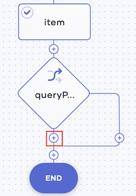{.cInlineImage-half}
    
    Click **Other**, and in the **Statement** field, enter `count = check int:fromString(queryParams.get("count")[0]);`.
    
    This statement specifies to get the value for the `count` parameter from the request.
            
    Click **Save**.
            
8. Once requests are filtered as specified above, further filter them so that only requests that specify an item are selected for further processing.
                      
    Similar to how you filtered requests that specify the count, you can add another `If` statement followed by a statement that defines the action to be followed when the `If` condition is met.
    
    1. To add the `If` statement, click the last **+** icon in the current low code diagram.
    
        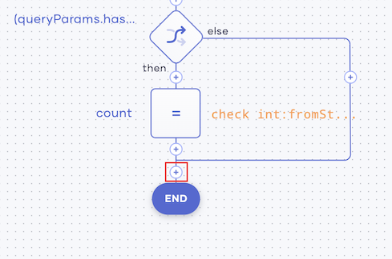{.cInlineImage-half}
        
        Click **If**, and in the **Statement** field, enter `queryParams.hasKey("item")`.
        
        Then click **Save**.
        
    2. To add the statement to get the item ordered, click the **+** icon on the **then** line of the `if` statement.
    
        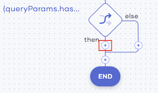{.cInlineImage-half}
        
        Click **Other**, and in the **Statement** field, enter `item = queryParams.get("item")[0];`.
        
        Click **Save**.
    
9. To connect your service to an endpoint, add an `HTTP` API call and then configure it.

    1. To add the API Call, click the last **+** icon in the current low code diagram.
    
        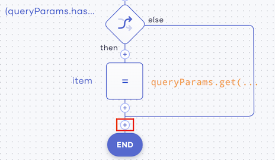{.cInlineImage-half}
    
        Click **API Calls**, and then click **HTTP**. Then enter the following information:   
    
        | **Field** | **Value**                                          |
        |-----------|----------------------------------------------------|
        | **Name**  | `inventoryEndpoint`                                |
        | **URL**   | `"<The URL to the inventory service you created >` |  
        
        Click **Save**.
        
    2. To configure the `HTTP` endpoint, click the last **+** icon in the current low code diagram, and then click **API Calls**.
    
        Under **Choose existing connection**, click **inventoryEndpoint** to open the `HTTP` endpoint you created.
    
        In the **Operation** field, select **put**, and then enter information in the rest of the fields that appear as follows:
    
        | **Field**                             | **Value**                                                 |
        |---------------------------------------|-----------------------------------------------------------|
        | **Resource Path**                     | `"/inventory?item=" + item + "&count=" + count.toString()`|
        | **Message**                           | `""`                                                      |
        | **Do you want to extract a payload?** | Select this                                               |
        | **Select Payload Type**               |  **Text**                                                 |
    
        Click **Save & Done**.    
    
10. To index an occurrence where the requested item was available in sufficient quantities and the `inventory` service deducted the ordered quantity from the stock, add a variable.

    Click the last **+** icon in the current low code diagram, and then click **Variable**.
    
    Enter information as follows:
    
    | **Field**      | **Value**                                              |
    |----------------|--------------------------------------------------------|
    | **Type**       | `var`                                                  |
    | **Name**       | `index`                                                |
    | **Expression** | `textPayload.indexOf("Successfully updated the item")` |
    
    Click **Save**.
    
11. Define the action to be performed by the `orders` service if an index is created to indicate that the `inventory` service has updated the stock record for an order. To do this, add the following statements.

    1. To define the condition where an index is created as mentioned above, click the last **+** icon in the current low code diagram. 
    
        Click **If**, and in the **Condition** field, enter `index is int && index > 0`.
        
        Here, you are specifying a condition where the index is in integer format and the value is more than 0.
        
        Click **Save**.
        
    2. To send a message via Twillio if the condition given above is met, add an API call and then configure it.
    
        1. To add the API call, click on the **+** icon just below the last `If` statement.
        
            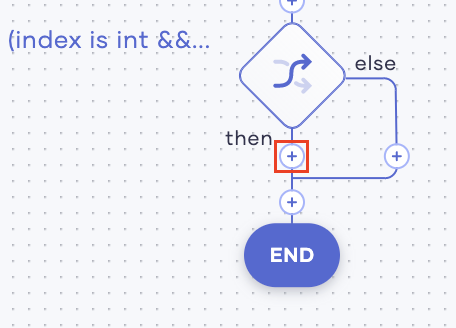{.cInlineImage-half}
        
            Click **API Calls**, and then click **Twillio**. Then enter the following information:
            
            | **Field**      | **Value**                      |
            |----------------|--------------------------------|
            | **AccountSId** | `<YOUR_TWILLIO_ACCOUNT_SID>`   |
            | **AuthToken**  | `<YOUR_TWILLIO_ACCOUNT_TOKEN>` |
            
            Click **Save**.
            
        2. To configure the API call, click the **+** icon after the Twillio API call.
        
            Under **Choose existing connection**, click **twillioEndpoint**.
            
            In the **OPERATION** field, select **sendWhatsAppMessage**. Then enter information in the rest of the fields that appear as follows:
            
            | **Field**                  | **Value**                                                                       |
            |----------------------------|---------------------------------------------------------------------------------|
            | **FromNo**                 | `<YOUR_TWILLIO_NUMBER>`                                                         |                   
            | **ToNo**                   | `<YOUR_MOBILE_NO>`                                                              |
            | **Message**                | `"Your purchase order of " + item + " has shipped and should be delivered tomorrow. Details: " + count.toString()` | 
            | **Response Variable Name** | `sendSmsResponse`                                                               |
            
            Then click **Save**.
    
        3. To log the WhatsApp message sent, add a `log` statement.
        
            Click on the **+** icon just below the last Twillio connection.
            
            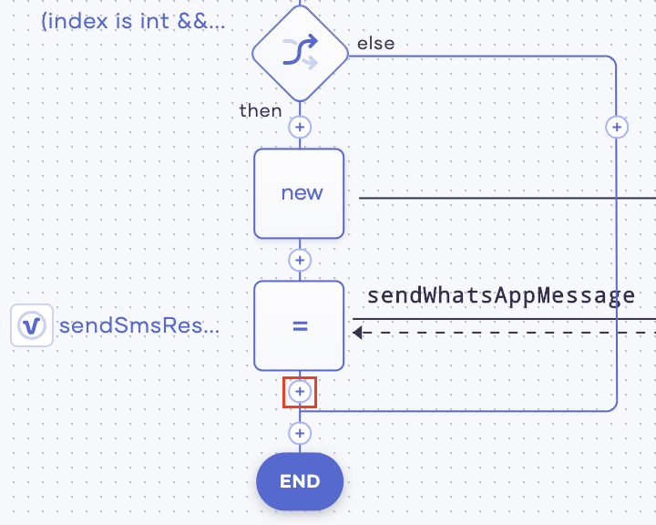{.cInlineImage-half}
            
            Click **Log**, and in the **Expression** field, enter `"WhatsApp message sent"`. 
            
            Click **Save**.
    
        4. To send an email informing the client confirming the order, add and configure another API call.
        
            1. To add the API Call, click the **+** icon just below the last log statement.
            
                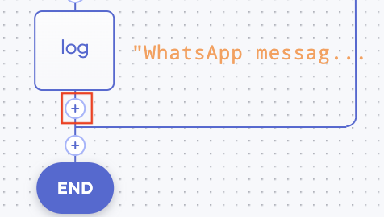{.cInlineImage-half}
            
                Click **API Calls**, and then click **Gmail**.
            
                Click **Connect Another Account**, and then click **Proceed**. Click on the Gmail account of your choice, and then click **Allow**. Then click **Save** to save the connection.
                
            2. To configure the API call, click the **+** icon after the last Gmail connection, and then click **API Calls**.
            
                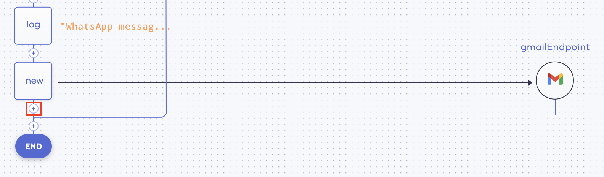{.cInlineImage-half}
            
                Under **Choose existing connection**, click  **gmailEndpoint**. 
            
                In the **Operation** field, select **sendMessage**. Then enter information as follows in the rest of the fields that appear:
            
                | **Field**                  | **Value**                                           |
                |----------------------------|-----------------------------------------------------|
                | **Mail Address of User**   | `<YOUR_GMAIL_ACCOUNT>`                              |
                | **sender**                 | `<YOUR_GMAIL_ACCOUNT>`                              |        
                | **Recipient**              | `<YOUR_GMAIL_ACCOUNT>`                              |
                | **Subject**                | `"Successfully received order"`                     |
                | **MessageBody**            | `"Payment received for " + count.toString() + item` |
                | **Content Type**           | `"text/plain"`                                      |
                | **Sender**                 | `<YOUR_GMAIL_ACCOUNT>`                              |
                | **Cc**                     | `<YOUR_GMAIL_ACCOUNT>`                              |
                | **Bcc**                    | `<YOUR_GMAIL_ACCOUNT>`                              |
                
                Click **Save**.
    
12. To send a response after the service successfully executes all its tasks, add a `respond` statement.

    Click the last **+** icon in the current low code diagram.
    
    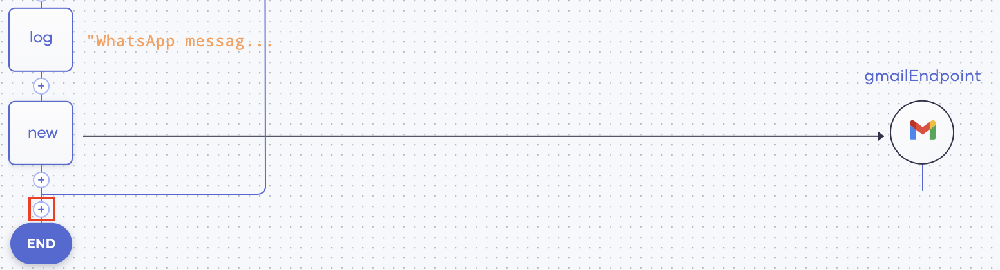{.cInlineImage-half}

    Click **Respond**, and in the **Respond Expression** field, enter `textPayload`.
    
    Click **Save**.
    
Now you have finished developing the `orders` service. Now you can test it and deploy it if it works as expected.

## Step 4: Test and deploy the created service

In this step, you will test the `orders` service and deploy it if it works as expected. 

1. Click **Run & Test** for your service.

    
    
    
    Once the service has started, you will see the following log.
    
    ```
    [ballerina/http] started HTTP/WS listener 0.0.0.0:8090
    ```
    
2. In the **Run & Test** tab, click **://cURL**.

    {.cInlineImage-half}
    
3. Copy the cURL command displayed.

4. Update your cURL command to add a payload and issue it as given below. 

    !!! note
        To demonstrate how the service works in the scenarios given below, let's assume that the cURL command you copied is `curl "https://orders-choreodeveloper-test.choreo.dev/orders" -X PUT`

    - **Scenario 1:** A sufficient quantity is available of the requested item
    
        Issue the following cURL command:
        
        ```
        curl "https://orders-choreodeveloper-test.choreo.dev/orders?item=trainers&count=10" -X PUT
        ```
      
        The following response is returned.
        
        ```
        ["Successfully updated the item: trainers"]
        ```
      
      This also reduces the count displayed in the B2 cell of the `inventory` Google sheet from `100` to `90`.
    
    - **Scenario 2:** The quantity requested in the order cannot be met
    
        Issue the following cURL command:
        
        ```
        curl "https://orders-choreodeveloper-test.choreo.dev/orders?item=trainers&count=1000" -X PUT
        ```
      
        The following response is returned.
        
        ```
        ["Stock is not enough for the Item: trainers"]
        ```
    
    - **Scenario 3:** The item ordered is not available
    
        Issue the following cURL command:
        
        ```
        curl "https://orders-choreodeveloper-test.choreo.dev/orders?item=galoshes&count=10" -X PUT
        ```
      
        The following response is returned.
        
        ```
        ["Cannot find the item: galoshes"]
        ```
    Based on the above, the `orders` service is working as expected. Therefore, you can deploy it.
    
5. To deploy the service, click **Go Live** for the service.

    {.cInlineImage-half}
    
6. Click **Deploy**.

    The status of the service changes to **Deployed**, and the following message appears.
    
    ```
    Deployed successfully. Note that the service will automatically undeploy in 12 hours.
    ```         
