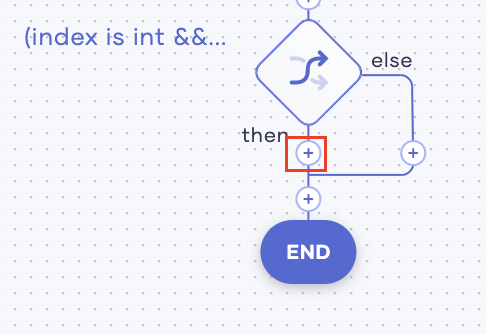

# Integrating Services

In this tutorial, you can learn how to integrate multiple services via Choreo. Here, let's consider a simple example where an online shoe store needs an application that captures online orders. For each order, the store also needs to generate a notification for the sales manager as well as update the inventory records.

## Before you begin

The following are required to try out this tutorial:

- A Google account. In this Google account, open the Google Drive and create a Google sheet named `inventory` with the following table:

    
    | **item**    | **count** |
    |-------------|-----------|
    | trainers    | 100       |
    | loafers     | 80        |
    | kittenheels | 60        |
    | maryjanes   | 40        |
                            
- A Twilio account

## Step 1: Create a service to manage inventory records

In this step, you are creating a service that consumes the orders captured by the `orders` service that you will be creating later, and then updates the inventory records based on the number of items ordered.

To create this service, follow the procedure below:

1. Access the Choreo Development Console and click **Services**. Then click **Create**.

2. Enter `inventory` as the name and click **Create**.

3. Click **PUT**, enter `/inventory` in the **Path** field, and then click **Save API**.

    

4. Click **Variable**. Then enter information as follows:

    | **Field**         | **Value**                     |
    |-------------------|-------------------------------|
    | **Type**          | **string**                    |     
    | **Name**          | `responseString`              |
    | **Expression**    | `""`                    |

    Click **Save**.
    
5. To define a variable for query parameters, add another variable statement as follows:

    1. Click the **+** icon below the last `responseString` variable statement you added and then click **Variable**. 
    
    2. Enter information for the variable as follows:

        | **Field**         | **Value**                  |
        |-------------------|----------------------------|
        | **Type**          | **other**                  |     
        | **Other Type**    | `map<string[]>`            |
        | **Name**          | `queryParams`              |
        | **Expression**    | `request.getQueryParams()` |

    3. Click **Save**.
    
6. To enable Choreo to read the value for the `item` parameter in the order request, add another variable statement as follows:

    1. Click the **+** below the `queryParams` variable statement you added, and then click **Variable**. 
    
    2. Enter information for the variable as follows:

        | **Field**         | **Value**                    |
        |-------------------|------------------------------|
        | **Type**          | **string**                   |     
        | **Name**          | `inventoryItemId`            |
        | **Expression**    | `queryParams.get("item")[0]` |
    
    3. Click **Save**.
    
7. To enable Choreo to read the value for the `quantity` parameter in the order request, add another variable statement as follows:

    1. Click the **+** icon below the `inventoryItemId` variable statement you added, and then click **Variable**. 
    
    2. Enter information for the variable as follows:

        | **Field**         | **Value**                                           |
        |-------------------|-----------------------------------------------------|
        | **Type**          | **int**                                             |     
        | **Name**          | `quantity`                                          |
        | **Expression**    | `check int:fromString(queryParams.get("count")[0])` |
        
    3. Click **Save**.
     
 8. To connect to the Google sheet where inventory records are maintained, add an API call as follows: 
            
    1. Click the **+** below the `quantity` variable statement you added, and then click **API Calls**.
    
    2. Click **Google Sheets**
    
    3. Click **Connect to Google Sheets**, and then click **Proceed**. Click on the Google Account of your choice and click **Allow** too allow Choreo to access it as described in the page. Then click **Save**.
    
    4. Click the **+** icon below the Google Sheets connection you just added. Click **API Calls**, and then click **sheetsEndpoint** under **Choose existing connection**.
    
    5. In the **Operation** field, select **Get values from a column**. Then enter information as follows in the rest of the fields that appear:
    
        | **Field**                  | **Value**                                                                                                       |
        |----------------------------|-----------------------------------------------------------------------------------------------------------------|
        | **SpreadsheetId**x         | The ID of your google sheet.                                                                                    |  
        | **Worksheet Name**         | The name of the sheet with the inventory records.                                                               |
        | **Column**                 | The ID of column in which you have added values for the `item` variable (i.e., `A` in the given example image). |
        | **Response Variable Name** | `itemIDs`                                                                                                       |
        
        Here, you are adding a connection that retrieves the number of items currently available in the column `A`, `Sheet1` of the `inventory` Google Sheet.
        
    6. Click **Save**.
        
 9. To cast the response received, add another variable statement as follows:
 
    1. Click the **+** below the Google Sheet connection you added, and then click **Variable**.
    
    2. Enter information for the variable as follows:
    
        | **Field**         | **Value**        |
        |-------------------|------------------|
        | **Type**          | **other**        |     
        | **Other Type**    | `string[]`       |
        | **Name**          | `respondMessages`|
        | **Expression**    | `[]`             |
        
    3. Click **Save**.
        
 10. To log the response, add a `log` statement as follows:
 
    1. Click the **+** below the `respondMessages` variable statement you added, and then click **Log**.
    
    2. In the **Expression** field, enter `"itemIDs.toJsonString()`. 
    
    3. Click **Save**.    
    
11. To define a parameter for the inventory record, add a new variable as follows:

    1. Click the **+** below the log statement you added, and then click **Variable**.
    
    2. Enter information for the variable as follows:
    
        | **Field**      | **Value** |
        |----------------|-----------|
        | **Type**       | **int**   |     
        | **Name**       | `i`       |
        | **Expression** | `1`       |
        
    3. Click **Save**.
        
12. To define a parameter for the inventory index, add a new variable as follows:
    
    1. Click the **+** icon below the last `i` variable statement you added, and then click **Variable**.
    
    2. Enter information for the variable as follows:
    
        | **Field**      | **Value** |
        |----------------|-----------|
        | **Type**       | **int**   |     
        | **Name**       | `index`   |
        | **Expression** | `-1`      |
        
    3. Click **Save**.
        
13. To define a parameter for the item ID, add a string variable as follows:   

    1. Click the **+** icon below the last `index` variable statement you added, and then click **Variable**.
    
    2. Enter information for the variable as follows:  
 
         | **Field**      | **Value**      |
         |----------------|----------------|
         | **Type**       | **string**     |     
         | **Name**       | `itemIDString` |
         | **Expression** | `""`           | 
         
    3. Click **Save**.
         
14. Add a `foreach` statement as follows:
   
    1. Click the **+** below the last `itemIDString` variable statement you added, and then click **ForEach**.
    
    2. Enter information for the ForEach statement as follows:
    
         | **Field**                  | **Value**   |
         |----------------------------|-------------|
         | **Current Value Variable** | **ItemID**  |     
         | **Iterable Expression**    | `itemIDs`   |
         
    3.Click **Save**.
         
    4. To specify the action to be iterated for each order request, add a custom statement within the ForEach statement as follows:
     
        1. Click the **+** icon below the `foreach` statement you added.
        
            
            
        2. Click **Custom**.
        
        3. In the **Statement** field, enter the following statement.
        
            ```
            itemIDString = <string>itemID;
            if (itemIDString == inventoryItemId) {
                index = i;
                break;
            } 
            i = i + 1;
            ```       
        4. Click **Save**.
                       
15. To define the action to be taken based on whether the requested item exists in stock or not, add an `if` statement as follows:

    1. Click the last **+** icon in the diagram of your low code view.
    
        
    
    2. Click **If**.
    
    3. In the **Condition** field, enter `index > 0`.
    
    4. Click **Save**.
        
    5. Define the actions that the service needs to perform if the given condition is met by adding the following statements:
    
        1. To get the available stock for the requested item from the specified cell in the google sheet, add a variable statement as follows: 
        
            1. Click the **+** icon below the last if statement you added.
    
                
        
            2. Then click **Variable** and enter information as follows:
            
                | **Field**      | **Value**                |
                |----------------|--------------------------|
                | **Type**       | **string**               |     
                | **Name**       | `cellName`               |
                | **Expression** | `"B" + index.toString()` | 
                
            3. Click **Save**.
            
        2. To get the cell value, add an API call as follows:            
        
            1. Click the **+** icon below the `cellName` variable statement you added.
            
                
                
            2. Click **API Call**, and then click **sheetsEndpoint** under **Choose existing connection**.
            
            3. In the **Operation** field, select **Get value in a cell**. Then enter information as follows in the rest of the fields that appear.
            
                | **Field**                          | **Value**                                                                                                       |
                |------------------------------------|-----------------------------------------------------------------------------------------------------------------|
                | **SpreadsheetId**x                 | The ID of your google sheet.                                                                                    |  
                | **Worksheet Name**                 | The name of the sheet with the inventory records.                                                               |
                | **Required Cell in A1 Annotation** | `cellName`                                                                                                      |
                | **Response Variable Name**         | `cellValue`                                                                                                     |
                
            4. Click **Save**.
            
        3. To log the cell value obtained, add a log statement as follows:
        
            1. Click the **+** icon below the last API call you added. 
            
                
                
            2. Click **Log**.
            
            3. In the **Expression** field, enter `cellValue.toJsonString()`.
            
            4. Click **Save**.
            
        4. To compare the cell value with the quantity ordered, add a variable statement as follows:
            
            1. Click the **+** icon below the last log statement you added.
    
                
        
            2. Then click **Variable** and enter information as follows:
            
                | **Field**      | **Value**                                         |
                |----------------|---------------------------------------------------|
                | **Type**       | **int**                                           |     
                | **Name**       | `intCellValue`                                    |
                | **Expression** | `check 'int:fromString(cellValue.toJsonString())` | 
                
            3. Click **Save**.                  
        
        5. To specify the action that the service should perform based on whether the cell value (i.e., the available stock) is greater that the quantity ordered or not, add an if statement as follows:
        
            1. Click the **+** icon below the `intcellValue` variable statement you added.
            
                
                
            2. Click **If**.
            
            3. In the **Condition** field, enter `intCellValue > quantity`.
            
                This checks whether the value in the cell is greater than the quantity specified in the order.
                
            4. Click **Save**.
            
            5. To specify the action to perform when the condition is met, add statements as follows.
               
                1. To deduct the quantity ordered from the existing stock, add a variable statement as follows:
                
                    1. Click the **+** icon on the **then** path of the if statement you added.
                
                        
               
                    2. Click **Variable**.
                    
                    3. Enter information for the variable as follows.
                    
                        | **Field**      | **Value**                 |
                        |----------------|---------------------------|
                        | **Type**       | **int**                   |     
                        | **Name**       | `newStockValue`           |
                        | **Expression** | `intCellValue - quantity` |
                        
                    4. Click **Save**.
                    
                2. To set the value derived via the `newStockValue` variable statement in the google sheet cell that has the current stock, add an API call as follows:
                
                    1. Click the **+** icon below the `newStockValue` variable statement you added.
                    
                        
                        
                    2. Click **API Call**, and then click **sheetsEndpoint** under **Choose existing connection**.
                    
                    3. In the **Operation** field, select **Set value to a cell**. Then enter information as follows in the rest of the fields that appear.
                    
                        | **Field**                          | **Value**                                           |
                        |------------------------------------|-----------------------------------------------------|
                        | **SpreadsheetId**x                 | The ID of your google sheet.                        |  
                        | **Worksheet Name**                 | The name of the sheet with the inventory records.   |
                        | **Required Cell in A1 Annotation** | **cellName**                                        |
                        | **Value Of The Cell To Set**       | **newStockValue**                                   |
                        | **Response Variable Name**         | `respondMessages`                                   |
                        
                    4. Click **Save**.
                    
                3. To generate a message that confirms that the current inventory record is updated, add a custom message as follows:
                
                    1. Click the **+** icon below the last API call you added.                     
            
                        
                        
                    2. Click **Other**.
                    
                    3. In the **Statement** field, enter `respondMessages.push("Successfully updated the item: " + itemIDString);`
                    
                    4. Click **Save**.
            
            6. To specify the action to perform when the `intCellValue > quantity` condition is not met, add a custom statement as follows.
            
                1. Click the **+** icon on the **else** path of the `intCellValue > quantity` if statement.
                
                    
                    
                2. Click **Other**.
                
                3. In the **Statement** field, enter `respondMessages.push("Stock is not enough for the Item: " + itemIDString);`.
                
                    Here, you are configuring a message stating that the stock is not enough to be returned if the available stock is less than the quantity requested.
                    
                4. Click **Save**.
                
        6. To specify the action to perform if the `index > 0` condition is not met, add a custom statement as follows:
        
            1. Click the **+** icon on the **else** path of the `index > 0` if statement.
            
                
                
            2. Click **Other**.
            
            3. In the **Statement** field, enter `respondMessages.push("Cannot find the item: " + itemIDString);`.
            
                Here, you are configuring a message stating that the requested item cannot be found when the item name in the order request is not available in the Google sheet.
                
            4. Click **Save**.
               
16. To send the final response after processing the complete flow of the service, add a respond statement as follows:

    1. Click the last **+** icon in the diagram. Then click **+** again.
    
        
    
    2. Click **Respond**.
    
    3. In the **Respond Expression** field, enter `respondMessages`. 
    
    4. Click **Save**.
    
Now you have finished developing the `inventory` service. Now you can test it and deploy it if it works as expected.

## Step 2: Test and deploy the created service

In this step, you will test the `inventory` service and deploy it if it works as expected. 

1. Click **Run & Test** for your service.

    
    
    Once the service has started, you will see the following log.
    
    ```
    [ballerina/http] started HTTP/WS listener 0.0.0.0:8090
    ```
    
2. In the **Run & Test** tab, click **://cURL**.

    
    
3. Copy the cURL command displayed.

4. Update your cURL command to add a payload and issue it as given below. 

    !!! note
        For the purpose of demonstration in the scenarios given below, let's assume that the cURL command you copied is `curl "https://inventory-choreodeveloper-test.choreo.dev/inventory" -X PUT`

    - **Scenario 1:** A sufficient quantity is available of the requested item
    
        Issue the following cURL command:
        
        ```
        curl "https://inventory-choreodeveloper-test.choreo.dev/inventory?item=trainers&count=10" -X PUT
        ```
      
        The following response is returned.
        
        ```
        ["Sucessfully updated the item: trainers"]
        ```
      
      This also reduces the count displayed in the B2 cell of the `inventory` Google sheet from `100` to `90`.
    
    - **Scenario 2:** The quantity requested in the order cannot be met
    
        Issue the following cURL command:
        
        ```
        curl "https://inventory-choreodeveloper-test.choreo.dev/inventory?item=trainers&count=1000" -X PUT
        ```
      
        The following response is returned.
        
        ```
        ["Stock is not enough for the Item: trainers"]
        ```
    
    - **Scenario 3:** The item ordered is not available
    
        Issue the following cURL command:
        
        ```
        curl "https://inventory-choreodeveloper-test.choreo.dev/inventory?item=galoshes&count=10" -X PUT
        ```
      
        The following response is returned.
        
        ```
        ["Cannot find the item: galoshes"]
        ```
    Based on the above, the `inventory` service is working as expected. Therefore, you can deploy it.
    
5. To deploy the service, click **Go Live** for the service.

    
    
6. Click **Deploy**.

    The status of the service changes to **Deployed**, and the following message appears.
    
    ```
    Deployed successfully. Note that the service will automatically undeploy in 12 hours.
    ```

## Step 3: Create a service to capture and respond to orders

First, let's create a service that captures the online orders as follows:

1. Access the Choreo Development Console via the following URL.

    `https://console.choreo.dev/`
    
    Sign in using either your Google or GitHub credentials.
    
2. In the **Services** page, click **Create**.

3. Under **Create with Choreo**, enter `orders` as the name of your Choreo service.

4. In the **Configure API Trigger** form, select **POST** as the HTTP method, and then click **Save API**.

    

5. To capture the query parameters of orders received, add a variable statement as follows:
    
    1. Click **Variable**.
        
    2. Enter information as follows:
    
        
    
        | **Field**      | **Value**                  |
        |----------------|----------------------------|
        | **Type**       | **other**                  |
        | **Other Type** | `map<string[]>`            |
        | **Name**       | `queryParams`              |
        | **Expression** | `request.getQueryParams()` |
    
        Click **Save**.
    
6. To capture the count the number of items ordered, add another variable statement as follows:

    1. Click the **+** icon below the `queryParams` variable statement you added. 
        
    2. Click **Variable** and enter information as follows:
    
        
    
        | **Field**      | **Value** |
        |----------------|-----------|
        | **Type**       | **var**   |
        | **Name**       | `count`   |
        | **Expression** | `-1`      |
    
    3. Click **Save**.
    
7. To capture the name of the item ordered, add another `variable` statement as follows. 

    1. Click the **+** icon below the `count` variable statement you added. 
    
    2. Click **Variable**, and enter information as follows.
    
        
    
        | **Field**      | **Value** |
        |----------------|-----------|
        | **Type**       | **var**   |
        | **Name**       | `item`    |
        | **Expression** | `""`      |
    
    3. Click **Save**.
    
8. Add an if statement as follows.

    1. Click the **+** icon below the `item` variable statement you added.
    
    2. Click **If**.
    
    3. In the **Condition** field, enter `queryParams.hasKey("count")`.
        
        This checks whether the request received includes a value for the `count` parameter.
    
    4. To specify the action to be carried out if the given condition for the `if` statement is true, add a custom statement as follows: 
    
        1. Click the **+** icon on the **then** line of the if statement you added.
        
            
    
        2. Click **Other**
    
        3. In the **Statement** field, enter `count = check int:fromString(queryParams.get("count")[0]);`.
            
        4. Click **Save**.
            
            This statement specifies to get the value for the `count` parameter from each request.
                      
    
9. To filter only the requests with values for the `item` parameter and then to get the value for the `item` parameter from them, add another `if` statement as follows:

    1. Click the last **+** icon in the current low code view.
    
        
    
    2. Click **If**.
    
    3. In the **Statement** field, enter `queryParams.hasKey("item")` and click **Save**.
    
        
    
    4. Click the **+** icon on the **then** line of the `if` statement you added.
    
        
    
    5. Click **Other**
    
    6. Enter `item = queryParams.get("item")[0];` as the statement, and click **Save**.
    
10. To connect your service to an endpoint, add an API call as follows:

    1. Click the last **+** icon in the current low code view. 
    
        
    
    2. Click **API Calls**, and then click **HTTP**.
    
    3. Enter information as follows:        
    
        | **Field** | **Value**                                          |
        |-----------|----------------------------------------------------|
        | **Name**  | `inventoryEndpoint`                                |
        | **URL**   | `"<The URL to the inventory service you created >` |   
    
    4. Click the last **+** icon in the current low code view.
    
    5. Click **API Calls**, and then click **inventoryEndpoint** HTTP connection that you have already added.
    
    6. In the **Operation** field, select **put**, and then enter information in the rest of the fields that appear as follows:
    
        | **Field**                             | **Value**                                                 |
        |---------------------------------------|-----------------------------------------------------------|
        | **Resource Path**                     | `"/inventory?item=" + item + "&count=" + count.toString()`|
        | **Message**                           | `""`                                                      |
        | **Do you want to extract a payload?** | Select this                                               |
        | **Select Payload Type**               |  **Text**
    
    7. Click **Save & Done**.    
    
11. Add another variable statement as follows:

    1. Click the last **+** icon in the current low code view.
    
    2. Click **Variable**, and then enter information as follows:
    
        | **Field**      | **Value**                                             |
        |----------------|-------------------------------------------------------|
        | **Type**       | `var`                                                 |
        | **Name**       | `index`                                               |
        | **Expression** | `textPayload.indexOf("Sucessfully updated the item")` |
    
    3. Click **Save**.
    
12. Add an if statement as follows:

    1. Click the last **+** icon in the current low code view. 
    
    2. Click **If**.
    
    3. In the **Condition** field, enter `index is int && index > 0`.
    
    4. Click **Save**.
    
13. To send a message via Twillio when the given if condition is met, add a new Twilio connection as follows:

    1. Click on the **+** icon just below the last if statement that you added.
    
        
    
    2. Click **API Calls**, and then click **Twillio**. 
    
    3. Enter information as follows:
    
        | **Field**      | **Value**                      |
        |----------------|--------------------------------|
        | **AccountSId** | `<YOUR_TWILLIO_ACCOUNT_SID>`   |
        | **AuthToken**  | `<YOUR_TWILLIO_ACCOUNT_TOKEN>` |
        
    3. Click **Save**.
    
    4. Click the **+** icon after the Twillio API call you added.
    
    5. In the **OPERATION** field, select **sendWhatsAppMessage**. Then enter information in the rest of the fields that appear as follows:
    
        | **Field**                  | **Value**                                                                       |
        |----------------------------|---------------------------------------------------------------------------------|
        | **FromNo**                 | `<YOUR_TWILLIO_NUMBER>`                                                         |                   
        | **ToNo**                   | `<YOUR_MOBILE_NO>`                                                              |
        | **Message**                | `"Your purchase order of " + item + " has shipped and should be delivered on tomorrow. Details: " + count.toString()` | 
        | **Response Variable Name** | `sendSmsResponse`                                                               |
        
    5. Click **Save**.
    
14. To log the WhatsApp message sent, add a `log` statement as follows:

    1. Click on the **+** icon just below the last Twillio connection that you added.
    
        
    
    2. Click **Log**.
    
    3. In the **Expression** field, enter `"WhatsApp message sent"`. 
    
    4. Click **Save**.
    
15. To send an email informing the client confirming the order, add a Gmail connection as follows:

    1. Click on the **+** icon just below the last log statement that you added. 
    
    2. Click **API Calls**, and then click **Gmail**.
    
    3. Click **Connect Another Account**, and then click **Proceed**. Click on the Gmail account of your choice, and then click **Allow**. Then click **Save** to save the connection.
    
    4. Click the **+** icon after the last Gmail connection you added, and then click **API Calls**.
    
    5. Click on the **gmailEndpoint** connection that you previously added.
    
    6. In the **Operation** field, select **sendMessage**. Then enter information as follows in the rest of the fields that appear:
    
        | **Field**                  | **Value**                                                          |
        |----------------------------|--------------------------------------------------------------------|
        | **Mail Address of User**   | `<YOUR_GMAIL_ACCOUNT>`                                             |
        | **sender**                 | `<YOUR_GMAIL_ACCOUNT>`                                             |        
        | **Recipient**              | `<YOUR_GMAIL_ACCOUNT>`                                             |
        | **Subject**                | `"Successfully received order"`                                    |
        | **MessageBody**            | `"Payment of " + item + " for " + count.toString() + " received."` |
        | **Content Type**           | `"text/plain"`                                                     |
        | **Sender**                 | `<YOUR_GMAIL_ACCOUNT>`                                             |
        | **Cc**                     | `<YOUR_GMAIL_ACCOUNT>`                                             |
        | **Bcc**                    | `<YOUR_GMAIL_ACCOUNT>`                                             |
        | **Response Variable Name** | `sendMessageResponse`                                              |
        
    5. Click **Save**.
    
16. To receive a response after the service is successfully executed, add a `respond` statement as follows:

    1. Click the last **+** icon in the current low code view.
    
    2. Click **Respond**.
    
    3. In the **Respond Expression** field, enter `textPayload`.
    
    4. Click **Save**.
    
Now you have finished developing the `orders` service. Now you can test it and deploy it if it works as expected.

## Step 4: Test and deploy the created service

In this step, you will test the `orders` service and deploy it if it works as expected. 

1. Click **Run & Test** for your service.

    
    
    Once the service has started, you will see the following log.
    
    ```
    [ballerina/http] started HTTP/WS listener 0.0.0.0:8090
    ```
    
2. In the **Run & Test** tab, click **://cURL**.

    
    
3. Copy the cURL command displayed.

4. Update your cURL command to add a payload and issue it as given below. 

    !!! note
        For the purpose of demonstration in the scenarios given below, let's assume that the cURL command you copied is `curl "https://orders-choreodeveloper-test.choreo.dev/orders" -X PUT`

    - **Scenario 1:** A sufficient quantity is available of the requested item
    
        Issue the following cURL command:
        
        ```
        curl "https://orders-choreodeveloper-test.choreo.dev/orders?item=trainers&count=10" -X PUT
        ```
      
        The following response is returned.
        
        ```
        ["Sucessfully updated the item: trainers"]
        ```
      
      This also reduces the count displayed in the B2 cell of the `inventory` Google sheet from `100` to `90`.
    
    - **Scenario 2:** The quantity requested in the order cannot be met
    
        Issue the following cURL command:
        
        ```
        curl "https://orders-choreodeveloper-test.choreo.dev/orders?item=trainers&count=1000" -X PUT
        ```
      
        The following response is returned.
        
        ```
        ["Stock is not enough for the Item: trainers"]
        ```
    
    - **Scenario 3:** The item ordered is not available
    
        Issue the following cURL command:
        
        ```
        curl "https://orders-choreodeveloper-test.choreo.dev/orders?item=galoshes&count=10" -X PUT
        ```
      
        The following response is returned.
        
        ```
        ["Cannot find the item: galoshes"]
        ```
    Based on the above, the `orders` service is working as expected. Therefore, you can deploy it.
    
5. To deploy the service, click **Go Live** for the service.

    
    
6. Click **Deploy**.

    The status of the service changes to **Deployed**, and the following message appears.
    
    ```
    Deployed successfully. Note that the service will automatically undeploy in 12 hours.
    ```
    
        

    

        
              
