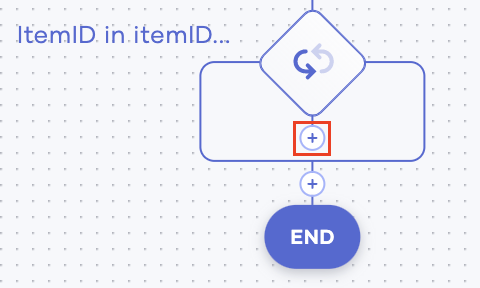
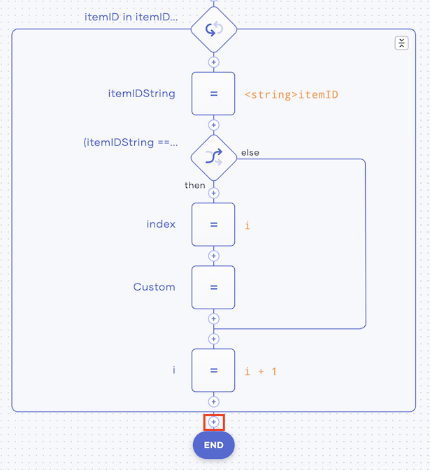
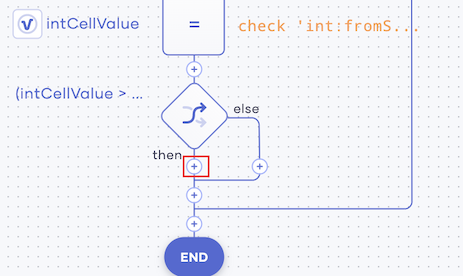
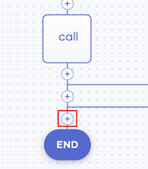

# Integrating Services

In this tutorial, you can learn how to integrate multiple services via Choreo. Here, let's consider a simple example where an online shoe store needs an application that captures online orders. For each order, the store also needs to generate a notification for the sales manager as well as update the inventory records.

## Before you begin

The following are required to try out this tutorial:

- A Google account. 
- A Twilio account

## Step 1: Create a service to manage inventory records

In this step, you are creating a service that consumes the orders captured by the `orders` service that you previously created, and then updates the inventory records based on the number of items ordered.

To create this service, follow the procedure below:

1. Access the Choreo Development Console and click **Services**. Then click **Create**.

2. Enter `inventory` as the name and click **Create**.

3. Click **PUT**, enter `/inventory` in tghe **Path** field, and then click **Save API**.

    

4. Click **Variable**. Then select/enter information as follows:

    | **Field**         | **Value**                     |
    |-------------------|-------------------------------|
    | **Type**          | **string**                    |     
    | **Name**          | `responseString`              |
    | **Expression**    | `""`                    |

    Then click **Save**.
    
5. Add another variable statement as follows:
 
    1. Click the **+** icon below the last variable statement you added, and then click **Variable**. 
    
    2. Enter information for the variable as follows:

        

        | **Field**         | **Value**                  |
        |-------------------|----------------------------|
        | **Type**          | **other**                  |     
        | **Other Type**    | `map<string[]>`            |
        | **Name**          | `queryParams`              |
        | **Expression**    | `request.getQueryParams()` |

    3. Click **Save**.
    
6. Add another variable statement as follows:
 
    1. Click the **+** icon below the last variable statement you added, and then click **Variable**. 
    
    2. Enter information for the variable as follows:

        
        
        | **Field**         | **Value**                    |
        |-------------------|------------------------------|
        | **Type**          | **string**                   |     
        | **Name**          | `inventoryItemId`            |
        | **Expression**    | `queryParams.get("item")[0]` |
    
    3. Click **Save**.
    
7. Add another variable statement as follows:
 
    1. Click the **+** below the last variable statement you added, and then click **Variable**. 
    
    2. Enter information for the variable as follows:

        
        
         | **Field**         | **Value**                                           |
         |-------------------|-----------------------------------------------------|
         | **Type**          | **int**                                             |     
         | **Name**          | `quantity`                                          |
         | **Expression**    | `check int:fromString(queryParams.get("count")[0])` | 
         
    3. Click **Save**. 
     
 8. To connect to the Google sheet where inventory records are maintained, add a Google Sheet API call as follows: 
 
    !!! tip "Before you carry out this step:"
        In your Google account, open the Google Drive and create a Google sheet named `inventory` with the following table.
        
        
        
        | **item**    | **count** |
        |-------------|-----------|
        | trainers    | 100       |
        | loafers     | 80        |
        | kittenheels | 60        |
        | maryjanes   | 40        |
            
    1. Click the **+** below the last variable statement you added, and then click **API Calls**.
    
    2. Click **Google Sheets**
    
    3. Click **Connect Another Account**, and then click **Proceed**. Then click on your Google ccount that you want to use for this service.
    
    4. Click **Save**.
    
    5. Click **+** below the Google Sheets API call you added, and click **API Calls**.
    
    6. Click on the existing connection.
    
        
    
    4. In the **Operation** field, select **getColumn** and then enter information in the rest of the fields as follows:
    
        | **Field**                  | **Value**                                                                                                       |
        |----------------------------|-----------------------------------------------------------------------------------------------------------------|
        | **SpreadsheetId**          | The ID of your google sheet.                                                                                    |  
        | **SheetName**              | The name of the sheet with the inventory records.                                                               |
        | **Column**                 | The ID of column in which you have added values for the `item` variable (i.e., `A` in the given example image). |
        | **Response Variable Name** | `ItemIDs`                                                                                                       |
        
        Click **Save**. 
        
        This connection retrieves the number of items currently available in the column `A`, `Sheet1` of the `inventory` Google Sheet.
        
 9. To cast the response received, add another variable statement as follows:
 
    1. Click the **+** below the Google Sheet connection you added, and then click **Variable**.
    
    2. Enter information as follows:
    
        
    
        | **Field**         | **Value**        |
        |-------------------|------------------|
        | **Type**          | **other**        |     
        | **Other Type**    | `string[]`       |
        | **Name**          | `respondMessages`|
        | **Expression**    | `[]`             |
        
        Then click **Save**.
        
 10. To log the response, add a `log` statement as follows:
 
    1. Click the **+** below the `respondMessages` variable statement you added, and then click **Log**.
    
    2. In the **Expression** field, enter `"itemIDs.toJsonString()"`. Then click **Save**.
    
        
    
11. To define a parameter for the inventory record, add a new variable as follows:

    1. Click the **+** below the log statement you added, and then click **Variable**.
    
    2. Enter information as follows:
    
        
    
        | **Field**      | **Value** |
        |----------------|-----------|
        | **Type**       | **int**   |     
        | **Name**       | `i`       |
        | **Expression** | `1`       |
        
        Then click **Save**.
        
12. To define a parameter for the inventory index, add a new variable as follows:
    
    1. Click the **+** icon below the last `i` variable statement you added, and then click **Variable**.
    
    2. Enter information as follows:
    
        
    
        | **Field**      | **Value** |
        |----------------|-----------|
        | **Type**       | **int**   |     
        | **Name**       | `index`   |
        | **Expression** | `-1`      |
        
        Then click **Save**.
        
13. To define a parameter for the item ID, add a string variable as follows:   

    1. Click the **+** icon below the last `index` variable statement you added.
    
    2. Click **Variable**, and then add information as follows:
    
           
 
         | **Field**      | **Value**      |
         |----------------|----------------|
         | **Type**       | **string**     |     
         | **Name**       | `itemIDString` |
         | **Expression** | `""`           | 
         
         Then click **Save**.
         
14. Add a `foreach` statement as follows:
   
    1. Click the **+** below the last `itemIDString` variable statement you added, and then click **ForEach**.
    
    2. Enter information as follows:
    
        
    
         | **Field**                  | **Value**        |
         |----------------------------|------------------|
         | **Current Value Variable** | **ItemID**       |     
         | **Iterable Expression**    | `itemIDs`   |
         
         Then click **Save**.
         
    3. Add a `custom` statement as follows:
     
        1. Click the **+** icon below the `foreach` statement you added, and then click **Other**.
        
            
        
        2. In the **Statement** field, enter `itemIDString = <string>itemID;`.
        
            
        
        3. Click **Save**.
            
    4. Add another custom statement as follows:
    
        1. Click the **+** icon below the last custom statement you added, and then click **Other**.         
                   
        2. Enter the following in the **Statement** field.
        
            ```text
            if (itemIDString == inventoryItemId) {
                index = i;
                break;
            } 
            i = i + 1;
            ```
                      
           
        3. Click **Save**.
           
15. To define the action to be taken depending on whether the item ordered is available or not, add an `if` statement as follows:

    1. Click the last **+** icon in the diagram of your low code view, and then click **If**.
    
        
    
    2. In the **Condition** field, enter `index > 0`.
    
        [If Statement](../assets/img/tutorials/inventory-service-if-statement.png)
    
    3. Click **Save**.
        
    4. To specify the action to be taken if the given condition is met, add a custom statement as follows.
     
        1. Click the **+** icon below the `if` statement you added. and then click **Other**. 
    
            
            
        2. Click **Other**, and enter the following in the **Statement** field.
        
            In the **Statement** field, enter the following.
                   
            ```
            string cellName = "B" + index.toString();
            var cellValue = checkpanic googleapis_sheetsEndpoint->getCell("<GOOGLE_SHEET_ID>", "Sheet1", cellName);
            log:print(cellValue.toJsonString());
            int intCellValue = checkpanic 'int:fromString(cellValue.toJsonString());
            ```
       
        3. Click **Save**.
       
    5. To define the action to be taken by the service depending on whether the available stock is greater than the quantity requested or not, add another `if` statement as follows:
    
        1. Click the **+** icon below the custom statement you added. 
        
            
    
        2. Click **If**, and enter the following in the **Condition** field.
        
            
        
            ```
            intCellValue > quantity
            ```
           
           Here, you are specifying a condition where the quantity available in stock (represented by `intCellValue`) is greater than the quantity requested in the order.
       
        3. Click **Save**.
       
        4. To specify the action to be taken if the condition is met, add a custom statement as follows:
        
            1. Click the **+** icon below the `if` statement you added.
            
                           
            
            2. Click **Other**, and then enter the following in the **Statement** field.
            
                
            
                ```
                int newStockValue = intCellValue - quantity;
                checkpanic googleapis_sheetsEndpoint->setCell("<GOOGLE_SHEET_ID>", "Sheet1", cellName, newStockValue);
                respondMessages.push("Sucessfully updated the item: " + itemIDString);
                ```
               
            3. Click **Save**.
            
        5. To specify the action to be taken if the given condition is not met, add another custom statement as follows:
        
            1. Click the **+** icon on the **else** line of the if statement.
            
                 
                
            2. Click **Other**, and enter the following in the **Statement** field.
            
                ```
                respondMessages.push("Stock is not enough for the Item: " + itemIDString);
                ``` 
            3. Click **Save**.
            
        6. Now, let's define the action to be taken when the condition defined by the first if statement (i.e., the ordered item being available) is not met.
        
            1. Click the **+** icon on the **else** line of the first if statement.
            
                
            
            2. Click **Other**, and enter the following in the **Statement** field.
            
                ```
                respondMessages.push("Cannot find the item: " + itemIDString);
                ```
                              
17. To respond with the updated inventory record, add a `response` statement as follows:

    1. Click the last **+** icon in the diagram. Then click **Respond**.
    
            
    
    2. In the **Respond Expression** field, enter `respondMessages`. 
    
        
    
    3. Click **Save**.

# Step 2: Create a service to capture and respond to orders

First, let's create a service that captures the online orders as follows:

1. Access the Choreo Development Console via the following URL.

    `https://console.choreo.dev/`
    
    Sign in using either your Google or GitHub credentials.
    
2. In the **Services** page, click **Create**.

3. Under **Create with Choreo**, enter `orders` as the name of your Choreo service.

4. In the **Configure API Trigger** form, select **PUT** as the HTTP method, and then click **Save API**.

    

5. To capture the query parameters of orders received, add a `variable` statement as follows:

    1. Click **Variable**.

        
        
    2. Enter information as follows:
    
        
    
        | **Field**      | **Value**                  |
        |----------------|----------------------------|
        | **Type**       | **other**                  |
        | **Other Type** | `map<string[]>`            |
        | **Name**       | `queryParams`              |
        | **Expression** | `request.getQueryParams()` |
    
        Click **Save**.
    
6. To capture the count the number of items ordered, add another variable statement as follows:

    1. Click the **+** icon below the `queryParams` variable statement you added.

        
        
    2. Click **Variable** and enter information as follows:
    
        
    
        | **Field**      | **Value** |
        |----------------|-----------|
        | **Type**       | **var**   |
        | **Name**       | `count`   |
        | **Expression** | `-1`      |
    
        Click **Save**.
    
7. To capture the item ordered, add another `variable` statement as follows. 

    1. Click the **+** icon below the `count` variable statement you added.
    
    2. Click **Variable**, and enter information as follows.
    
        
    
        | **Field**      | **Value** |
        |----------------|-----------|
        | **Type**       | **var**   |
        | **Name**       | `item`    |
        | **Expression** | `""`      |
    
        Click **Save**.
    
8. Add an `if` statement as follows.

    1. Click the **+** icon below the `item` variable statement you added. Then click **+** again.
    
    2. Click **If**.
    
    3. In the **Condition** field, enter `queryParams.hasKey("count")`, and click **Save**.
    
        
        
        This checks whether the request received includes a value for the `count` parameter.
    
    4. To specify the action to be carried out if the given condition for the `if` statement is true, add a custom statement as follows: 
    
        1. Click the **+** icon below the `if` statement you added. Then click **+** again.
        
            
    
        2. Click **Other**
    
        3. In the **Statement** field, enter `count = check int:fromString(queryParams.get("count")[0]);`.
        
            
            
            Click **Save**.
            
            This statement specifies to get the value for the `count` parameter from each request.
                      
    
9. To filter only the requests with values for the `item` parameter and then to get the value for the `item` parameter from them, add another `if` statement as follows:

    1. Click the last **+** icon in the current low code view. Then click **+** again.
    
        
    
    2. Click **If**.
    
    3. In the **Statement** field, enter `queryParams.hasKey("item")` and click **Save**.
    
        
    
    4. Click the **+** icon below the `if` statement you added. Then click **+** again.
    
        
    
    5. Click **Other Statement**
    
    6. Enter `item = queryParams.get("item")[0];` as the statement and click **Save**.
    
        
    
10. To connect your service to an endpoint, add an HTTP connection as follows:

    1. Click the last **+** icon in the current low code view. Then click **+** again.
    
        
    
    2. Click **Connections**, and then click **HTTP**.
    
    3. Enter information as follows:
    
        
    
        | **Field** | **Value**                                                                                                    |
        |-----------|--------------------------------------------------------------------------------------------------------------|
        | **Name**  | `inventoryEndpoint`                                                                                          |
        | **URL**   | `"<The URL to the inventory service you created >?item=" + item + "&count=" + count.toString()` |   
    
    4. Select **PUT** as the operation.
    
    6. Click **Save & Next**, and then enter information in the new tab as follows.
    
        | **Field**               | **Value** |
        |-------------------------|---------  |
        | **Message**             | `""`      |
        | **Select Payload Type** | **Text**  |
    
        Click **Save**.
    
    
11. Add another `variable` statement as follows:

    1. Click the last **+** icon in the current low code view. Then click **+** again.
    
    2. Click **Variable**.
    
    3. In the **Name** field, enter `index`.
    
    4. In the **Expression** field, enter `textPayload.indexOf("Sucessfully updated the item")`.
    
    5. Click **Save**.
    
12. Add an `if` statement as follows:

    1. Click the last **+** icon in the current low code view. Then click **+** again.
    
    2. Click **If**.
    
    3. In the **Condition** field, enter `index is int && index > 0`.
    
    4. Click **Save**.
    
13. Add a new Twilio connector as follows:

    1. Click on the **+** icon just below the last If statement that you added. Then click **+** again.
    
    2. Click **Connections**, and then click **Twillio**. Then enter information as follows:
    
        | **Field**      | **Value**                             |
        |----------------|---------------------------------------|
        | **AccountSId** | `ACc055c08964b76edfxsb0a755a3edcd6f3` |
        | **AuthToken**  | `7901fea3341fd05db51451b3eedwsae4`    |
        
    3. Click **Save & Next**.
    
    4. In the **OPERATION** field, select **sendWhatsAppMessage**. Then enter information as follows:
    
        | **Field**   | **Value**        |
        |-------------|------------------|
        | **FromNo**  | `+14155238886`   |                   
        | **ToNo**    | `+94775544041`   |
        | **Message** | `"Your purchase order of " + item + " has shipped and should be delivered on tomorrow. Details: " + count.toString()` | 
        
    5. Click **Save**.
    
14. To log the WhatsApp message sent, add a `log` statement as follows:

    1. Click on the **+** icon just below the last Twillio connection that you added. Then click **+** again.
    
    2. Click **Log**.
    
    3. In the **Expression** field, enter `"WhatsApp message sent"`. 
    
    4. Click **Save**.
    
15. To send an email informing the client confirming the order, add a Gmail connection as follows:

    1. Click on the **+** icon just below the last IF statement that you added. Then click **+** again. 
    
    2. Click **Connections**, and then click **Gmail**.
    
    3. Click **Manual Connection**, and then enter information as follows:
    
        | **Field**        | **Value**                                                                                                   |
        |------------------|-------------------------------------------------------------------------------------------------------------|
        | **RefreshUrl**   | `"229137887995-hagu9n9cjhbdrmtm1udtqub45opq3jgt.apps.googleusercontent.com"`                                |
        | **RefreshToken** | `"x7avYRP-b_1SA3TklT1K7Nf1"`                                                                                |
        | **ClientId**     | `"1//04rsnB0wQBE8KCgYIARPMGAQSNwF-L9Ir4j0hVXqQ4VvxEBaQl89NWfqzYmvDkYfOBVPwngFocKzaPL9YF6fDjjbVfGWaXEwQc1g"` |
        | **ClientSecret** | `"https://oauth2.googleapis.com/token"`                                                                     |
        
        Then click **Save & Next**.
        
    4. In the **OPERATION** field, select **sendMessage**. Then add information in the fields that appear below it as follows:
    
        | **Field**         | **Value**                                                          |
        |-------------------|--------------------------------------------------------------------|
        | **UserId**        | Your user.                                                         |
        | **sender**        | `"tempApr333@gmail.com"`                                           |        
        | **recipient**     | `"tempApr333@gmail.com"`                                           |
        | **subject**       | `"Successfully received order"`                                    |
        | **messageBody**   | `"Payment of " + item + " for " + count.toString() + " received."` |
        | **contentType**   | `"text/plain"`                                                     |
        
    5. Click **Save**.
    
16. To receive a response after the service is successfully executed, add a `respond` statement as follows:

    1. Click the last **+** icon in the current low code view. Then click **+** again.
    
    2. Click **Respond**.
    
    3. In the **Respond Expression** field, enter `textPayload`.
    
    4. Click **Save**.
    
Now you have successfully created the Order Service.


    
        

    

        
              