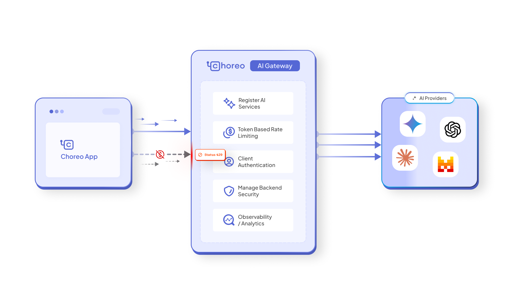

# Choreo AI Gateway

As AI adoption accelerates, managing AI APIs effectively has become essential for organizations integrating AI into their applications. Choreo's AI Gateway simplifies this process, providing a seamless way to create, manage, and expose AI APIs with robust security and scalability.

Choreo offers built-in support for OpenAI, Azure OpenAI, and Mistral and AWS Bedrock.

With a comprehensive set of capabilities, the AI Gateway ensures secure and efficient AI integration. Key features include:

- AI Vendor Key Configuration: Securely authenticate AI APIs by configuring API keys obtained from the AI vendor.
- Rate Limiting: Protect AI backends by enforcing token-based rate limits to manage resource consumption.
- AI API Observability: Track AI API usage statistics using Analytics solutions. (coming soon)

By leveraging these capabilities, organizations can efficiently integrate, monitor, and scale AI APIs, unlocking the full potential of AI-driven applications.
