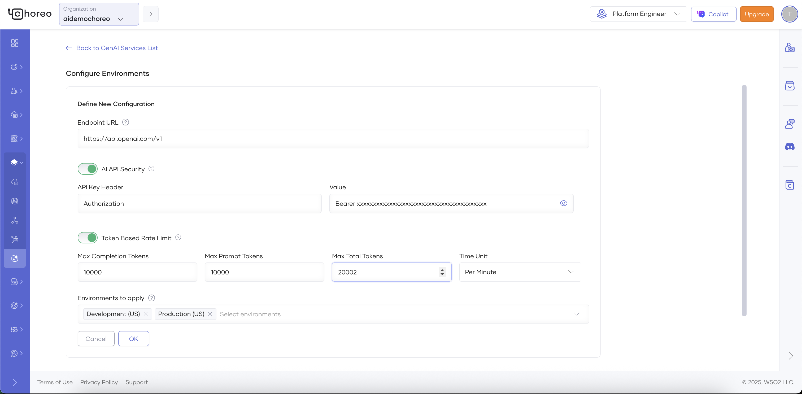
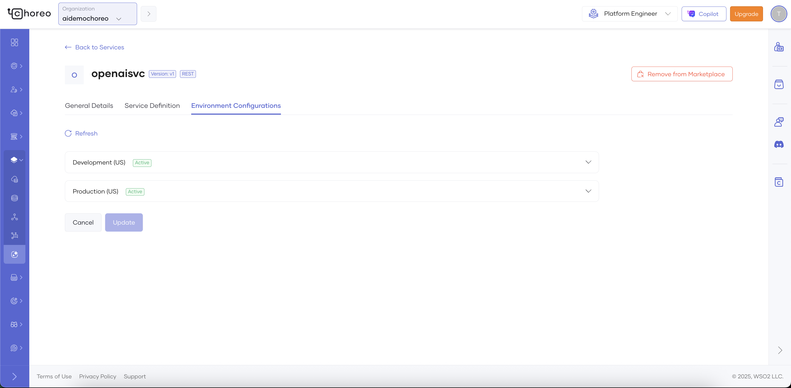

# Integrate and Manage Generative AI Services

## Overview

Generative AI (GenAI) services leverage advanced machine learning models to produce original content—such as text, images, music, or code—by learning patterns from existing data. Powered by deep neural networks, these services can generate human-like outputs across multiple formats, making them well-suited for tasks like content creation, image generation, and conversational automation.

Choreo provides native support for integrating GenAI services into applications. Using the Choreo AI Gateway, Platform Engineers and Admins can:

- Register GenAI services in the Choreo AI Gateway.

- Manage access and authentication for GenAI services.

- Enforce governance, security, and cost controls for GenAI services at scale.

## Register a GenAI Service

When you register a GenAI service in Choreo, all requests are routed through the AI Gateway, which enforces:

- Security – Authentication, authorization, and encrypted transport.

- Rate Limiting – Token-based throttling.

- Observability (Coming Soon) – Metrics, logging, and monitoring.

This ensures consistent, secure, and cost-controlled access to the underlying provider.

## Registration Scopes

You can register GenAI services at two levels:

- Organization-level registration – Service is available across all projects in the organization.

- Project-level registration – Service is restricted to the project where it is registered.

Once registered, the service is published to the Internal Marketplace, where developers can discover and consume it via Connections.

## Prerequisites

Before registering a GenAI service, obtain the following from your provider:

- API key

- Service URL

- Any additional credentials (e.g., client secrets, subscription keys)

!!! note

    - Choose the correct registration scope:

        - Use organization-level if the service will be shared across multiple projects.
        - Use project-level if usage is limited to a single project.

## Registration Steps

### Step 1: Select a Service Provider

1. Sign in to the Choreo Console.

2. Select your Organization or Project, depending on the required scope.

3. In the left navigation menu, go to DB & Services → GenAI Services.

4. Choose a provider from the list:

- OpenAI

- Azure OpenAI

- Anthropic Claude

- Mistral

- AWS Bedrock

5. Click Next.

### Step 2: Provide Service Details

Under **Register a GenAI Service**, enter:

- Name – The service name.

- Context Path – A unique identifier for the API within the AI Gateway.

- Service URL – The provider’s endpoint.

- Summary – A short description of the service.

Click **Next**.

### Step 3: Add Environment Configurations

### Configure Backend Security

In **Backend Security**, set the Authorization header.

- Provide the API key or credentials (e.g., Authorization: Bearer <token>).

- Key formats may vary by provider.

### Configure Token-Based Rate Limiting

LLMs and GenAI services are billed based on token usage, not just request count. Token-based rate limiting helps:

- Control costs.

- Prevent excessive usage.

- Enforce fair quotas across consumers.

Set the following parameters:

- Time Unit – Enforcement window (per minute, hour, or day).

- Max Prompt Token Count – Maximum input tokens per request.

- Max Completion Token Count – Maximum output tokens per request.

- Max Total Token Count – Combined input + output tokens per request.

Click **Register**.

The service is now available in the Internal Marketplace, where developers can discover and connect to it.

See the [Developer Docs](https://wso2.com/choreo/docs/develop-components/sharing-and-reusing/create-a-connection-to-a-genai-service/) for instructions on how to consume a GenAI service published in the Internal Marketplace.

## Manage Registered Services

### View or Update Service Details

1. Sign in to the [Choreo Console](https://console.choreo.dev).

2. Navigate to DB & Services → GenAI Services.

3. Select a service to view or edit details:

- General Details – Name, description, and labels.

- Environment Configurations – Backend security and rate limiting.

- Deployment Status – View deployment state for each environment.

### Remove a GenAI Service

1. Sign in to the [Choreo Console](https://console.choreo.dev).

2. Navigate to DB & Services → GenAI Services.

3. Select the service.

4. Click Remove from Marketplace.

The service is removed from the Internal Marketplace and can’t be used for new Connections. Existing Connections remain functional until manually removed.
