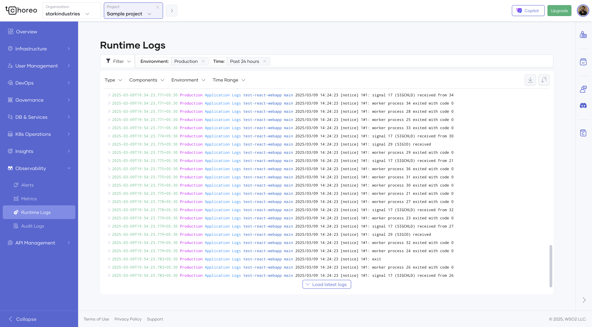
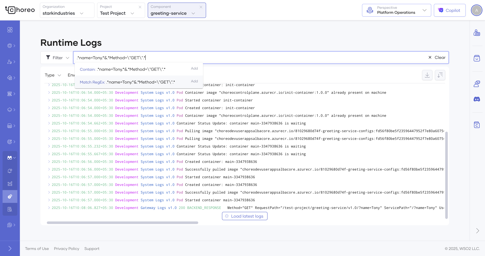

# Runtime Logs in Choreo

Choreo runtime logs provide insights into both project and component-level logs, covering application and gateway logs. These logs streamline the debugging process by centralizing diverse log sources.

In Choreo, any organization member can view runtime logs via the runtime logs page. Choreo allows you to apply filters based on parameters such as log level (error, warn, info, debug), log type (application, gateway, system), and environment (development, staging, production) to simplify the debugging process.

To access runtime logs, follow the steps below:

1. Sign in to [Choreo](https://console.choreo.dev/).
2. In the left navigation menu, click **Observability** and then click **Runtime Logs**. This displays runtime logs for the past 24 hours by default.

    To view logs based on a specific time range and other requirements, you can apply the necessary filter criteria.

    

### Searching through runtime logs

The runtime logs interface provides powerful search capabilities to help you quickly locate specific log entries.

#### Text search
Type any text into the search box to locate log entries that contain the exact phrase. Searches are case-sensitive and will match partial strings within the log messages of Application, Gateway, and System logs.

#### Advanced search with regex
Use Lucene-compatible regex patterns to perform advanced search queries. Refer to the [OpenSearch regex syntax](https://docs.opensearch.org/latest/query-dsl/regex-syntax/#standard-regex-operators) for more details.

Pattern examples:

  - `error.*timeout` : Find logs containing the phrase "error" followed by "timeout"
  - `.*(GET|POST).*&.*500.*` : Find logs of GET or POST request methods with HTTP 500 status code
  - `\"userId\":\"12345\"` : Find logs containing the userId "12345"
  - `outOfMemory|OOM` : Find logs containing either "outOfMemory" or "OOM"

### Understand runtime logs

When you view component-level logs on the **Runtime Logs** page, you will see both application and gateway logs.

#### Application logs

Each application log entry displays the following details:

  - `timestamp`: The time when the request is received by the component.
  - `level`: Indicates the severity of the log message. Possible values are **Debug**, **Info**, **Warn**, and **Error**.
  - `componentVersion`: The version of the invoked component.
  - `componentVersionId`: The identifier of the invoked component’s version.
  - `envName`: The environment of the inbound request. For example, Development, Production, etc.

#### Gateway logs

Each gateway log entry displays the following details:

  - `timestamp`: The time when the request is received by the gateway component.
  - `logLine`: Contains the following details about the request, including inbound and outbound information from the gateway perspective.
    - `Method`: The HTTP method of the request.
    - `RequestPath`: The path of the inbound request.
    - `ServicePath`: The path of the outbound request.
    - `UserAgent`: The user-agent header of the request.
    - `CorrelationID`: The request identifier of the inbound request. This is useful to track a request.
    - `ServiceHost`: The host IP of the backend.
    - `Duration`: The time taken for the gateway to serve the request.  
  - `gatewayCode`: Indicates the state of the request from the gateway perspective. Possible values are as follows:
    - `BACKEND_RESPONSE`:  Indicates successful processing of the request by the gateway with a response to the client from the backend application.
    - `CORS_RESPONSE`: Denotes a CORS (Cross Origin Resource Sharing) request.
    - `AUTH_FAILURE`: Indicates a request failure at the gateway due to authentication or authorization issues, such as an invalid token.
    - `NO_HEALTHY_BACKEND`: Indicates a request failure at the gateway due to a non-existent backend.
    - `RATE_LIMITED`: Indicates a request failure at the gateway due to surpassing the rate limit enforced within the component.
    - `RESOURCE_NOT_FOUND`: Indicates a request failure at the gateway due to the absence of a matching API resource for the inbound request. This can be caused by a mismatch in the HTTP method, path, or host.
    - `BACKEND_TIMEOUT`: Indicates a request timeout when calling the backend application from the gateway.
    - `GATEWAY_ERROR`: Indicates a request failure due to an erroneous behavior in the gateway.
  - `statusCode`: The HTTP status code returned to the client.
  - `componentVersion`: The version of the invoked component.
  - `envName`: The environment of the inbound request. For example, Development, Production, etc.

#### System logs

Each system log entry displays the following details:

  - `timestamp`: The time of the system event.
  - `componentVersion`: The version of the component.
  - `componentVersionId`: The identifier of the component version.
  - `reason`: The system event reason.
  - `logEntry`: System event details.
  - `kind`: The kind of the k8s object related to the event.
