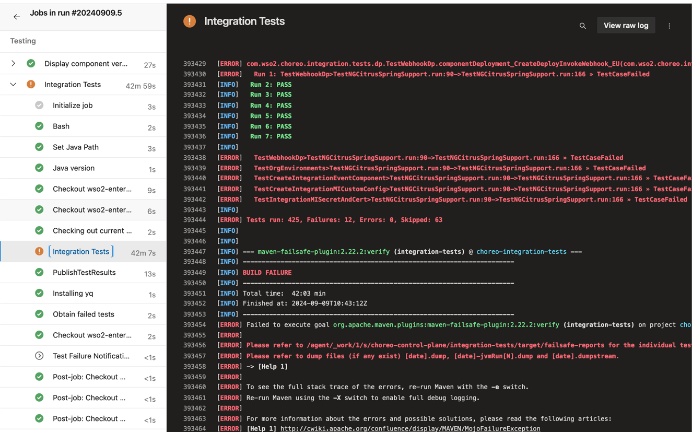
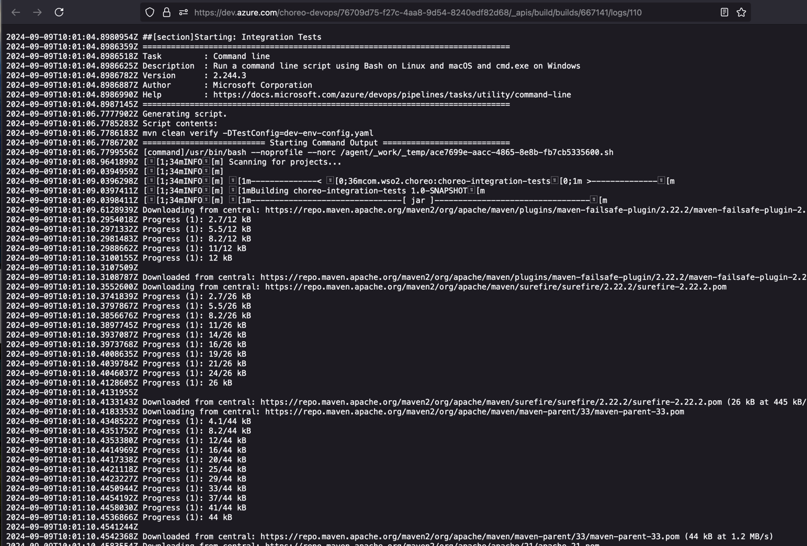
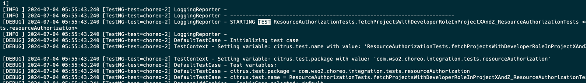

# Investigating integration test logs

## Introduction
When integration tests are executed in the pipeline via maven, they are executed in parallel using multiple threads. 
This can cause the logs to be interleaved with entries from multiple test executions being executed by various threads.
Trying to follow the execution of a specific test case can be difficult due to this interleaving. The included python 
script `log-filter.py` can be used to filter logs based on a specific thread in order to make investigation easier.

## Filtering the complete test log
1. Go to the respective release deployment pipeline run in Azure devops and navigate to the Integration Tests job as
shown in the image below.



2. Click on the `View raw log` link which will open the complete log file in a new browser tab as shown below.
Once the page has loaded completely you can save the page as a **Text** file to your local machine.



3. Find the test case execution that you are interested in the download log file and make a note of the thread 
execution id. This can be seen with the following format `[TestNG-test=choreo-<thread-id>]` just after the timestamp
section of the log entry. For example in the below image the thread id is `2`.



4. Provide the required arguments to the `log-filter.py` script as shown below to filter the logs based on the 
thread id. In this example we will be filtering by thread id `2`.

```bash
python3 log-filter.py ~/Downloads/complete.log ~/out/thread2.log  2
```

_Execute `python3 log-filter.py -h` for more details._ 

5. The filtered log file will now only contain the sequential entries belonging to thread 2.