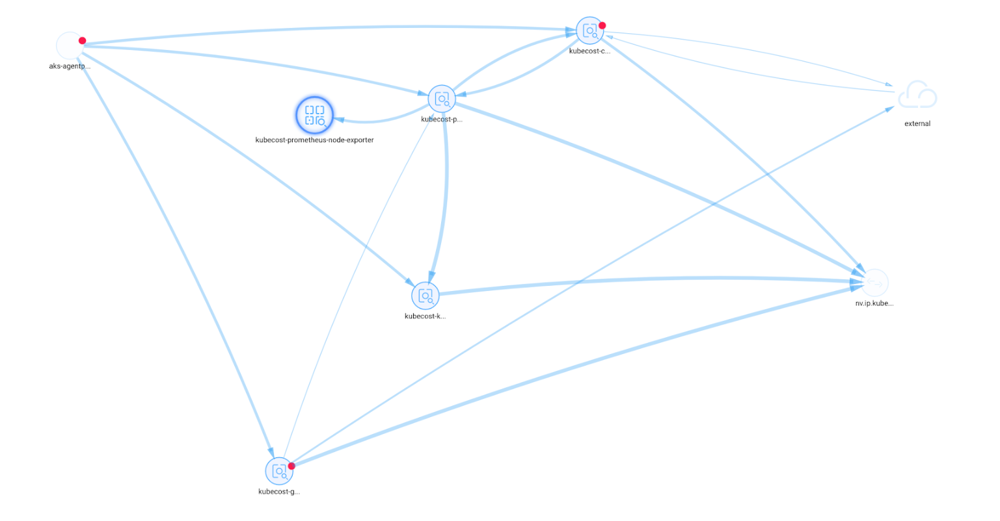
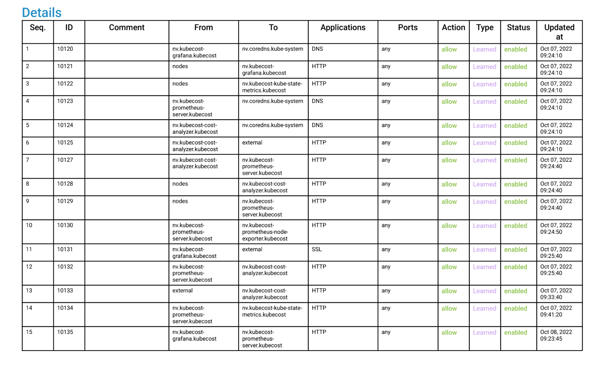

# Kubecost network interactions

In the onboarding, Here we need to ensure that kubecost is only allowed for legitimate transitions relevant to the cost calculation of Choreo cluster and out of the cluster services.

In brief, there are several  concerns as follows, Kubecost should be able to,
1. Access azure rate api to read cost reports to calculate the OOC costs.
2. Do necessary transactions within the kubecost namespace to calculate the costs.
3. Access other namespaces of the cluster  that  it is installed in.

# NeuVector analysis
1. Network Diagram for kubecost by [NeuVector](https://neuvector.com/)

2. Network Interactions for kubecost by [NeuVector](https://neuvector.com/)

