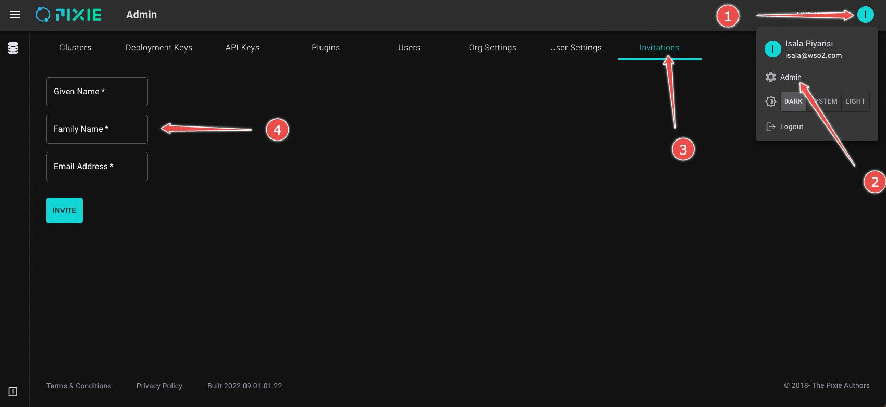

### How to setup pixie cloud (in control-plane)

1. Run `create_cloud_secrets.sh`

2. Create new record for px-cloud.choreo.dev and *.px-cloud.choreo.dev in choreo.dev public domain zone. point it to prod-choreo.trafficmanager.net CNAME

3. Apply the issuer and certificate respectively using the following YAML content;

    issuer.yaml

    ```yaml
    apiVersion: cert-manager.io/v1
    kind: Issuer
    metadata:
      name: choreo-dev-px-cloud-letsencrypt-prod
      namespace: cert-manager
    spec:
      acme:
        email: techops@wso2.com
        preferredChain: ""
        privateKeySecretRef:
          name: choreo-dev-px-cloud-letsencrypt-prod
        server: https://acme-v02.api.letsencrypt.org/directory
        solvers:
        - dns01:
            azureDNS:
              clientID: 6634629f-e772-4b83-84f1-a3e9cedd4c1d
              clientSecretSecretRef:
                key: client-secret
                name: choreo-secret-azuredns-config
              environment: AzurePublicCloud
              hostedZoneName: choreo.dev
              resourceGroupName: CHOREO-DNS-RG
              subscriptionID: 0a7b14d7-05f7-4c32-8929-619eb4fb7aeb
              tenantID: da76d684-740f-4d94-8717-9d5fb21dd1f9
    ```

    certificate.yaml (Make sure to update the environment name accordingly in the below YAML)

    ```yaml
    apiVersion: cert-manager.io/v1
    kind: Certificate
    metadata:
      annotations:
        reflector.v1.k8s.emberstack.com/secret-reflection-allowed: "true"
        reflector.v1.k8s.emberstack.com/secret-reflection-auto-enabled: "true"
      name: {dev/stage/prod}-choreo-px-cloud-wildcard-cert
      namespace: cert-manager
    spec:
      dnsNames:
      - px-cloud.choreo.dev
      - '*.px-cloud.choreo.dev'
      issuerRef:
        kind: Issuer
        name: choreo-dev-px-cloud-letsencrypt-prod
      secretName: {dev/stage/prod}-choreo-px-cloud-wildcard-tls

    ```

    Edit the secret {dev/stage/prod}-choreo-px-cloud-wildcard-tls and add the following lines under annotations section

    ```yaml
    reflector.v1.k8s.emberstack.com/reflection-allowed: "true"
    reflector.v1.k8s.emberstack.com/reflection-auto-enabled: "true"
    ```

4. Make sure the TLS secret `{dev/stage/prod}-choreo-px-cloud-wildcard-tls` is present on the plc namespace

5. Apply kustomize overlay

6. Run `kubectl -n plc apply -f pixie_cloud_jobs.yaml`

7. Setup default admin account

    Open the url printed in the logs of create-admin-job pod and
    set a password for the default "admin@default.com" user

8. From the UI invite other users as necessary using admin console. Follow the steps shown in the following diagram.

  

### How to re-deploy pixie cloud (in case of an unrecoverable error)

1. Stop choreo deployment pipeline

2. Delete `plc` and `elastic-system` namespaces

3. Run `create_cloud_secrets.sh`

4. Make sure `{dev/stage/prod}-choreo-px-cloud-wildcard-tls` tls secret is created

5. Enable and trigger choreo deployment pipeline

6. Setup default admin account

   Open the url printed in the logs of create-admin-job pod and
   set a password for the default "admin@default.com" user

7. From the UI invite other users as necessary using admin console. Follow the steps shown in the following diagram.

  
